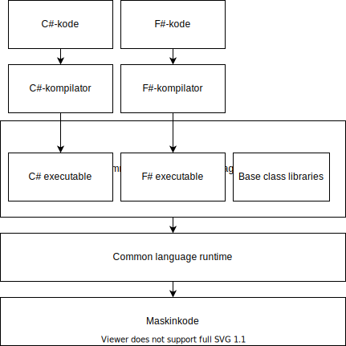
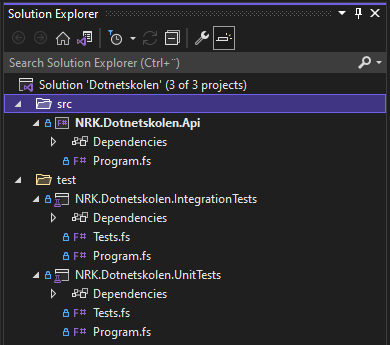

# Dotnetskolen

## To do

- Steg 9 - Skall for web-API
  - Sett opp host i web-API med skall for `Startup`
    - Trenger dette for å kunne skrive integrasjonstester
- Steg 10 - Integrasjonstester
  - Lag integrasjonstester for webapi
    - Definer routes og verifiser success/bad request
    - Valider respons opp mot OpenAPI
- Steg 11 - Fullføre API
  - Fullfør implementasjon av webapi
    - Sett opp workflow for route
      - Ta inn avhengighet for å hente alle sendinger
        - Registrer i `ConfigureServices` og overskriv i `CustomWebHostBuilder` i integrasjonstestprosjektet
        - Avhengighet returnerer kanskje DTO?
        - Deserialisere JSON til DTO?
      - Map DTO til domenemodell
        - Mest for å vise at man burde gjøre dette steget
      - Gå gjennom alle sendinger
        - Filtrer på dato (startdato må være på oppgitt dato?)
      - Map til dto
    - Lag JSON-modul for serialisering og deserialisering
      - Med enhetstester?
      - Serialiser DTO til JSON og returner
- Legg til "steg x av y"
- Legg til lenker til forrige og neste steg
- Steg 7 - Utlede kontrakten steg for steg, og til slutt list opp helheten. På denne måten er det lettere for de som er ukjent med OpenAPI å følge eksemplet.
- Vurdere om vi skal legge til bygg og deploy (mulig utenfor scope av kurset)
  - Kan ev. vise en enkel DOCKERFILE?
- Lage branchen `ferdig`

## Innledning

Velkommen til Dotnetskolen!

Dette er et kurs hvor du blir tatt gjennom prosessen av å sette opp og implementere et .NET-prosjekt fra bunnen av, steg for steg. Målet med kurset er å vise hvordan man kan utføre oppgaver som er vanlige i etableringsfasen av et system, som å:

- Opprette prosjekter og mappestruktur
- Sette opp pakkehåndtering
- Sette opp tester
- ~~Sette opp bygg og deploy~~

Som en eksempel-applikasjon skal vi lage et web-API for å hente ut elektronisk programguide (EPG) for NRK TV, med tilhørende enhets- og integrasjonstester.

Kurset er forsøkt lagt opp slik at deltakere med ulike bakgrunner og erfaringsnivå kan ha nytte av det. Dersom du er helt ny til .NET kan det være nyttig å begynne med å lese [hva .NET er](#hva-er-net). Deretter bør du lese [hvordan du kommer i gang](#hvordan-komme-i-gang) før du begynner på [selve stegene](#oppgaver).

Et sekundært mål med dette repoet er at den ferdige eksempel-applikasjonen (som du finner i [branchen ferdig](https://github.com/nrkno/dotnetskolen/tree/ferdig)) kan fungere som et referanse-repo for hvordan man kan sette opp .NET-prosjekter.

## Innholdsfortegnelse

- [Hva er .NET?](#hva-er-net)
- [Hvordan komme i gang](#hvordan-komme-i-gang)
  - [Nødvendige verktøy](#verktøy)
  - [Lokalt oppsett av koden](#lokalt-oppsett-av-koden)
  - [Se løsningsforslag](#se-løsningsforslag)
- [Oppgaver](#oppgaver)
  - [Steg 1 - Opprette API](#steg-1---opprette-api)
  - [Steg 2 - Opprette testprosjekter](#steg-2---opprette-testprosjekter)
  - [Steg 3 - Opprette solution](#steg-3---opprette-solution)
  - [Steg 4 - Pakkehåndtering](#steg-4---pakkehåndtering)
  - [Steg 5 - Definere domenemodell](#steg-5---definere-domenemodell)
  - [Steg 6 - Enhetstester for domenemodell](#steg-6---enhetstester-for-domenemodell)
  - [Steg 7 - Definere API-kontrakt](#steg-7---definere-api-kontrakt)
  - [Steg 8 - Implementere kontraktstyper](#steg-8---implementere-kontraktstyper)

## Hva er .NET?

.NET er en plattform for å utvikle og kjøre applikasjoner, og består av flere ting:

- Programmeringsspråk - som f.eks. C# og F#
- Kompilatorer - programmer som kompilerer kode skrevet i et .NET-programmeringsspråk til CIL ("common intermediate language")
- CIL ("common intermediate language") - et felles språk som alle .NET-programmer blir kompilert til
- CLR ("common language runtime") - kjøretidsmiljø for .NET-programmer som oversetter instruksjonene definert i CIL til maskinkode, og kjører maskinkoden
- BCL ("base class library") - en stor samling biblioteker skrevet av Microsoft som tilbyr standard funksjonalitet som f.eks. datastrukturer (lister, datoer etc.), IO (lesing og skriving av filer, nettverkshåndtering) og sikkerhet (kryptering, sertifikater).



### Versjoner av .NET

Opprinnelig var .NET kun tilgjengelig på Windows. Denne versjonen av .NET omtales som .NET Framework. Etter hvert kom implementasjoner av kjøretidsmiljøet til andre plattformer også, som Mono til Linux og Mac, og Xamarin til Android og iOS. Både Mono og Xamarin var opprinnelig drevet av andre selskaper enn Microsoft. I 2016 lanserte Microsoft en ny versjon av .NET, .NET Core, som er en implementasjon av .NET for alle plattformer (Windows, Mac og Linux). .NET Core gikk gjennom tre hovedversjoner, i parallell med .NET Framework som nådde sin siste versjon, 4.8, i 2019. .NET Framework blir ikke videreutviklet, og i 2020 lanserte Microsoft .NET 5 som er den nyeste versjon av .NET Core. .NET 5 er den versjonen Microsoft vil fortsette å utvikle fremover.

For å definere hva som er tilgjengelig i de ulike versjonene av .NET har Microsoft laget en spesifikasjon, .NET Standard. .NET Standard har flere versjoner, og de ulike versjonene av .NET (.NET Framework, .NET Core, Mono etc.) oppfyller kravene i en gitt versjon av .NET Standard. Les mer om .NET Standard, og kompatibilitet på tvers av .NET-versjoner her: [https://docs.microsoft.com/en-us/dotnet/standard/net-standard](https://docs.microsoft.com/en-us/dotnet/standard/net-standard)

#### Kilder

- [https://www.mono-project.com/](https://www.mono-project.com/)
- [https://en.wikipedia.org/wiki/.NET_Core](https://en.wikipedia.org/wiki/.NET_Core)
- [https://en.wikipedia.org/wiki/.NET_Framework](https://en.wikipedia.org/wiki/.NET_Framework)
- [https://en.wikipedia.org/wiki/Common_Intermediate_Language](https://en.wikipedia.org/wiki/Common_Intermediate_Language)
- [https://docs.microsoft.com/en-us/dotnet/standard/clr](https://docs.microsoft.com/en-us/dotnet/standard/clr)
- [https://dotnet.microsoft.com/apps/xamarin](https://dotnet.microsoft.com/apps/xamarin)

## Hvordan komme i gang

Påse at du har de [verktøyene](#verktøy) som kreves for å gjennomføre kurset. Deretter kan du [sette opp koden lokalt](#lokalt-oppsett-av-koden), og gå i gang med [første steg](#steg-1---opprette-api).

### Verktøy

For å gjennomføre kurset må du ha satt opp følgende:

- [Git](#Git)
- [.NET SDK](#NET-SDK)
- [En IDE](#IDE)
  - [Rider](https://www.jetbrains.com/rider/download)
  - [Visual Studio](https://visualstudio.microsoft.com/vs/community)
  - [Visual Studio Code](https://code.visualstudio.com/download)

#### Git

Git er et gratis versjonshåndteringssystem som finnes til alle plattformer. Dersom du ønsker å ha instruksjonene til kurset (dokumentet du leser nå), eller se forventet resultat etter å ha gjennomført hvert av de ulike stegene, på din egen maskin trenger du Git installert. Med Git kan du også lage din egen versjon av dette repoet slik som forklart [her](#sjekke-ut-egen-branch).

Du kan laste ned Git her: [https://git-scm.com/downloads](https://git-scm.com/downloads).

#### .NET SDK

Når man installerer .NET på maskinen sin har man valget mellom å installere

- .NET runtime - kjøretidsmiljø for .NET-applikasjoner
- .NET SDK - inneholder alt man trenger for å utvikle og kjøre .NET-applikasjoner lokalt, og inkluderer
  - .NET runtime og basebiblioteker (BCL)
  - Kompilatorer
  - .NET CLI - kommandolinjeverktøy for å bygge, kjøre og publisere .NET-applikasjoner

Ettersom du gjennom kurset skal utvikle og kjøre .NET-applikasjoner trenger du .NET SDK installert på maskinen din. Kurset er laget med .NET 5, men de fleste kommandoene fungerer nok med lavere versjoner av .NET, og vil trolig være tilgjengelig i fremtidige versjoner også. Du kan undersøke hvilken versjon av .NET du har lokalt (om noen i det hele tatt) ved å kjøre følgende kommando

``` bash
$ dotnet --version

5.0.103
```

Dersom du ikke har .NET installert på maskinen din, kan du laste det ned her: [https://dotnet.microsoft.com/download/dotnet](https://dotnet.microsoft.com/download/dotnet)

Som nevnt over inkluderer .NET SDK også .NET CLI som gir oss muligheten til å bygge, kjøre og publisere .NET-applikasjoner. For at kurset skal kunne gjennomføres uavhengig av plattform og IDE skal vi bruke .NET CLI til oppsett av løsningen vår. Du kan lese mer om .NET CLI her: [https://docs.microsoft.com/en-us/dotnet/core/tools/](https://docs.microsoft.com/en-us/dotnet/core/tools/)

#### IDE

For å kunne debugge kode, samt få syntax highlighting, autocomplete, og kodenavigering er det kjekt å ha en IDE. De mest brukte IDE-ene for .NET er oppsummert i tabellen under.

| Navn | Plattform | Lisens | Download |
| - | - | - | - |
| Visual Studio|Windows | Community-versjon er gratis. Øvrige versjoner krever lisens. |[https://visualstudio.microsoft.com/vs/community](https://visualstudio.microsoft.com/vs/community)|
| Visual Studio Code | Kryssplattform | Gratis | [https://code.visualstudio.com/download](https://code.visualstudio.com/download) |
| Rider | Kryssplattform | Gratis i 30 dager. Deretter kreves lisens. | [https://www.jetbrains.com/rider/download](https://www.jetbrains.com/rider/download) |

Velg den IDE-en som passer dine behov.

> Merk at et vanlig use case for IDE-er er at de også blir brukt til å kompilere og kjøre kode. Instruksjonene i kurset kommer imidlertid til å benytte .NET CLI til dette. Du står selvfølgelig fritt frem til å bygge og kjøre koden ved hjelp av din IDE hvis du ønsker det.

### Lokalt oppsett av koden

#### Klone repo

Dersom du ønsker dette repoet lokalt på din maskin, kan du gjøre det slik:

``` bash
$ git clone git@github.com:nrkno/dotnetskolen.git # Last ned repo fra GitHub til din maskin

Cloning into 'dotnetskolen'...
remote: Enumerating objects: 9, done.
remote: Counting objects: 100% (9/9), done.
remote: Compressing objects: 100% (5/5), done.
remote: Total 9 (delta 2), reused 4 (delta 1), pack-reused 0
Receiving objects: 100% (9/9), done.
Resolving deltas: 100% (2/2), done.
```

Da skal nå ha `main`-branchen sjekket ut lokalt på din maskin. Det kan du verifisere ved å gå inn i mappen til repoet og liste ut branchene i Git:

``` bash
$ cd dotnetskolen # Gå inn i mappen som repoet ligger i lokalt
$ git branch # List ut alle brancher du har sjekket ut lokalt

* main

```

#### Sjekke ut egen branch

Før du begynner å kode kan du gjerne lage din egen branch med `git checkout -b <branchnavn>`. På denne måten kan du holde dine endringer adskilt fra koden som ligger i repoet fra før.

``` bash
$ git checkout -b my-branch

Switched to a new branch 'my-branch'
```

#### Sette opp .gitignore

Vanligvis er det en del filer man ikke ønsker å ha inkludert i Git. Dette er noe man fort merker ved etablering av et nytt system. For å fortelle Git hvilke filer man vil ignorere, oppretter man en `.gitignore`-fil i roten av repoet.

GitHub har et eget repo som inneholder `.gitignore`-filer for ulike typer prosjekter: [https://github.com/github/gitignore](https://github.com/github/gitignore). `.gitignore`-filene GitHub har utarbeidet inneholder filtypene det er vanligst å utelate fra Git for de ulike prosjekttypene. Ettersom dette kurset omhandler .NET kan vi bruke `VisualStudio.gitignore` fra repoet deres.

For å sette opp `.gitignore` i ditt lokale repo:

1. Opprett en tekstfil med navn `.gitignore` i roten av repoet
2. Lim inn innholdet i denne filen: [https://github.com/github/gitignore/blob/master/VisualStudio.gitignore](https://github.com/github/gitignore/blob/master/VisualStudio.gitignore) 
3. Lagre og commite `.gitignore`-filen.

### Se løsningsforslag

Dersom du ønsker å se den forventede tilstanden til repoet etter å ha utført de ulike stegene i kurset, kan du sjekke ut branchen med korresponderende navn som seksjonen du ønsker å se på. F.eks. hvis du vil se hvordan repoet ser ut etter "Steg 1 - Opprette API", kan du sjekke ut branchen `steg-1` slik:

``` bash
$ git checkout steg-1

Switched to branch 'steg-1'
```

## Oppgaver

[⬇ Neste oppgave](#steg-2---opprette-testprosjekter)

Nå som du har installert alle verktøyene du trenger, og satt opp koden lokalt, er du klar til å begynne på selve kurset!

### Steg 1 - Opprette API

I dette steget starter vi med et repo helt uten kode, og bruker .NET CLI til å opprette vårt første prosjekt `NRK.Dotnetskolen.Api`.

#### Dotnet new

Som nevnt i [innledningen](#dotnetskolen) er .NET CLI et kommandolinjeverktøy laget for å utvikle, bygge, kjøre og publisere .NET-applikasjoner. .NET CLI kjøres fra kommandolinjen med kommandoen `dotnet`, og har mange underkommandoer og valg. For å se alle kan du kjøre kommandoen under, eller lese mer her: [https://docs.microsoft.com/en-us/dotnet/core/tools/dotnet](https://docs.microsoft.com/en-us/dotnet/core/tools/dotnet)

``` bash
$ dotnet --help

.NET SDK (5.0.103)
Usage: dotnet [runtime-options] [path-to-application] [arguments]

Execute a .NET application.

runtime-options:
  --additionalprobingpath <path>   Path containing probing policy and assemblies to probe for.
  --additional-deps <path>         Path to additional deps.json file.
  --depsfile                       Path to <application>.deps.json file.
  --fx-version <version>           Version of the installed Shared Framework to use to run the application.
  --roll-forward <setting>         Roll forward to framework version  (LatestPatch, Minor, LatestMinor, Major, LatestMajor, Disable).
  --runtimeconfig                  Path to <application>.runtimeconfig.json file.

path-to-application:
  The path to an application .dll file to execute.

Usage: dotnet [sdk-options] [command] [command-options] [arguments]

Execute a .NET SDK command.

sdk-options:
  -d|--diagnostics  Enable diagnostic output.
  -h|--help         Show command line help.
  --info            Display .NET information.
  --list-runtimes   Display the installed runtimes.
  --list-sdks       Display the installed SDKs.
  --version         Display .NET SDK version in use.

SDK commands:
  add               Add a package or reference to a .NET project.
  build             Build a .NET project.
  build-server      Interact with servers started by a build.
  clean             Clean build outputs of a .NET project.
  help              Show command line help.
  list              List project references of a .NET project.
  msbuild           Run Microsoft Build Engine (MSBuild) commands.
  new               Create a new .NET project or file.
  nuget             Provides additional NuGet commands.
  pack              Create a NuGet package.
  publish           Publish a .NET project for deployment.
  remove            Remove a package or reference from a .NET project.
  restore           Restore dependencies specified in a .NET project.
  run               Build and run a .NET project output.
  sln               Modify Visual Studio solution files.
  store             Store the specified assemblies in the runtime package store.
  test              Run unit tests using the test runner specified in a .NET project.
  tool              Install or manage tools that extend the .NET experience.
  vstest            Run Microsoft Test Engine (VSTest) commands.

Additional commands from bundled tools:
  dev-certs         Create and manage development certificates.
  fsi               Start F# Interactive / execute F# scripts.
  sql-cache         SQL Server cache command-line tools.
  user-secrets      Manage development user secrets.
  watch             Start a file watcher that runs a command when files change.

Run 'dotnet [command] --help' for more information on a command.
```

#### Maler

For å opprette API-prosjektet skal vi bruke `new`-kommandoen i .NET CLI. Som første parameter tar `new`-kommandoen inn hva slags type prosjekt som skal opprettes. Når man installerer .NET SDK får man med et sett med forhåndsdefinerte prosjektmaler for vanlige typer prosjekter. For å se malene som er installert på din maskin kan du kjøre `dotnet new` slik:

``` bash
$ dotnet new

Templates                                         Short Name               Language          Tags
--------------------------------------------      -------------------      ------------      ----------------------
Console Application                               console                  [C#], F#, VB      Common/Console        
Class library                                     classlib                 [C#], F#, VB      Common/Library        
WPF Application                                   wpf                      [C#], VB          Common/WPF
WPF Class library                                 wpflib                   [C#], VB          Common/WPF
WPF Custom Control Library                        wpfcustomcontrollib      [C#], VB          Common/WPF
WPF User Control Library                          wpfusercontrollib        [C#], VB          Common/WPF
Windows Forms App                                 winforms                 [C#], VB          Common/WinForms       
Windows Forms Control Library                     winformscontrollib       [C#], VB          Common/WinForms       
Windows Forms Class Library                       winformslib              [C#], VB          Common/WinForms       
Worker Service                                    worker                   [C#], F#          Common/Worker/Web     
Unit Test Project                                 mstest                   [C#], F#, VB      Test/MSTest
NUnit 3 Test Project                              nunit                    [C#], F#, VB      Test/NUnit
NUnit 3 Test Item                                 nunit-test               [C#], F#, VB      Test/NUnit
xUnit Test Project                                xunit                    [C#], F#, VB      Test/xUnit
Razor Component                                   razorcomponent           [C#]              Web/ASP.NET
Razor Page                                        page                     [C#]              Web/ASP.NET
MVC ViewImports                                   viewimports              [C#]              Web/ASP.NET
MVC ViewStart                                     viewstart                [C#]              Web/ASP.NET
Blazor Server App                                 blazorserver             [C#]              Web/Blazor
Blazor WebAssembly App                            blazorwasm               [C#]              Web/Blazor/WebAssembly
ASP.NET Core Empty                                web                      [C#], F#          Web/Empty
ASP.NET Core Web App (Model-View-Controller)      mvc                      [C#], F#          Web/MVC
ASP.NET Core Web App                              webapp                   [C#]              Web/MVC/Razor Pages
ASP.NET Core with Angular                         angular                  [C#]              Web/MVC/SPA
ASP.NET Core with React.js                        react                    [C#]              Web/MVC/SPA
ASP.NET Core with React.js and Redux              reactredux               [C#]              Web/MVC/SPA
Razor Class Library                               razorclasslib            [C#]              Web/Razor/Library
ASP.NET Core Web API                              webapi                   [C#], F#          Web/WebAPI
ASP.NET Core gRPC Service                         grpc                     [C#]              Web/gRPC
dotnet gitignore file                             gitignore                                  Config
global.json file                                  globaljson                                 Config
NuGet Config                                      nugetconfig                                Config
Dotnet local tool manifest file                   tool-manifest                              Config
Web Config                                        webconfig                                  Config
Solution File                                     sln                                        Solution
Protocol Buffer File                              proto                                      Web/gRPC

Examples:
    dotnet new mvc --auth Individual
    dotnet new mstest
    dotnet new --help
    dotnet new nunit --help
```

I tillegg til å styre hva slags type prosjekt man vil opprette med `new`-kommandoen, har man mulighet til å styre ting som hvilket språk man ønsker prosjektet skal opprettes for, og i hvilken mappe prosjektet opprettes i. For å se alle valgene man har i `dotnet new` kan du kjøre følgende kommando

``` bash
$ dotnet new --help

Usage: new [options]

Options:
  -h, --help          Displays help for this command.
  -l, --list          Lists templates containing the specified name. If no name is specified, lists all templates.
  -n, --name          The name for the output being created. If no name is specified, the name of the current directory is used.
  -o, --output        Location to place the generated output.
  -i, --install       Installs a source or a template pack.
  -u, --uninstall     Uninstalls a source or a template pack.
  --interactive       Allows the internal dotnet restore command to stop and wait for user input or action (for example to complete authentication).
  --nuget-source      Specifies a NuGet source to use during install.
  --type              Filters templates based on available types. Predefined values are "project", "item" or "other".
  --dry-run           Displays a summary of what would happen if the given command line were run if it would result in a template creation.
  --force             Forces content to be generated even if it would change existing files.
  -lang, --language   Filters templates based on language and specifies the language of the template to create.
  --update-check      Check the currently installed template packs for updates.
  --update-apply      Check the currently installed template packs for update, and install the updates.
```

#### Opprette API-prosjektet

Som du ser av malene som er listet ut over, er det en innebygget mal for web-API som heter `webapi`. For å komme raskt i gang med et prosjekt, eller se hvordan ting er satt opp, kan man bruke `webapi` som mal. Vi kommer imidlertid til å opprette API-et vårt ved å bruke malen `console` for å lære mest mulig om å sette opp prosjektet helt fra bunnen av.

Forutsatt at du står i roten av repoet, kan du kjøre følgende kommando for å opprette API-prosjektet

``` bash
$ dotnet new console --language F# --output src/api --name NRK.Dotnetskolen.Api

The template "Console Application" was created successfully.

Processing post-creation actions...
Running 'dotnet restore' on src/api\NRK.Dotnetskolen.Api.fsproj...
  Determining projects to restore...
  Restored C:\Dev\nrkno@github.com\dotnetskolen\src\api\NRK.Dotnetskolen.Api.fsproj (in 101 ms).
Restore succeeded.
```

I kommandoen over brukte vi `--language`-argumentet for å oppgi at vi ønsket et F#-prosjekt. I tillegg brukte vi `--output` for å oppgi hvor vi ønsket at prosjektet skulle ligge relativt til der vi kjører kommandoen fra, og `--name` til å styre navnet på prosjektet.

> Merk at istedenfor `--language`, `--output` og `--name`, kunne vi brukt forkortelsene `-lang`, `-o` og `-n`.

Du skal nå ha en filstruktur som ser slik ut

``` 
src
└── api
    └── NRK.Dotnetskolen.Api.fsproj
    └── Program.fs
```

Som vi ser av diagrammet over opprettet .NET CLI mappene `src` og `src/api`, med `NRK.Dotnetskolen.Api.fsproj` og `Program.fs` i `src/api`.

Navnet til prosjektet `NRK.Dotnetskolen.Api.fsproj` følger Microsoft sin navnekonvensjon for programmer og biblioteker i .NET. For å lese mer om denne, og andre navnekonvensjoner i .NET, kan du se her: [https://docs.microsoft.com/en-us/dotnet/standard/design-guidelines/names-of-assemblies-and-dlls](https://docs.microsoft.com/en-us/dotnet/standard/design-guidelines/names-of-assemblies-and-dlls)

> Mappestrukturen over er ment som et forslag, og de videre stegene i kurset bygger på denne. Hvis du bruker kurset som inspirasjon eller veiledning til å opprette ditt eget prosjekt, trenger du ikke følge denne mappestrukturen. Hvordan du strukturerer mappene i ditt system er opp til deg, og er avhengig av aspekter som størrelse på systemet, antall prosjekter, og personlige preferanser.

#### Kjøre API-prosjektet

For å kjøre prosjektet som ble opprettet over kan du kjøre følgende kommando

``` bash
$ dotnet run --project src/api/NRK.Dotnetskolen.Api.fsproj

Hello world from F#
```

Alternativt kan du gå til mappen hvor prosjektet ligger, og kjøre `dotnet run` derfra, slik som vist under

``` bash
$ cd src/api
$ dotnet run

Hello world from F#
```

### Steg 2 - Opprette testprosjekter

I dette steget skal vi opprette to testprosjekter

- Ett for enhetstester - `NRK.Dotnetskolen.UnitTests`
- Ett for integrasjonstester - `NRK.Dotnetskolen.IntegrationTests`

For å gjøre dette bruker vi fortsatt `dotnet new`-kommandoen, men denne gangen velger vi en annen [mal](#maler) enn da vi opprettet API-prosjektet. Når man installerer .NET SDK følger det med flere maler for testprosjekter som korresponderer til ulike rammeverk som finnes for å detektere og kjøre tester:

- xUnit
- nUnit
- MSTest

I dette kurset kommer vi til å bruke xUnit. Dette valget er litt vilkårlig ettersom alle rammeverkene over vil være tilstrekkelig til formålet vårt, som er å vise hvordan man kan sette opp testprosjekter og komme i gang med å skrive tester. Dersom du ønsker å vite mer om de ulike testrammeverkene, kan du lese mer om dem her: [https://docs.microsoft.com/en-us/dotnet/core/testing/#testing-tools](https://docs.microsoft.com/en-us/dotnet/core/testing/#testing-tools)

#### Opprette enhetstestprosjekt

Forutsatt at du er i rotmappen til repoet, kan du kjøre følgende kommando for å opprette enhetstestprosjektet

``` bash
$ dotnet new xunit -lang F# -o test/unit -n NRK.Dotnetskolen.UnitTests

The template "xUnit Test Project" was created successfully.

Processing post-creation actions...
Running 'dotnet restore' on test/unit\NRK.Dotnetskolen.UnitTests.fsproj...
  Determining projects to restore...
  Restored C:\Dev\nrkno@github.com\dotnetskolen\test\unit\NRK.Dotnetskolen.UnitTests.fsproj (in 1.31 sec).
Restore succeeded.
```

Du skal nå ha følgende mappestruktur

``` txt
src
└── api
    └── NRK.Dotnetskolen.Api.fsproj
    └── Program.fs
test
└── unit
    └── NRK.Dotnetskolen.UnitTests.fsproj
    └── Program.fs
    └── Tests.fs
```

For å kjøre testene i enhetstestprosjektet kan du kjøre følgende kommando

``` bash
$ dotnet test test/unit/NRK.Dotnetskolen.UnitTests.fsproj

  Determining projects to restore...
  All projects are up-to-date for restore.
  Unit -> C:\Dev\nrkno@github.com\dotnetskolen\test\unit\bin\Debug\net5.0\NRK.Dotnetskolen.UnitTests.dll
Test run for C:\Dev\nrkno@github.com\dotnetskolen\test\unit\bin\Debug\net5.0\NRK.Dotnetskolen.UnitTests.dll (.NETCoreApp,Version=v5.0)
Microsoft (R) Test Execution Command Line Tool Version 16.9.1
Copyright (c) Microsoft Corporation.  All rights reserved.

Starting test execution, please wait...
A total of 1 test files matched the specified pattern.

Passed!  - Failed:     0, Passed:     1, Skipped:     0, Total:     1, Duration: 2 ms - Unit.dll (net5.0)
```

På lik linje med `dotnet run`, kan du alternativt gå inn i mappen til enhetstestprosjektet, og kjøre `dotnet test` derfra:

``` bash
$ cd test/unit
$ dotnet test

  Determining projects to restore...
  All projects are up-to-date for restore.
  Unit -> C:\Dev\nrkno@github.com\dotnetskolen\test\unit\bin\Debug\net5.0\NRK.Dotnetskolen.UnitTests.dll
Test run for C:\Dev\nrkno@github.com\dotnetskolen\test\unit\bin\Debug\net5.0\NRK.Dotnetskolen.UnitTests.dll (.NETCoreApp,Version=v5.0)
Microsoft (R) Test Execution Command Line Tool Version 16.9.1
Copyright (c) Microsoft Corporation.  All rights reserved.

Starting test execution, please wait...
A total of 1 test files matched the specified pattern.

Passed!  - Failed:     0, Passed:     1, Skipped:     0, Total:     1, Duration: 2 ms - Unit.dll (net5.0)
```

#### Opprette integrasjonstestprosjekt

For å opprette integrasjonstestprosjektet, kan du kjøre samme kommando som da du [opprettet enhetstestprosjektet](#opprette-enhetstestprosjekt), men bytt ut `Unit` med `Integration` i navnet på testprosjektet, som vist under:

``` bash
$ dotnet new xunit -lang F# -o test/integration -n NRK.Dotnetskolen.IntegrationTests

The template "xUnit Test Project" was created successfully.

Processing post-creation actions...
Running 'dotnet restore' on test/integration\NRK.Dotnetskolen.IntegrationTests.fsproj...
  Determining projects to restore...
  Restored C:\Dev\nrkno@github.com\dotnetskolen\test\integration\NRK.Dotnetskolen.IntegrationTests.fsproj (in 580 ms).
Restore succeeded.
```

Du skal nå ha følgende mappestruktur

``` txt
src
└── api
    └── NRK.Dotnetskolen.Api.fsproj
    └── Program.fs
test
└── unit
    └── NRK.Dotnetskolen.UnitTests.fsproj
    └── Program.fs
    └── Tests.fs
└── integration
    └── NRK.Dotnetskolen.IntegrationTests.fsproj
    └── Program.fs
    └── Tests.fs
```

For å kjøre testene i integrasjonstestprosjektet kan du kjøre følgende kommando

``` bash
$ dotnet test test/integration/NRK.Dotnetskolen.IntegrationTests.fsproj

  Determining projects to restore...
  All projects are up-to-date for restore.
  Integration -> C:\Dev\nrkno@github.com\dotnetskolen\test\integration\bin\Debug\net5.0\NRK.Dotnetskolen.IntegrationTests.dll
Test run for C:\Dev\nrkno@github.com\dotnetskolen\test\integration\bin\Debug\net5.0\NRK.Dotnetskolen.IntegrationTests.dll (.NETCoreApp,Version=v5.0)
Microsoft (R) Test Execution Command Line Tool Version 16.9.1
Copyright (c) Microsoft Corporation.  All rights reserved.

Starting test execution, please wait...
A total of 1 test files matched the specified pattern.

Passed!  - Failed:     0, Passed:     1, Skipped:     0, Total:     1, Duration: 2 ms - Integration.dll (net5.0)
```

### Steg 3 - Opprette solution

Slik oppsettet er nå, har vi tre prosjekter som er uavhengige av hverandre. Annet enn at de ligger i samme repo, er det ingenting som kobler dem sammen. For å kunne gjøre operasjoner som å legge til felles pakker og kjøre alle testene for systemet vårt, kan vi knytte prosjektene sammen i en og samme løsning (_solution_). Å ha alle prosjektene i en og samme løsning gir også fordelen av at man kan åpne alle prosjektene samlet i en IDE.

For å opprette en solution med `dotnet` kan du kjøre følgende kommando i roten av repoet

``` bash
$ dotnet new sln -n Dotnetskolen

The template "Solution File" was created successfully.
```

Du skal nå ha fått filen `Dotnetskolen.sln` slik som vist under

``` txt
src
└── api
    └── NRK.Dotnetskolen.Api.fsproj
    └── Program.fs
test
└── unit
    └── NRK.Dotnetskolen.UnitTests.fsproj
    └── Program.fs
    └── Tests.fs
└── integration
    └── NRK.Dotnetskolen.IntegrationTests.fsproj
    └── Program.fs
    └── Tests.fs
└── Dotnetskolen.sln
```

Hvis vi ser på innholdet i `Dotnetskolen.sln` ser vi at det ikke er noen referanser til prosjektene våre enda

``` txt

Microsoft Visual Studio Solution File, Format Version 12.00
# Visual Studio Version 16
VisualStudioVersion = 16.6.30114.105
MinimumVisualStudioVersion = 10.0.40219.1
Global
	GlobalSection(SolutionConfigurationPlatforms) = preSolution
		Debug|Any CPU = Debug|Any CPU
		Debug|x64 = Debug|x64
		Debug|x86 = Debug|x86
		Release|Any CPU = Release|Any CPU
		Release|x64 = Release|x64
		Release|x86 = Release|x86
	EndGlobalSection
	GlobalSection(SolutionProperties) = preSolution
		HideSolutionNode = FALSE
	EndGlobalSection
EndGlobal

```

For å legge til referanser til prosjektene du har opprettet kan du kjøre følgende kommandoer

``` bash
$ dotnet sln add src/api/NRK.Dotnetskolen.Api.fsproj

Project `src\api\NRK.Dotnetskolen.Api.fsproj` added to the solution.

$ dotnet sln add test/unit/NRK.Dotnetskolen.UnitTests.fsproj

Project `test\unit\NRK.Dotnetskolen.UnitTests.fsproj` added to the solution.

$ dotnet sln add test/integration/NRK.Dotnetskolen.IntegrationTests.fsproj

Project `test\integration\NRK.Dotnetskolen.IntegrationTests.fsproj` added to the solution.
```

Nå ser vi at `Dotnetskolen.sln` inneholder referanser til prosjektene våre

``` txt

Microsoft Visual Studio Solution File, Format Version 12.00
# Visual Studio Version 16
VisualStudioVersion = 16.6.30114.105
MinimumVisualStudioVersion = 10.0.40219.1
Project("{2150E333-8FDC-42A3-9474-1A3956D46DE8}") = "src", "src", "{B029A5BA-0144-4C70-92FB-626C6348BD46}"
EndProject
Project("{F2A71F9B-5D33-465A-A702-920D77279786}") = "NRK.Dotnetskolen.Api", "src\api\NRK.Dotnetskolen.Api.fsproj", "{65DD6510-FFD6-4B5D-B6A0-4D6C94969D77}"
EndProject
Project("{2150E333-8FDC-42A3-9474-1A3956D46DE8}") = "test", "test", "{A53A8A2E-FED1-4E9A-801B-56F9DEB5BC41}"
EndProject
Project("{F2A71F9B-5D33-465A-A702-920D77279786}") = "NRK.Dotnetskolen.UnitTests", "test\unit\NRK.Dotnetskolen.UnitTests.fsproj", "{B469E9C6-8E0D-4129-86BE-3A31F0853361}"
EndProject
Project("{F2A71F9B-5D33-465A-A702-920D77279786}") = "NRK.Dotnetskolen.IntegrationTests", "test\integration\NRK.Dotnetskolen.IntegrationTests.fsproj", "{A7B1B28B-6889-4E4B-B266-ADE3A294A39D}"
EndProject
Global
	GlobalSection(SolutionConfigurationPlatforms) = preSolution
		Debug|Any CPU = Debug|Any CPU
		Debug|x64 = Debug|x64
		Debug|x86 = Debug|x86
		Release|Any CPU = Release|Any CPU
		Release|x64 = Release|x64
		Release|x86 = Release|x86
	EndGlobalSection
	GlobalSection(SolutionProperties) = preSolution
		HideSolutionNode = FALSE
	EndGlobalSection
	GlobalSection(ProjectConfigurationPlatforms) = postSolution
		{65DD6510-FFD6-4B5D-B6A0-4D6C94969D77}.Debug|Any CPU.ActiveCfg = Debug|Any CPU
		{65DD6510-FFD6-4B5D-B6A0-4D6C94969D77}.Debug|Any CPU.Build.0 = Debug|Any CPU
		{65DD6510-FFD6-4B5D-B6A0-4D6C94969D77}.Debug|x64.ActiveCfg = Debug|Any CPU
		{65DD6510-FFD6-4B5D-B6A0-4D6C94969D77}.Debug|x64.Build.0 = Debug|Any CPU
		{65DD6510-FFD6-4B5D-B6A0-4D6C94969D77}.Debug|x86.ActiveCfg = Debug|Any CPU
		{65DD6510-FFD6-4B5D-B6A0-4D6C94969D77}.Debug|x86.Build.0 = Debug|Any CPU
		{65DD6510-FFD6-4B5D-B6A0-4D6C94969D77}.Release|Any CPU.ActiveCfg = Release|Any CPU
		{65DD6510-FFD6-4B5D-B6A0-4D6C94969D77}.Release|Any CPU.Build.0 = Release|Any CPU
		{65DD6510-FFD6-4B5D-B6A0-4D6C94969D77}.Release|x64.ActiveCfg = Release|Any CPU
		{65DD6510-FFD6-4B5D-B6A0-4D6C94969D77}.Release|x64.Build.0 = Release|Any CPU
		{65DD6510-FFD6-4B5D-B6A0-4D6C94969D77}.Release|x86.ActiveCfg = Release|Any CPU
		{65DD6510-FFD6-4B5D-B6A0-4D6C94969D77}.Release|x86.Build.0 = Release|Any CPU
		{B469E9C6-8E0D-4129-86BE-3A31F0853361}.Debug|Any CPU.ActiveCfg = Debug|Any CPU
		{B469E9C6-8E0D-4129-86BE-3A31F0853361}.Debug|Any CPU.Build.0 = Debug|Any CPU
		{B469E9C6-8E0D-4129-86BE-3A31F0853361}.Debug|x64.ActiveCfg = Debug|Any CPU
		{B469E9C6-8E0D-4129-86BE-3A31F0853361}.Debug|x64.Build.0 = Debug|Any CPU
		{B469E9C6-8E0D-4129-86BE-3A31F0853361}.Debug|x86.ActiveCfg = Debug|Any CPU
		{B469E9C6-8E0D-4129-86BE-3A31F0853361}.Debug|x86.Build.0 = Debug|Any CPU
		{B469E9C6-8E0D-4129-86BE-3A31F0853361}.Release|Any CPU.ActiveCfg = Release|Any CPU
		{B469E9C6-8E0D-4129-86BE-3A31F0853361}.Release|Any CPU.Build.0 = Release|Any CPU
		{B469E9C6-8E0D-4129-86BE-3A31F0853361}.Release|x64.ActiveCfg = Release|Any CPU
		{B469E9C6-8E0D-4129-86BE-3A31F0853361}.Release|x64.Build.0 = Release|Any CPU
		{B469E9C6-8E0D-4129-86BE-3A31F0853361}.Release|x86.ActiveCfg = Release|Any CPU
		{B469E9C6-8E0D-4129-86BE-3A31F0853361}.Release|x86.Build.0 = Release|Any CPU
		{A7B1B28B-6889-4E4B-B266-ADE3A294A39D}.Debug|Any CPU.ActiveCfg = Debug|Any CPU
		{A7B1B28B-6889-4E4B-B266-ADE3A294A39D}.Debug|Any CPU.Build.0 = Debug|Any CPU
		{A7B1B28B-6889-4E4B-B266-ADE3A294A39D}.Debug|x64.ActiveCfg = Debug|Any CPU
		{A7B1B28B-6889-4E4B-B266-ADE3A294A39D}.Debug|x64.Build.0 = Debug|Any CPU
		{A7B1B28B-6889-4E4B-B266-ADE3A294A39D}.Debug|x86.ActiveCfg = Debug|Any CPU
		{A7B1B28B-6889-4E4B-B266-ADE3A294A39D}.Debug|x86.Build.0 = Debug|Any CPU
		{A7B1B28B-6889-4E4B-B266-ADE3A294A39D}.Release|Any CPU.ActiveCfg = Release|Any CPU
		{A7B1B28B-6889-4E4B-B266-ADE3A294A39D}.Release|Any CPU.Build.0 = Release|Any CPU
		{A7B1B28B-6889-4E4B-B266-ADE3A294A39D}.Release|x64.ActiveCfg = Release|Any CPU
		{A7B1B28B-6889-4E4B-B266-ADE3A294A39D}.Release|x64.Build.0 = Release|Any CPU
		{A7B1B28B-6889-4E4B-B266-ADE3A294A39D}.Release|x86.ActiveCfg = Release|Any CPU
		{A7B1B28B-6889-4E4B-B266-ADE3A294A39D}.Release|x86.Build.0 = Release|Any CPU
	EndGlobalSection
	GlobalSection(NestedProjects) = preSolution
		{65DD6510-FFD6-4B5D-B6A0-4D6C94969D77} = {B029A5BA-0144-4C70-92FB-626C6348BD46}
		{B469E9C6-8E0D-4129-86BE-3A31F0853361} = {A53A8A2E-FED1-4E9A-801B-56F9DEB5BC41}
		{A7B1B28B-6889-4E4B-B266-ADE3A294A39D} = {A53A8A2E-FED1-4E9A-801B-56F9DEB5BC41}
	EndGlobalSection
EndGlobal

```

Bildet under viser hvordan "Solution explorer" i Visual Studio viser løsningen.



### Steg 4 - Pakkehåndtering

Siden vi har behov for å installere NuGet-pakker senere i kurset, setter vi opp Paket for løsningen nå. [Første avsnitt](#nuget-og-paket) under introduserer konseptene NuGet og Paket, og [andre avsnitt](#sette-opp-paket) forklarer hvordan man setter opp Paket i en .NET-løsning.

#### NuGet og Paket

Basebiblioteket i .NET inneholder mye grunnleggende funksjonalitet, men det inneholder ikke alt. For å slippe å skrive kode for mye brukt funksjonalitet på nytt hver gang man trenger den, er det derfor et behov at utviklere skal kunne dele kode med hverandre. De facto måte å dele kode i .NET på er via "NuGet". NuGet er både et offentlig repo for kode utviklet av tredjeparter (tilgjengelig på [https://www.nuget.org/](https://www.nuget.org/)), og et verktøy for å laste opp og ned "NuGet-pakker" fra dette repoet.

Nuget som verktøy for å håndtere pakker i et prosjekt har imidlertid noen utfordringer:

- Transitive avhengigheter - Dersom et prosjekt har en avhengighet til `SomeNuGetPackage`, og `SomeNuGetPackage` har en avhengighet til `SomeOtherNuGetPackage`, er `SomeOtherNuGetPackage` en transitiv avhengighet i prosjektet. NuGet skiller ikke transitive avhengigheter fra direkte avhengigheter i `packages.config`. Dermed har man ikke kontroll på hvilke avhengigheter i `packages.config` som er direkte, og hvilke som er transitive.
- En annen utfordring med NuGet er at dersom to pakker refererer ulike versjoner av en annen pakke, vil NuGet velge den siste versjonen av pakken. 
- I tillegg må hvert prosjekt i en solution definere hvilke avhengigheter det har, og hvilken versjon. Dermed kan prosjekter i samme solution ha ulike versjoner av samme pakke. Dette kan skape problemer.

Verktøyet "Paket" forsøker å løse utfordringene nevnt over, og er mye brukt i NRK. Derfor blir Paket brukt i dette kurset.

> Merk at selv om man bruker Paket som verktøy for å håndtere tredjepartsavhengigheter i en .NET-løsning, benytter man fortsatt NuGet sitt offentlige repo for å laste opp og ned avhengighetene.

##### Kilder

- [https://fsprojects.github.io/Paket/faq.html#I-do-not-understand-why-I-need-Paket-to-manage-my-packages-Why-can-t-I-just-use-NuGet-exe-and-packages-config](https://fsprojects.github.io/Paket/faq.html#I-do-not-understand-why-I-need-Paket-to-manage-my-packages-Why-can-t-I-just-use-NuGet-exe-and-packages-config)

#### Sette opp Paket

Paket finnes som en utvidelse (også kalt "tool") til .NET CLI. Utvidelser i .NET CLI kan enten installeres som globale (tilgjengelig for alle .NET-løsninger på maskinen), eller lokale (kun for prosjektet utvidelsen blir installert i). I dette kurset installerer vi Paket lokalt for vår løsning. Fordelen med dette er at versjonen av Paket vi installerer kun gjelder for dette repoet. Det gjør at andre repoer på samme maskin kan ha andre versjoner av Paket. I tillegg vil andre som kloner repoet kunne kjøre `dotnet tool restore`, og få installert alle verktøyene de trenger.

Lokale utvidelser av .NET CLI defineres i en egen fil `dotnet-tools.json` som ligger i en mappe `.config`. Ettersom denne filen ikke finnes enda, oppretter vi den ved å kjøre følgende kommando

``` bash
$ dotnet new tool-manifest

The template "Dotnet local tool manifest file" was created successfully.
```

Du skal nå ha fått `dotnet-tools.json`-filen i `.config`-mappen slik som vist under.

``` txt
└── .config
    └── dotnet-tools.json
src
└── api
    └── NRK.Dotnetskolen.Api.fsproj
    └── Program.fs
test
└── unit
    └── NRK.Dotnetskolen.UnitTests.fsproj
    └── Program.fs
    └── Tests.fs
└── integration
    └── NRK.Dotnetskolen.IntegrationTests.fsproj
    └── Program.fs
    └── Tests.fs
└── Dotnetskolen.sln
```

`dotnet-tools.json` inneholder imidlertid ingen tools enda

``` json
{
  "version": 1,
  "isRoot": true,
  "tools": {}
}
```

For å legge til Paket i listen over tools løsningen skal ha kan du kjøre følgende kommando

``` bash
$ dotnet tool install paket

You can invoke the tool from this directory using the following commands: 'dotnet tool run paket' or 'dotnet paket'.
Tool 'paket' (version '5.257.0') was successfully installed. Entry is added to the manifest file C:\Dev\nrkno@github.com\dotnetskolen\.config\dotnet-tools.json. 
```

Nå ser vi at Paket er lagt til i listen over tools i `dotnet-tools.json`

``` txt
{
  "version": 1,
  "isRoot": true,
  "tools": {
    "paket": {
      "version": "5.257.0",
      "commands": [
        "paket"
      ]
    }
  }
}
```

For å installere Paket på maskinen din kan du kjøre følgende kommando

``` bash
$ dotnet tool restore

Tool 'paket' (version '5.257.0') was restored. Available commands: paket

Restore was successful.
```

Paket bruker filen `paket.dependencies` til å holde oversikt over hvilken avhengigheter løsningen har. For å opprette denne kan du kjøre følgende kommando

``` bash
$ dotnet paket init

Paket version 5.257.0
Saving file C:\Dev\nrkno@github.com\dotnetskolen\paket.dependencies
Performance:
 - Runtime: 500 milliseconds
```

Du skal nå ha følgende filer i repoet ditt

``` txt
└── .config
    └── dotnet-tools.json
src
└── api
    └── NRK.Dotnetskolen.Api.fsproj
    └── Program.fs
test
└── unit
    └── NRK.Dotnetskolen.UnitTests.fsproj
    └── Program.fs
    └── Tests.fs
└── integration
    └── NRK.Dotnetskolen.IntegrationTests.fsproj
    └── Program.fs
    └── Tests.fs
└── Dotnetskolen.sln
└── paket.dependencies
```

##### .NET 5

På tidspunktet dette kurset ble skrevet legger ikke Paket inn .NET 5 i `paket.dependencies` ved kjøring av `dotnet paket init`. Dette kan vi se ved å åpne `paket.dependencies` og se på hva som er lagt inn for `framework`:

```txt

source https://api.nuget.org/v3/index.json

storage: none
framework: netcoreapp3.1, netstandard2.0, netstandard2.1

```

Dersom du kjører .NET 5 på din maskin, sørg for å legge til `net5` på starten av verdien for `framework`, slik:

```txt

source https://api.nuget.org/v3/index.json

storage: none
framework: net5, netcoreapp3.1, netstandard2.0, netstandard2.1

```

#### Migrere pakker fra NuGet til Paket

Da vi opprettet testprosjektene i [steg 2](#steg-2---opprette-testprosjekter), ble det lagt til referanser til nødvendige NuGet-pakker. Malene i .NET SDK benytter NuGet som pakkehåndteringssystem, og dermed ble disse prosjektreferansene lagt til i `.fsproj`-filene til testprosjektene:

```xml
<Project Sdk="Microsoft.NET.Sdk">

  <PropertyGroup>
    <TargetFramework>net5.0</TargetFramework>

    <IsPackable>false</IsPackable>
    <GenerateProgramFile>false</GenerateProgramFile>
  </PropertyGroup>

  <ItemGroup>
    <Compile Include="Tests.fs" />
    <Compile Include="Program.fs" />
  </ItemGroup>

  <ItemGroup>
    <PackageReference Include="Microsoft.NET.Test.Sdk" Version="16.7.1" />
    <PackageReference Include="xunit" Version="2.4.1" />
    <PackageReference Include="xunit.runner.visualstudio" Version="2.4.3">
      <IncludeAssets>runtime; build; native; contentfiles; analyzers; buildtransitive</IncludeAssets>
      <PrivateAssets>all</PrivateAssets>
    </PackageReference>
    <PackageReference Include="coverlet.collector" Version="1.3.0">
      <IncludeAssets>runtime; build; native; contentfiles; analyzers; buildtransitive</IncludeAssets>
      <PrivateAssets>all</PrivateAssets>
    </PackageReference>
  </ItemGroup>

</Project>
```

Siden vi ønsker å benytte Paket til å håndtere pakkene i løsningen vår, må vi migrere disse pakkene til Paket. Det gjør vi ved å fjerne pakkereferansene fra `.fsproj`-filene, og legge dem til via Paket istedenfor.

##### Fjerne pakkereferanser via NuGet

For å fjerne pakkereferansene fra enhetstestprosjektet

1. Åpne filen `test\unit\NRK.Dotnetskolen.UnitTests.fsproj`
2. Fjern det siste `<ItemGroup>`-elementet - det som inneholder referanser til `Microsoft.NET.Test.Sdk`, `xunit`, `xunit.runner.visualstudio` og `coverlet.collector`
3. Lagre prosjektfilen

Gjenta stegene over for `test\integration\NRK.Dotnetskolen.IntegrationTests.fsproj` for å fjerne pakkereferansene fra integrasjonstestprosjektet.

##### Legge til pakkereferanser via Paket

Kjør følgende kommandoer for å legge til pakkereferansene i enhetstestprosjektet via Paket:

```bash

$ dotnet paket add FSharp.Core --project test\unit\NRK.Dotnetskolen.UnitTests.fsproj
...

$ dotnet paket add Microsoft.NET.Test.Sdk --project test\unit\NRK.Dotnetskolen.UnitTests.fsproj
...

$ dotnet paket add xunit --project test\unit\NRK.Dotnetskolen.UnitTests.fsproj
...

$ dotnet paket add xunit.runner.visualstudio --project test\unit\NRK.Dotnetskolen.UnitTests.fsproj
...

$ dotnet paket add coverlet.collector --project test\unit\NRK.Dotnetskolen.UnitTests.fsproj
...

```

> Merk at NuGet-pakken `FSharp.Core` ikke var listet ut i `.fsproj`-filene til enhets- og integrasjonstestprosjektene. Vi er imidlertid avhengig av å ha denne pakken for å få kjørt testene. Derfor er den lagt til eksplisitt via Paket over.

Gjenta kommandoene for integrasjonstestprosjektet ved å bytte ut `test\unit\NRK.Dotnetskolen.UnitTests.fsproj` med `test\integration\NRK.Dotnetskolen.IntegrationTests.fsproj`.

Verifiser at testprosjektene fortsatt kjører ved å kjøre `dotnet test` i roten av repoet:

```bash
$ dotnet test

  Determining projects to restore...
  All projects are up-to-date for restore.
  NRK.Dotnetskolen.UnitTests -> C:\Dev\nrkno@github.com\dotnetskolen\test\unit\bin\Debug\net5.0\NRK.Dotnetskolen.UnitTests.dll
  NRK.Dotnetskolen.IntegrationTests -> C:\Dev\nrkno@github.com\dotnetskolen\test\integration\bin\Debug\net5.0\NRK.Dotnetskolen.IntegrationTests.dll
Test run for C:\Dev\nrkno@github.com\dotnetskolen\test\unit\bin\Debug\net5.0\NRK.Dotnetskolen.UnitTests.dll (.NETCoreApp,Version=v5.0)
Test run for C:\Dev\nrkno@github.com\dotnetskolen\test\integration\bin\Debug\net5.0\NRK.Dotnetskolen.IntegrationTests.dll (.NETCoreApp,Version=v5.0)
Microsoft (R) Test Execution Command Line Tool Version 16.9.1
Copyright (c) Microsoft Corporation.  All rights reserved.   

Microsoft (R) Test Execution Command Line Tool Version 16.9.1
Copyright (c) Microsoft Corporation.  All rights reserved.   

Starting test execution, please wait...
Starting test execution, please wait...
A total of 1 test files matched the specified pattern.
A total of 1 test files matched the specified pattern.


Passed!  - Failed:     0, Passed:     1, Skipped:     0, Total:     1, Duration: 1 ms - NRK.Dotnetskolen.UnitTests.dll (net5.0)       
Passed!  - Failed:     0, Passed:     1, Skipped:     0, Total:     1, Duration: 1 ms - NRK.Dotnetskolen.IntegrationTests.dll (net5.0)

```

Nå er du klar til å legge til avhengigheter i prosjektet ditt!

> Merk at vi kunne ha latt være å opprette testprosjektene med malen `xunit`, og heller satt opp testprosjektene fra bunnen av ved å bruke `console`-malen. Da hadde vi unngått å måtte migrere NuGet-pakkene til Paket. Kurset er imidlertid lagt opp på denne måten for å illustrere bruken av ulike maler i .NET SDK.

### Steg 5 - Definere domenemodell

Vi skal lage et API for å hente ut en forenklet elektronisk programguide (EPG) for ulike kanaler i NRK TV. Tanken er at dette API-et kunne levert datagrunnlaget til en programguide - f.eks. den som vises her: [https://info.nrk.no/presse/tvguide/](https://info.nrk.no/presse/tvguide/)

> Modellen vi bruker for EPG i dette kurset er forenklet sammenliknet med [den som benyttes i PS API](http://psapi-granitt-prod-we.cloudapp.net/swagger/ui/index#/Epg), og er kun brukt som eksempel.

En EPG kan sees på som en liste med sendinger, og for vårt eksempel inneholder en sending følgende felter:

- Tittel - Tittelen til programmet. Må være mellom 5 og 100 tegn (inklusiv), og kan kun bestå av store og små bokstaver, tall, og enkelte spesialtegn: `, . : - !`
- Kanal - Kanalen sendingen går på. I vårt tilfelle begrenses mulige kanaler til NRK1 og NRK2, og må skrives med store bokstaver.
- Startdato- og tidspunkt - dato og tidspunkt for når sendingen starter.
- Sluttdato- og tidspunkt - dato og tidspunkt for når sendingen slutter. Må være etter startdato- og tidspunkt.

#### Domenemodell i F#

Nå som vi har spesifisert domenet vårt, kan vi modellere det i F#. Start med å opprett en ny fil `Domain.fs` under `src/api`:

```txt
└── .config
    └── dotnet-tools.json
src
└── api
    └── NRK.Dotnetskolen.Api.fsproj
    └── Domain.fs
    └── Program.fs
test
└── unit
    └── NRK.Dotnetskolen.UnitTests.fsproj
    └── Program.fs
    └── Tests.fs
└── integration
    └── NRK.Dotnetskolen.IntegrationTests.fsproj
    └── Program.fs
    └── Tests.fs
└── Dotnetskolen.sln
└── paket.dependencies
```

Lim inn innholdet under i `Domain.fs`:

```f#

module NRK.Dotnetskolen.Domain

open System

type Sending = {
    Tittel: string
    Kanal: string
    StartTidspunkt: DateTimeOffset
    SluttTidspunkt: DateTimeOffset
}

type Epg = Sending list

```

Domenemodellen vår består av to typer:

- `Sending` - modellerer et enkelt innslag i EPG-en, og inneholder feltene som ble definert i forrige seksjon
- `Epg` - en liste med sendinger

Inkluder `Domain.fs` i api-prosjektet ved å legge til `<Compile Include="Domain.fs" />` i `src\api\NRK.Dotnetskolen.Api.fsproj` slik som vist under:

```xml
<Project Sdk="Microsoft.NET.Sdk">

  <PropertyGroup>
    <OutputType>Exe</OutputType>
    <TargetFramework>net5.0</TargetFramework>
  </PropertyGroup>

  <ItemGroup>
    <Compile Include="Domain.fs" />
    <Compile Include="Program.fs" />
  </ItemGroup>

</Project>
```

### Steg 6 - Enhetstester for domenemodell

Domenemodellen som ble innført i [forrige steg](#steg-5---definere-domenemodell) inneholder både strukturen til EPG-en, og valideringsreglene knyttet til dem. Så langt har vi kun modellert strukturen i F# (at EPG består av en liste med sendinger, og hvilke felter hver sending inneholder). I dette steget skal vi implementere valideringsreglene i F#, og verifisere at vi har implementert dem riktig ved hjelp av enhetstester.

#### Regler i domenet vårt

Før vi begynner å implementere valideringsreglene i domenemodellen skal vi skrive enhetstestene som verifiserer dem. Vi ønsker å verifisere følgende regler fra domenet vårt:

- Tittel
  - Må bestå av 5-100 tegn (inklusiv)
  - Kan kun bestå av store og små bokstaver, tall, og følgende spesialtegn: `, . : - !`
- Kanal
  - `NRK1` eller `NRK2`.
  - Kun store bokstaver er lov.
- Sendetidspunkt
  - Sluttidspunkt skal være etter starttidspunkt

#### Tittel

La oss begynne med å verifisere at vi implementerer valideringsreglene for tittel riktig.

##### Enhetstester

Ettersom tittel har lengdebegrensninger er det viktig å teste grensetilfellene til lengden. I tillegg er det viktig å teste at kun gyldige tegn er lov. Erstatt innholdet i `Tests.fs` i enhetstestprosjektet med koden under.

```f#
module Tests

open Xunit

[<Fact>]
let ``IsTitleValid_TitleWithFiveLettersAndNumbers_ReturnsTrue`` () =
    // Arrange
    let title = "abc12"

    // Act
    let isTitleValid = IsTitleValid title

    // Assert
    Assert.True isTitleValid

[<Fact>]
let ``IsTitleValid_TitleWithOneHundredUpperCaseLetters_ReturnsTrue`` () =
    // Arrange
    let title = "ABCDEFGHIJABCDEFGHIJABCDEFGHIJABCDEFGHIJABCDEFGHIJABCDEFGHIJABCDEFGHIJABCDEFGHIJABCDEFGHIJABCDEFGHIJ"

    // Act
    let isTitleValid = IsTitleValid title

    // Assert
    Assert.True isTitleValid

[<Fact>]
let ``IsTitleValid_TitleWithFourLetters_ReturnsFalse`` () =
    // Arrange
    let title = "abcd"

    // Act
    let isTitleValid = IsTitleValid title

    // Assert
    Assert.False isTitleValid

[<Fact>]
let ``IsTitleValid_TitleWithOneHundredAndOneLetters_ReturnsFalse`` () =
    // Arrange
    let title = "abcdefghijabcdefghijabcdefghijabcdefghijabcdefghijabcdefghijabcdefghijabcdefghijabcdefghijabcdefghija"

    // Act
    let isTitleValid = IsTitleValid title

    // Assert
    Assert.False isTitleValid

[<Fact>]
let ``IsTitleValid_TitleWithFiveSpecialCharacters_ReturnsTrue`` () =
    // Arrange
    let title = ".,-:!"

    // Act
    let isTitleValid = IsTitleValid title

    // Assert
    Assert.True isTitleValid

[<Fact>]
let ``IsTitleValid_TitleWithFiveIllegalCharacters_ReturnsFalse`` () =
    // Arrange
    let title = "@$%&/"

    // Act
    let isTitleValid = IsTitleValid title

    // Assert
    Assert.False isTitleValid
```

Hvis du forsøker å kjøre testene, vil du se at testprosjektet ikke kompilerer fordi vi verken har referanse til API-prosjektet (hvor domenet vårt er definert) eller har definert funksjonen `IsTitleValid` enda.

```bash
$ dotnet test test/unit/NRK.Dotnetskolen.UnitTests.fsproj

  Determining projects to restore...
  All projects are up-to-date for restore.
  NRK.Dotnetskolen.Api -> C:\Dev\nrkno@github.com\dotnetskolen\src\api\bin\Debug\net5.0\NRK.Dotnetskolen.Api.dll
C:\Dev\nrkno@github.com\dotnetskolen\test\unit\Tests.fs(11,28): error FS0039: The value or constructor 'IsTitleValid' is not defined. [C:\Dev\nrkno@github.com\dotnetskolen\test\unit\NRK.Dotnetskolen.UnitTests.fsproj]
C:\Dev\nrkno@github.com\dotnetskolen\test\unit\Tests.fs(22,28): error FS0039: The value or constructor 'IsTitleValid' is not defined. [C:\Dev\nrkno@github.com\dotnetskolen\test\unit\NRK.Dotnetskolen.UnitTests.fsproj]
C:\Dev\nrkno@github.com\dotnetskolen\test\unit\Tests.fs(33,28): error FS0039: The value or constructor 'IsTitleValid' is not defined. [C:\Dev\nrkno@github.com\dotnetskolen\test\unit\NRK.Dotnetskolen.UnitTests.fsproj]
C:\Dev\nrkno@github.com\dotnetskolen\test\unit\Tests.fs(44,28): error FS0039: The value or constructor 'IsTitleValid' is not defined. [C:\Dev\nrkno@github.com\dotnetskolen\test\unit\NRK.Dotnetskolen.UnitTests.fsproj]
C:\Dev\nrkno@github.com\dotnetskolen\test\unit\Tests.fs(55,28): error FS0039: The value or constructor 'IsTitleValid' is not defined. [C:\Dev\nrkno@github.com\dotnetskolen\test\unit\NRK.Dotnetskolen.UnitTests.fsproj]
C:\Dev\nrkno@github.com\dotnetskolen\test\unit\Tests.fs(66,28): error FS0039: The value or constructor 'IsTitleValid' is not defined. [C:\Dev\nrkno@github.com\dotnetskolen\test\unit\NRK.Dotnetskolen.UnitTests.fsproj]
```

##### Implementere IsTitleValid

For å validere en tittel bruker vi et regulært uttrykk som reflekterer reglene i domenet vårt. Åpne filen `Domain.fs` i API-prosjektet, og lim inn følgende kode på slutten av filen:

```f#
...
let IsTitleValid (title: string) : bool =
    let titleRegex = Regex(@"^[\p{L}0-9\.,-:!]{5,100}$")
    titleRegex.IsMatch(title)
```

Det regulære uttrykket lister opp hvilke tegn som er gyldige i en gruppe (tegnene mellom mellom `[` og `]`):

- `\p{L}` - syntaks for å spesifisere enhver bokstav i Unicode
- `0-9` - tall
- `\.,-:!` - spesialtegnene vi tillater

I tillegg spesifiserer `{5,100}` at vi tillater 5-100 av tegnene i gruppen over.

##### Legge til prosjektreferanse

For at enhetstestprosjektet skal få tilgang til funksjonen vi nettopp definerte i `Domain.fs` må vi legge til en prosjektreferanse til API-prosjektet i enhetstestprosjektet. Det kan vi gjøre vha. .NET CLI med følgende kommando:

```bash
$ dotnet add .\test\unit\NRK.Dotnetskolen.UnitTests.fsproj reference .\src\api\NRK.Dotnetskolen.Api.fsproj

Reference `..\..\src\api\NRK.Dotnetskolen.Api.fsproj` added to the project.
```

Du kan se effekten av kommandoen over ved å åpne `test\unit\NRK.Dotnetskolen.UnitTests.fsproj`:

```xml
<?xml version="1.0" encoding="utf-8"?>
<Project Sdk="Microsoft.NET.Sdk">
  <PropertyGroup>
    <TargetFramework>net5.0</TargetFramework>
    <IsPackable>false</IsPackable>
    <GenerateProgramFile>false</GenerateProgramFile>
  </PropertyGroup>
  <ItemGroup>
    <Compile Include="Tests.fs" />
    <Compile Include="Program.fs" />
  </ItemGroup>
  <ItemGroup>
    <ProjectReference Include="..\..\src\api\NRK.Dotnetskolen.Api.fsproj" />
  </ItemGroup>
  <Import Project="..\..\.paket\Paket.Restore.targets" />
</Project>
```

##### Åpne modul

I tillegg til å legge til en referanse til API-prosjektet i enhetstestprosjektet, må vi åpne `NRK.Dotnetskolen.Domain`-modulen i `Tests.fs`. Det kan du gjøre ved å legge til `open NRK.Dotnetskolen.Domain` under `open Xunit` i `Tests.fs`:

```f#
module Tests

open Xunit
open NRK.Dotnetskolen.Domain
...
```

Nå skal testene kjøre vellykket:

```bash
$ dotnet test test/unit/NRK.Dotnetskolen.UnitTests.fsproj

  Determining projects to restore...
  All projects are up-to-date for restore.
  NRK.Dotnetskolen.Api -> C:\Dev\nrkno@github.com\dotnetskolen\src\api\bin\Debug\net5.0\NRK.Dotnetskolen.Api.dll
  NRK.Dotnetskolen.UnitTests -> C:\Dev\nrkno@github.com\dotnetskolen\test\unit\bin\Debug\net5.0\NRK.Dotnetskolen.UnitTests.dll
Test run for C:\Dev\nrkno@github.com\dotnetskolen\test\unit\bin\Debug\net5.0\NRK.Dotnetskolen.UnitTests.dll (.NETCoreApp,Version=v5.0)
Microsoft (R) Test Execution Command Line Tool Version 16.9.1
Copyright (c) Microsoft Corporation.  All rights reserved.

Starting test execution, please wait...
A total of 1 test files matched the specified pattern.

Passed!  - Failed:     0, Passed:     6, Skipped:     0, Total:     6, Duration: 6 ms - NRK.Dotnetskolen.UnitTests.dll (net5.0)
```

#### Kanal

Reglene for kanal er ganske enkle ettersom det kun er to gyldige kanaler, og disse kun kan skrives med store bokstaver.

##### Enhetstester

For å teste valideringsreglen for kanal trenger vi én positiv test per gyldige kanal, en negativ test for en kanal små bokstaver, og en negativ test for en ugyldig kanal. Utvid `Tests.fs` i med følgende tester for kanal:

```f#
...
[<Fact>]
let ``IsChannelValid_NRK1UpperCase_ReturnsTrue`` () =
    // Arrange
    let channel = "NRK1"

    // Act
    let isChannelValid = IsChannelValid channel

    // Assert
    Assert.True isChannelValid

[<Fact>]
let ``IsChannelValid_NRK2UpperCase_ReturnsTrue`` () =
    // Arrange
    let channel = "NRK2"

    // Act
    let isChannelValid = IsChannelValid channel

    // Assert
    Assert.True isChannelValid

[<Fact>]
let ``IsChannelValid_NRK1LowerCase_ReturnsFalse`` () =
    // Arrange
    let channel = "nrk1"

    // Act
    let isChannelValid = IsChannelValid channel

    // Assert
    Assert.False isChannelValid

[<Fact>]
let ``IsChannelValid_NRK3UpperCase_ReturnsFalse`` () =
    // Arrange
    let channel = "NRK3"

    // Act
    let isChannelValid = IsChannelValid channel

    // Assert
    Assert.False isChannelValid
```

##### Implementasjon av IsChannelValid

Før vi kjører testene igjen, legger vi til implementasjon av `IsChannelValid` i `Domain.fs`:

```f#
...
let IsChannelValid (channel: string) : bool =
    List.contains channel ["NRK1"; "NRK2"]
```

Kjør testene:

```bash
$ dotnet test .\test\unit\NRK.Dotnetskolen.UnitTests.fsproj

  Determining projects to restore...
  All projects are up-to-date for restore.
  NRK.Dotnetskolen.Api -> C:\Dev\nrkno@github.com\dotnetskolen\src\api\bin\Debug\net5.0\NRK.Dotnetskolen.Api.dll
  NRK.Dotnetskolen.UnitTests -> C:\Dev\nrkno@github.com\dotnetskolen\test\unit\bin\Debug\net5.0\NRK.Dotnetskolen.UnitTests.dll
Test run for C:\Dev\nrkno@github.com\dotnetskolen\test\unit\bin\Debug\net5.0\NRK.Dotnetskolen.UnitTests.dll (.NETCoreApp,Version=v5.0)
Microsoft (R) Test Execution Command Line Tool Version 16.9.1
Copyright (c) Microsoft Corporation.  All rights reserved.

Starting test execution, please wait...
A total of 1 test files matched the specified pattern.

Passed!  - Failed:     0, Passed:    10, Skipped:     0, Total:    10, Duration: 8 ms - NRK.Dotnetskolen.UnitTests.dll (net5.0)
```

#### Sendetidspunkter

Det siste vi skal validere i domenet vårt er at sluttidspunkt er etter starttidspunkt.

##### Enhetstester

Lim inn følgende enhetstester for validering av sendetidspunkter i `Tests.fs`:

```f#
...
[<Fact>]
let ``AreStartAndEndTimesValid_StartBeforeEnd_ReturnsTrue`` () =
    // Arrange
    let startTime = DateTimeOffset.Now
    let endTime = startTime.AddMinutes 30.

    // Act
    let areStartAndSluttTidspunktValid = AreStartAndEndTimesValid startTime endTime

    // Assert
    Assert.True areStartAndSluttTidspunktValid

[<Fact>]
let ``AreStartAndEndTimesValid_StartAfterEnd_ReturnsFalse`` () =
    // Arrange
    let startTime = DateTimeOffset.Now
    let endTime = startTime.AddMinutes -30.

    // Act
    let areStartAndSluttTidspunktValid = AreStartAndEndTimesValid startTime endTime

    // Assert
    Assert.False areStartAndSluttTidspunktValid

[<Fact>]
let ``AreStartAndEndTimesValid_StartEqualsEnd_ReturnsFalse`` () =
    // Arrange
    let startTime = DateTimeOffset.Now
    let endTime = startTime

    // Act
    let areStartAndSluttTidspunktValid = AreStartAndEndTimesValid startTime endTime

    // Assert
    Assert.False areStartAndSluttTidspunktValid
```

##### Implementasjon av AreStartAndEndTimesValid

Funksjonen for å validere sendetidspunktene må undersøke om sluttidspunktet er større enn starttidspunktet. Lim inn implementasjonen under i `Domain.fs`:

```f#
...
let AreStartAndEndTimesValid (startTime: DateTimeOffset) (endTime: DateTimeOffset) =
    startTime < endTime
```

Kjør enhetstestene:

```bash
$ dotnet test .\test\unit\NRK.Dotnetskolen.UnitTests.fsproj

  Determining projects to restore...
  All projects are up-to-date for restore.
  NRK.Dotnetskolen.Api -> C:\Dev\nrkno@github.com\dotnetskolen\src\api\bin\Debug\net5.0\NRK.Dotnetskolen.Api.dll
  NRK.Dotnetskolen.UnitTests -> C:\Dev\nrkno@github.com\dotnetskolen\test\unit\bin\Debug\net5.0\NRK.Dotnetskolen.UnitTests.dll
Test run for C:\Dev\nrkno@github.com\dotnetskolen\test\unit\bin\Debug\net5.0\NRK.Dotnetskolen.UnitTests.dll (.NETCoreApp,Version=v5.0)
Microsoft (R) Test Execution Command Line Tool Version 16.9.1
Copyright (c) Microsoft Corporation.  All rights reserved.

Starting test execution, please wait...
A total of 1 test files matched the specified pattern.

Passed!  - Failed:     0, Passed:    13, Skipped:     0, Total:    13, Duration: 10 ms - NRK.Dotnetskolen.UnitTests.dll (net5.0)
```

#### Validere en sending

Nå som vi har funksjoner for å validere de ulike feltene i en sending, kan vi lage en funksjon som validerer en hel sending.

##### Enhetstester

Siden vi har skrevet enhetstester for valideringsfunksjonene til de ulike delene av en sending, kan enhetstestene for validering av hele sendingen være ganske enkle. Vi kan skrive én positiv test for en gyldig sending, og én negativ test for en ugyldig sending. Lim inn følgende enhetstester for validering av sendinger i `Tests.fs`:

```f#
...
[<Fact>]
let ``IsTransmissionValid_ValidTransmission_ReturnsTrue`` () =
    // Arrange
    let now = DateTimeOffset.Now
    let transmission = {
        Sending.Tittel = "Dagsrevyen"
        Kanal = "NRK1"
        StartTidspunkt = now
        SluttTidspunkt = now.AddMinutes 30.
    }

    // Act
    let isTransmissionValid = IsTransmissionValid transmission

    // Assert
    Assert.True isTransmissionValid

[<Fact>]
let ``IsTransmissionValid_InValidTransmission_ReturnsFalse`` () =
    // Arrange
    let now = DateTimeOffset.Now
    let transmission = {
        Sending.Tittel = "@$%&/"
        Kanal = "nrk3"
        StartTidspunkt = now
        SluttTidspunkt = now.AddMinutes -30.
    }

    // Act
    let isTransmissionValid = IsTransmissionValid transmission

    // Assert
    Assert.False isTransmissionValid
```

##### Implementasjon av IsTransmissionValid

`IsTransmissionValid` trenger bare å slå sammen resultatet av å validere hvert av feltene i sendingen. Lim inn implementasjonen av `IsTransmissionValid` under i `Domain.fs`:

```f#
...
let IsTransmissionValid (transmission: Sending) : bool =
    (IsTitleValid transmission.Tittel) && 
    (IsChannelValid transmission.Kanal) && 
    (AreStartAndEndTimesValid transmission.StartTidspunkt transmission.SluttTidspunkt)
```

Kjør enhetstestene en siste gang:

```bash
$ dotnet test .\test\unit\NRK.Dotnetskolen.UnitTests.fsproj 

  Determining projects to restore...
  All projects are up-to-date for restore.
  NRK.Dotnetskolen.Api -> C:\Dev\nrkno@github.com\dotnetskolen\src\api\bin\Debug\net5.0\NRK.Dotnetskolen.Api.dll
  NRK.Dotnetskolen.UnitTests -> C:\Dev\nrkno@github.com\dotnetskolen\test\unit\bin\Debug\net5.0\NRK.Dotnetskolen.UnitTests.dll
Test run for C:\Dev\nrkno@github.com\dotnetskolen\test\unit\bin\Debug\net5.0\NRK.Dotnetskolen.UnitTests.dll (.NETCoreApp,Version=v5.0)
Microsoft (R) Test Execution Command Line Tool Version 16.9.1
Copyright (c) Microsoft Corporation.  All rights reserved.

Starting test execution, please wait...
A total of 1 test files matched the specified pattern.

Passed!  - Failed:     0, Passed:    15, Skipped:     0, Total:    15, Duration: 12 ms - NRK.Dotnetskolen.UnitTests.dll (net5.0)
```

### Steg 7 - Definere API-kontrakt

For å dokumentere hva API-et vårt tilbyr av operasjoner og responser skal vi lage en API-kontrakt. I NRK definerer vi API-kontrakter ved bruk av OpenAPI ([https://www.openapis.org/](https://www.openapis.org/)).

#### Operasjoner

For å begrense omfanget av API-et vårt skal vi ha kun én operasjon i det:

- Hent EPG på en gitt dato

#### Responser

Responsen til denne operasjonen vil bestå av to lister med sendinger, én for hver kanal i domenet vårt, hvor hver sending har:

- Tittel - tekststreng som følger reglene definert i [domenemodellen vår](#steg-5---definere-domenemodell).
- Startdato- og tidspunkt - tekststreng som følger datoformatet i [RFC 3339](https://tools.ietf.org/html/rfc3339#section-5.6).
- Sluttdato- og tidspunkt - tekststreng som følger datoformatet i [RFC 3339](https://tools.ietf.org/html/rfc3339#section-5.6). Er garantert å være større enn startdato- og tidspunkt.

#### OpenAPI-kontrakt

Under følger OpenAPI-kontrakt for web-API-et vårt. Den inneholder den ene operasjonen vår, hvilken path den er tilgjenglig på, hvilke parametere og responser den har, og formatet på responsene.

```json
{
    "openapi": "3.0.0",
    "info": {
        "title": "Dotnetskolen EPG-API",
        "description": "API for å hente ut EPG for kanalene NRK1 og NRK2 i NRKTV",
        "version": "0.0.1"
    },
    "paths": {
        "/epg/{dato}": {
            "get": {
                "parameters": [
                    {
                        "description": "Dato slik den er definert i [RFC 3339](https://tools.ietf.org/html/rfc3339#section-5.6). Eksempel: 2021-11-15.",
                        "in": "path",
                        "name": "dato",
                        "required": true,
                        "schema": {
                            "type": "string",
                            "format": "date"
                        },
                        "example": "2021-11-15"
                    }
                ],
                "responses": {
                    "200": {
                        "content": {
                            "application/json": {
                                "schema": {
                                    "$ref": "#/components/schemas/Epg"
                                }
                            }
                        },
                        "description": "OK"
                    },
                    "400": {
                        "content": {
                            "text/plain": {
                                "schema": {
                                    "type": "string",
                                    "example": "\"Ugyldig dato\""
                                }
                            }
                        },
                        "description": "Bad Request"
                    }
                },
                "operationId": "hentEpgPåDato",
                "description": "Henter EPG for NRK1 og NRK 2 på den oppgitte datoen. Returnerer 400 dersom dato er ugyldig. Listen med sendinger for en kanal er tom dersom det ikke finnes noen sendinger på den gitte dagen."
            }
        }
    },
    "components": {
        "schemas": {
            "Tittel": {
                "type": "string",
                "pattern": "^[\\p{L}0-9\\.,-:!]{5,100}$",
                "example": "Dagsrevyen",
                "description": "Programtittel"
            },
            "Sending": {
                "type": "object",
                "properties": {
                    "tittel": {
                        "$ref": "#/components/schemas/Tittel"
                    },
                    "startTidspunkt": {
                        "type": "string",
                        "format": "date-time",
                        "description": "Startdato- og tidspunkt for sendingen."
                    },
                    "sluttTidspunkt": {
                        "type": "string",
                        "format": "date-time",
                        "description": "Sluttdato- og tidspunkt for sendingen. Er alltid større enn sendingens startdato- og tidspunkt."
                    }
                },
                "required": [
                    "tittel",
                    "startTidspunkt",
                    "sluttTidspunkt"
                ]
            },
            "Epg": {
                "type": "object",
                "properties": {
                    "NRK1": {
                        "type": "array",
                        "items": {
                            "$ref": "#/components/schemas/Sending"
                        }
                    },
                    "NRK2": {
                        "type": "array",
                        "items": {
                            "$ref": "#/components/schemas/Sending"
                        }
                    }
                },
                "required": ["NRK1", "NRK2"]
            }
        }
    }
}
```

> OpenAPI-kontrakten over er inspirert av kontrakten til `PSINT Transmissions API` som er definert her: [https://github.com/nrkno/psint-documentation/blob/master/public/documentation/openapi/psint-transmissions-api/openapi.json](https://github.com/nrkno/psint-documentation/blob/master/public/documentation/openapi/psint-transmissions-api/openapi.json)
>
> I tillegg er den validert ved hjelp av dette verktøyet: [https://editor.swagger.io/](https://editor.swagger.io/)

Foreløpig skal vi ikke gjøre noe mer med denne kontrakten annet enn å ha den som dokumentasjon på API-et vårt. Lag en ny mappe `docs` i roten av repoet med enn ny fil `openapi.json` i hvor du limer inn kontrakten over. Du skal nå ha følgende mappehierarki i repoet:

```txt
└── .config
    └── dotnet-tools.json
└── docs
    └── openapi.json
src
└── api
    └── NRK.Dotnetskolen.Api.fsproj
    └── Domain.fs
    └── Program.fs
test
└── unit
    └── NRK.Dotnetskolen.UnitTests.fsproj
    └── Program.fs
    └── Tests.fs
└── integration
    └── NRK.Dotnetskolen.IntegrationTests.fsproj
    └── Program.fs
    └── Tests.fs
└── Dotnetskolen.sln
└── paket.dependencies
```

### Steg 8 - Implementere kontraktstyper

I [steg-5](#steg-5---definere-domenemodell) definerte vi domenemodellen vår som en F#-type. Domenemodellen representerer EPG-en slik vi konseptuelt tenker på den, både når det gjelder  struktur og regler for gyldige tilstander. API-kontrakter er ikke nødvendigvis en-til-en med domenemodeller. For det første kan strukturen til typene i API-et være annerledes enn i domenemodellen. Dette ser vi i vårt tilfelle hvor domenemodellen har alle sendinger, på tvers av kanaler, i én liste, mens API-kontrakten har én liste med sendinger per kanal. I tillegg er vi begrenset til å representere data med tekst i API-et ettersom HTTP er en tekstbasert protokoll. For eksempel benytter vi en `DateTimeOffset` til å representere start- og sluttidspunkt i domenemodellen vår, mens vi benytter `string` i OpenAPI-kontrakten vår. For at vi skal kunne oversette domenemodellen til OpenAPI-kontrakten skal vi innføre en egen F#-type som reflekterer typene i OpenAPI-kontrakten vår. Generelt blir typer som representerer dataene våre slik vi kommuniserer med andre systemer på kalt "data transfer objects", eller "DTO".

Start med å opprett en fil `Dto.fs` i mappen `src/api`:

```txt
└── .config
    └── dotnet-tools.json
└── docs
    └── openapi.json
src
└── api
    └── NRK.Dotnetskolen.Api.fsproj
    └── Dto.fs
    └── Domain.fs
    └── Program.fs
test
└── unit
    └── NRK.Dotnetskolen.UnitTests.fsproj
    └── Program.fs
    └── Tests.fs
└── integration
    └── NRK.Dotnetskolen.IntegrationTests.fsproj
    └── Program.fs
    └── Tests.fs
└── Dotnetskolen.sln
└── paket.dependencies
```

Lim inn innholdet under i `Dto.fs`:

```f#
module NRK.Dotnetskolen.Dto

type Sending = {
    Tittel: string
    StartTidspunkt: string
    SluttTidspunkt: string
}

type Epg = {
  NRK1: Sending list
  NRK2: Sending list
}
```

På samme måte som da vi [opprettet domenemodellen](#steg-5---definere-domenemodell), må vi legge til `Dto.fs` i prosjektfilen vår:

```xml
<Project Sdk="Microsoft.NET.Sdk">

  <PropertyGroup>
    <OutputType>Exe</OutputType>
    <TargetFramework>net5.0</TargetFramework>
  </PropertyGroup>

  <ItemGroup>
    <Compile Include="Dto.fs" />
    <Compile Include="Domain.fs" />
    <Compile Include="Program.fs" />
  </ItemGroup>

</Project>
```

### Steg 9 - Skall for web-API

> Dersom man ønsker å skrive integrasjonstester på en annen måte enn det er gjort i steg 10, erstatte dem med smoketester f.eks., eller unnlate dem fullstendig, kan man gå videre til steg 11.
> 
> Det er dumt at dette steget kommer nå bare pga. hvordan vi tenker å skrive integrasjonstestene. Undersøk om det er mulig å skrive integrasjonstestene uten bruk av `Startup`.

- Sett opp host i web-API med skall for `Startup`
  - Trenger dette for å kunne skrive integrasjonstester

### Steg 10 - Integrasjonstester

> Dette steget er kun nødvendig å gjøre nå dersom man ønsker å skrive integrasjonstestene på den måten de er gjort i steg 10. Dersom man ønsker å skrive integrasjonstester på en annen måte, erstatte dem med smoketester f.eks., eller unnlate dem fullstendig, kan man gå videre til steg 11.

- Lag integrasjonstester for webapi
  - Definer routes og verifiser success/bad request
  - Valider respons opp mot OpenAPI

### Steg 11 - Fullføre API

- Fullfør implementasjon av webapi
  - Sett opp workflow for route
    - Ta inn avhengighet for å hente alle sendinger
      - Registrer i `ConfigureServices` og overskriv i `CustomWebHostBuilder` i integrasjonstestprosjektet
      - Avhengighet returnerer kanskje DTO?
      - Deserialisere JSON til DTO?
    - Map DTO til domenemodell
      - Mest for å vise at man burde gjøre dette steget
    - Gå gjennom alle sendinger
      - Filtrer på dato (startdato må være på oppgitt dato?)
    - Map til dto
  - Lag JSON-modul for serialisering og deserialisering
    - Med enhetstester?
    - Serialiser DTO til JSON og returner