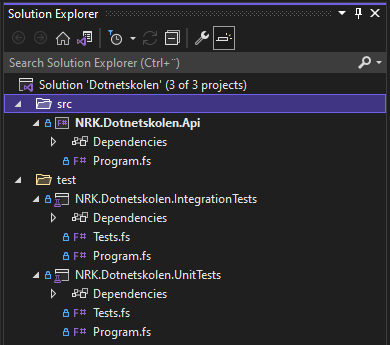
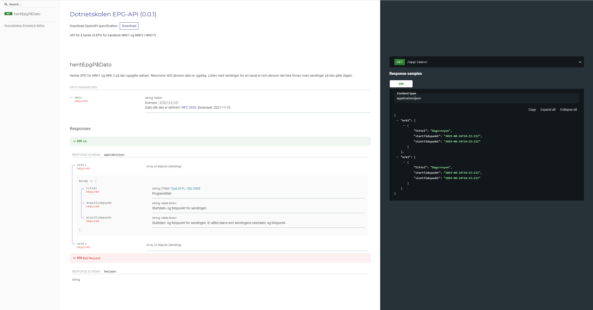

# 🏫 .NET-skolen

## 👋 Innledning

Velkommen til .NET-skolen!

Dette er et kurs hvor du blir tatt gjennom prosessen av å sette opp, og implementere, en .NET-løsning fra bunnen av, steg for steg. Målet med kurset er å vise hvordan man kan utføre oppgaver som er vanlige i etableringsfasen av et system, som å:

- Opprette prosjekter og mappestruktur
- Sette opp pakkehåndtering
- Sette opp tester

Som en eksempel-applikasjon skal vi lage et web-API i F# for å hente ut elektronisk programguide (EPG) for NRK TV, med tilhørende enhets- og integrasjonstester. Tanken er at API-et kunne levert datagrunnlaget til en programguide - f.eks. den som vises her: <https://info.nrk.no/presse/tvguide/>

> Et sekundært mål med dette repoet er at den ferdige eksempel-applikasjonen (som du finner i [branchen ferdig](https://github.com/nrkno/dotnetskolen/tree/ferdig)) kan fungere som et referanse-repo for hvordan å sette opp et .NET-prosjekt.

### 💻 Fremgangsmåte

Vi skal bruke [.NET CLI](https://docs.microsoft.com/en-us/dotnet/core/tools/) til å opprette prosjekter, samt kjøre koden og testene. I tillegg skal vi dokumentere web-API-et vårt ved hjelp av [OpenAPI](https://www.openapis.org/).

Overordnet kommer mappestrukturen til løsningen vår til å se slik ut:

```txt
└── docs (kontrakt for web-API-et)
└── src  (kildekode til web-API-et)
└── test (kildekode til enhets- og integrasjonstestene)
```

Det anbefales å følge denne veiledningen [på GitHub](https://github.com/nrkno/dotnetskolen), da visningen der støtter lenkene som er lagt inn, og har innholdsfortegnelse som alltid er synlig oppe til venstre når man blar i veiledningen.

### 🚀 Kom i gang

For å gjennomføre dette kurset trenger du [.NET 9 SDK](https://dotnet.microsoft.com/download/dotnet), en teksteditor og en terminal. Når du har dette, gå til [Steg 1 - Opprette API](#steg-1---opprette-api) og følg veiledningen. For alternative startpunkter se [alternative startpunkter](https://github.com/nrkno/dotnetskolen#-alternative-startpunkter).

> Stegene i kurset gir veiledning, steg for steg, med anvisninger for kommandoer du kan kjøre og referanseimplementasjon av kode du kan kopiere. Enkelte steder er implementasjonen av koden imidlertid utelatt slik at du kan forsøke å implementere den selv. Disse stedene er markert med ☑️. Les mer om hvordan du kan se fullstendig løsningsforslag for hvert steg [her](#se-løsningsforslag).

> Hvis du trenger mer detaljer om hvordan du gjør klar maskinen din til å gjennomføre kurset, se [Detaljer om oppsett på maskinen din](/docs/detaljer-oppsett.md).

> Dersom du er helt ny til .NET kan det være nyttig å begynne med å lese:
> - [Hva .NET er](/docs/hva-er-dotnet.md)
> - [Hva F# er](/docs/hva-er-fsharp.md)

#### 📍 Alternative startpunkter

Denne workshopen dekker en del ulike temaer, og det kan ta litt tid å fullføre alle stegene. Heldigvis finnes det løsningsforslag for hvert steg i workshopen, som betyr at du kan starte på et hvilket som helst steg ved å sjekke ut branchen med løsningsforslaget til steget før du ønsker å begynne på, og fortsette derfra. Les mer om hvordan du kan [klone dette repoet](https://github.com/nrkno/dotnetskolen/blob/main/docs/detaljer-oppsett.md#-lokalt-oppsett-av-koden-valgfritt) og [sjekke ut løsningsforslag](https://github.com/nrkno/dotnetskolen#se-l%C3%B8sningsforslag).

Under følger noen anbefalinger for alternative startpunkter, avhengig av hvilke temaer du ønsker å lære mer om.

> NB! Dersom du begynner på steg 5 eller senere, må du kjøre `dotnet tool restore` før du fortsetter å følge veiledningen.

##### Oppsett av prosjekter og solution med .NET CLI

Dersom du er interessert i å lære mer om hvordan du kan bruke .NET CLI til å opprette prosjekter og solutions, kan følge disse stegene:

- [Steg 1 - Opprette API](#steg-1---opprette-api)
- [Steg 2 - Opprette testprosjekter](#steg-2---opprette-testprosjekter)
- [Steg 3 - Opprette solution](#steg-3---opprette-solution)

##### Domenemodellering og enhetstester

Vil du lære mer om domenemodellering i F# og tilhørende enhetstester, kan følge disse stegene:

- [Steg 4 - Definere domenemodell](#steg-4---definere-domenemodell)
- [Steg 5 - Enhetstester for domenemodell](#steg-5---enhetstester-for-domenemodell)

##### API-kontrakter

Hvis du vil lære mer om hvordan du kan dokumentere API-et ditt vha. Open API, og modellere kontraktstyper, kan følge disse stegene:

- [Steg 6 - Definere API-kontrakt](#steg-6---definere-api-kontrakt)
- [Steg 7 - Implementere kontraktstyper](#steg-7---implementere-kontraktstyper)

##### .NET 9 og minimal API

Om du er interessert i .NET 9 sin hosting modell, "minimal APIs", og hvordan du kan teste API-et ditt med integrasjonstester, kan følge disse stegene:

- [Steg 8 - Sette opp skall for API](#steg-8---sette-opp-skall-for-api)
- [Steg 9 - Implementere web-API](#steg-9---implementere-web-api)

##### Tilleggsoppgaver

Til slutt finnes det noen ekstraoppgaver, hvis du vil ha mer å bryne deg på:

- [Ekstraoppgaver](#ekstraoppgaver)
  - [Steg 10 - Følge prinsipper i domenedrevet design](#steg-10---følge-prinsipper-i-domenedrevet-design)
  - [Steg 11 - Grafisk fremstilling av OpenAPI-dokumentasjon](#steg-11---grafisk-fremstilling-av-openapi-dokumentasjon)

### ❓ Spørsmål

Lurer du på noe knyttet til kurset? Opprett gjerne en tråd under "Discussions" i dette repoet:

- <https://github.com/nrkno/dotnetskolen/discussions/categories/q-a>

### 💡 Tips og triks

Nyttige [tips og triks finner du her](/docs/tips-og-triks.md)

### 🔗 Nyttige lenker

- Microsoft's offisielle dokumentasjon for .NET - <https://docs.microsoft.com/en-us/dotnet/>
- F# cheat sheet - <http://dungpa.github.io/fsharp-cheatsheet/>
- Innføring i F# - <https://fsharpforfunandprofit.com/site-contents/#understanding-f>
- Andre kurs i NRK
  - F#-skolen, kurs i F# laget av ansatte i NRK TV - <https://github.com/nrkno/fsharpskolen>
  - GitHub Actions 101, laget av [@teodor-elstad](https://github.com/teodor-elstad) <https://github.com/teodor-elstad/github-actions-101>

### 👍👎 Tilbakemeldinger

Har du tilbakemeldinger til kurset? Opprett gjerne en tråd for det her:

- <https://github.com/nrkno/dotnetskolen/discussions/categories/ideas>

### 👩👨 Medvirkende

- [@heidisu](https://github.com/heidisu) - Idé og kvalitetssikring
- [@thomaswolff](https://github.com/thomaswolff) - Primus motor og forfatter

### 🙌 Takk

- Takk til alle som har kommet med konstruktiv kritikk og nyttige tilbakemeldinger til dette kurset.

### 📝 Lisens

All dokumentasjon (inkludert denne veiledningen) og kildekoden i dette repoet er åpent tilgjengelig under [MIT-lisensen](/LICENCE).

## 📖 Innholdsfortegnelse

- [Steg](#steg)
  - [Steg 1 - Opprette API](#steg-1---opprette-api)
  - [Steg 2 - Opprette testprosjekter](#steg-2---opprette-testprosjekter)
  - [Steg 3 - Opprette solution](#steg-3---opprette-solution)
  - [Steg 4 - Definere domenemodell](#steg-4---definere-domenemodell)
  - [Steg 5 - Enhetstester for domenemodell](#steg-5---enhetstester-for-domenemodell)
  - [Steg 6 - Definere API-kontrakt](#steg-6---definere-api-kontrakt)
  - [Steg 7 - Implementere kontraktstyper](#steg-7---implementere-kontraktstyper)
  - [Steg 8 - Sette opp skall for API](#steg-8---sette-opp-skall-for-api)
  - [Steg 9 - Implementere web-API](#steg-9---implementere-web-api)
- [Ekstraoppgaver](#ekstraoppgaver)
  - [Steg 10 - Følge prinsipper i domenedrevet design](#steg-10---følge-prinsipper-i-domenedrevet-design)
  - [Steg 11 - Grafisk fremstilling av OpenAPI-dokumentasjon](#steg-11---grafisk-fremstilling-av-openapi-dokumentasjon)

## Steg

Nå som du har installert alle verktøyene du trenger er du klar til å begynne på selve kurset!

### Steg 1 - Opprette API

**Steg 1 av 9** - [🔝 Gå til toppen](#-net-skolen) [⬇ Neste steg](#steg-2---opprette-testprosjekter)

I dette steget starter vi med en mappe helt uten kode, og bruker .NET CLI til å opprette vårt første prosjekt `NRK.Dotnetskolen.Api`.

#### .NET-versjon

Siden denne veiledningen er skrevet for .NET 9, og det er mulig at du har flere .NET-versjoner installert på maskinen din, må vi instruere .NET CLI til å benytte .NET 9 når vi kjører kommandoene i veiledningen. Dette gjør vi ved å opprette en konfigurasjonsfil `global.json` i roten av repoet med følgende innhold:

```json¨
{
    "sdk": {
        "version": "9.0.0",
        "rollForward": "latestMinor"
    }
}
```

Her oppgir vi at vi i utgangspunktet ønsker å bruke version `9.0.0` av .NET SDK. I tillegg sier vi gjennom `rollForward: latestMinor` at vi ønsker at den høyeste tilgjengelige versjonen av .NET 9 på maskinen din skal brukes.

> Du kan lese mer om `global.json` her: <https://docs.microsoft.com/en-us/dotnet/core/tools/global-json>

#### .NET-prosjekter

For å kunne organisere kode i .NET bruker man _prosjekter_. Et prosjekt er en samling med kildekodefiler, og eventuelle andre ressursfiler, og alle filene som inngår i prosjektet er referert til i en _prosjektfil_. For F#-prosjekter har slike prosjektfiler filendelsen `.fsproj`.

Når man kompilerer .NET-prosjekter kan man velge mellom to typer output:

- Kjørbar fil (_executable_) - et program som kan kjøres
- Klassebibliotek (_dynamically linked library_) - en samling med funksjonalitet som kan benyttes av andre programmer

#### Dotnet new

Som nevnt i [innledningen](#-fremgangsmåte) er .NET CLI et kommandolinjeverktøy laget for å utvikle, bygge, kjøre og publisere .NET-applikasjoner. .NET CLI kjøres fra kommandolinjen med kommandoen `dotnet`, og har mange underkommandoer og valg. For å se alle kan du kjøre kommandoen under, eller lese mer her: <https://docs.microsoft.com/en-us/dotnet/core/tools/dotnet>

```bash
dotnet --help
```

```bash
Usage: dotnet [runtime-options] [path-to-application] [arguments]

Execute a .NET application.

runtime-options:
  --additionalprobingpath <path>   Path containing probing policy and assemblies to probe for.
  --additional-deps <path>         Path to additional deps.json file.
  --depsfile                       Path to <application>.deps.json file.
  --fx-version <version>           Version of the installed Shared Framework to use to run the application.
  --roll-forward <setting>         Roll forward to framework version  (LatestPatch, Minor, LatestMinor, Major, LatestMajor, Disable).
  --runtimeconfig                  Path to <application>.runtimeconfig.json file.

path-to-application:
  The path to an application .dll file to execute.

Usage: dotnet [sdk-options] [command] [command-options] [arguments]

Execute a .NET SDK command.

sdk-options:
  -d|--diagnostics  Enable diagnostic output.
  -h|--help         Show command line help.
  --info            Display .NET information.
  --list-runtimes   Display the installed runtimes.
  --list-sdks       Display the installed SDKs.
  --version         Display .NET SDK version in use.

SDK commands:
  add               Add a package or reference to a .NET project.
  build             Build a .NET project.
  build-server      Interact with servers started by a build.
  clean             Clean build outputs of a .NET project.
  format            Apply style preferences to a project or solution.
  help              Opens the reference page in a browser for the specified command.
  list              List packages or references of a .NET project.
  msbuild           Run Microsoft Build Engine (MSBuild) commands.
  new               Create a new .NET project or file.
  nuget             Provides additional NuGet commands.
  pack              Create a NuGet package.
  publish           Publish a .NET project for deployment.
  remove            Remove a package or reference from a .NET project.
  restore           Restore dependencies specified in a .NET project.
  run               Build and run a .NET project output.
  sdk               Manage .NET SDK installation.
  sln               Modify Visual Studio solution files.
  store             Store the specified assemblies in the runtime package store.
  test              Run unit tests using the test runner specified in a .NET project.
  tool              Install or manage tools that extend the .NET experience.
  vstest            Run Microsoft Test Engine (VSTest) commands.
  workload          Manage optional workloads.

Additional commands from bundled tools:
  dev-certs         Create and manage development certificates.
  fsi               Start F# Interactive / execute F# scripts.
  user-jwts         Manage JSON Web Tokens in development.
  user-secrets      Manage development user secrets.
  watch             Start a file watcher that runs a command when files change.

Run 'dotnet [command] --help' for more information on a command.
```

#### Maler

For å opprette API-prosjektet skal vi bruke `new`-kommandoen i .NET CLI. `dotnet new` oppretter .NET-prosjekter, og som første parameter tar `new`-kommandoen inn hva slags mal prosjektet man oppretter skal følge. Når man installerer .NET SDK får man med et sett med forhåndsdefinerte prosjektmaler for vanlige formål. For å se malene som er installert på din maskin kan du kjøre `dotnet new --list` slik:

```bash
dotnet new list
```

```bash
These templates matched your input:

Template Name                               Short Name                  Language    Tags
------------------------------------------  --------------------------  ----------  -------------------------------------------------------
.NET Aspire App Host                        aspire-apphost              [C#]        Common/.NET Aspire/Cloud
.NET Aspire Empty App                       aspire                      [C#]        Common/.NET Aspire/Cloud/Web/Web API/API/Service
.NET Aspire Service Defaults                aspire-servicedefaults      [C#]        Common/.NET Aspire/Cloud/Web/Web API/API/Service
.NET Aspire Starter App                     aspire-starter              [C#]        Common/.NET Aspire/Blazor/Web/Web API/API/Service/Cloud
.NET Aspire Test Project (MSTest)           aspire-mstest               [C#]        Common/.NET Aspire/Cloud/Web/Web API/API/Service/Test
.NET Aspire Test Project (NUnit)            aspire-nunit                [C#]        Common/.NET Aspire/Cloud/Web/Web API/API/Service/Test
.NET Aspire Test Project (xUnit)            aspire-xunit                [C#]        Common/.NET Aspire/Cloud/Web/Web API/API/Service/Test
API Controller                              apicontroller               [C#]        Web/ASP.NET
ASP.NET Core Empty                          web                         [C#],F#     Web/Empty
ASP.NET Core gRPC Service                   grpc                        [C#]        Web/gRPC/API/Service
ASP.NET Core Web API                        webapi                      [C#],F#     Web/WebAPI/Web API/API/Service
ASP.NET Core Web API (native AOT)           webapiaot                   [C#]        Web/Web API/API/Service
ASP.NET Core Web App (Model-View-Contro...  mvc                         [C#],F#     Web/MVC
ASP.NET Core Web App (Razor Pages)          webapp,razor                [C#]        Web/MVC/Razor Pages
ASP.NET Core with Angular                   angular                     [C#]        Web/MVC/SPA
ASP.NET Core with React.js                  react                       [C#]        Web/MVC/SPA
ASP.NET Core with React.js and Redux        reactredux                  [C#]        Web/MVC/SPA
Blazor Server App                           blazorserver                [C#]        Web/Blazor
Blazor Server App Empty                     blazorserver-empty          [C#]        Web/Blazor/Empty
Blazor Web App                              blazor                      [C#]        Web/Blazor/WebAssembly
Blazor WebAssembly App Empty                blazorwasm-empty            [C#]        Web/Blazor/WebAssembly/PWA/Empty
Blazor WebAssembly Standalone App           blazorwasm                  [C#]        Web/Blazor/WebAssembly/PWA
Class Library                               classlib                    [C#],F#,VB  Common/Library
Console App                                 console                     [C#],F#,VB  Common/Console
dotnet gitignore file                       gitignore,.gitignore                    Config
Dotnet local tool manifest file             tool-manifest                           Config
EditorConfig file                           editorconfig,.editorconfig              Config
global.json file                            globaljson,global.json                  Config
MSBuild Directory.Build.props file          buildprops                              MSBuild/props
MSBuild Directory.Build.targets file        buildtargets                            MSBuild/props
MSBuild Directory.Packages.props file       packagesprops                           MSBuild/packages/props/CPM
MSTest Playwright Test Project              mstest-playwright           [C#]        Test/MSTest/Playwright/Desktop/Web
MSTest Test Class                           mstest-class                [C#],F#,VB  Test/MSTest
MSTest Test Project                         mstest                      [C#],F#,VB  Test/MSTest/Desktop/Web
MVC Controller                              mvccontroller               [C#]        Web/ASP.NET
MVC ViewImports                             viewimports                 [C#]        Web/ASP.NET
MVC ViewStart                               viewstart                   [C#]        Web/ASP.NET
NuGet Config                                nugetconfig,nuget.config                Config
NUnit 3 Test Item                           nunit-test                  [C#],F#,VB  Test/NUnit
NUnit 3 Test Project                        nunit                       [C#],F#,VB  Test/NUnit/Desktop/Web
NUnit Playwright Test Project               nunit-playwright            [C#]        Test/NUnit/Playwright/Desktop/Web
Protocol Buffer File                        proto                                   Web/gRPC
Razor Class Library                         razorclasslib               [C#]        Web/Razor/Library/Razor Class Library
Razor Component                             razorcomponent              [C#]        Web/ASP.NET
Razor Page                                  page                        [C#]        Web/ASP.NET
Razor View                                  view                        [C#]        Web/ASP.NET
Solution File                               sln,solution                            Solution
Web Config                                  webconfig                               Config
Windows Forms App                           winforms                    [C#],VB     Common/WinForms
Windows Forms Class Library                 winformslib                 [C#],VB     Common/WinForms
Windows Forms Control Library               winformscontrollib          [C#],VB     Common/WinForms
Worker Service                              worker                      [C#],F#     Common/Worker/Web
WPF Application                             wpf                         [C#],VB     Common/WPF
WPF Class Library                           wpflib                      [C#],VB     Common/WPF
WPF Custom Control Library                  wpfcustomcontrollib         [C#],VB     Common/WPF
WPF User Control Library                    wpfusercontrollib           [C#],VB     Common/WPF
xUnit Test Project                          xunit                       [C#],F#,VB  Test/xUnit/Desktop/Web
```

I tillegg til å styre hva slags type prosjekt man vil opprette med `new`-kommandoen, har man mulighet til å styre ting som hvilket språk man ønsker prosjektet skal opprettes for, og i hvilken mappe prosjektet opprettes i. For å se alle valgene man har i `dotnet new` kan du kjøre følgende kommando

```bash
dotnet new --help
```

```bash
Description:
  Template Instantiation Commands for .NET CLI.

Usage:
  dotnet new [<template-short-name> [<template-args>...]] [options]
  dotnet new [command] [options]

Arguments:
  <template-short-name>  A short name of the template to create.
  <template-args>        Template specific options to use.

Options:
  -o, --output <output>    Location to place the generated output.
  -n, --name <name>        The name for the output being created. If no name is specified, the name of the output directory is used.
  --dry-run                Displays a summary of what would happen if the given command line were run if it would result in a template
                           creation.
  --force                  Forces content to be generated even if it would change existing files.
  --no-update-check        Disables checking for the template package updates when instantiating a template.
  --project <project>      The project that should be used for context evaluation.
  -v, --verbosity <LEVEL>  Sets the verbosity level. Allowed values are q[uiet], m[inimal], n[ormal], and diag[nostic]. [default: normal]
  -d, --diagnostics        Enables diagnostic output.
  -?, -h, --help           Show command line help.

Commands:
  create <template-short-name> <template-args>  Instantiates a template with given short name. An alias of 'dotnet new <template name>'.
  install <package>                             Installs a template package.
  uninstall <package>                           Uninstalls a template package.
  update                                        Checks the currently installed template packages for update, and install the updates.
  search <template-name>                        Searches for the templates on NuGet.org.
  list <template-name>                          Lists templates containing the specified template name. If no name is specified, lists all
                                                templates.
  details <package-identifier>                  Provides the details for specified template package.
                                                      The command checks if the package is installed locally, if it was not found, it
                                                searches the configured NuGet feeds.
```

#### Opprette API-prosjektet

Som du ser av malene som er listet ut over, er det en innebygget mal for web-API som heter `webapi`. For å komme raskt i gang med et prosjekt, eller se hvordan et default .NET API er satt opp, kan man bruke `webapi` som mal. Vi kommer imidlertid til å opprette API-et vårt fra bunnen av ved å bruke malen `console` for å lære mest mulig om de ulike bestanddelene.

Kjør følgende kommando for å opprette API-prosjektet

```bash
dotnet new console --language F# --output src/api --name NRK.Dotnetskolen.Api
```

```bash
The template "Console App" was created successfully.

Processing post-creation actions...
Running 'dotnet restore' on src\api\NRK.Dotnetskolen.Api.fsproj...
  Determining projects to restore...
  Restored C:\Dev\nrkno@github.com\dotnetskolen\src\api\NRK.Dotnetskolen.Api.fsproj (in 101 ms).
Restore succeeded.
```

I kommandoen over brukte vi `--language`-argumentet for å oppgi at vi ønsket et F#-prosjekt. I tillegg brukte vi `--output` for å oppgi hvor vi ønsket at prosjektet skulle ligge relativt til der vi kjører kommandoen fra, og `--name` til å styre navnet på prosjektet.

> Merk at istedenfor `--language`, `--output` og `--name`, kunne vi brukt forkortelsene `-lang`, `-o` og `-n`.

Du skal nå ha en mappestruktur som ser slik ut

```txt
src
└── api
    └── NRK.Dotnetskolen.Api.fsproj
    └── Program.fs
```

Som vi ser av diagrammet over opprettet .NET CLI mappene `src` og `src/api`, med `NRK.Dotnetskolen.Api.fsproj` og `Program.fs` i `src/api`.

> Merk at med mindre noe annet er spesifisert, er alle kommandoene i veiledningen skrevet med forutsetning om at du står i samme mappe når du kjører dem. Dersom du har klonet Git-repoet til kurset er det rotmappen til repoet. Dersom du følger kurset uten å bruke Git er det mappen du bestemmer deg for å kjøre kommandoene i.

##### Prosjektfil

Åpne `NRK.Dotnetskolen.Api.fsproj` for å se innholdet til prosjektfilen til prosjektet du nettopp opprettet:

```xml
<Project Sdk="Microsoft.NET.Sdk">

  <PropertyGroup>
    <OutputType>Exe</OutputType>
    <TargetFramework>net9.0</TargetFramework>
  </PropertyGroup>

  <ItemGroup>
    <Compile Include="Program.fs" />
  </ItemGroup>

</Project>
```

Her ser vi at prosjektet:

- Har outputtypen `exe` - prosjektet kompileres til å bli en kjørbar fil
- Skal kompileres til .NET 9
- Består av én fil `Program.fs`

##### Programfilen

For å se hva programmet gjør kan vi åpne `Program.fs` og se på koden:

```f#
// For more information see https://aka.ms/fsharp-console-apps
printfn "Hello from F#"
```

Malen la inn kun én linje i `Program.fs` som skriver tekststrengen `Hello world from F#` til output. Fra andre programmeringsspråk er du kanskje vant til å se en `main`-funksjon eller liknende, men det ser vi ikke her. Grunnen til det er at F# bruker et implisitt startpunkt som er på toppen av filen. Deretter utføres koden linje for linje slik som spesifisert i filen. Det er også mulig å bruke eksplisitte startpunkter i F#-programmer. Les mer om det her: <https://docs.microsoft.com/en-us/dotnet/fsharp/language-reference/functions/entry-point#implicit-entry-point>
> Navnet til prosjektet `NRK.Dotnetskolen.Api.fsproj` følger Microsoft sin navnekonvensjon for programmer og biblioteker i .NET. For å lese mer om denne, og andre navnekonvensjoner i .NET, kan du se her: <https://docs.microsoft.com/en-us/dotnet/standard/design-guidelines/names-of-assemblies-and-dlls>
>
> Mappestrukturen over er ment som et forslag, og de videre stegene i kurset bygger på denne. Hvis du bruker kurset som inspirasjon eller veiledning til å opprette ditt eget prosjekt, trenger du ikke følge denne mappestrukturen. Hvordan du strukturerer mappene i ditt system er opp til deg, og er avhengig av aspekter som størrelse på systemet, antall prosjekter, og personlige preferanser.

#### Kjøre API-prosjektet

For å kjøre prosjektet som ble opprettet over kan du kjøre følgende kommando

```bash
dotnet run --project src/api/NRK.Dotnetskolen.Api.fsproj
```

```bash
Hello world from F#
```

Alternativt kan du gå til mappen hvor prosjektet ligger, og kjøre `dotnet run` derfra, slik som vist under

```bash
cd src/api
dotnet run
```

```bash
Hello world from F#
```

#### Lagre endringer i Git (valgfritt)

Nå som du har fullført det første steget i kurset er det en fin anledning til å lagre endringene du har gjort så langt i Git.

##### Se endringer

Gitt at du fulgte veiledningen for å [sette opp koden lokalt](https://github.com/nrkno/dotnetskolen/blob/main/docs/detaljer-oppsett.md#-lokalt-oppsett-av-koden-valgfritt) før du begynte å kode, kan du kjøre følgende kommando for å se hvilke endringer som er gjort i repoet:

```bash
git status
```

```bash
On branch <branchnavn>
Untracked files:
  (use "git add <file>..." to include in what will be committed)
        global.json
        src/

nothing added to commit but untracked files present (use "git add" to track)
```

I outputen over ser vi at Git har oppdaget at det er opprettet en mappe `src` og innhold i den, men Git overvåker ikke disse per nå (filene er "untracked").

##### Legg til endringer i Git

For å få Git til å overvåke filene vi har opprettet, og deretter se status i Git kan du kjøre følgende kommandoer:

```bash
git add .
git status
```

```bash
Changes to be committed:
  (use "git restore --staged <file>..." to unstage)
        new file:   global.json
        new file:   src/api/NRK.Dotnetskolen.Api.fsproj
        new file:   src/api/Program.fs
```

Nå overvåker Git filene.

##### Lagre endringene

For å lagre nåværende tilstand av filene i en "commit" i Git kan du kjøre følgende kommando:

```bash
git commit -m "Opprettet API-prosjekt"
```

```bash
[<branchnavn> 00d11c8] Opprettet API-prosjekt
 2 files changed, 25 insertions(+)
 create mode 100644 src/api/NRK.Dotnetskolen.Api.fsproj
 create mode 100644 src/api/Program.fs
```

##### Se alle historiske endringer i repoet

For å se alle commits i nåværende branch i Git, kan du kjøre følgende kommando:

```bash
git log
```

```bash
commit 00d11c82d0179f41883a55ce88e147a73ae60ee2 (HEAD -> <branchnavn>)
Author: Thomas Wolff <thomas.wolff@nrk.no>
Date:   Fri Apr 16 13:43:40 2021 +0200

    Opprettet API-prosjekt
...
```

> 💡 Tips! Gjenta de tre stegene over med å se endringer, legge dem til, og lagre dem etter å ha fullført hvert steg for å ha bedre oversikt over hva du har vært gjennom i kurset.

#### Se løsningsforslag

Dersom du ønsker å se den forventede tilstanden til repoet etter å ha utført de ulike stegene i kurset, kan du sjekke ut branchen med korresponderende navn som seksjonen du ønsker å se på. F.eks. hvis du vil se hvordan repoet ser ut etter første steg, kan du sjekke ut branchen `steg-1` slik:

```bash
git checkout steg-1
```

```bash
Switched to branch 'steg-1'
```

### Steg 2 - Opprette testprosjekter

**Steg 2 av 9** - [🔝 Gå til toppen](#-net-skolen) [⬆ Forrige steg](#steg-1---opprette-api) [⬇ Neste steg](#steg-3---opprette-solution)

Tester er en viktig del av systemutvikling fordi de hjelper oss med å verifisere at systemet fungerer slik det skal. Når man skriver tester for kode opererer man ofte med to typer tester:

- Enhetstester
- Integrasjonstester

Enhetstester verifiserer at små, isolerte deler av koden fungerer slik den skal. Gjerne én og én funksjon. I dette kurset skal vi bruke enhetstester til å verifisere valideringsregler i domenet vårt.

Integrasjonstester verifiserer at større deler av systemet fungerer slik det skal, og kan til og med dekke samspill med andre systemer. I dette kurset skal vi bruke integrasjonstester til å verifisere at web-API-et oppfører seg i henhold til [kontrakten vi definerer i steg 6](#steg-6---definere-api-kontrakt).

#### Dotnet new

I dette steget skal vi opprette to testprosjekter

- Ett for enhetstester - `NRK.Dotnetskolen.UnitTests`
- Ett for integrasjonstester - `NRK.Dotnetskolen.IntegrationTests`

For å opprette testprosjektene skal vi igjen bruke `dotnet new`-kommandoen, men denne gangen velger vi en annen [mal](#maler) enn da vi opprettet API-prosjektet. Når man installerer .NET SDK følger det med flere maler for testprosjekter som korresponderer til ulike rammeverk som finnes for å detektere og kjøre tester:

- xUnit
- nUnit
- MSTest

I dette kurset kommer vi til å bruke xUnit. Dette valget er litt vilkårlig ettersom alle rammeverkene over vil være tilstrekkelig til formålet vårt, som er å vise hvordan man kan sette opp testprosjekter og komme i gang med å skrive tester. Dersom du ønsker å vite mer om de ulike testrammeverkene, kan du lese mer om dem her: <https://docs.microsoft.com/en-us/dotnet/core/testing/#testing-tools>

#### Opprette enhetstestprosjekt

Kjør følgende kommando for å opprette enhetstestprosjektet

```bash
dotnet new xunit -lang F# -o test/unit -n NRK.Dotnetskolen.UnitTests
```

```bash
The template "xUnit Test Project" was created successfully.

Processing post-creation actions...
Running 'dotnet restore' on test/unit/NRK.Dotnetskolen.UnitTests.fsproj...
  Determining projects to restore...
  Restored C:\Dev\nrkno@github.com\dotnetskolen\test\unit\NRK.Dotnetskolen.UnitTests.fsproj (in 1.31 sec).
Restore succeeded.
```

Du skal nå ha følgende mappestruktur

```txt
src
└── api
    └── NRK.Dotnetskolen.Api.fsproj
    └── Program.fs
test
└── unit
    └── NRK.Dotnetskolen.UnitTests.fsproj
    └── Program.fs
    └── Tests.fs
```

##### Prosjektfil

Åpne filen `NRK.Dotnetskolen.UnitTests.fsproj`:

```xml
<Project Sdk="Microsoft.NET.Sdk">

  <PropertyGroup>
    <TargetFramework>net9.0</TargetFramework>
    <IsPackable>false</IsPackable>
    <GenerateProgramFile>false</GenerateProgramFile>
  </PropertyGroup>

  <ItemGroup>
    <Compile Include="Tests.fs" />
    <Compile Include="Program.fs" />
  </ItemGroup>

  <ItemGroup>
    <PackageReference Include="coverlet.collector" Version="6.0.2" />
    <PackageReference Include="Microsoft.NET.Test.Sdk" Version="17.12.0" />
    <PackageReference Include="xunit" Version="2.9.2" />
    <PackageReference Include="xunit.runner.visualstudio" Version="2.8.2" />
  </ItemGroup>

</Project>
```

I prosjektfilen kan vi se at enhetstestprosjektet:

- Skal kompileres til .NET 9
- Inneholder to kildekodefiler
  - `Tests.fs`
  - `Program.fs`
- Har referanser til fire NuGet-pakker
  - `coverlet.collector` - bibliotek for å få code coverage statistikk for prosjekter <https://docs.microsoft.com/en-us/dotnet/core/testing/unit-testing-code-coverage?tabs=windows>
  - `Microsoft.NET.Test.Sdk` - Pakke for å bygge .NET testprosjekter
  - `xunit` - Bibliotek for å skrive enhetstester
  - `xunit.runner.visualstudio` - Pakke for å kjøre Xunit-tester i "Test explorer" i Visual Studio <https://docs.microsoft.com/en-us/visualstudio/test/run-unit-tests-with-test-explorer?view=vs-2019>

##### Testfilen

Åpne filen `Tests.fs`:

```f#
module Tests

open System
open Xunit

[<Fact>]
let ``My test`` () =
    Assert.True(true)

```

Øverst i filen blir det definert en F#-modul `Tests`. I tillegg blir modulene `System` og `Xunit` åpnet, som kommer fra hhv. basebiblioteket til Microsoft, og biblioteket Xunit. Videre blir det definert en test ``` ``My test`` ```. Måten vi ser at det er en test på er ved å se at den er annotert med `[<Fact>]`. Xunit opererer med to annotasjoner for tester:

- `[<Fact>]`
- `[<Theory>]`

Forskjellen på disse blir nærmere forklart i [steget om enhetstester](#steg-5---enhetstester-for-domenemodell).

> Merk at ``` ``<variabelnavn med mellomrom>`` ``` er brukt for å kunne ha et variabelnavn som inneholder mellomrom. På denne måten kan man ha et funksjonsnavn som beskriver testen og samtidig er lesbar for mennesker.

##### Kjøre enhetstestprosjektet

For å kjøre testen i enhetstestprosjektet kan du bruke følgende kommando

```bash
dotnet test test/unit/NRK.Dotnetskolen.UnitTests.fsproj
```

```bash
Restore complete (0,3s)
  NRK.Dotnetskolen.UnitTests succeeded (2,0s) → test\unit\bin\Debug\net9.0\NRK.Dotnetskolen.UnitTests.dll
[xUnit.net 00:00:00.00] xUnit.net VSTest Adapter v2.8.2+699d445a1a (64-bit .NET 9.0.1)
[xUnit.net 00:00:00.51]   Discovering: NRK.Dotnetskolen.UnitTests
[xUnit.net 00:00:00.54]   Discovered:  NRK.Dotnetskolen.UnitTests
[xUnit.net 00:00:00.54]   Starting:    NRK.Dotnetskolen.UnitTests
[xUnit.net 00:00:00.69]   Finished:    NRK.Dotnetskolen.UnitTests
  NRK.Dotnetskolen.UnitTests test succeeded (1,8s)

Test summary: total: 1; failed: 0; succeeded: 1; skipped: 0; duration: 1,8s
Build succeeded in 4,5s
```

På lik linje med `dotnet run`, kan du alternativt gå inn i mappen til enhetstestprosjektet, og kjøre `dotnet test` derfra:

```bash
cd test/unit
dotnet test
```

```bash
Restore complete (0,3s)
  NRK.Dotnetskolen.UnitTests succeeded (0,4s) → bin\Debug\net9.0\NRK.Dotnetskolen.UnitTests.dll
[xUnit.net 00:00:00.00] xUnit.net VSTest Adapter v2.8.2+699d445a1a (64-bit .NET 9.0.1)
[xUnit.net 00:00:00.50]   Discovering: NRK.Dotnetskolen.UnitTests
[xUnit.net 00:00:00.52]   Discovered:  NRK.Dotnetskolen.UnitTests
[xUnit.net 00:00:00.53]   Starting:    NRK.Dotnetskolen.UnitTests
[xUnit.net 00:00:00.68]   Finished:    NRK.Dotnetskolen.UnitTests
  NRK.Dotnetskolen.UnitTests test succeeded (1,7s)

Test summary: total: 1; failed: 0; succeeded: 1; skipped: 0; duration: 1,7s
Build succeeded in 2,9s
```

#### Opprette integrasjonstestprosjekt

For å opprette integrasjonstestprosjektet, kan du kjøre samme kommando som da du [opprettet enhetstestprosjektet](#opprette-enhetstestprosjekt), men bytt ut `Unit` med `Integration` i navnet på testprosjektet, som vist under:

```bash
dotnet new xunit -lang F# -o test/integration -n NRK.Dotnetskolen.IntegrationTests
```

```bash
The template "xUnit Test Project" was created successfully.

Processing post-creation actions...
Running 'dotnet restore' on test\integration\NRK.Dotnetskolen.IntegrationTests.fsproj...
  Determining projects to restore...
  Restored C:\Dev\nrkno@github.com\dotnetskolen\test\integration\NRK.Dotnetskolen.IntegrationTests.fsproj (in 580 ms).
Restore succeeded.
```

Du skal nå ha følgende mappestruktur

```txt
src
└── api
    └── NRK.Dotnetskolen.Api.fsproj
    └── Program.fs
test
└── unit
    └── NRK.Dotnetskolen.UnitTests.fsproj
    └── Program.fs
    └── Tests.fs
└── integration
    └── NRK.Dotnetskolen.IntegrationTests.fsproj
    └── Program.fs
    └── Tests.fs
```

Foreløpig er prosjekt- og test-filene til integrasjonstestprosjektet helt like de fra enhetstestprosjektet (bortsett fra prosjektnavnet). Forskjellen på enhets- og integrasjonstestene blir tydeligere når vi skal skrive testene i hhv. [steg 5](#steg-5---enhetstester-for-domenemodell) og [steg 9](#steg-9---implementere-web-api).

##### Kjøre integrasjonstester

For å kjøre testene i integrasjonstestprosjektet kan du bruke følgende kommando

```bash
dotnet test test/integration/NRK.Dotnetskolen.IntegrationTests.fsproj
```

```bash
Restore complete (0,3s)
  NRK.Dotnetskolen.IntegrationTests succeeded (2,0s) → test\integration\bin\Debug\net9.0\NRK.Dotnetskolen.IntegrationTests.dll
[xUnit.net 00:00:00.00] xUnit.net VSTest Adapter v2.8.2+699d445a1a (64-bit .NET 9.0.1)
[xUnit.net 00:00:00.54]   Discovering: NRK.Dotnetskolen.IntegrationTests
[xUnit.net 00:00:00.56]   Discovered:  NRK.Dotnetskolen.IntegrationTests
[xUnit.net 00:00:00.57]   Starting:    NRK.Dotnetskolen.IntegrationTests
[xUnit.net 00:00:00.72]   Finished:    NRK.Dotnetskolen.IntegrationTests
  NRK.Dotnetskolen.IntegrationTests test succeeded (1,8s)

Test summary: total: 1; failed: 0; succeeded: 1; skipped: 0; duration: 1,8s
Build succeeded in 4,6s
```

### Steg 3 - Opprette solution

**Steg 3 av 9** - [🔝 Gå til toppen](#-net-skolen) [⬆ Forrige steg](#steg-2---opprette-testprosjekter) [⬇ Neste steg](#steg-4---definere-domenemodell)

Slik oppsettet er nå, har vi tre prosjekter som er uavhengige av hverandre. Annet enn at de ligger i samme mappe, er det ingenting som kobler dem sammen. For å kunne gjøre operasjoner som å legge til felles pakker, og kjøre alle testene for systemet vårt, kan vi knytte prosjektene sammen i en og samme løsning (_solution_). Å ha alle prosjektene i en og samme løsning gir også fordelen av at man kan åpne alle prosjektene samlet i en IDE.

#### Dotnet sln

For å opprette en solution med `dotnet` kan du kjøre følgende kommando:

```bash
dotnet new sln -n Dotnetskolen
```

```bash
The template "Solution File" was created successfully.
```

Du skal nå ha fått filen `Dotnetskolen.sln` slik som vist under

```txt
src
└── api
    └── NRK.Dotnetskolen.Api.fsproj
    └── Program.fs
test
└── unit
    └── NRK.Dotnetskolen.UnitTests.fsproj
    └── Program.fs
    └── Tests.fs
└── integration
    └── NRK.Dotnetskolen.IntegrationTests.fsproj
    └── Program.fs
    └── Tests.fs
└── Dotnetskolen.sln
```

Hvis vi ser på innholdet i `Dotnetskolen.sln` ser vi at det ikke er noen referanser til prosjektene våre enda

```txt

Microsoft Visual Studio Solution File, Format Version 12.00
# Visual Studio Version 17
VisualStudioVersion = 17.0.31903.59
MinimumVisualStudioVersion = 10.0.40219.1
Global
        GlobalSection(SolutionConfigurationPlatforms) = preSolution
                Debug|Any CPU = Debug|Any CPU
                Release|Any CPU = Release|Any CPU
        EndGlobalSection
        GlobalSection(SolutionProperties) = preSolution
                HideSolutionNode = FALSE
        EndGlobalSection
EndGlobal

```

#### Legge til prosjekter i solution

For å legge til referanser til prosjektene du har opprettet kan du kjøre følgende kommandoer

##### Legge til API-prosjekt

```bash
dotnet sln add src/api/NRK.Dotnetskolen.Api.fsproj
```

```bash
Project `src\api\NRK.Dotnetskolen.Api.fsproj` added to the solution.
```

##### Legge til enhetstestprosjekt

```bash
dotnet sln add test/unit/NRK.Dotnetskolen.UnitTests.fsproj
```

```bash
Project `test\unit\NRK.Dotnetskolen.UnitTests.fsproj` added to the solution.
```

##### Legge til integrasjonstestprosjekt

```bash
dotnet sln add test/integration/NRK.Dotnetskolen.IntegrationTests.fsproj
```

```bash
Project `test\integration\NRK.Dotnetskolen.IntegrationTests.fsproj` added to the solution.
```

Nå ser vi at `Dotnetskolen.sln` inneholder referanser til prosjektene våre

```txt

Microsoft Visual Studio Solution File, Format Version 12.00
# Visual Studio Version 17
VisualStudioVersion = 17.0.31903.59
MinimumVisualStudioVersion = 10.0.40219.1
Project("{2150E333-8FDC-42A3-9474-1A3956D46DE8}") = "src", "src", "{602F7DA2-73CF-4DA2-82E5-D392DE47E0BC}"
EndProject
Project("{F2A71F9B-5D33-465A-A702-920D77279786}") = "NRK.Dotnetskolen.Api", "src\api\NRK.Dotnetskolen.Api.fsproj", "{618BF895-AEA1-4086-8904-89DD317B2429}"
EndProject
Project("{2150E333-8FDC-42A3-9474-1A3956D46DE8}") = "test", "test", "{10963520-731D-442B-B808-DA74BDD9207D}"
EndProject
Project("{F2A71F9B-5D33-465A-A702-920D77279786}") = "NRK.Dotnetskolen.UnitTests", "test\unit\NRK.Dotnetskolen.UnitTests.fsproj", "{95B87F0E-15B8-4646-98F0-E8DAACA5526D}"
EndProject
Project("{F2A71F9B-5D33-465A-A702-920D77279786}") = "NRK.Dotnetskolen.IntegrationTests", "test\integration\NRK.Dotnetskolen.IntegrationTests.fsproj", "{391F46FA-9684-460E-B6A2-99EF7363693F}"
EndProject
Global
        GlobalSection(SolutionConfigurationPlatforms) = preSolution
                Debug|Any CPU = Debug|Any CPU
                Release|Any CPU = Release|Any CPU
        EndGlobalSection
        GlobalSection(SolutionProperties) = preSolution
                HideSolutionNode = FALSE
        EndGlobalSection
        GlobalSection(ProjectConfigurationPlatforms) = postSolution
                {618BF895-AEA1-4086-8904-89DD317B2429}.Debug|Any CPU.ActiveCfg = Debug|Any CPU
                {618BF895-AEA1-4086-8904-89DD317B2429}.Debug|Any CPU.Build.0 = Debug|Any CPU
                {618BF895-AEA1-4086-8904-89DD317B2429}.Release|Any CPU.ActiveCfg = Release|Any CPU
                {618BF895-AEA1-4086-8904-89DD317B2429}.Release|Any CPU.Build.0 = Release|Any CPU
                {95B87F0E-15B8-4646-98F0-E8DAACA5526D}.Debug|Any CPU.ActiveCfg = Debug|Any CPU
                {95B87F0E-15B8-4646-98F0-E8DAACA5526D}.Debug|Any CPU.Build.0 = Debug|Any CPU
                {95B87F0E-15B8-4646-98F0-E8DAACA5526D}.Release|Any CPU.ActiveCfg = Release|Any CPU
                {95B87F0E-15B8-4646-98F0-E8DAACA5526D}.Release|Any CPU.Build.0 = Release|Any CPU
                {391F46FA-9684-460E-B6A2-99EF7363693F}.Debug|Any CPU.ActiveCfg = Debug|Any CPU
                {391F46FA-9684-460E-B6A2-99EF7363693F}.Debug|Any CPU.Build.0 = Debug|Any CPU
                {391F46FA-9684-460E-B6A2-99EF7363693F}.Release|Any CPU.ActiveCfg = Release|Any CPU
                {391F46FA-9684-460E-B6A2-99EF7363693F}.Release|Any CPU.Build.0 = Release|Any CPU
        EndGlobalSection
        GlobalSection(NestedProjects) = preSolution
                {618BF895-AEA1-4086-8904-89DD317B2429} = {602F7DA2-73CF-4DA2-82E5-D392DE47E0BC}
                {95B87F0E-15B8-4646-98F0-E8DAACA5526D} = {10963520-731D-442B-B808-DA74BDD9207D}
                {391F46FA-9684-460E-B6A2-99EF7363693F} = {10963520-731D-442B-B808-DA74BDD9207D}
        EndGlobalSection
EndGlobal

```

#### Solution i Visual Studio

Bildet under viser hvordan "Solution explorer" i Visual Studio viser løsningen.



### Steg 4 - Definere domenemodell

**Steg 4 av 9** - [🔝 Gå til toppen](#-net-skolen) [⬆ Forrige steg](#steg-3---opprette-solution) [⬇ Neste steg](#steg-5---enhetstester-for-domenemodell)

Vi skal lage et API for å hente ut en forenklet elektronisk programguide (EPG) for ulike kanaler i NRK TV. Tanken er at dette API-et kunne levert datagrunnlaget til en programguide - f.eks. den som vises her: <https://info.nrk.no/presse/tvguide/>

> Modellen vi bruker for EPG i dette kurset er forenklet sammenliknet med [den som benyttes i PS API](https://webapp-ps-granitt-api-prod-we.azurewebsites.net/swagger/ui/index#/Epg), og er kun brukt som eksempel.

En EPG kan sees på som en liste med sendinger, og for vårt eksempel i dette kurset inneholder en sending følgende felter:

- Tittel - Tittelen til programmet. Må være mellom 5 og 100 tegn (inklusiv), og kan kun bestå av store og små bokstaver, tall, og enkelte spesialtegn: `, . : - !`
- Kanal - Kanalen sendingen går på. I vårt tilfelle begrenses mulige kanaler til NRK1 og NRK2, og må skrives med store bokstaver.
- Startdato- og tidspunkt - dato og tidspunkt for når sendingen starter.
- Sluttdato- og tidspunkt - dato og tidspunkt for når sendingen slutter. Må være etter startdato- og tidspunkt.

#### Domenemodell i F#

Nå som vi har spesifisert domenet vårt, kan vi modellere det i F#. Start med å opprett en ny fil `Domain.fs` under `src/api`:

```txt
└── .config
    └── ...
src
└── api
    └── Domain.fs
    └── NRK.Dotnetskolen.Api.fsproj
    └── Program.fs
test
└── ...
└── Dotnetskolen.sln
```

Lim inn innholdet under i `Domain.fs`:

```f#
namespace NRK.Dotnetskolen

module Domain = 

    open System

    type Sending = {
        Tittel: string
        Kanal: string
        Starttidspunkt: DateTimeOffset
        Sluttidspunkt: DateTimeOffset
    }

    type Epg = Sending list
```

Over definerer vi en F#-modul `Domain` i namespacet `NRK.Dotnetskolen`. I `Domain`-modulen definerer vi domenemodellen vår, som består av to typer:

- `Sending` - modellerer et enkelt innslag i EPG-en, og inneholder feltene som ble definert i forrige seksjon
  - Tittel
  - Kanal
  - Starttidspunkt
  - Sluttidspunkt
- `Epg` - en liste med sendinger

Vi åpnet også modulen `System` for å få tilgang til typen `DateTimeOffset`.

> Legg merke til innrykket på linjene etter `module Domain =`. Dette inntrykket er påkrevd av F# for at koden skal kompilere riktig.

Inkluder `Domain.fs` i api-prosjektet ved å legge til `<Compile Include="Domain.fs" />` i `src/api/NRK.Dotnetskolen.Api.fsproj` slik som vist under:

```xml
<Project Sdk="Microsoft.NET.Sdk">

  <PropertyGroup>
    <OutputType>Exe</OutputType>
    <TargetFramework>net9.0</TargetFramework>
  </PropertyGroup>

  <ItemGroup>
    <Compile Include="Domain.fs" />
    <Compile Include="Program.fs" />
  </ItemGroup>

</Project>
```

> Merk at rekkefølgen filer blir inkludert i F#-prosjektfiler på har betydning. Dersom `modul A` er definert i `ModulA.fs` og `modul B` er definert i `ModulB.fs`, og `modul A` skal kunne åpne `modul B` må `ModulB.fs` ligge før `ModulA.fs` i prosjektfilen.
>
> Moduler i F# blir kompilert til det samme i CIL som statiske klasser i C#.

#### Opprette en EPG

Nå som vi har definert domenemodellen vår, skal vi se hvordan vi kan ta den i bruk. Åpne `Program.fs` i web-API-prosjektet og erstatt innholdet med følgende kode:

```f#
open System
open NRK.Dotnetskolen.Domain

let epg = [
    {
        Tittel = "Dagsrevyen"
        Kanal = "NRK1"
        Starttidspunkt = DateTimeOffset.Parse("2021-04-16T19:00:00+02:00")
        Sluttidspunkt = DateTimeOffset.Parse("2021-04-16T19:30:00+02:00")
    }
]
printfn "%A" epg
```

Her oppretter vi en variabel `epg` som er en liste med sendinger, slik vi definerte i `Domain.fs`.

Kjør API-prosjektet igjen med følgende kommando, og se at `epg`-verdien blir skrevet til terminalen.

```bash
dotnet run --project src/api/NRK.Dotnetskolen.Api.fsproj
```

```bash
[{ Tittel = "Dagsrevyen"
   Kanal = "NRK1"
   Starttidspunkt = 16.04.2021 19:00:00 +02:00   
   Sluttidspunkt = 16.04.2021 19:30:00 +02:00 }]
```

> Merk at noen har rapportert om problemer med feilmeldinger i Rider etter å ha lagt til linjen `open NRK.Dotnetskolen.Domain`. Dersom du opplever det samme kan du høyreklikke på "Solution"-noden i Rider, og klikke på "Unload" etterfulgt av "Reload". Dette skal forhåpentligvis rette opp i problemet.

### Steg 5 - Enhetstester for domenemodell

**Steg 5 av 9** - [🔝 Gå til toppen](#-net-skolen) [⬆ Forrige steg](#steg-4---definere-domenemodell) [⬇ Neste steg](#steg-6---definere-api-kontrakt)

Domenemodellen som ble innført i [forrige steg](#steg-4---definere-domenemodell) inneholder både strukturen til EPG-en, og valideringsreglene knyttet til dem. Så langt har vi kun modellert strukturen til domenemodellen i F# (at EPG består av en liste med sendinger, og hvilke felter hver sending inneholder). I dette steget skal vi implementere valideringsreglene i F#, og verifisere at vi har implementert dem riktig ved hjelp av enhetstester.

#### Regler i domenet vårt

Vi ønsker å verifisere følgende regler fra domenet vårt:

- Tittel
  - Må bestå av 5-100 tegn (inklusiv)
  - Kan kun bestå av store og små bokstaver, tall, og følgende spesialtegn: `, . : - !`
- Kanal
  - `NRK1` eller `NRK2`.
  - Kun store bokstaver er lov.
- Sendetidspunkt
  - Sluttidspunkt skal være etter starttidspunkt

#### Tittel

La oss begynne med å verifisere at vi implementerer valideringsreglene for tittel riktig.

##### Enhetstester

Ettersom tittel har lengdebegrensninger er det viktig å teste grensetilfellene til lengden. I tillegg er det viktig å teste at kun gyldige tegn er lov. Erstatt den eksisterende testen i `Tests.fs` i enhetstestprosjektet med testene under.

```f#
module Tests

open Xunit

[<Theory>]
[<InlineData("abc12")>]
[<InlineData(".,-:!")>]
[<InlineData("ABCDEFGHIJABCDEFGHIJABCDEFGHIJABCDEFGHIJABCDEFGHIJABCDEFGHIJABCDEFGHIJABCDEFGHIJABCDEFGHIJABCDEFGHIJ")>]
let ``isTittelValid valid tittel returns true`` (tittel: string) =
    let isTittelValid = isTittelValid tittel

    Assert.True isTittelValid

[<Theory>]
[<InlineData("abcd")>]
[<InlineData("@$%&/")>]
[<InlineData("abcdefghijabcdefghijabcdefghijabcdefghijabcdefghijabcdefghijabcdefghijabcdefghijabcdefghijabcdefghija")>]
let ``isTittelValid invalid tittel returns false`` (tittel: string) =
    let isTittelValid = isTittelValid tittel

    Assert.False isTittelValid
```

Her har vi definert to enhetstester som begge tester funksjonen `isTittelValid`. Den første testen verifiserer at `isTittelValid` returnerer `true` når tittelen _er_ gyldig, mens den andre verifiserer det motsatte tilfellet. I xUnit annoterer man testfunksjoner med enten `[<Fact>]` eller `[<Theory>]`. Testfunksjoner annotert med `[<Fact>]` vil kjøre én gang uten noen inputparametere, mens i testfunksjoner annotert med `[<Theory>]` kan man ta inn parametere, og annotere testfunksjonen med `[<InlineData>]` for å sende inn gitte inputparametere. Da vil testfunksjonen bli kjørt én gang _per_ annotering med `[<InlineData>]`.

Hvis du forsøker å kjøre testene, vil du se at testprosjektet ikke kompilerer fordi vi verken har referanse til API-prosjektet (hvor domenet vårt er definert) eller har definert funksjonen `isTittelValid` enda.

```bash
dotnet test test/unit/NRK.Dotnetskolen.UnitTests.fsproj
```

```bash
dotnet test test/unit/NRK.Dotnetskolen.UnitTests.fsproj     [11:56:17] 
Restore complete (0,4s)
  NRK.Dotnetskolen.UnitTests failed with 2 error(s) (2,0s)
    C:\Dev\github.com\nrkno\dotnetskolen\test\unit\Tests.fs(9,25): error FS0039: The value or constructor 'isTittelValid' is not defined.
    C:\Dev\github.com\nrkno\dotnetskolen\test\unit\Tests.fs(18,25): error FS0039: The value or constructor 'isTittelValid' is not defined.

Build failed with 2 error(s) in 3,0s
```

##### Implementere isTittelValid

For å validere en tittel bruker vi et regulært uttrykk som reflekterer reglene i domenet vårt. Åpne filen `Domain.fs` i API-prosjektet, og legg til følgende `open`-statement under `open system`:

```f#
open System.Text.RegularExpressions
```

Lim deretter inn følgende kode på slutten av filen:

```f#
    let isTittelValid (tittel: string) : bool =
        let tittelRegex = Regex(@"^[\p{L}0-9\.,-:!]{5,100}$")
        tittelRegex.IsMatch(tittel)
```

Det regulære uttrykket lister opp hvilke tegn som er gyldige i en gruppe (tegnene mellom mellom `[` og `]`):

- `\p{L}` - syntaks for å spesifisere enhver bokstav i Unicode
- `0-9` - tall
- `\.,-:!` - spesialtegnene vi tillater

I tillegg spesifiserer `{5,100}` at vi tillater 5-100 av tegnene i gruppen over.

##### Legge til prosjektreferanse

For at enhetstestprosjektet skal få tilgang til funksjonen vi nettopp definerte i `Domain.fs` må vi legge til en prosjektreferanse til API-prosjektet i enhetstestprosjektet. Det kan vi gjøre vha. .NET CLI med følgende kommando:

```bash
dotnet add ./test/unit/NRK.Dotnetskolen.UnitTests.fsproj reference ./src/api/NRK.Dotnetskolen.Api.fsproj
```

```bash
Reference `..\..\src\api\NRK.Dotnetskolen.Api.fsproj` added to the project.
```

Du kan se effekten av kommandoen over ved å åpne `test/unit/NRK.Dotnetskolen.UnitTests.fsproj`:

```xml
<Project Sdk="Microsoft.NET.Sdk">

  <PropertyGroup>
    <TargetFramework>net9.0</TargetFramework>
    <IsPackable>false</IsPackable>
    <GenerateProgramFile>false</GenerateProgramFile>
  </PropertyGroup>

  <ItemGroup>
    <Compile Include="Tests.fs" />
    <Compile Include="Program.fs" />
  </ItemGroup>

  <ItemGroup>
    <PackageReference Include="coverlet.collector" Version="6.0.2" />
    <PackageReference Include="Microsoft.NET.Test.Sdk" Version="17.12.0" />
    <PackageReference Include="xunit" Version="2.9.2" />
    <PackageReference Include="xunit.runner.visualstudio" Version="2.8.2" />
  </ItemGroup>

  <ItemGroup>
    <ProjectReference Include="..\..\src\api\NRK.Dotnetskolen.Api.fsproj" />
  </ItemGroup>

</Project>

```

##### Åpne modul

I tillegg til å legge til en referanse til API-prosjektet i enhetstestprosjektet, må vi åpne `NRK.Dotnetskolen.Domain`-modulen i `Tests.fs`. Det kan du gjøre ved å legge til `open NRK.Dotnetskolen.Domain` under `open Xunit` i `Tests.fs`:

```f#
module Tests

open Xunit
open NRK.Dotnetskolen.Domain
```

Nå skal testene kjøre vellykket:

```bash
dotnet test test/unit/NRK.Dotnetskolen.UnitTests.fsproj
```

```bash
Restore complete (1,1s)
  NRK.Dotnetskolen.Api succeeded (2,9s) → src\api\bin\Debug\net9.0\NRK.Dotnetskolen.Api.dll
  NRK.Dotnetskolen.UnitTests succeeded (2,4s) → test\unit\bin\Debug\net9.0\NRK.Dotnetskolen.UnitTests.dll
[xUnit.net 00:00:00.00] xUnit.net VSTest Adapter v2.8.2+699d445a1a (64-bit .NET 9.0.1)
[xUnit.net 00:00:00.76]   Discovering: NRK.Dotnetskolen.UnitTests
[xUnit.net 00:00:00.83]   Discovered:  NRK.Dotnetskolen.UnitTests
[xUnit.net 00:00:00.83]   Starting:    NRK.Dotnetskolen.UnitTests
[xUnit.net 00:00:01.19]   Finished:    NRK.Dotnetskolen.UnitTests
  NRK.Dotnetskolen.UnitTests test succeeded (3,2s)

Test summary: total: 6; failed: 0; succeeded: 6; skipped: 0; duration: 3,1s
Build succeeded in 10,2s
```

> Legg merke til at testrapporten viser at seks tester ble kjørt. Foreløpig har vi kun definert to tester. Dette illustrerer at `xUnit` kjører tester en gang per annotasjon med `[<InlineData>]`.

#### Kanal

Reglene for kanal er ganske enkle ettersom det kun er to gyldige kanaler, og disse kun kan skrives med store bokstaver.

##### Enhetstester

For å teste valideringsreglen for kanal trenger vi én positiv test per gyldige kanal, en negativ test for en kanal med små bokstaver, og en negativ test for en ugyldig kanal. Utvid `Tests.fs` i med følgende tester for kanal:

```f#
[<Theory>]
[<InlineData("NRK1")>]
[<InlineData("NRK2")>]
let ``isKanalValid valid kanal returns true`` (kanal: string) =
    let isKanalValid = isKanalValid kanal

    Assert.True isKanalValid

[<Theory>]
[<InlineData("nrk1")>]
[<InlineData("NRK3")>]
let ``isKanalValid invalid kanal returns false`` (kanal: string) =
    let isKanalValid = isKanalValid kanal

    Assert.False isKanalValid
```

##### Implementasjon av isKanalValid

Før vi kjører testene igjen, definerer vi skallet for `isKanalValid` i `Domain.fs`:

```f#
    let isKanalValid (kanal: string) : bool =
    // Implementasjon her
```

☑️ Implementér `isKanalValid` slik at enhetstestene passerer.

```bash
dotnet test ./test/unit/NRK.Dotnetskolen.UnitTests.fsproj
```

```bash
Restore complete (0,4s)
  NRK.Dotnetskolen.Api succeeded (2,2s) → src\api\bin\Debug\net9.0\NRK.Dotnetskolen.Api.dll
  NRK.Dotnetskolen.UnitTests succeeded (2,3s) → test\unit\bin\Debug\net9.0\NRK.Dotnetskolen.UnitTests.dll
[xUnit.net 00:00:00.00] xUnit.net VSTest Adapter v2.8.2+699d445a1a (64-bit .NET 9.0.1)
[xUnit.net 00:00:00.08]   Discovering: NRK.Dotnetskolen.UnitTests
[xUnit.net 00:00:00.12]   Discovered:  NRK.Dotnetskolen.UnitTests
[xUnit.net 00:00:00.12]   Starting:    NRK.Dotnetskolen.UnitTests
[xUnit.net 00:00:00.26]   Finished:    NRK.Dotnetskolen.UnitTests
  NRK.Dotnetskolen.UnitTests test succeeded (1,2s)

Test summary: total: 10; failed: 0; succeeded: 10; skipped: 0; duration: 1,1s
Build succeeded in 6,7s
```

#### Sendetidspunkter

Det siste vi skal validere i domenet vårt er at sluttidspunkt er etter starttidspunkt.

##### Enhetstester

Under følger én enhetstest for validering av sendetidspunkter i `Tests.fs`:

```f#
[<Fact>]
let ``areStartAndSluttidspunktValid start before end returns true`` () =
    let starttidspunkt = DateTimeOffset.Now
    let sluttidspunkt = starttidspunkt.AddMinutes 30.

    let areStartAndSluttidspunktValid = areStartAndSluttidspunktValid starttidspunkt sluttidspunkt

    Assert.True areStartAndSluttidspunktValid
```

Merk at du også må legge til følgende `open`-statement i `Tests.fs` for at `DateTimeOffset.Now` fra kodesnutten over skal fungere:

```f#
open System
```

☑️ Legg til flere enhetstester du mener er nødvendig for å verifisere at validering av start- og sluttidspunkt er korrekt.

> Merk at her bruker vi `[<Fact>]`-attributtet istedenfor `[<Theory>]`. `[<InlineData>]`-attributtet som man bruker med `[<Theory>]`-attributtet krever verdier som er konstante ved kompilering. Ettersom vi benytter `DateTimeOffset`-objekter (som ikke er konstante ved kompilering) som input til `areStartAndSluttidspunktValid`, bruker vi derfor `[<Fact>]`-attributtet.

##### Implementasjon av areStartAndSluttidspunktValid

Funksjonen for å validere sendetidspunktene må undersøke om sluttidspunktet er større enn starttidspunktet. Lim inn skallet til `areStartAndSluttidspunktValid` i `Domain.fs`:

```f#
    let areStartAndSluttidspunktValid (starttidspunkt: DateTimeOffset) (sluttidspunkt: DateTimeOffset) =
    // Implementasjon her
```

☑️ Implementér `areStartAndSluttidspunktValid` og få enhetstestene til å passere.

```bash
dotnet test ./test/unit/NRK.Dotnetskolen.UnitTests.fsproj
```

```bash
Restore complete (0,4s)
  NRK.Dotnetskolen.Api succeeded (2,2s) → src\api\bin\Debug\net9.0\NRK.Dotnetskolen.Api.dll
  NRK.Dotnetskolen.UnitTests succeeded (2,2s) → test\unit\bin\Debug\net9.0\NRK.Dotnetskolen.UnitTests.dll
[xUnit.net 00:00:00.00] xUnit.net VSTest Adapter v2.8.2+699d445a1a (64-bit .NET 9.0.1)
[xUnit.net 00:00:00.08]   Discovering: NRK.Dotnetskolen.UnitTests
[xUnit.net 00:00:00.13]   Discovered:  NRK.Dotnetskolen.UnitTests
[xUnit.net 00:00:00.13]   Starting:    NRK.Dotnetskolen.UnitTests
[xUnit.net 00:00:00.24]   Finished:    NRK.Dotnetskolen.UnitTests
  NRK.Dotnetskolen.UnitTests test succeeded (1,1s)

Test summary: total: 13; failed: 0; succeeded: 13; skipped: 0; duration: 1,1s
Build succeeded in 6,6s
```

#### Validere en sending

Nå som vi har funksjoner for å validere de ulike feltene i en sending, kan vi lage en funksjon som validerer en hel sending.

##### Enhetstester

Siden vi har skrevet enhetstester for valideringsfunksjonene til de ulike delene av en sending, kan enhetstestene for validering av hele sendingen være ganske enkle.

☑️ Skriv én positiv test for en gyldig sending, og én negativ test for en ugyldig sending i `Tests.fs` som antar at det finnes en funksjon `isSendingValid` i `Domain.fs`

##### Implementasjon av isSendingValid

Legg til følgende skall for `isSendingValid` i `Domain.fs`:

```f#
    let isSendingValid (sending: Sending) : bool =
    // Implementasjon her
```

☑️ Implementér `isSendingValid`, og få enhetstestene til å passere:

```bash
dotnet test ./test/unit/NRK.Dotnetskolen.UnitTests.fsproj
```

```bash
Restore complete (0,5s)
  NRK.Dotnetskolen.Api succeeded (2,3s) → src\api\bin\Debug\net9.0\NRK.Dotnetskolen.Api.dll
  NRK.Dotnetskolen.UnitTests succeeded (2,6s) → test\unit\bin\Debug\net9.0\NRK.Dotnetskolen.UnitTests.dll
[xUnit.net 00:00:00.00] xUnit.net VSTest Adapter v2.8.2+699d445a1a (64-bit .NET 9.0.1)
[xUnit.net 00:00:00.09]   Discovering: NRK.Dotnetskolen.UnitTests
[xUnit.net 00:00:00.14]   Discovered:  NRK.Dotnetskolen.UnitTests
[xUnit.net 00:00:00.14]   Starting:    NRK.Dotnetskolen.UnitTests
[xUnit.net 00:00:00.27]   Finished:    NRK.Dotnetskolen.UnitTests
  NRK.Dotnetskolen.UnitTests test succeeded (1,2s)

Test summary: total: 15; failed: 0; succeeded: 15; skipped: 0; duration: 1,2s
Build succeeded in 7,2s
```

> Merk at domenemodellen, slik den er implementert i [steg 4](#steg-4---definere-domenemodell) og [steg 5](#steg-5---enhetstester-for-domenemodell), har en svakhet i at man kan opprette en `Sending`-verdi som er ugyldig. Vi har implementert `isSendingValid`, men det er ingenting som hindrer oss i å opprette en `Sending`-verdi uten å bruke `isSendingValid`. I ekstraoppgaven i [steg 10](#steg-10---følge-prinsipper-i-domenedrevet-design) blir en alternativ tilnærming som bruker prinsipper fra [domenedrevet design](https://en.wikipedia.org/wiki/Domain-driven_design) presentert. De resterende stegene i dette kurset frem til og med steg 10 kommer til å basere seg på domenemodellen slik den er definert her i [steg 4](#steg-4---definere-domenemodell) og [steg 5](#steg-5---enhetstester-for-domenemodell) for å ikke innføre for mange prinsipper på en gang, og holde fokus på det kurset er ment for. Dersom du ønsker må du gjerne gå videre til [steg 10](#steg-10---følge-prinsipper-i-domenedrevet-design) nå for å se hvordan det er gjort der. Husk at steg 11 er skrevet med forutsetning av at man har gjennomført kurset til og med steg 10 først.

### Steg 6 - Definere API-kontrakt

**Steg 6 av 9** - [🔝 Gå til toppen](#-net-skolen) [⬆ Forrige steg](#steg-5---enhetstester-for-domenemodell) [⬇ Neste steg](#steg-7---implementere-kontraktstyper)

For å dokumentere hva API-et vårt tilbyr av operasjoner og responser skal vi lage en API-kontrakt. I NRK TV og NRK Radio definerer vi API-kontrakter ved bruk av OpenAPI (<https://www.openapis.org/>).

#### Operasjoner

For å begrense omfanget av API-et vårt skal vi ha kun én operasjon i det:

- Hent EPG på en gitt dato

#### Responser

Responsen til denne operasjonen vil bestå av to lister med sendinger, én for hver kanal i domenet vårt, hvor hver sending har:

- Tittel - tekststreng som følger reglene definert i [domenemodellen vår](#steg-4---definere-domenemodell).
- Startdato- og tidspunkt - tekststreng som følger datoformatet i [RFC 3339](https://tools.ietf.org/html/rfc3339#section-5.6).
- Sluttdato- og tidspunkt - tekststreng som følger datoformatet i [RFC 3339](https://tools.ietf.org/html/rfc3339#section-5.6). Er garantert å være større enn startdato- og tidspunkt.

#### JSON Schema

Før vi definerer selve kontrakten til API-et i en OpenAPI-spesifikasjon, skal vi definere et [JSON Schema](https://json-schema.org/) for innholdet i responsen til operasjonen i API-et vårt. Dette er vist under.

```json
{
    "$schema": "https://json-schema.org/draft/2020-12/schema",
    "type": "object",
    "properties": {
        "nrk1": {
            "type": "array",
            "items": {
                "$ref": "#/components/schemas/Sending"
            }
        },
        "nrk2": {
            "type": "array",
            "items": {
                "$ref": "#/components/schemas/Sending"
            }
        }
    },
    "required": [
        "nrk1",
        "nrk2"
    ],
    "components": {
        "schemas": {
            "Tittel": {
                "type": "string",
                "pattern": "^[\\p{L}0-9\\.,-:!]{5,100}$",
                "example": "Dagsrevyen",
                "description": "Programtittel"
            },
            "Sending": {
                "type": "object",
                "properties": {
                    "tittel": {
                        "$ref": "#/components/schemas/Tittel"
                    },
                    "starttidspunkt": {
                        "type": "string",
                        "format": "date-time",
                        "description": "Startdato- og tidspunkt for sendingen."
                    },
                    "sluttidspunkt": {
                        "type": "string",
                        "format": "date-time",
                        "description": "Sluttdato- og tidspunkt for sendingen. Er alltid større enn sendingens startdato- og tidspunkt."
                    }
                },
                "required": [
                    "tittel",
                    "starttidspunkt",
                    "sluttidspunkt"
                ]
            }
        }
    }
}
```

Her ser vi at responsen består av et objekt med to felter: `nrk1` og `nrk2`, som begge er en liste med sendingene på de respektive kanalene. Hver sending inneholder en tittel, samt start- og sluttidspunkt. Hver av feltene er tekststrenger som følger valideringsreglene vi har definert i domenet vårt. `Tittel` har `pattern` lik det regulære uttrykket vi benyttet i `isTittelValid` i `Domain.fs`. `Starttidspunkt` og `Sluttidspunkt` har `format: "date-time"`, som følger datoformatet i [RFC 3339](https://tools.ietf.org/html/rfc3339#section-5.6).

Foreløpig skal vi ikke gjøre noe mer med JSON schemaet enn å ha det som dokumentasjon på API-et vårt. Lag en ny mappe `docs` i rotmappen din med en ny fil `epg.schema.json` hvor du limer inn JSON schemaet over. Du skal nå ha følgende mappehierarki:

```txt
└── .config
    └── ...
└── docs
    └── epg.schema.json
└── src
    └── ...
└── test
    └── ...
└── Dotnetskolen.sln
```

#### OpenAPI-kontrakt

Nå som vi har formatet på innholdet i responsen vår, kan vi definere Open API-spesifikasjonen for API-et vårt. La oss starte med å opprett en ny fil `openapi.json` i `docs`-mappen. Du skal nå ha følgende mappehierarki:

```txt
└── .config
    └── ...
└── docs
    └── epg.schema.json
    └── openapi.json
└── src
    └── ...
test
    └── ...
└── Dotnetskolen.sln
```

La oss begynne med å definere litt metadata for kontrakten vår.

Lim inn følgende JSON i `openapi.json`:

```json
{
    "openapi": "3.0.0",
    "info": {
        "title": "Dotnetskolen EPG-API",
        "description": "API for å hente ut EPG for kanalene NRK1 og NRK2 i NRKTV",
        "version": "0.0.1"
    }
}
```

Her oppgir vi hvilken versjon av OpenAPI vi benytter, og litt metadata om API-et vårt. Fortsett med å legg til definisjon av hvilke URL-er som er eksponert i API-et vårt:

```json
{
    "openapi": "3.0.0",
    "info": {
        "title": "Dotnetskolen EPG-API",
        "description": "API for å hente ut EPG for kanalene NRK1 og NRK2 i NRKTV",
        "version": "0.0.1"
    },
    "paths": {
        "/epg/{dato}": {
            "get": {
            }
        }
    }
}
```

Her har vi spesifisert at API-et vårt eksponerer URL-en `/epg/{dato}` for HTTP `GET`-forespørsler. La oss fortsette med å spesifisere parameteret `dato`:

```json
{
    "openapi": "3.0.0",
    "info": {
        "title": "Dotnetskolen EPG-API",
        "description": "API for å hente ut EPG for kanalene NRK1 og NRK2 i NRKTV",
        "version": "0.0.1"
    },
    "paths": {
        "/epg/{dato}": {
            "get": {
                "parameters": [
                    {
                        "description": "Dato slik den er definert i [RFC 3339](https://tools.ietf.org/html/rfc3339#section-5.6). Eksempel: 2021-11-15.",
                        "in": "path",
                        "name": "dato",
                        "required": true,
                        "schema": {
                            "type": "string",
                            "format": "date"
                        },
                        "example": "2021-11-15"
                    }
                ]
            }
        }
    }
}
```

Her har vi spesifisert `dato`-parameteret vårt, og sagt at:

- Det er påkrevd
- At det er en tekststreng som oppfyller formatet `date` i OpenAPI
- `2021-11-15` er et eksempel på en gyldig dato

Nå kan vi legge til hvilke responser endepunktet har: `200 OK` med EPG eller `400 Bad Request` ved ugyldig dato.

```json
{
    "openapi": "3.0.0",
    "info": {
        "title": "Dotnetskolen EPG-API",
        "description": "API for å hente ut EPG for kanalene NRK1 og NRK2 i NRKTV",
        "version": "0.0.1"
    },
    "paths": {
        "/epg/{dato}": {
            "get": {
                "parameters": [
                    {
                        "description": "Dato slik den er definert i [RFC 3339](https://tools.ietf.org/html/rfc3339#section-5.6). Eksempel: 2021-11-15.",
                        "in": "path",
                        "name": "dato",
                        "required": true,
                        "schema": {
                            "type": "string",
                            "format": "date"
                        },
                        "example": "2021-11-15"
                    }
                ],
                "responses": {
                    "200": {
                        "content": {
                            "application/json": {
                                "schema": {
                                    "$ref": "./epg.schema.json"
                                }
                            }
                        },
                        "description": "OK"
                    },
                    "400": {
                        "content": {
                            "text/plain": {
                                "schema": {
                                    "type": "string",
                                    "example": "\"Ugyldig dato\""
                                }
                            }
                        },
                        "description": "Bad Request"
                    }
                }
            }
        }
    }
}
```

Til slutt legger vi til en ID for operasjonen, og en tekstlig beskrivelse av den.

```json
{
    "openapi": "3.0.0",
    "info": {
        "title": "Dotnetskolen EPG-API",
        "description": "API for å hente ut EPG for kanalene NRK1 og NRK2 i NRKTV",
        "version": "0.0.1"
    },
    "paths": {
        "/epg/{dato}": {
            "get": {
                "parameters": [
                    {
                        "description": "Dato slik den er definert i [RFC 3339](https://tools.ietf.org/html/rfc3339#section-5.6). Eksempel: 2021-11-15.",
                        "in": "path",
                        "name": "dato",
                        "required": true,
                        "schema": {
                            "type": "string",
                            "format": "date"
                        },
                        "example": "2021-11-15"
                    }
                ],
                "responses": {
                    "200": {
                        "content": {
                            "application/json": {
                                "schema": {
                                    "$ref": "./epg.schema.json"
                                }
                            }
                        },
                        "description": "OK"
                    },
                    "400": {
                        "content": {
                            "text/plain": {
                                "schema": {
                                    "type": "string",
                                    "example": "\"Ugyldig dato\""
                                }
                            }
                        },
                        "description": "Bad Request"
                    }
                },
                "operationId": "hentEpgPåDato",
                "description": "Henter EPG for NRK1 og NRK 2 på den oppgitte datoen. Returnerer 400 dersom dato er ugyldig. Listen med sendinger for en kanal er tom dersom det ikke finnes noen sendinger på den gitte dagen."
            }
        }
    }
}
```

> Kontrakten over er validert ved hjelp av <https://editor.swagger.io/>
>
> Merk at i OpenAPI-kontrakten over benytter vi versjon `3.0.0` av OpenAPI. I denne versjonen er det ikke full støtte for JSON Schema. Man kan derfor ikke bruke alle features i JSON Schema i OpenAPI-kontrakten. Kontrakten vår bruker imidlertid kun features i JSON Schema som er støttet. `OpenAPI 3.1.0` ble lansert 16. februar 2021, som _har_ full støtte for alle features i JSON Schema. Det vil imidlertid ta noe tid før det er støtte for denne i tooling som `ReDoc` (brukt i [steg 11](#steg-11---grafisk-fremstilling-av-openapi-dokumentasjon)) `WebGUI` og linting. Takk til [@laat](https://github.com/laat) som poengterte det.

#### Grafisk fremstilling av Open-API-kontrakten

I [steg 11](#steg-11---grafisk-fremstilling-av-openapi-dokumentasjon) ser vi på hvordan man kan sette opp en grafisk fremstilling av OpenAPI-dokumentasjonen som en egen HTML-side i API-et,. Merk at det forutsetter at du har utført steg 1-10 først. Dersom du ønsker å se en grafisk fremstilling nå kan du lime inn koden under på <https://editor.swagger.io/>.

> Bare trykk "OK" dersom du blir spurt om å gjøre om fra JSON til YAML.

```json
{
    "openapi": "3.0.0",
    "info": {
        "title": "Dotnetskolen EPG-API",
        "description": "API for å hente ut EPG for kanalene NRK1 og NRK2 i NRKTV",
        "version": "0.0.1"
    },
    "paths": {
        "/epg/{dato}": {
            "get": {
                "parameters": [
                    {
                        "description": "Dato slik den er definert i [RFC 3339](https://tools.ietf.org/html/rfc3339#section-5.6). Eksempel: 2021-11-15.",
                        "in": "path",
                        "name": "dato",
                        "required": true,
                        "schema": {
                            "type": "string",
                            "format": "date"
                        },
                        "example": "2021-11-15"
                    }
                ],
                "responses": {
                    "200": {
                        "content": {
                            "application/json": {
                                "schema": {
                                    "type": "object",
                                    "properties": {
                                        "nrk1": {
                                            "type": "array",
                                            "items": {
                                                "$ref": "#/components/schemas/Sending"
                                            }
                                        },
                                        "nrk2": {
                                            "type": "array",
                                            "items": {
                                                "$ref": "#/components/schemas/Sending"
                                            }
                                        }
                                    },
                                    "required": [
                                        "nrk1",
                                        "nrk2"
                                    ]
                                }
                            }
                        },
                        "description": "OK"
                    },
                    "400": {
                        "content": {
                            "text/plain": {
                                "schema": {
                                    "type": "string",
                                    "example": "\"Ugyldig dato\""
                                }
                            }
                        },
                        "description": "Bad Request"
                    }
                },
                "operationId": "hentEpgPåDato",
                "description": "Henter EPG for NRK1 og NRK 2 på den oppgitte datoen. Returnerer 400 dersom dato er ugyldig. Listen med sendinger for en kanal er tom dersom det ikke finnes noen sendinger på den gitte dagen."
            }
        }
    },
    "components": {
        "schemas": {
            "Tittel": {
                "type": "string",
                "pattern": "^[\\p{L}0-9\\.,-:!]{5,100}$",
                "example": "Dagsrevyen",
                "description": "Programtittel"
            },
            "Sending": {
                "type": "object",
                "properties": {
                    "tittel": {
                        "$ref": "#/components/schemas/Tittel"
                    },
                    "starttidspunkt": {
                        "type": "string",
                        "format": "date-time",
                        "description": "Startdato- og tidspunkt for sendingen."
                    },
                    "sluttidspunkt": {
                        "type": "string",
                        "format": "date-time",
                        "description": "Sluttdato- og tidspunkt for sendingen. Er alltid større enn sendingens startdato- og tidspunkt."
                    }
                },
                "required": [
                    "tittel",
                    "starttidspunkt",
                    "sluttidspunkt"
                ]
            }
        }
    }
}
```

> Merk at <https://editor.swagger.io/> ikke støtter at JSON Schema og Open-API-kontrakt er definert i to forskjellige filer. Derfor er kontrakten over en sammenslåing av `epg.schema.json` og `openapi.json`.

### Steg 7 - Implementere kontraktstyper

**Steg 7 av 9** - [🔝 Gå til toppen](#-net-skolen) [⬆ Forrige steg](#steg-6---definere-api-kontrakt) [⬇ Neste steg](#steg-8---sette-opp-skall-for-api)

I [steg-4](#steg-4---definere-domenemodell) definerte vi domenemodellen vår som en F#-type. Domenemodellen representerer EPG-en slik vi konseptuelt tenker på den, både når det gjelder  struktur og regler for gyldige tilstander. API-kontrakter er ikke nødvendigvis en-til-en med domenemodeller.

1. For det første kan strukturen til typene i API-et være annerledes enn i domenemodellen. Dette ser vi i vårt tilfelle hvor domenemodellen har alle sendinger, på tvers av kanaler, i én liste, mens API-kontrakten har én liste med sendinger per kanal.
2. I tillegg er vi begrenset til å representere data med tekst i API-et ettersom HTTP er en tekstbasert protokoll. For eksempel benytter vi en `DateTimeOffset` til å representere start- og sluttidspunkt i domenemodellen vår, mens vi benytter `string` i OpenAPI-kontrakten vår.

For at vi skal kunne oversette domenemodellen til OpenAPI-kontrakten skal vi innføre en egen F#-type som reflekterer typene i OpenAPI-kontrakten vår. Generelt blir typer som representerer dataene våre slik vi kommuniserer med andre systemer på kalt "data transfer objects", eller "DTO".

Start med å opprett en fil `Dto.fs` i mappen `src/api`:

```txt
└── .config
    └── ...
└── docs
    └── ...
src
└── api
    └── Domain.fs
    └── Dto.fs
    └── NRK.Dotnetskolen.Api.fsproj
    └── Program.fs
test
└── ...
└── Dotnetskolen.sln
```

Lim inn innholdet under i `Dto.fs`:

```f#
namespace NRK.Dotnetskolen

module Dto =

  type SendingDto = {
      Tittel: string
      Starttidspunkt: string
      Sluttidspunkt: string
  }

  type EpgDto = {
    Nrk1: SendingDto list
    Nrk2: SendingDto list
  }
```

På samme måte som da vi [opprettet domenemodellen](#steg-4---definere-domenemodell), må vi legge til `Dto.fs` i prosjektfilen til API-prosjektet:

```xml
<Project Sdk="Microsoft.NET.Sdk">

  <PropertyGroup>
    <OutputType>Exe</OutputType>
    <TargetFramework>net9.0</TargetFramework>
  </PropertyGroup>

  <ItemGroup>
    <Compile Include="Domain.fs" />
    <Compile Include="Dto.fs" />
    <Compile Include="Program.fs" />
  </ItemGroup>

</Project>
```

### Steg 8 - Sette opp skall for API

**Steg 8 av 9** - [🔝 Gå til toppen](#-net-skolen) [⬆ Forrige steg](#steg-7---implementere-kontraktstyper) [⬇ Neste steg](#steg-9---implementere-web-api)

I dette steget skal vi sette opp et skall for web-API-et, og verifisere at vi når API-et ved å skrive en integrasjonstest. Før vi begynner å kode skal vi se på et par relevante konsepter i .NET.

#### Prosjekttyper

Fra og med .NET Core opererer .NET med ulike SDK-prosjekttyper avhengig av hva slags type applikasjon man ønsker å utvikle. Via de ulike prosjekttype får man tilgang til forskjellig funksjonalitet knyttet til kompilering og publisering av prosjektene. Da vi opprettet API- og testprosjektene fikk vi prosjekter med den grunnleggende prosjekttypen `.NET SDK`. Siden vi i dette steget er avhengig av funksjonalitet som finnes i `.NET Web SDK` skal vi endre prosjekttypene til API- og integrasjonstestprosjektene.

Åpne filen `src/api/NRK.Dotnetskolen.Api.fsproj`, og endre `Sdk`-attributtet på `Project`-elementet fra `Microsoft.NET.Sdk` til `Microsoft.NET.Sdk.Web`:

```xml
<Project Sdk="Microsoft.NET.Sdk.Web">

  <PropertyGroup>
    <OutputType>Exe</OutputType>
    <TargetFramework>net9.0</TargetFramework>
  </PropertyGroup>

  <ItemGroup>
    <Compile Include="Domain.fs" />
    <Compile Include="Dto.fs" />
    <Compile Include="Program.fs" />
  </ItemGroup>

</Project>
```

Gjenta steget over for `test/integration/NRK.Dotnetskolen.IntegrationTests.fsproj` for å endre SDK-prosjekttypen til integrasjonstestprosjektet:

```xml
<?xml version="1.0" encoding="utf-8"?>
<Project Sdk="Microsoft.NET.Sdk.Web">
  <PropertyGroup>
    <TargetFramework>net9.0</TargetFramework>
    <IsPackable>false</IsPackable>
    <GenerateProgramFile>false</GenerateProgramFile>
  </PropertyGroup>
  <ItemGroup>
    <Compile Include="Tests.fs" />
    <Compile Include="Program.fs" />
  </ItemGroup>
</Project>
```

> Du kan lese mer om de ulike prosjekttypene i .NET her: <https://docs.microsoft.com/en-us/dotnet/core/project-sdk/overview>

#### Modellen til .NET

Før vi setter opp skallet til web-API-et, skal vi se på noen grunnleggende konsepter som er brukt i .NET for å lage applikasjoner.

##### Host

Når vi utvikler og kjører en applikasjon har vi behov for tilgang til felles ressurser som konfigurasjon, avhengigheter og logging. I tillegg ønsker vi å ha kontroll på hvordan prosessen til applikasjonen vår starter og slutter. Microsoft tilbyr et objekt, `IHost`, som holder styr på disse tingene for oss. Typisk bygger man opp og starter et `IHost`-objekt i `Program.fs`. Det skal vi gjøre nå ved å kalle en innebygd funksjon i Microsoft sitt bibliotek `Host.CreateDefaultBuilder`.

Åpne `Program.fs` i web-API-prosjektet og erstatt innholdet med følgende:

```f#
open Microsoft.Extensions.Hosting

Host.CreateDefaultBuilder().Build().Run()
```

Her åpner vi `Microsoft.Extensions.Hosting` for å få tilgang til `CreateDefaultBuilder`. `CreateDefaultBuilder` kommer fra biblioteket til Microsoft, og sørger for å lese konfigurasjon, sette opp grunnleggende logging, og setter filstien til ressursfilene til applikasjonen (også kalt "content root").

Til slutt bygger vi hosten vår, og starter den slik `Host.CreateDefaultBuilder().Build().Run()`.

###### Kjøre host

Du kan kjøre hosten med følgende kommando:

```bash
dotnet run --project ./src/api/NRK.Dotnetskolen.Api.fsproj
```

```bash
info: Microsoft.Hosting.Lifetime[0]
      Application started. Press Ctrl+C to shut down.
info: Microsoft.Hosting.Lifetime[0]
      Hosting environment: Production
info: Microsoft.Hosting.Lifetime[0]
      Content root path: C:\Dev\nrkno@github.com\dotnetskolen\src\api
```

Foreløpig gjør ikke hosten vår noen ting. Den bare starter, og kjører helt til vi avslutter den ved å trykke `Ctrl+C` i terminalen. I outputen over ser vi imidlertid tre logginnslag av typen `info` som er blitt skrevet av hosten. Dette illustrerer at `CreateDefaultBuilder` har satt opp logging til konsoll. Logginnslagene forteller at applikasjonen har startet, at miljøet er `Production`, og hva filstien til "content root" er.

Trykk `Ctrl+C` for å stoppe hosten:

```bash
// Trykker `Ctrl+C`
```

```bash
info: Microsoft.Hosting.Lifetime[0]  
      Application is shutting down...
```

> `Production` er default miljø i .NET med mindre annet er spesifisert. Du kan lese mer om miljøer i .NET her: <https://docs.microsoft.com/en-us/aspnet/core/fundamentals/environments?view=aspnetcore-9.0>
>
> Du kan lese mer om `Host`-konseptet og hva det innebærer her: <https://docs.microsoft.com/en-us/aspnet/core/fundamentals/host/generic-host?view=aspnetcore-9.0>

##### Middleware pipeline

Microsoft har laget et rammeverk for web-applikasjoner i .NET, ASP.NET (ASP står for "active server pages"). Web-applikasjoner i ASP.NET er konfigurerbare og modulære, og gjennom å konfigurere modulene i den har man kontroll på hvordan HTTP-forespørsler blir prosessert helt fra de kommer inn til serveren, og til HTTP-responsen blir sendt tilbake til klienten. Modulene i denne sammenhengen kalles mellomvare (eller "middleware" på engelsk), og de henger sammen i en lenket liste hvor HTTP-forespørselen blir prosessert suksessivt av mellomvarene i listen. Denne lenkede listen blir omtalt som "middleware pipeline".

> Du kan se en illustrasjon av hvordan mellomvarer henger sammen i ASP.NET her: <https://learn.microsoft.com/en-us/aspnet/core/fundamentals/middleware/?view=aspnetcore-9.0#create-a-middleware-pipeline-with-webapplication>

Alle mellomvarer har i utgangspunktet anledning til å prosessere HTTP-forespørselen både før og etter den neste mellomvaren i listen prosesserer den, og kan på den måten være med å påvirke responsen som blir sendt tilbake til klienten. Enhver mellomvare har ansvar for å kalle den neste mellomvaren. På denne måten kan en mellomvare stoppe videre prosessering av forespørselen også. Et eksempel på en slik mellomvare er autentisering, hvor man ikke sender forespørselen videre i pipelinen dersom den ikke er tilstrekkelig autentisert. Pga. denne kortslutningen ligger autentisering tidlig i listen over mellomvarer.

Hosten vi opprettet i forrige avsnitt er et utgangspunkt for hvilken som helst applikasjon. Det kan bli f.eks. en bakgrunnstjeneste eller en web-applikasjon. Siden vi skal lage et web-API skal vi gå videre med å tilpasse hosten til å bli en web-server. Microsoft har laget en spesiell funksjon akkurat til dette formålet: `WebApplication.CreateBuilder`. Denne likner på `Host.CreateDefaultBuilder` som vi brukte i tidligere i avsnittet om [host](#host), bare at hosten den lager er en web-server som har mulighet til å konfigurere en "middleware pipeline". For å lage en web-applikasjon istedenfor en generisk applikasjon, åpne `Microsoft.AspNetCore.Builder`, og bytt ut linjen `Host.CreateDefaultBuilder().Build().Run()` med `WebApplication.CreateBuilder().Build().Run()` slik at `Program.fs` i API-prosjektet nå ser slik ut:

```f#
open Microsoft.AspNetCore.Builder

WebApplication.CreateBuilder().Build().Run()
```

`WebApplication.CreateBuilder` sørger bl.a. for å sette opp [Kestrel](https://docs.microsoft.com/en-us/aspnet/core/fundamentals/servers/kestrel?view=aspnetcore-9.0) som web-server for applikasjonen vår. I tillegg returnerer den et objekt av typen `WebApplicationBuilder` som vi kan bruke til å konfigurere web-applikasjonen etter våre behov. Vi kaller umiddelbart på `WebApplicationBuilder` sin funksjon `Build` for å bygge web-applikasjonen vår. `Build` returnerer et objekt av typen `WebApplication`, og vi kaller til slutt `Run`-metoden på `WebApplication`-objektet for å starte web-applikasjonen.

###### Kjøre web host

Hvis du nå kjører hosten igjen, vil du se et nytt logginnslag:

```bash
dotnet run --project ./src/api/NRK.Dotnetskolen.Api.fsproj
```

```bash
info: Microsoft.Hosting.Lifetime[0]
      Now listening on: http://localhost:5000
...
```

Fra logginnslaget over ser vi at hosten vår nå lytter på HTTP-forespørsler på port `5000`. I og med at vi ikke har lagt til noen middlewares i pipelinen vår enda, svarer API-et med `404 Not Found` på alle forespørsler. Det kan du verifisere ved å åpne <http://localhost:5000/> i en nettleser.

> Du kan lese mer om middleware i .NET-web-applikasjoner her: <https://docs.microsoft.com/en-us/aspnet/core/fundamentals/middleware/?view=aspnetcore-9.0>

#### Ping

Nå som vi har blitt kjent med noen grunnleggende konsepter i .NET-applikasjoner, kan vi starte å sette sammen vårt eget web-API. For å gjøre det trenger vi en middleware pipeline som kan behandle HTTP-forespørslene som kommer inn til API-et vårt.

I .NET 6 innførte Microsoft "minimal APIs" som er en rekke metoder som gjør det enklere å komme i gang med å definere oppførslen til en host. For web-applikasjoner har Microsoft laget "minimal APIs" som gjør det enkelt å legge til funksjoner i "middleware pipelinen" til en web-applikasjon som håndterer innkommende HTTP-forespørsler for en gitt sti. Dette kan vi bruke for å lage et "ping"-endepunkt.

Åpne `Program.fs` i API-prosjektet, og bytt ut innholdet i filen med koden under:

```f#
open System
open Microsoft.AspNetCore.Builder

let app = WebApplication.CreateBuilder().Build()
app.MapGet("/ping", Func<string>(fun () -> "pong")) |> ignore
app.Run()
```

Her har vi tatt vare på `WebApplication`-objektet, som `WebApplication.CreateBuilder().Build()` returnerer, i en egen variabel `app`. Dette har vi gjort for å få tilgang til "minimal API"-metodene Microsoft har definert for `WebApplication`. Videre har vi brukt én av dem, nemlig `MapGet`, som tar inn to argumenter:

1. En tekststreng som spesifiserer hvilken sti i URL-en som leder til denne funksjonen. I dette tilfellet `ping`.
2. En funksjon uten parametere som returnerer en tekststreng. I dette tilfellet `pong`.

> Merk at som andre parameter til `MapGet` har vi oppgitt `Func<string>(fun () -> "pong")` som strengt tatt ikke er en funksjon. `Func` er .NET sin måte å opprette et `Delegate` på. Delegates er .NET sin måte å pakke inn funksjonskall som objekter på. Siden "Minimal APIs" er skrevet for å fungere for hvilket som helst programmeringsspråk i .NET, har Microsoft vært nødt til å velge en modell som passer både for både det objektorienterte programmeringsparadigmet så vel som det funksjonelle programmeringsparadigmet. Dermed tar `MapGet` strengt tatt inn et `Delegate`-objekt som andre parameter, og måten man oppretter et `Delegate`-objekt i F# på er ved å kalle `Func` sin konstruktør. I konstruktøren til `Func` sender vi inn den anonyme F#-funksjonen `fun () -> "pong"`. `<string>` delen av `Func<string>` definerer hva slags type returverdien til den anonyme funksjonen har. Ettersom den anonyme funksjonen ikke tar inn noen parametere er det ikke spesifisert noe mer i `Func<string>` for det. Dersom den anonyme funksjonen hadde tatt inn et parameter av typen `int`, hadde kallet til `Func` sett slik ut: `Func<int, string>`. Du kan lese mer om delegates i F# her: <https://docs.microsoft.com/en-us/dotnet/fsharp/language-reference/delegates>
>
> Du kan lese mer om "minimal APIs" her: <https://docs.microsoft.com/en-us/aspnet/core/fundamentals/minimal-apis?view=aspnetcore-9.0>

##### Kjøre API-et

Start API-et med følgende kommando:

```bash
dotnet run --project ./src/api/NRK.Dotnetskolen.Api.fsproj
```

```bash
info: Microsoft.Hosting.Lifetime[0]
      Now listening on: https://localhost:5001
info: Microsoft.Hosting.Lifetime[0]
      Now listening on: http://localhost:5000
info: Microsoft.Hosting.Lifetime[0]
      Application started. Press Ctrl+C to shut down.
info: Microsoft.Hosting.Lifetime[0]
      Hosting environment: Development
info: Microsoft.Hosting.Lifetime[0]
      Content root path: C:\Dev\nrkno@github.com\dotnetskolen\src\api
```

Dette starter web-API-et på `http://localhost:5000`. Verifiser at API-et fungerer ved å gå til <http://localhost:5000/ping> i nettleseren din og se at svaret er `pong`.

#### Integrasjonstester

Før vi fortsetter med å implementere web-API-et skal vi sette opp en integrasjonstest som verifiserer at API-et er oppe og kjører, og at det svarer på HTTP-forespørsler. Det skal vi gjøre ved å:

1. Kjøre web-API-et vårt på en webserver som kjører i minnet under testen, en såkalt `TestServer`.
2. Sende forespørsler mot denne testserveren
3. Verifisere at testserveren svarer med de verdiene vi forventer

Siden vi gir hele web-API-et vårt som input til testserveren er responsene vi får tilsvarende de web-API-et svarer med i et deployet miljø, og dermed kan vi være trygge på at API-et oppfyller kontrakten vi har definert også når det deployes.

> Webserveren vi skal kjøre i integrasjonstestene er dokumentert her: <https://docs.microsoft.com/en-us/dotnet/api/microsoft.aspnetcore.testhost.testserver?view=aspnetcore-9.0>
>
> Inspirasjonen til å skrive integrasjonstestene på måten beskrevet over er fra [et kurs](https://github.com/erikly/FagkveldTesthost/tree/CompleteWithTestHost) som [@erikly](https://github.com/erikly) har arrangert.
>
> En liknende metode er også beskrevet i denne artikkelen skrevet av Microsoft: <https://docs.microsoft.com/en-us/aspnet/core/test/integration-tests?view=aspnetcore-9.0>. Artikkelen belager seg imidlertid på konsepter fra objektorientert programmering, og siden dette kurset fokuserer på F# og funksjonell programmering er det valgt å skrive integrasjonstestene med en mer funksjonell tilnærming.

##### Legge til avhengigheter

For å kunne kjøre integrasjonstestene våre er vi avhengig av et par NuGet-pakker og en prosjektreferanse til web-API-et. De følgende avsnittene forklarer hvordan du legger dem til.

###### Microsoft.AspNetCore.Mvc.Testing

For å få tilgang til testserverem vi skal kjøre under integrasjonstestene er vi avhengig av NuGet-pakken `Microsoft.AspNetCore.Mvc.Testing`.

Kjør følgende kommando fra rotenmappen din for å installere pakken:

```bash
dotnet add ./test/integration/NRK.Dotnetskolen.IntegrationTests.fsproj package Microsoft.AspNetCore.Mvc.Testing
```

###### Referanse til API-prosjektet

For å kunne referere til API-et vårt fra testprosjektet må vi legge til en referanse til API-prosjektet fra integrasjonstestprosjektet.

Gjør dette ved å kjør følgende kommando fra rotmappen din:

```bash
dotnet add ./test/integration/NRK.Dotnetskolen.IntegrationTests.fsproj reference ./src/api/NRK.Dotnetskolen.Api.fsproj
```

##### Klargjøre API-et for testing

###### WebApplicationBuilder

For å kunne lage en testserver som representerer API-et vårt når vi kjører testene må vi konfiguerere API-et vårt til å bruke en testserver, men kun når vi faktisk kjører testene, og ikke når API-et kjører ellers. For å få til dette må vi kalle en funksjon på `WebApplicationBuilder`-objektet (som vi oppretter i `main`-funksjonen i `Program.fs` i API-prosjektet) når vi setter opp testserveren i testene.

Husk at `Program.fs` i API-prosjektet nå ser slik ut:

```f#
open System
open Microsoft.AspNetCore.Builder

let app = WebApplication.CreateBuilder().Build()
app.MapGet("/ping", Func<string>(fun () -> "pong")) |> ignore
app.Run()
```

For å få tak i `WebApplicationBuilder`-objektet som `WebApplication.CreateBuilder` returnerer fra integrasjonstesten, trekker vi ut oppretting av `WebApplicationBuilder`-objektet til en egen funksjon `createWebApplicationBuilder` slik:

```f#
open System
open Microsoft.AspNetCore.Builder

let createWebApplicationBuilder () =
    WebApplication.CreateBuilder()

let app = createWebApplicationBuilder().Build()
app.MapGet("/ping", Func<string>(fun () -> "pong")) |> ignore
app.Run()
```

Ved å bruke funksjonen `createWebApplicationBuilder` fra integrasjonstestprosjektet kan vi konfiguerere `WebApplicationBuilder`-objektet til å bruke testserveren når testene kjører.

###### WebApplication

I tillegg til å konfigurere `WebApplicationBuilder`-objektet til å bruke en testserver trenger vi å få tak i `app`-objektet fra `main`-funksjonen i API-prosjektet for å opprette en HTTP-klient som sender HTTP-forespørsler til testserveren. For å få til dette trekker vi ut koden som oppretter og konfigurerer `WebApplication`-objektet i API-et slik:

```f#
open System
open Microsoft.AspNetCore.Builder

let createWebApplicationBuilder () =
    WebApplication.CreateBuilder()

let createWebApplication (builder: WebApplicationBuilder) =
    let app = builder.Build()
    app.MapGet("/ping", Func<string>(fun () -> "pong")) |> ignore
    app

let builder = createWebApplicationBuilder()
let app = createWebApplication builder
app.Run()
```

Ved å bruke funksjonen `createWebApplication` fra integrasjonstestprosjektet kan vi hente ut `WebApplication`-objektet som representerer hele web-API-et vårt, og sende HTTP-forespørsler mot det fra integrasjonstestene våre.

###### Namespace og modul

For å kunne referere til de to nye funksjonene vi lagde i API-prosjektet, `createWebApplicationBuilder` og `createWebApplication`, fra integrasjonstestprosjektet må vi legge dem i en egen modul, slik:

```f#
namespace NRK.Dotnetskolen.Api

module Program = 

    open System
    open Microsoft.AspNetCore.Builder

    let createWebApplicationBuilder () =
        WebApplication.CreateBuilder()

    let createWebApplication (builder: WebApplicationBuilder) =
        let app = builder.Build()
        app.MapGet("/ping", Func<string>(fun () -> "pong")) |> ignore
        app

    let builder = createWebApplicationBuilder()
    let app = createWebApplication builder
    app.Run()
```

> Merk at vi her også la til linjen `namespace NRK.Dotnetskolen.Api` øverst. Dette setter modulen `Program` i kontekst av `NRK.Dotnetskolen.Api`, og gjør at når vi skal referere til funksjonene `createWebApplicationBuilder` og `createWebApplication` må vi åpne `NRK.Dotnetskolen.Api.Program`.

##### Test for ping

Nå er vi klare til å kunne sette opp integrasjonstestene. Åpne `Tests.fs` i integrasjonstestprosjektet, og erstatt innholdet i filen med koden under:

```f#
module Tests

open System.Net.Http
open System.Threading.Tasks
open Xunit
open Microsoft.AspNetCore.TestHost
open NRK.Dotnetskolen.Api.Program

let runWithTestClient (test: HttpClient -> Task<unit>) = 
    task {
        let builder = createWebApplicationBuilder()
        builder.WebHost.UseTestServer() |> ignore

        use app = createWebApplication builder
        do! app.StartAsync()

        let testClient = app.GetTestClient()
        do! test testClient
    }

[<Fact>]
let ``Get "ping" returns "pong"`` () =
    runWithTestClient (fun httpClient -> 
        task {
            let! response = httpClient.GetStringAsync("ping")
            Assert.Equal(response, "pong")
        }
    )
```

La oss se litt nærmere på hva denne koden gjør.

###### Definere modul

Først definerer vi en modul som heter `Tests`:

```f#
module Tests
```

###### Åpne namespaces

Deretter åpner vi de namespacene vi er avhengige av:

```f#
open System.Net.Http
open System.Threading.Tasks
open Xunit
open Microsoft.AspNetCore.TestHost
open NRK.Dotnetskolen.Api.Program
```

- `System.Net.Http` for å ha tilgang til `HttpClient`-typen
- `System.Threading.Tasks` for å ha tilgang til `Task`-typen
- `Xunit` for å ha tilgang til `[<Fact>]` som attributt til test-funksjonene våre
- `Microsoft.AspNetCore.TestHost` for å ha tilgang til funksjonene `UseTestServer` og `GetTestClient` som lar hhv. lar oss konfigurere `WebApplicationBuilder` til å bruke testserveren, samt hente ut en `HttpClient` som sender forespørsler til testserveren.
- `NRK.Dotnetskolen.Api.Program` for å ha tilgang til funksjonene `createWebApplicationBuilder` og `createWebApplication` for å kunne hente ut hhv. `WebApplicationBuilder`-objektet og `WebApplication`-objektet til API-et vårt.

###### Funksjon for å kalle test med test-HTTP-klient

Deretter definerer vi en funksjon `runWithTestClient`. Hensikten med denne funksjonen er å samle koden som konfigurerer testserveren og henter ut `HttpClient`-objektet som kan sende HTTP-forespørsler til denne.

```f#
let runWithTestClient (test: HttpClient -> Task<unit>) = 
    task {
        let builder = createWebApplicationBuilder()
        builder.WebHost.UseTestServer() |> ignore

        use app = createWebApplication builder
        do! app.StartAsync()

        let testClient = app.GetTestClient()
        do! test testClient
    }
```

`runWithTestClient` kaller `createWebApplicationBuilder` fra API-prosjektet, og konfigurerer `WebHost`-objektet til å bruke testserveren.

Deretter kaller `runWithTestClient` `createWebApplication` med `WebApplicationBuilder` som argument for å få `WebApplication`-objektet som representerer API-et vårt, og starter web-API-et.

Videre henter `runWithTestClient` ut et `HttpClient`-objekt fra `WebApplication`-objektet. Det er dette `HttpClient`-objektet som kan sende HTTP-forespørsler til testserveren.

Til slutt kaller `runWithTestClient` `test`-funksjonen og sender med `testClient` som parameter.

> Merk at `runWithTestClient` lager et `task` "computation expression" (`task {...}`). Med slike blokker kan vi sette i gang .NET tasks, som lar oss kjøre kode asynkront. F# har to typer "computation expressions" for å kjøre asynkron kode på: `async` og `task`. `async` kom først, og er hittil det mest vanlige å bruke, mens `task` kom i F# 6 inkludert i .NET 6. Du kan lese mer om "computation expressions", `async` og `task` her:
>
> - <https://docs.microsoft.com/en-us/dotnet/fsharp/language-reference/computation-expressions>
> - <https://docs.microsoft.com/en-us/dotnet/fsharp/language-reference/async-expressions>
> - <https://docs.microsoft.com/en-us/dotnet/fsharp/language-reference/task-expressions>
>
> Merk at vi bruker `use`-kodeordet når vi oppretter test-HTTP-klienten. Dette sørger for at kompilatoren rydder opp ressursene som objektet bruker når testen er ferdig.

###### Definere test

Til slutt definerer vi en test `Get "ping" returns "pong"` som kaller `runWithTestClient` med en anonym funksjon. Den anonyme funksjonen tar inn `HttpClient`-objektet som sender HTTP-forespørsler til testserveren vår. Deretter kaller den `httpClient.GetStringAsync("/ping")` for å sende en HTTP GET til testserveren med `ping` som sti i URL-en. Til slutt verifiserer den at responsen fra testserveren var `pong`.

```f#
[<Fact>]
let ``Get "ping" returns "pong"`` () =
    runWithTestClient (fun httpClient -> 
        task {
            let! response = httpClient.GetStringAsync("/ping")
            Assert.Equal(response, "pong")
        }
    )
```

> Merk at her bruker vi `let!` istedenfor `let` før `httpClient.GetStringAsync(/ping")`. Ved å bruke `let!` venter vi på at den asynkrone handlingen på høyresiden av `=` (`httpClient.GetStringAsync("/ping")`) returnerer før vi går videre.

###### Kjør tester

Kjør integrasjonstesten med følgende kommando:

```bash
dotnet test ./test/integration/NRK.Dotnetskolen.IntegrationTests.fsproj
```

```bash
Restore complete (0,5s)
  NRK.Dotnetskolen.Api succeeded (3,0s) → src\api\bin\Debug\net9.0\NRK.Dotnetskolen.Api.dll 
  NRK.Dotnetskolen.IntegrationTests succeeded (3,3s) → test\integration\bin\Debug\net9.0\NRK.Dotnetskolen.IntegrationTests.dll
[xUnit.net 00:00:00.00] xUnit.net VSTest Adapter v2.8.2+699d445a1a (64-bit .NET 9.0.1)      
[xUnit.net 00:00:00.08]   Discovering: NRK.Dotnetskolen.IntegrationTests
[xUnit.net 00:00:00.12]   Discovered:  NRK.Dotnetskolen.IntegrationTests
[xUnit.net 00:00:00.12]   Starting:    NRK.Dotnetskolen.IntegrationTests
info: Microsoft.AspNetCore.Hosting.Diagnostics[1]
      Request starting HTTP/1.1 GET http://localhost/ping - - -
info: Microsoft.AspNetCore.Routing.EndpointMiddleware[0]
      Executing endpoint 'HTTP: GET /ping => Invoke'    
info: Microsoft.AspNetCore.Routing.EndpointMiddleware[1]
      Executed endpoint 'HTTP: GET /ping => Invoke'
info: Microsoft.AspNetCore.Hosting.Diagnostics[2]
      Request finished HTTP/1.1 GET http://localhost/ping - 200 - text/plain;+charset=utf-8 
32.9542ms
[xUnit.net 00:00:00.43]   Finished:    NRK.Dotnetskolen.IntegrationTests
  NRK.Dotnetskolen.IntegrationTests test succeeded (1,4s)

Test summary: total: 1; failed: 0; succeeded: 1; skipped: 0; duration: 1,3s
Build succeeded in 8,9s
```

### Steg 9 - Implementere web-API

**Steg 9 av 9** - [🔝 Gå til toppen](#-net-skolen) [⬆ Forrige steg](#steg-8---sette-opp-skall-for-api)

I [forrige steg](#steg-8---sette-opp-skall-for-api) opprettet vi et skall for web-API-et ved å legge til et `ping`-endepunkt med en tilhørende integrasjonstest. I dette steget skal vi utvide web-API-et med endepunkt for å hente EPG. I tillegg skal vi skrive integrasjonstester for å verifisere at implementasjonen av web-API-et er i henhold til Open API-dokumentasjonen vår. Vi bruker en testdrevet tilnærming ved at vi skriver en integrasjonstest som feiler, og deretter gjør vi endringer i API-et slik at testen passerer. Slik fortsetter vi til vi har implementert ferdig API-et vårt.

#### Test 1 - Verifisere at endepunktet finnes

I den første integrasjonstesten skal vi sende en forespørsel til API-et vårt som henter ut EPG-en for dagen i dag, og validere at vi får 200 OK tilbake. Start med å legg til følgende "open"-statement før `open System.Net.Http` i `Tests.fs`-filen i integrasjonstestprosjektet.

```f#
open System
```

Legg deretter til følgende test etter `ping`-testen i `Tests.fs`-filen:

```f#
[<Fact>]
let ``Get EPG today returns 200 OK`` () =
    runWithTestClient (fun httpClient -> 
        task {
            let todayAsString = DateTimeOffset.Now.ToString "yyyy-MM-dd"
            let url = $"/epg/{todayAsString}" 
            let! response = httpClient.GetAsync(url)
            response.EnsureSuccessStatusCode() |> ignore
        }
    )
```

På tilsvarende måte som `ping`-testen vår, bruker vi `runWithTestClient`-funksjonen til å få en HTTP-klient som sender HTTP-forespørsler til testserveren vår. Deretter benytter vi HTTP-klienten til å sende en GET-forespørsel til `/epg/<dagens dato>`. Vi forventer å få 200 OK i respons, og verifiserer dette ved å kalle `response.EnsureSuccessStatusCode()`.

##### Se at testen feiler

Kjør integrasjonstesten med følgende kommando:

```bash
dotnet test ./test/integration/NRK.Dotnetskolen.IntegrationTests.fsproj
```

```bash
[xUnit.net 00:00:00.41]     Tests.Get EPG today returns 200 OK [FAIL]
[xUnit.net 00:00:00.41]       System.Net.Http.HttpRequestException : Response status code does not indicate success: 404 (Not Found).
[xUnit.net 00:00:00.41]       Stack Trace:
[xUnit.net 00:00:00.41]            at System.Net.Http.HttpResponseMessage.EnsureSuccessStatusCode()
[xUnit.net 00:00:00.41]         C:\Dev\github.com\nrkno\dotnetskolen\test\integration\Tests.fs(39,0): at Tests.Get EPG today returns 200 OK@35-1.MoveNext()
[xUnit.net 00:00:00.41]         C:\Dev\github.com\nrkno\dotnetskolen\test\integration\Tests.fs(20,0): at Tests.runWithTestClient@12.MoveNext()
[xUnit.net 00:00:00.41]         C:\Dev\github.com\nrkno\dotnetskolen\test\integration\Tests.fs(20,0): at Tests.runWithTestClient@12.MoveNext()
[xUnit.net 00:00:00.41]         --- End of stack trace from previous location ---
...
Test summary: total: 2; failed: 1; succeeded: 1; skipped: 0; duration: 1,4s
```

Som vi ser over feiler testen foreløpig ettersom web-API-et returnerer `404 (Not Found)`. La oss endre API-et slik at integrasjonstesten passerer.

##### Definere route fra API-kontrakt

Dersom vi ser på API-kontrakten vi definerte i [steg 6](#steg-6---definere-api-kontrakt) inneholder den én operasjon `/epg/{dato}` som returnerer `200 OK` med den aktuelle EPG-en dersom alt er OK, og `400 Bad Request` dersom den ikke klarer å parse datoen:

```json
...
    "paths": {
        "/epg/{dato}": {
            "get": {
                ...
                "responses": {
                    "200": {
                    ...
                        "description": "OK"
                    },
                    "400": {
                        ...
                        "description": "Bad Request"
                    }
                }
                ...
                "description": "Henter EPG for NRK1 og NRK 2 på den oppgitte datoen. Returnerer 400 dersom dato er ugyldig. Listen med sendinger for en kanal er tom dersom det ikke finnes noen sendinger på den gitte dagen."
            }
        }
    }
}
```

Det er to ting som definerer operasjonen i API-et vårt:

1. URL-en `/epg/{dato}`
2. At den er tilgjengelig gjennom HTTP `GET`-verbet

Dette kan vi bruke når vi skal definere operasjonen i `WebApplication`-objektet vårt. Utvid `createWebApplication` i `Program.fs` i API-prosjektet med linjen `app.MapGet("/epg/{date}", Func<string, string>(fun (date) -> date)) |> ignore` slik:

```f#
    let createWebApplication (builder: WebApplicationBuilder) =
        let app = builder.Build()
        app.MapGet("/ping", Func<string>(fun () -> "pong")) |> ignore
        app.MapGet("/epg/{date}", Func<string, string>(fun date -> date)) |> ignore
        app
```

Her spesifiserer vi at vi ønsker å kjøre den anonyme funksjonen `fun date -> date)` for HTTP `GET`-forespørsler til URL-en `epg/{date}`, hvor `{date}` matcher tekststrengen oppgitt i URL-en etter `/epg/`.

> Legg merke til bruken av delegates her også gjennom `Func<string, string>(fun date -> date)`. Her ser vi at delegaten vår tar inn et parameter av typen `string`, og returnerer en verdi av typen `string`.

##### Kjøre API-et

Start API-et igjen og se hva som skjer dersom du går til <http://localhost:5000/epg/2025-01-01> i nettleseren.

```bash
dotnet run --project ./src/api/NRK.Dotnetskolen.Api.fsproj
```

##### Se at testen passerer

Nå skal også integrasjonstesten som verifiserer om API-et vårt svarer på `/epg/{dato}` passere. Det kan vi se ved å kjøre følgende kommando:

```bash
dotnet test ./test/integration/NRK.Dotnetskolen.IntegrationTests.fsproj
```

```bash
Test summary: total: 2; failed: 0; succeeded: 2; skipped: 0; duration: 1,4s
```

#### Test 2 - Verifisere at dato valideres

I den neste testen skal vi verifisere at API-et validerer datoen som oppgis i URL-en. Utvid `Tests.fs` i integrasjonstestprosjektet med følgende `open`-statement og testfunksjon:

```f#
open System.Net
```

```f#
[<Fact>]
let ``Get EPG invalid date returns bad request`` () =
    runWithTestClient (fun httpClient -> 
        task {
            let invalidDateAsString = "2021-13-32"
            let url = $"/epg/{invalidDateAsString}"
            let! response = httpClient.GetAsync(url)
            Assert.Equal(HttpStatusCode.BadRequest, response.StatusCode)
        }
    )
```

Her sender vi inn en ugyldig dato, og forventer å få 400 Bad Request som respons.

##### Se at testen feiler

Kjør integrasjonstestene igjen med følgende kommando:

```bash
dotnet test ./test/integration/NRK.Dotnetskolen.IntegrationTests.fsproj
```

```bash
[xUnit.net 00:00:00.38]     Tests.Get EPG invalid date returns bad request [FAIL]
[xUnit.net 00:00:00.38]       Assert.Equal() Failure: Values differ
[xUnit.net 00:00:00.38]       Expected: BadRequest
[xUnit.net 00:00:00.38]       Actual:   OK
...
Test summary: total: 3; failed: 1; succeeded: 2; skipped: 0; duration: 1,3s
```

Den nye testen vi la til feiler fordi API-et ikke validerer den oppgitte datoen. La oss endre implementasjonen av web-API-et slik at testen passerer.

##### Implementere HTTP Handler for /epg/{dato}

Den anonyme funksjonen som håndterer HTTP GET-forespørsler til `/epg/{dato}` gir ikke så mye verdi slik den står nå. La oss gå videre med å implementere operasjonen slik den er definert i API-kontrakten vår. Overordnet ønsker vi at funksjonen skal gjøre følgende:

1. Validere datoen som er oppgitt i URL-en, og returnere `400 Bad Request` dersom den er ugyldig
2. Hente sendinger for den oppgitte datoen
3. Returnere EPG på JSON-format som oppfyller API-kontrakten vår

###### Flytte HttpHandler til egen modul

La oss starte med å trekke ut den anonyme funksjonen til en egen funksjon `epgHandler` som vi legger i en ny modul `HttpHandlers`. Opprett en ny fil `HttpHandlers.fs` som du legger i mappen `src/api` slik:

```txt
...
src
└── api
    └── NRK.Dotnetskolen.Api.fsproj
    └── Domain.fs
    └── Dto.fs
    └── HttpHandlers.fs
    └── Program.fs
...
```

Husk å legg til `HttpHandlers.fs` i prosjektfilen til API-prosjektet:

```xml
<Project Sdk="Microsoft.NET.Sdk.Web">
  <PropertyGroup>
    <OutputType>Exe</OutputType>
    <TargetFramework>net9.0</TargetFramework>
  </PropertyGroup>
  <ItemGroup>
    <Compile Include="Domain.fs" />
    <Compile Include="Dto.fs" />
    <Compile Include="HttpHandlers.fs" />
    <Compile Include="Program.fs" />
  </ItemGroup>
</Project>
```

Legg til følgende kode i `HttpHandlers.fs`:

```f#
namespace NRK.Dotnetskolen.Api

module HttpHandlers =

    let epgHandler (dateAsString: string) =
        dateAsString
```

Her oppretter vi en modul `HttpHandlers` i namespacet `NRK.Dotnetskolen.Api`. I modulen har vi en funksjon `epgHandler`, som tar inn en tekststreng, og foreløpig returnerer funksjonen den samme tekststrengen. Returverdien av `epgHandler` er foreløpig lik som den anonyme funksjonen vi hadde i `Program.fs`, men nå har vi anledning til å utvide den uten at koden i `Program.fs` blir uoversiktlig.

Åpne modulen `HttpHandlers` i `Program.fs` og kall funksjonen `epgHandler` istedenfor den anonyme funksjonen vi hadde:

```f#
open NRK.Dotnetskolen.Api.HttpHandlers
```

```f#
let createWebApplication (builder: WebApplicationBuilder) =
    let app = builder.Build()
    app.MapGet("/ping", Func<string>(fun () -> "pong")) |> ignore
    app.MapGet("/epg/{date}", Func<string, string>(fun date -> epgHandler date)) |> ignore
    app
```

###### Validere dato

La oss fortsette med å validere datoen vi får inn i `epgHandler`-funksjonen. Lim inn følgende `open`-statements, og `parseAsDate`-funksjon før `epgHandler`-funksjonen i `HttpHandlers.fs`:

```f#
open System
open System.Globalization
open System.Threading.Tasks

let parseAsDate (dateAsString : string) : DateOnly option =
    try
        let date = DateOnly.ParseExact(dateAsString, "yyyy-MM-dd", CultureInfo.InvariantCulture, DateTimeStyles.None)
        Some date
    with
    | _ -> None
```

`parseAsDate`-funksjonen forsøker å parse tekststrengen den får som parameter til en dato på formatet `yyyy-MM-dd` og returnerer en `DateOnly option` verdi som indikerer om det gikk bra eller ikke. `parseAsDate` benytter `DateOnly.ParseExact`-funksjonen fra basebiblioteket til Microsoft. `DateOnly.ParseExact` kaster en `Exception` dersom den oppgitte `string`-verdien ikke matcher det oppgitte formatet. Derfor har vi en `try/with`-blokk rundt kallet til funksjonen, og returnerer `None` (ingen verdi) dersom `DateOnly.ParseExact` kaster `Exception`, og `Some date` dersom funksjonskallet lykkes.

Nå kan vi bruke `parseAsDate`-funksjonen i `epgHandler` til å returnere `400 Bad Request` dersom datoen er ugyldig. Legg til følgende `open`-statement, og endre implementasjonen av `epgHandler` slik:

```f#
open Microsoft.AspNetCore.Http
```

```f#
let epgHandler (dateAsString: string) =
    match (parseAsDate dateAsString) with
    | Some date -> Results.Ok(date)
    | None -> Results.BadRequest("Invalid date")
```

Her bruker vi et `match`-statement i F# som sammenlikner resultatet av å kalle `parseAsDate dateAsString` med `Some date` (i tilfellet datoen ble vellykket parset som en dato på formatet vi har spesifisert i `parseAsDate`) eller `None` i motsatt fall. Dersom datoen ble vellykket parset som en dato returnerer vi `Results.Ok(date)` som setter statuskoden til `200 OK` og returnerer datoen. I motsatt fall returnerer vi `Results.BadRequest("Invalid date")` som setter statuskoden til `400 Bad Request`, og returnerer teksten `Invalid date`.

Siden vi nå har endret returtypen til `epgHandler` fra `string` til `IResult` (samleinterface for blant annet `Ok` og `BadRequest`), må vi også endre typen til delegaten i `MapGet("/epg/{date}"`. Åpne `Microsoft.AspNetCore.Http`, og endre typen til delegaten slik:

```f#
open Microsoft.AspNetCore.Http
```

```f#
app.MapGet("/epg/{date}", Func<string, IResult>(fun date -> epgHandler date)) |> ignore
```

##### Kjøre API-et

Start API-et igjen og se hva som skjer dersom du går til <http://localhost:5000/epg/2021-01-01> i nettleseren.

```bash
dotnet run --project ./src/api/NRK.Dotnetskolen.Api.fsproj
```

Det vi nå får tilbake er ASP.NET sin serialisering av det parsede datoobjektet.

##### Se at testen passerer

Kjør integrasjonstestene på nytt, og se at testen som verifiserer at API-et vårt responderer med `400 Bad Request` med en ugyldig dato passerer nå:

```bash
dotnet test ./test/integration/NRK.Dotnetskolen.IntegrationTests.fsproj
```

```bash
Test summary: total: 3; failed: 0; succeeded: 3; skipped: 0; duration: 1,3s
```

#### Test 3 - Verifisere format på EPG-respons

I den siste testen skal vi verifisere at responsen API-et gir følger formatet vi har spesifisert i OpenAPI-kontrakten vår.

##### JsonSchema.Net

For å kunne validere at responsen fra web-API-et er i henhold til OpenAPI-kontrakten, skal vi benytte NuGet-pakken `JsonSchema.Net`. Installer denne pakken ved å kjøre følgende kommando fra rotmappen din:

```bash
dotnet add ./test/integration/NRK.Dotnetskolen.IntegrationTests.fsproj package JsonSchema.Net
```

##### JSON Schema for API-kontrakt

For å kunne verifisere at responsen fra API-et vårt følger den definerte kontrakten, må vi inkludere JsonSchema-et for responsen vår i integrasjonstestprosjektet. Det kan vi gjøre ved å legge til følgende i slutten av samme `ItemGroup` som `Program.fs` og `Tests.fs` i prosjektfilen til integrasjonstestprosjektet:

```xml
<Content Include="../../docs/epg.schema.json">
      <CopyToOutputDirectory>Always</CopyToOutputDirectory>
</Content>
```

Legg deretter til følgende "open"-statement i `Tests.fs`:

```f#
open Json.Schema
open System.Text.Json
```

Legg til slutt til følgende test i `Test.fs`-klassen:

```f#
[<Fact>]
let ``Get EPG today return valid response`` () =
    runWithTestClient (fun httpClient -> 
        task {
            let todayAsString = DateTimeOffset.Now.ToString "yyyy-MM-dd"
            let url = $"/epg/{todayAsString}"
            let jsonSchema = JsonSchema.FromFile "./epg.schema.json"

            let! response = httpClient.GetAsync(url)

            response.EnsureSuccessStatusCode() |> ignore
            let! bodyAsString = response.Content.ReadAsStringAsync()
            let bodyAsJsonDocument = JsonDocument.Parse(bodyAsString).RootElement
            let isJsonValid = jsonSchema.Evaluate(bodyAsJsonDocument, EvaluationOptions(RequireFormatValidation = true)).IsValid
            
            Assert.True(isJsonValid)
        }
    )
```

Denne testen bygger på de foregående testene vi har skrevet, og validerer i tillegg at responsen følger JsonSchema-et som vi definerte i OpenAPI-kontrakten:

- `let jsonSchema = JsonSchema.FromFile "./epg.schema.json"` oppretter en .NET-representasjon av JSON Schemaet vi definerte i [kapittel 6](#steg-6---definere-api-kontrakt)
- `let! bodyAsString = response.Content.ReadAsStringAsync()` henter ut innholdet i responsen som en `string`
- `let bodyAsJsonDocument = JsonDocument.Parse(bodyAsString).RootElement` oppretter en .NET-representasjon av JSON-dokumentet som API-et returnerer, og henter en referanse til rotelementet i JSON-dokumentet
- `let isJsonValid = jsonSchema.Evaluate(bodyAsJsonDocument, EvaluationOptions(RequireFormatValidation = true)).IsValid` benytter JSON Schemaet vårt til å validere om JSON-objektet som web-API-et returnerte tilfredstiller API-kontrakten

##### Se at testen feiler

Kjør integrasjonstestene igjen med følgende kommando.

```bash
dotnet test ./test/integration/NRK.Dotnetskolen.IntegrationTests.fsproj
```

```bash
[xUnit.net 00:00:00.84]     Tests.Get EPG today return valid response [FAIL]
[xUnit.net 00:00:00.84]       Assert.True() Failure
[xUnit.net 00:00:00.84]       Expected: True
[xUnit.net 00:00:00.84]       Actual:   False
...
Test summary: total: 4; failed: 1; succeeded: 3; skipped: 0; duration: 1,9s
```

Testen feiler. La oss implementere ferdig API-et.

##### Dependency injection

Før vi koder videre skal vi ta en snartur innom et mye brukt prinsipp i programvareutvikling: "Inversion of control" (IoC). Inversion of control går kort fortalt ut på at man lar kontrollen over implementasjonen av avhengighetene man har i koden sin ligge på utsiden av der man har behov for avhengigheten. På denne måten kan man endre hva som implementerer avhengigheten man har, og man kan enklere enhetsteste koden sin fordi man kan sende inn fiktive implementasjoner av avhengighetene.

Et eksempel på dette er dersom man har en funksjon `isLoginValid` for å validere brukernavn og passord som kommer inn fra et innloggingsskjema, har man behov for å hente entiteten som korresponderer til det oppgitte brukernavnet fra brukerdatabasen. Ved å ta inn en egen funksjon `getUser` i `ValidateLogin` har man gitt kontrollen over hvordan `getUser` skal implementeres til utsiden av `ValidateLogin`-funksjonen.

```f#
let isLoginValid (getUser: string -> UserEntity) (username: string) (password: string) : bool ->
```

En måte å oppnå IoC på er å bruke "dependency injection" (DI). Da sender man inn de nødvendige avhengighetene til de ulike delene av koden sin fra utsiden. Dersom en funksjon `A` har avhengiheter funksjonene `B` og `C`, og `B` og `C` har hhv. avhengiheter til funksjonene `D` og `E`, må man ha implementasjoner for `B`, `C`, `D` og `E` for å kunne kalle funksjon `A`. Disse avhengighetene danner et avhengighetstre, og dersom man skal kalle en funksjon på toppen av treet er man nødt til å ha implementasjoner av alle de interne nodene og alle løvnodene i avhengighetstreet. For hver toppnivåfunksjon (slik som `A`) man har i applikasjonen sin, vil man ha et avhengighetstre.

Den delen av applikasjonen som har ansvar for å tilfredsstille alle avhengighetene til alle toppnivåfunksjoner i applikasjonen kalles "composition root".

> Du kan lese mer om "dependency injection" her: <https://docs.microsoft.com/en-us/aspnet/core/fundamentals/dependency-injection?view=aspnetcore-9.0>

##### Hente EPG

Neste steg i å implementere API-et nå er å hente EPG for den validerte datoen. Siden det å hente sendinger for en gitt dato kan implementeres på flere måter (kalle web-tjeneste, spørre database, hente fra fil), benytter vi IoC-prinsippet, og sier at dette er en funksjon vi må få inn til `epgHandler`. Vi definerer denne funksjonen som `getEpgForDate: DateOnly -> Epg` hvor `Epg` er typen fra domenemodellen vår. Utvid `epgHandler` i `HttpHandlers.fs` med denne avhengigheten slik som vist under:

```f#
open NRK.Dotnetskolen.Domain
```

```f#
...
let epgHandler (getEpgForDate: DateOnly -> Epg) (dateAsString: string) =
    match (parseAsDate dateAsString) with
    | Some date -> Results.Ok(date)
    | None -> Results.BadRequest("Invalid date")
```

Nå kan vi kalle `getEpgForDate` med den validerte datoen for å få alle sendingene for den gitte datoen slik som vist under:

```f#
let epgHandler (getEpgForDate: DateOnly -> Epg) (dateAsString: string) =
    match (parseAsDate dateAsString) with
    | Some date -> 
        let epg = getEpgForDate date
        Results.Ok(epg)
    | None -> Results.BadRequest("Invalid date")
```

##### Returnere JSON som oppfyller API-kontrakten

Det eneste som gjenstår i `epgHandler` nå er å mappe fra domenemodellen til kontraktstypen vår, og returnere kontraktstypen som JSON.

Vi begynner med å mappe fra domenemodellen til kontraktstypen vår. Utvid `Dto.fs` med en funksjon `fromDomain` som tar inn et `Epg`-objekt og returnerer et `EpgDto`-objekt:

```f#
let fromDomain (domain: Domain.Epg) : EpgDto =
  // Implementasjon her
```

☑️ Implementér `fromDomain`-funksjonen.

> 💡Tips!
>
> - For å konvertere en `DateTimeOffset` til `string` på riktig format, kan man bruke `ToString("o")` på en `DateTimeOffset`-verdi slik: `let dateTimeOffsetAsString = myDateTimeOffset.ToString("o")`
> - Husk at `EpgDto`-typen har to felter: ett for `Nrk1` og ett for `Nrk2`, og at sendingene i `Epg`-typen må filtreres før de settes i de to feltene. Funksjonen `List.filter` kan brukes til å filtrere elementer i en liste.
> - Dersom man har en liste med sendinger for en gitt kanal, kan man bruke `List.map` til å mappe en `Sending`-verdi til en `SendingDto`-verdi.

Nå som vi har implementert `fromDomain`-funksjonen kan vi bruke den i `epgHandler`. Legg til følgende `open`-statement, og bruk `fromDomain` i `epgHandler` i `HttpHandlers.fs` slik:

```f#
open NRK.Dotnetskolen.Dto
```

```f#
...
let epgHandler (getEpgForDate: DateOnly -> Epg) (dateAsString: string) =
    match (parseAsDate dateAsString) with
    | Some date -> 
        let epg = getEpgForDate date
        let dto = fromDomain epg
        Results.Ok(dto)
    | None -> Results.BadRequest("Invalid date")
```

Skrevet med `|>`-operatoren i F# ser `epgHandler`-funksjonen slik ut:

```f#
let epgHandler (getEpgForDate: DateOnly -> Epg) (dateAsString: string) =
    match (parseAsDate dateAsString) with
    | Some date -> 
        let response =
            date
            |> getEpgForDate
            |> fromDomain
        Results.Ok(response)
    | None -> Results.BadRequest("Invalid date")
```

##### Implementere avhengigheter

I steget [hente EPG](#hente-epg) definerte vi at funksjonen `epgHandler` hadde en avhengighet til en funksjon `getEpgForDate: DateOnly -> Epg`. Husk fra [kapitlet om "dependency injection"](#dependency-injection) at vi må sørge for at slike avhengigheter er tilfredsstilt når vi kaller funksjonen.

`epgHandler`-funksjonen blir kalt av `MapGet` i `createWebApplication`-funksjonen i `Program.fs` i API-prosjektet. Dermed er det her vi må sende inn implementasjonen av `getEpgForDate`-funksjonen.

###### Implementere `getEpgForDate`

La oss begynne med å definere funksjonen `getEpgForDate` i en ny fil `Services.fs`:

```txt
...
src
└── api
    └── NRK.Dotnetskolen.Api.fsproj
    └── Domain.fs
    └── Dto.fs
    └── HttpHandlers.fs
    └── Program.fs
    └── Services.fs
...
```

Husk å legg til `Services.fs` i prosjektfilen til API-prosjektet:

```xml
<Project Sdk="Microsoft.NET.Sdk.Web">
  <PropertyGroup>
    <OutputType>Exe</OutputType>
    <TargetFramework>net9.0</TargetFramework>
  </PropertyGroup>
  <ItemGroup>
    <Compile Include="Domain.fs" />
    <Compile Include="Dto.fs" />
    <Compile Include="Services.fs" />
    <Compile Include="HttpHandlers.fs" />
    <Compile Include="Program.fs" />
  </ItemGroup>
</Project>
```

Legg til følgende kode i `Services.fs`:

```f#
namespace NRK.Dotnetskolen.Api

module Services =

    open System
    open NRK.Dotnetskolen.Domain

    let getEpgForDate (date : DateOnly) : Epg =
      []
```

Foreløpig returnerer vi bare en tom liste slik at vi kan se hvordan vi kan benytte `getEpgForDate` i `epgHandler`.

Legg til følgende `open`-statement i `Program.fs` i API-prosjektet:

```f#
...
open NRK.Dotnetskolen.Api.Services
...
```

Send deretter inn `getEpgForDate` fra `NRK.Dotnetskolen.Api.Services` til `epgHandler` i `createWebApplication`-funksjonen i `Program.fs` i API-prosjektet slik:

```f#
app.MapGet("/epg/{date}", Func<string, IResult>(fun date -> epgHandler getEpgForDate date)) |> ignore
```

Kjør web-API-et med følgende kommando, og gå til <http://localhost:5000/epg/2021-04-23> for å se hva API-et returnerer.

```bash
dotnet run --project src/api/NRK.Dotnetskolen.Api.fsproj
```

La oss gå videre med å implementere `getEpgForDate` i `Services.fs`.

Oppgaven til `getEpgForDate` er å filtrere sendinger på den oppgitte datoen, men hvor skal den få sendingene fra? På tilsvarende måte som vi gjorde i `epgHandler`-funksjonen i `HttpHandlers`, kan vi her si at vi ønsker å delegere ansvaret til å faktisk hente sendinger til noen andre. Dette kan vi gjøre ved å ta inn en funksjon `getAlleSendinger: () -> Epg` i `getEpgForDate`:

```f#
let getEpgForDate (getAlleSendinger : unit -> Epg) (date : DateOnly) : Epg =
    let alleSendinger = getAlleSendinger ()
```

☑️ Fullfør implementasjonen for `getEpgForDate` og sørg for at Epg-verdien som returneres kun har sendinger som starter på den oppgitte datoen `date`.

> 💡Tips!
>
> - `List.filter` kan være til hjelp for å filtrere sendingene fra `getAlleSendinger`
> - `DateTimeOffset` har en property `Date` som henter datokomponenten av `DateTimeOffset`-verdien
> - `DateOnly` har en funksjon `FromDateTime`som tar inn en `DateTime` og returnerer en `DateOnly`

###### Implementere getAlleSendinger

Nå kan vi bestemme hvor vi skal hente sendinger fra. Skal vi hente dem fra en web-tjeneste, database, fil? `getAlleSendinger`-funksjonen skjuler denne implementasjonsdetaljen fra resten av koden vår. For eksemplet vårt i dette kurset er det tilstrekkelig å definere sendinger i en egen fil `DataAccess.fs` og implementere `getAlleSendinger` der.

Opprett `DataAccess.fs` i `src/api`:

```txt
...
src
└── api
    └── NRK.Dotnetskolen.Api.fsproj
    └── DataAccess.fs
    └── Domain.fs
    └── Dto.fs
    └── HttpHandlers.fs
    └── Program.fs
    └── Services.fs
...
```

Husk å legg til `DataAccess.fs` i prosjektfilen til API-prosjektet:

```xml
<Project Sdk="Microsoft.NET.Sdk.Web">
  <PropertyGroup>
    <OutputType>Exe</OutputType>
    <TargetFramework>net9.0</TargetFramework>
  </PropertyGroup>
  <ItemGroup>
    <Compile Include="Domain.fs" />
    <Compile Include="DataAccess.fs" />
    <Compile Include="Dto.fs" />
    <Compile Include="Services.fs" />
    <Compile Include="HttpHandlers.fs" />
    <Compile Include="Program.fs" />
  </ItemGroup>
</Project>
```

Vi later som at vi henter sendingene våre fra en database, og implementerer derfor egne typer som representerer hvordan sendingene og EPG-en er lagret i databasen:

```f#
namespace NRK.Dotnetskolen.Api

module DataAccess = 

    open System

    type SendingEntity = {
        Tittel: string
        Kanal: string
        Starttidspunkt: string
        Sluttidspunkt: string
    }

    type EpgEntity = SendingEntity list
```

Deretter kan vi definere noen sendinger i en egen liste vi kaller `database`:

```f#
let database = 
    [
        {
            Tittel = "Testprogram"
            Kanal = "NRK1"
            Starttidspunkt = "2021-04-12T13:00:00Z"
            Sluttidspunkt = "2021-04-12T13:30:00Z"
        }
        {
            Tittel = "Testprogram"
            Kanal = "NRK2"
            Starttidspunkt = "2021-04-12T14:00:00Z"
            Sluttidspunkt = "2021-04-12T15:00:00Z"
        }
        {
            Tittel = "Testprogram"
            Kanal = "NRK3"
            Starttidspunkt = "2021-04-12T14:00:00Z"
            Sluttidspunkt = "2021-04-12T16:30:00Z"
        }
    ]
```

Nå kan vi implementere `getAlleSendinger`-funksjonen ved å legge til følgende `open`-statement, og funksjonen `getAlleSendinger` på slutten av `DataAccess.fs`:

```f#
open NRK.Dotnetskolen.Domain
```

```f#
let getAlleSendinger () : Epg =
  // Implementasjon her
```

Legg merke til at `getAlleSendinger`-funksjonen skal returnere en verdi av typen `Epg` fra `Domain`-modulen.

☑️ Implementér `getAlleSendinger`-funksjonen.

> Tips: det kan være lurt å skrive en eller flere funksjoner som mapper en `SendingEntity`-verdi til `Sending`-verdi og `EpgEntity`-verdi til `Epg`-verdi. Husk i den forbindelse å validére om `Epg`-verdien er gyldig i ettertid. Vi kan ikke garantere datakvaliteten til databasen.

###### Registrere avhengigheter

Ettersom vi innførte `getAlleSendinger` som en avhengighet til `getEpgForDate`, må vi endre `createWebApplication` slik at `getEpgForDate` får inn denne avhengigheten.

Legg til følgende `open`-statement, og utvid kallet til `app.MapGet("/epg/{date}"` i `createWebApplication` i `Program.fs` i web-API-prosjektet slik:

```f#
open NRK.Dotnetskolen.Api.DataAccess
```

```f#
let createWebApplication (builder: WebApplicationBuilder) =
    let app = builder.Build()
    app.MapGet("/ping", Func<string>(fun () -> "pong")) |> ignore
    app.MapGet("/epg/{date}", Func<string, IResult>(fun date -> epgHandler (getEpgForDate getAlleSendinger) date)) |> ignore
    app
```

Merk at over har vi kalt `getEpgForDate` med `getAlleSendinger`, og fått en ny funksjon i retur som tar inn en `DateOnly` og returnerer en `Epg`-verdi. Det å sende inn et subsett av parameterene til en funksjon, og få en funksjon i retur som tar inn de resterende parameterene kalles "partial application". Du kan lese mer om "partial application" av funksjoner i F# her: <https://docs.microsoft.com/en-us/dotnet/fsharp/language-reference/functions/#partial-application-of-arguments>

Kjør API-et med følgende kommando, gå til <http://localhost:5000/epg/2021-04-12>, og se hva du får i retur.

```bash
dotnet run --project src/api/NRK.Dotnetskolen.Api.fsproj
```

#### Benytte egne avhengigheter i integrasjonstester

Et problem med integrasjonstestene våre slik de er nå er at vi ikke har kontroll på avhengighetene til applikasjonen under kjøringen av integrasjonstestene. Mer konkret brukte vi den faktiske dataaksessen til web-API-et da vi kjørte testene. I et faktisk system ville ikke dataene være hardkodet i web-API-et, men heller lagret i den database eller liknende. For å slippe å være avhengig av en database ved kjøring av integrasjonstestene, kan vi endre hosten vi bruker i integrasjonstestene til å benytte et datalager vi spesifiserer i testene istedenfor å bruke det datalageret web-API-et er konfigurert til å bruke.

##### Implementere mock av getAlleSendinger

La oss implementere vår egen `getAlleSendinger`-funksjon i integrasjonstestprosjektet, og få API-et vårt til å bruke den istedenfor.

Opprett filen `Mock.fs` i mappen `/test/integration`:

```txt
...
test
└── unit
    └── ...
└── integration
    └── Mock.fs
    └── NRK.Dotnetskolen.IntegrationTests.fsproj
    └── Program.fs
    └── Tests.fs
└── Dotnetskolen.sln
```

Husk å legg til `Mock.fs` i prosjektfilen til integrasjonstestprosjektet:

```xml
<?xml version="1.0" encoding="utf-8"?>
<Project Sdk="Microsoft.NET.Sdk.Web">
  <PropertyGroup>
    <TargetFramework>net9.0</TargetFramework>
    <IsPackable>false</IsPackable>
    <GenerateProgramFile>false</GenerateProgramFile>
  </PropertyGroup>
  <ItemGroup>
    <Compile Include="Mock.fs" />
    <Compile Include="Tests.fs" />
    <Compile Include="Program.fs" />
    <Content Include="../../docs/epg.schema.json">
      <CopyToOutputDirectory>Always</CopyToOutputDirectory>
    </Content>
  </ItemGroup>
  <ItemGroup>
    <ProjectReference Include="..\..\src\api\NRK.Dotnetskolen.Api.fsproj" />
  </ItemGroup>
</Project>
```

Lim inn følgende kode i `Mock.fs` hvor vi hardkoder noen sendinger som alltid har dagens dato:

```f#
namespace NRK.Dotnetskolen.IntegrationTests

module Mock =

    open System
    open NRK.Dotnetskolen.Domain

    let getAlleSendinger () : Epg =
        let now = DateTimeOffset.Now
        [
            // Sendinger tilbake i tid
            {
                Tittel = "Testprogram"
                Kanal = "NRK1"
                Starttidspunkt = now.AddDays(-10.)
                Sluttidspunkt = now.AddDays(-10.).AddMinutes(30.)
            }
            {
                Tittel = "Testprogram"
                Kanal = "NRK2"
                Starttidspunkt = now.AddDays(-10.)
                Sluttidspunkt = now.AddDays(-10.).AddMinutes(30.)
            }
            // Sendinger i dag
            {
                Tittel = "Testprogram"
                Kanal = "NRK1"
                Starttidspunkt = now
                Sluttidspunkt = now.AddMinutes(30.)
            }
            {
                Tittel = "Testprogram"
                Kanal = "NRK2"
                Starttidspunkt = now
                Sluttidspunkt = now.AddMinutes(30.)
            }
            // Sendinger frem i tid
            {
                Tittel = "Testprogram"
                Kanal = "NRK1"
                Starttidspunkt = now.AddDays(10.)
                Sluttidspunkt = now.AddDays(10.).AddMinutes(30.)
            }
            {
                Tittel = "Testprogram"
                Kanal = "NRK2"
                Starttidspunkt = now.AddDays(10.)
                Sluttidspunkt = now.AddDays(10.).AddMinutes(30.)
            }
        ]
```

##### Benytte mock av getAlleSendinger

Nå har vi en egen implementasjon av `getAlleSendinger` som vi ønsker å bruke kun når integrasjonstestene kjører. Hvordan får vi til det? La oss se nøyere på hvordan `Program.fs` i API-prosjektet ser ut:

```f#
namespace NRK.Dotnetskolen.Api

module Program = 

    open System
    open Microsoft.AspNetCore.Http
    open Microsoft.AspNetCore.Builder
    open NRK.Dotnetskolen.Api.Services
    open NRK.Dotnetskolen.Api.DataAccess
    open NRK.Dotnetskolen.Api.HttpHandlers

    let createWebApplicationBuilder () =
        WebApplication.CreateBuilder()

    let createWebApplication (builder: WebApplicationBuilder) =
        let app = builder.Build()
        app.MapGet("/ping", Func<string>(fun () -> "pong")) |> ignore
        app.MapGet("/epg/{date}", Func<string, IResult>(fun date -> epgHandler (getEpgForDate getAlleSendinger) date)) |> ignore
        app

    let builder = createWebApplicationBuilder()
    let app = createWebApplication builder
    app.Run()
```

Her ser vi at `epgHandler` tar inn `getEpgForDate` "partially applied" med `getAlleSendinger` som første parameter. `getEpgForDate` og `getAlleSendinger` her er tatt fra hhv. `Services`- og `DataAccess`-modulene i API-prosjektet, men vi ønsker å sende med egne implementasjoner av disse i integrasjonstestene slik at vi har kontroll på avhengighetene til API-et under kjøring av integrasjonstestene. Husk at `runWithTestClient`-funksjonen i `Tests.fs` i integrasjonstestprosjektet kaller `createWebApplication`-funksjonen fra `Program.fs` i API-prosjektet. Dersom vi hadde utvidet `createWebApplication`-funksjonen til å ta inn `getEpgForDate` som et eget parameter kunne vi sendt én implementasjon av funksjonen fra API-et, og en annen implementasjon fra integrasjonstestene. La oss gjøre det.

Legg til følgende `open`-statement, og utvid `createWebApplication`-funksjonen i `Program.fs` i API-prosjektet med et parameter til `getEpgForDate`, og send dette inn til `epgHandler` slik:

```f#
open NRK.Dotnetskolen.Domain
```

```bash
let createWebApplication (builder: WebApplicationBuilder) (getEpgForDate: DateOnly -> Epg) =
    let app = builder.Build()
    app.MapGet("/ping", Func<string>(fun () -> "pong")) |> ignore
    app.MapGet("/epg/{date}", Func<string, IResult>(fun date -> epgHandler getEpgForDate date)) |> ignore
    app
```

Send deretter `getEpgForDate` fra `Services`-modulen "partially applied" med `getAlleSendinger` fra `DataAccess`-modulen inn som andre parameter til `createWebApplication`, slik:

```f#
let app = createWebApplication builder (getEpgForDate getAlleSendinger)
```

`Program.fs` i API-prosjektet skal nå se slik ut:

```f#
namespace NRK.Dotnetskolen.Api

module Program = 

    open System
    open Microsoft.AspNetCore.Http
    open Microsoft.AspNetCore.Builder
    open NRK.Dotnetskolen.Domain
    open NRK.Dotnetskolen.Api.Services
    open NRK.Dotnetskolen.Api.DataAccess
    open NRK.Dotnetskolen.Api.HttpHandlers

    let createWebApplicationBuilder () =
        WebApplication.CreateBuilder()

    let createWebApplication (builder: WebApplicationBuilder) (getEpgForDate: DateOnly -> Epg) =
        let app = builder.Build()
        app.MapGet("/ping", Func<string>(fun () -> "pong")) |> ignore
        app.MapGet("/epg/{date}", Func<string, IResult>(fun date -> epgHandler getEpgForDate date)) |> ignore
        app

    let builder = createWebApplicationBuilder()
    let app = createWebApplication builder (getEpgForDate getAlleSendinger)
    app.Run()
```

Nå som kan styre implementasjonen av `getEpgForDate` fra utsiden av `createWebApplication`-funksjonen kan vi lage en egen `getEpgForDate` i integrasjonstestprosjektet som bruker mock-implementasjonen av `getAlleSendinger`. Start med å åpne `Services`-modulen fra API-prosjektet, og `Mock`-modulen fra integrasjonstestprosjektet i `Tests.fs` i integrasjonstestprosjektet, slik:

```f#
open NRK.Dotnetskolen.Api.Services
open NRK.Dotnetskolen.IntegrationTests.Mock
```

Endre deretter kallet til `createWebApplication` fra `runWithTestClient` i `Tests.fs` i integrasjonstestprosjektet til å sende med en "partially applied" versjon av `getEpgForDate` fra `Services` med `getAlleSendinger` fra `Mock`-modulen slik:

```f#
use app = createWebApplication builder (getEpgForDate getAlleSendinger)
```

Hele `runWithTestClient`-funksjonen skal nå se slik ut:

```f#
let runWithTestClient (test: HttpClient -> Task<unit>) = 
    task {
        let builder = createWebApplicationBuilder()
        builder.WebHost.UseTestServer() |> ignore

        use app = createWebApplication builder (getEpgForDate getAlleSendinger)
        do! app.StartAsync()

        let testClient = app.GetTestClient()
        do! test testClient
    }
```

Dersom du kjører integrasjonstestene igjen, skal de fortsatt passere:

```bash
dotnet test test/integration/NRK.Dotnetskolen.IntegrationTests.fsproj
```

```bash
Test summary: total: 4; failed: 0; succeeded: 4; skipped: 0; duration: 2,7s
```

Gratulerer! 🎉

Du har nå implementert et web-API i F#, med enhets- og integrasjonstester, API-dokumentasjon i OpenAPI, og gjort alt ved hjelp av .NET CLI.

### Ekstraoppgaver

#### Steg 10 - Følge prinsipper i domenedrevet design

Implementasjonen av domenemodellen slik vi gjorde det i [steg 4](#steg-4---definere-domenemodell) og [steg 5](#steg-5---enhetstester-for-domenemodell) har en svakhet: det er ingen garanti for at verdier vi oppretter for `Sending` og `Epg` er gyldige. Det er kun `epgEntityToDomain`-funksjonen i `DataAccess.fs` som kaller `isSendingValid` når sendinger hentes. Det er ingen garanti for at alle opprettelser av `Sending`- og `Epg`-verdier kommer gjennom `epgEntityToDomain`. I dette steget skal vi se hvordan vi kan endre domenemodellen vår slik at man ikke kan opprette `Sending`- og `Epg`-verdier uten at de er gyldige.

I [steg 4](#steg-4---definere-domenemodell) modellerte vi tittel og kanal som `string`, og start- og sluttidspunktene som `DateTimeOffset`. Utover at feltene har disse typene er det ingenting i `Sending`-typen vår som sier hvilke regler som gjelder for dem. Det kan vi imidlertid gjøre noe med.

##### Tittel

La oss ta tittel som eksempel. Dersom vi oppretter en egen type for tittel `Tittel`, og setter konstruktøren som `private` er det ingen som kan opprette en `Tittel`-verdi direkte. For å gjøre det mulig å opprette `Tittel`-verdier kan vi lage en modul med samme navn som typen vår, `Tittel`, med en `create`-funksjon i. `create`-funksjonen tar inn tittel som en `string`, validerer om den er gyldig, og returnerer en `Tittel option` avhengig av om tittelen er gyldig eller ikke. Dersom tittelen er gyldig returnerer `create`-funksjonen `Some (Tittel tittel)`, hvor `tittel` er `string`-verdien man sender inn til `create`, `Tittel` er konstruktøren til `Tittel`-typen, og `Some` er den ene konstruktøren til `option`-verdier. Dersom tittelen imidlertid er ugyldig returnerer `create`-funksjonen `None`. På tilsvarende måte som man er avhengig av `create`-funksjonen for å opprette `Tittel`-verdier, er vi også avhengig av å ha en funksjon for å hente ut den indre verdien til en tittel, selve `string`-verdien. Til det oppretter vi en `value`-funksjon. La oss se hvordan det ser ut i kode. 

###### Opprette egen type

Legg til koden under i `Domain.fs`, mellom `open`-statementene og `type Sending`.

```f#
type Tittel = private Tittel of string

let isTittelValid (tittel: string) : bool =
    let tittelRegex = Regex(@"^[\p{L}0-9\.,-:!]{5,100}$")
    tittelRegex.IsMatch(tittel)

module Tittel =
    let create (tittel: String) : Tittel option = 
        if isTittelValid tittel then
            Tittel tittel
            |> Some
        else
            None

    let value (Tittel tittel) = tittel
```

Her ser vi at vi har definert tittel som en egen type `Tittel`, som er en "single case union"-type med privat konstruktør. Deretter har vi `isTittelValid`-funksjonen slik vi definerte den i [steg 5](#steg-5---enhetstester-for-domenemodell). Til slutt har vi `Tittel`-modulen med `create`- og `value`-funksjonene.

> Merk at `isTittelValid`-funksjonen over er den samme som tidligere, bare at den har byttet plass. Du kan fjerne `isTittelValid`-funksjonen som tidligere var definert i `Domain.fs`.

###### Oppdatere sending

Nå som vi har laget en egen type for tittel i en sending, kan vi ta den i bruk i `Sending`-typen vår i `Domain.fs`:

```f#
type Sending = {
    Tittel: Tittel
    Kanal: string
    Starttidspunkt: DateTimeOffset
    Sluttidspunkt: DateTimeOffset
}
```

Her ser vi at istedenfor å bruke `string` for tittel, bruker vi den nye typen vi har opprettet, `Tittel`.

###### Fikse kompileringsfeil

Dersom vi forsøker å kompilere API-prosjektet vårt nå, vil det feile fordi vi har endret typen til feltet `Tittel` i `Sending`-typen vår. La oss fikse kompileringsfeilene.

```bash
dotnet build ./src/api/NRK.Dotnetskolen.Api.fsproj
```

```bash
Build FAILED.
...
3 Error(s)
...
```

Det første som feiler er `isSendingValid`-funksjonen i `Domain.fs`:

```f#
let isSendingValid (sending: Sending) : bool =
    (isTittelValid sending.Tittel) && 
    (isKanalValid sending.Kanal) && 
    (areStartAndSluttidspunktValid sending.Starttidspunkt sending.Sluttidspunkt)
```

Her kaller vi `isTittelvalid` med `sending.Tittel`. Ettersom `isTittelValid` tar inn et argument av typen `string`, og `sending.Tittel` nå har typen `Tittel` feiler typesjekken. På grunn av at vi har gjort konstruktøren til `Tittel` privat, er den eneste måten å opprette en `Tittel`-verdi på ved å bruke `create`-funksjonen i `Tittel`-modulen. Siden `create`-funksjonen kun returnerer en `Tittel`-verdi dersom den oppgitte tittelen er gyldig, vet vi at `Tittel`-feltet i en `Sending`-verdi må være gyldig. Dermed kan vi fjerne sjekken på om tittel er gyldig i `isSendingValid`, slik:

```f#
let isSendingValid (sending: Sending) : bool =
    (isKanalValid sending.Kanal) && 
    (areStartAndSluttidspunktValid sending.Starttidspunkt sending.Sluttidspunkt)
```

Det neste som feiler er opprettelsen av en `Sending`-verdi i `DataAccess.fs`. Under er implementasjonen av funksjonen som mapper `SendingEntity` til `Sending` hentet fra [løsningsforslaget for kapittel 10](https://github.com/nrkno/dotnetskolen/blob/steg-10/src/api/DataAccess.fs#L39-L45).

```f#
let sendingEntityToDomain (sendingEntity: SendingEntity) : Sending =
    {
        Sending.Tittel = sendingEntity.Tittel
        Kanal = sendingEntity.Kanal
        Starttidspunkt = DateTimeOffset.Parse(sendingEntity.Starttidspunkt)
        Sluttidspunkt = DateTimeOffset.Parse(sendingEntity.Sluttidspunkt)
    }
```

Her forsøker vi å sette `Sending.Tittel` direkte til `Tittel`-feltet fra `SendingEntity`-verdien. Siden `Tittel`-feltet i `SendingEntity`-typen er `string`, og `Sending.Tittel` er av typen `Tittel` feiler typesjekken. For å fikse dette må vi kalle `Tittel.create`-funksjonen med `SendingEntity` sin `Tittel` som input, slik:

```f#
let sendingEntityToDomain (sendingEntity: SendingEntity) : Sending =
    {
        Sending.Tittel = (Tittel.create sendingEntity.Tittel).Value
        Kanal = sendingEntity.Kanal
        Starttidspunkt = DateTimeOffset.Parse(sendingEntity.Starttidspunkt)
        Sluttidspunkt = DateTimeOffset.Parse(sendingEntity.Sluttidspunkt)
    }
```

Ettersom `Tittel.create` returnerer en `Tittel option`, må vi kalle `.Value`-funksjonen på returverdien av `Tittel.create` for å få ut `Tittel`-verdien. Merk at dersom den oppgitte tittelen er ugyldig, vil kallet til `.Value` kaste en `System.NullReferenceException`.

Det neste som feiler er uthentingen av `Tittel`-verdien fra `Sending` i `fromDomain`-funksjonen i `Dto.fs`. Under er funksjonen `fromDomain` vist slik den er implementert i [løsningsforslaget til steg 10](https://github.com/nrkno/dotnetskolen/blob/steg-10/src/api/Dto.fs#L16-L28).

```f#
let fromDomain (domain : Domain.Epg) : EpgDto =
    let mapSendingerForKanal (kanal : string) =
        domain 
            |> List.filter (fun s -> s.Kanal = kanal) 
            |> List.map (fun s -> { 
                Tittel = s.Tittel
                Starttidspunkt = s.Starttidspunkt.ToString("o")
                Sluttidspunkt = s.Sluttidspunkt.ToString("o")
            })
    {
        Nrk1 = mapSendingerForKanal "NRK1"
        Nrk2 = mapSendingerForKanal "NRK2"
    }
```

Her forsøker vi å sette `Tittel`-verdien til `SendingDto`-typen til en `Tittel`-verdi, men siden `SendingDto.Tittel` er en `string` feiler typesjekken. For å hente ut den indre `string`-verdien til en `Tittel`-verdi kan vi kalle `Tittel.value` med `Tittel`-verdien som input, slik:

```f#
let fromDomain (domain : Domain.Epg) : EpgDto =
    let mapSendingerForKanal (kanal : string) =
        domain 
            |> List.filter (fun s -> s.Kanal = kanal) 
            |> List.map (fun s -> { 
                Tittel = Domain.Tittel.value s.Tittel
                Starttidspunkt = s.Starttidspunkt.ToString("o")
                Sluttidspunkt = s.Sluttidspunkt.ToString("o")
            })
    {
        Nrk1 = mapSendingerForKanal "NRK1"
        Nrk2 = mapSendingerForKanal "NRK2"
    }
```

Dersom du forsøker å bygge API-prosjektet igjen nå, skal det lykkes:

```bash
dotnet build ./src/api/NRK.Dotnetskolen.Api.fsproj
```

```bash
Build succeeded.
...
```

Det gjenstår imidlertid å fikse kompileringsfeil i testprosjektene våre. Dersom du forsøker å bygge løsningen, vil du se at kompilering av testprosjektene feiler:

```bash
dotnet build
```

```bash
Build FAILED.
...
8 Error(s)
...
```

Det første vi må rette opp er opprettelsen av `Sending`-verdier i `Tests.fs` i enhetstestprosjektet. Her må vi gjøre det samme som vi gjorde i `DataAccess.fs`, og kalle `Tittel.create`-funksjonen for å opprette `Tittel`-verdier i `Sending`-typen.

☑️ Fiks kompileringsfeilene i `Tests.fs` i enhetstestprosjektet på samme måte som vi gjorde for `DataAccess.fs`.

Opprettelsen av `Sending`-verdier i `Mock.fs` i integrasjonstestprosjektet feiler av samme grunn som over.

☑️ Fiks kompileringsfeilene på samme måte.

##### Kanal

Nå som vi har sett hvordan vi kan implementere en egen type for `Tittel`-feltet i `Sending`-typen, kan vi gå videre til å følge samme mønster for kanal også.

☑️ Følg samme mønster for kanal som vi gjorde for tittel. Husk følgende punkter:

- Opprett egen type for `Kanal` i `Domain.fs` med privat konstruktør
- Opprett egen modul for `Kanal` i `Domain.fs` med `create`- og `value`-funksjoner
- Flytt `isKanalValid`-funksjonen mellom typen og modulen for `Kanal`
- Benytt den nye `Kanal`-typen i `Sending`-typen i `Domain.fs`
- Fiks kompileringsfeil i API-prosjektet:
  - Fjern sjekk for kanal i `isSendingValid`-funksjonen i `Domain.fs`
  - Opprettelse av `Kanal`-verdier i `sendingEntityToDomain`-funksjonen i `DataAccess.fs`
  - Uthenting av `Kanal`-verdier i `fromDomain`-funksjonen i `Dto.fs`
- Fiks kompileringsfeil i testprosjektene:
  - Opprettelse av `Sending`-verdier i `Tests.fs` i enhetstestprosjektet
  - Opprettelse av `Sending`-verdier i `Mock.fs` i integrasjonstestprosjektet

##### Start- og sluttidspunkt

Vi kan følge de samme prinsippene som for tittel og kanal for start- og sluttidspunkt også, men ettersom man ikke kan si om start- og sluttidspunktene er gyldige med mindre man har begge to, må vi lage en type som har begge feltene:

```f#
type Sendetidspunkt = private {
        Starttidspunkt: DateTimeOffset
        Sluttidspunkt: DateTimeOffset
    }

  let areStartAndSluttidspunktValid (starttidspunkt: DateTimeOffset) (sluttidspunkt: DateTimeOffset) =
      starttidspunkt < sluttidspunkt

  module Sendetidspunkt =
      let create (starttidspunkt: DateTimeOffset) (sluttidspunkt: DateTimeOffset) : Sendetidspunkt option =
          if areStartAndSluttidspunktValid starttidspunkt sluttidspunkt then
              {
                  Starttidspunkt = starttidspunkt
                  Sluttidspunkt = sluttidspunkt
              }
              |> Some
          else
              None

      let starttidspunkt (sendeTidspunkt: Sendetidspunkt) = sendeTidspunkt.Starttidspunkt
      let sluttidspunkt (sendeTidspunkt: Sendetidspunkt) = sendeTidspunkt.Sluttidspunkt
```

Her har vi definert en samletype `Sendetidspunkt`, som inneholder både start- og sluttidspunkt. Legg merke til at `create`-funksjonen tar inn begge disse, og bruker `areStartAndSluttidspunktValid`-funksjonen til å undersøke om de er gyldige opp mot hverandre, før en `Sendetidspunkt`-verdi opprettes. Merk at vi ikke har laget en `value`-funksjon her, men istedenfor laget en `starttidspunkt`- og en `sluttidspunkt`-funksjon, som begge tar inn en `Sendetidspunkt`-verdi, og returnerer den respektive verdien fra `Sendetidspunkt`-verdien.

###### Bruke Sendetidspunkt i Sending

Nå som vi har laget en egen type for start- og sluttidspunkt i en sending, kan vi ta dem i bruk i `Sending`-typen vår:

```f#
type Sending = {
    Tittel: Tittel
    Kanal: Kanal
    Sendetidspunkt: Sendetidspunkt
}
```

Her ser vi at vi bruker `Sendetidspunkt` istedenfor `DateTimeOffset` for start- og sluttidspunkt. Legg merke til at `Sending` ikke har privat konstruktør. Det er ikke nødvendig ettersom alle feltene i `Sending`-typen må opprettes gjennom deres `create`-funksjoner. Dermed vil en `Sending`-verdi alltid være gyldig. Som en beleilighet for de som skal ta i bruk `Sending`-typen kan vi likevel lage en `create`-funksjon i en egen `Sending`-modul, slik at man enklere kan lage en `Sending`-verdi uten å kalle `create`-funksjonene i modulen som korresponderer til typen til hvert felt.

```f#
module Sending =
    let create (tittel: string) (kanal: string) (starttidspunkt: DateTimeOffset) (sluttidspunkt: DateTimeOffset) : Sending option =
        let tittel = Tittel.create tittel
        let kanal = Kanal.create kanal
        let sendeTidspunkt = Sendetidspunkt.create starttidspunkt sluttidspunkt

        if tittel.IsNone || kanal.IsNone || sendeTidspunkt.IsNone then
            None
        else
            Some {
                Tittel = tittel.Value
                Kanal = kanal.Value
                Sendetidspunkt = sendeTidspunkt.Value
            }
```

Over ser vi `Sending`-modulen med `create`-funksjonen som tar inn verdier for alle feltene i en `Sending`-verdi. `create`-funksjonen til `Sending` kaller `create`-funksjonen til hver av typene som den består av, og returnerer en `Sending`-verdi kun dersom alle verdiene ble vellykket opprettet.

For å oppsummere ser `Domain.fs` nå slik ut:

```f#
namespace NRK.Dotnetskolen

module Domain = 

    open System
    open System.Text.RegularExpressions

    type Tittel = private Tittel of string

    let isTittelValid (tittel: string) : bool =
        let tittelRegex = Regex(@"^[\p{L}0-9\.,-:!]{5,100}$")
        tittelRegex.IsMatch(tittel)

    module Tittel =
        let create (tittel: String) : Tittel option = 
            if isTittelValid tittel then
                Tittel tittel
                |> Some
            else
                None

        let value (Tittel tittel) = tittel

    type Kanal = private Kanal of string

    let isKanalValid (kanal: string) : bool =
        List.contains kanal ["NRK1"; "NRK2"]

    module Kanal =
        let create (kanal: string) : Kanal option =
            if isKanalValid kanal then
                Kanal kanal
                |> Some
            else
                None

        let value (Kanal kanal) = kanal
    
    type Sendetidspunkt = private {
        Starttidspunkt: DateTimeOffset
        Sluttidspunkt: DateTimeOffset
    }

    let areStartAndSluttidspunktValid (starttidspunkt: DateTimeOffset) (sluttidspunkt: DateTimeOffset) =
        starttidspunkt < sluttidspunkt

    module Sendetidspunkt =
        let create (starttidspunkt: DateTimeOffset) (sluttidspunkt: DateTimeOffset) : Sendetidspunkt option =
            if areStartAndSluttidspunktValid starttidspunkt sluttidspunkt then
                {
                    Starttidspunkt = starttidspunkt
                    Sluttidspunkt = sluttidspunkt
                }
                |> Some
            else
                None

        let starttidspunkt (sendeTidspunkt: Sendetidspunkt) = sendeTidspunkt.Starttidspunkt
        let sluttidspunkt (sendeTidspunkt: Sendetidspunkt) = sendeTidspunkt.Sluttidspunkt

    type Sending = {
        Tittel: Tittel
        Kanal: Kanal
        Sendetidspunkt: Sendetidspunkt
    }

    type Epg = Sending list

    module Sending =
        let create (tittel: string) (kanal: string) (starttidspunkt: DateTimeOffset) (sluttidspunkt: DateTimeOffset) : Sending option =
            let tittel = Tittel.create tittel
            let kanal = Kanal.create kanal
            let sendeTidspunkt = Sendetidspunkt.create starttidspunkt sluttidspunkt

            if tittel.IsNone || kanal.IsNone || sendeTidspunkt.IsNone then
                None
            else
                Some {
                    Tittel = tittel.Value
                    Kanal = kanal.Value
                    Sendetidspunkt = sendeTidspunkt.Value
                }
```

Legg merke til at `isSendingValid`-funksjonen er fjernet, ettersom `Sending.create`-funksjonen har overtatt dens ansvar.

###### Fikse sendingEntityToDomain

Dersom du forsøker å bygge løsningen nå, vil du se at det feiler:

```bash
dotnet build
```

```bash
Build FAILED.
...
```

La oss starte med `sendingEntityToDomain`-funksjonen i `DataAccess.fs`:

```f#
let sendingEntityToDomain (sendingEntity: SendingEntity) : Sending =
    {
        Sending.Tittel = (Tittel.create s.Tittel).Value
        Kanal = sendingEntity.Kanal
        Starttidspunkt = DateTimeOffset.Parse(sendingEntity.Starttidspunkt)
        Sluttidspunkt = DateTimeOffset.Parse(sendingEntity.Sluttidspunkt)
    }
```

Her forsøker vi å sette `Starttidspunkt` og `Sluttidspunkt` direkte, men disse er nå flyttet inn i feltet `Sendetidspunkt`. Vi kunne ha brukt `Sendetidspunkt.create`-funksjonen til å løse det på tilsvarende vis som for `Tittel` og `Kanal`, men ettersom vi har innført `Sending.create`-funksjonen som kaller `create`-funksjonen for alle de nye typene for oss, kan vi heller bruke den, slik:

```f#
let sendingEntityToDomain (sendingEntity: SendingEntity) : Sending option =
    Sending.create sendingEntity.Tittel sendingEntity.Kanal (DateTimeOffset.Parse(sendingEntity.Starttidspunkt)) (DateTimeOffset.Parse(sendingEntity.Sluttidspunkt))

let epgEntityToDomain (epgEntity: EpgEntity) : Epg =
    epgEntity
    |> List.map sendingEntityToDomain
    |> List.filter (fun s -> s.IsSome)
    |> List.map (fun s -> s.Value)
```

Over kaller vi `sendingEntityToDomain` for hver sending i `EpgEntity` som vi får inn til `epgEntityToDomain`. `sendingEntityToDomain` kaller igjen på `Sending.create`. Husk at `Sending.create`-funksjonen returnerer en `Sending option`, så `sendingEntityToDomain` vil returnere `None` for ugyldige `SendingEntity`-verdier. For å filtrere bort disse kan vi kalle `List.filter (fun e -> e.IsSome)` etterfulgt av `List.map (fun s -> s.Value)` for å hente ut selve `Sending`-verdien fra `Sending option`. Alternativt kan man kalle `List.choose id` slik:

```f#
let epgEntityToDomain (epgEntity: EpgEntity) : Epg =
    epgEntity
    |> List.map sendingEntityToDomain
    |> List.choose id
```

> `List.choose` tar inn en funksjon `f`, og returnerer en liste med de interne verdiene til innslagene i listen hvor `f` returnerer `Some`. `ìd` er en innebygd funksjon i F# som returnerer det den får inn. Ved å kombinere `List.choose` med `id`-funksjonen oppnår vi det samme som vi gjorde med `List.filter (fun s -> s.IsSome)` og `List.map (fun s -> s.Value)` etter hverandre.

Legg også merke til at i koden over fjernet vi `List.filter (fun d -> isSendingValid d)`, og på den måten flyttet ansvaret for å validere en `Sending`-verdi fra `sendingEntityToDomain`-funksjonen i `DataAccess.fs` til `Sending.create`-funksjonen i `Domain.fs`.

###### Fikse fromDomain

`fromDomain`-funksjonen i `Dto.fs` feiler også ettersom den ikke får hentet ut verdiene til `Starttidspunkt` og `Sluttidspunkt` i en `Sending`-verdi slik den forventer.

```f#
let fromDomain (domain : Domain.Epg) : EpgDto =
    let mapSendingerForKanal (kanal : string) =
        domain 
            |> List.filter (fun s -> (Domain.Kanal.value s.Kanal) = kanal) 
            |> List.map (fun s -> { 
                Tittel = Domain.Tittel.value s.Tittel
                Starttidspunkt = s.Starttidspunkt.ToString("o")
                Sluttidspunkt = s.Sluttidspunkt.ToString("o")
            })
    {
        Nrk1 = mapSendingerForKanal "NRK1"
        Nrk2 = mapSendingerForKanal "NRK2"
    }
```

Start- og sluttidspunkt er nå lagret i en samletype `Sendetidspunkt`, så uthentingen av start- og sluttidspunkt vil ikke fungere. Vi kan imidlertid bruke funksjonene vi definerte tidligere i dette steget til å hente ut de indre verdiene til `Sendetidspunkt` slik:

```f#
open Domain
...
let fromDomain (domain: Domain.Epg): EpgDto =
    let mapSendingerForKanal (kanal: string) =
        domain
        |> List.filter (fun s -> Kanal.value s.Kanal = kanal)
        |> List.map (fun s ->
            { Tittel = Tittel.value s.Tittel
              Starttidspunkt = (Sendetidspunkt.starttidspunkt s.Sendetidspunkt).ToString("o")
              Sluttidspunkt = (Sendetidspunkt.sluttidspunkt s.Sendetidspunkt).ToString("o") })

    { Nrk1 = mapSendingerForKanal "NRK1"
      Nrk2 = mapSendingerForKanal "NRK2" }
```

Vi henter start- og sluttidspunkt ved å kalle hhv. `Sendetidspunkt.starttidspunkt` og `Sendetidspunkt.sluttidspunkt` med `s.Sendetidspunkt` som input.

###### Fikse getEpgForDate

I `getEpgForDate`-funksjonen i `Services.fs` filtrerer vi sendinger basert på dato:

```f#
let getEpgForDate (getAlleSendinger : unit -> Epg) (date : DateOnly) : Epg =
  getAlleSendinger ()
  |> List.filter (fun s -> s.Starttidspunkt.Date.Date = date.Date)
```

Ettersom vi har innført en ny måte å hente ut starttidspunkt fra en sending på, må vi oppdatere `getEpgForDate` til å reflektere dette:

```f#
let getEpgForDate (getAlleSendinger : unit -> Epg) (date : DateOnly) : Epg =
    getAlleSendinger ()
    |> List.filter (fun s -> (Sendetidspunkt.starttidspunkt s.Sendetidspunkt).Date.Date = date.Date)
```

Istedenfor å hente starttidspunktet direkte, kaller vi `Sendetidspunkt.starttidspunkt` med `s.Sendetidspunkt` som input.

###### Fikse enhetstester

I enhetstestprosjektet har vi tester for funksjonen `isSendingValid` som vi hadde i `Domain.fs`. Ettersom `Sending.create`-funksjonen har tatt over ansvaret til `isSendingValid` må vi skrive om testene til å bruke `Sending.create`-funksjonen istedenfor:

```f#
[<Fact>]
let ``Sending.create valid sending returns Some`` () =
    let now = DateTimeOffset.Now
    let sending = Sending.create "Dagsrevyen" "NRK1" now (now.AddMinutes 30.)

    match sending with
    | Some t ->
        Assert.Equal("Dagsrevyen", Tittel.value t.Tittel)
        Assert.Equal("NRK1", Kanal.value t.Kanal)
        Assert.Equal(now, Sendetidspunkt.starttidspunkt t.Sendetidspunkt)
        Assert.Equal(now.AddMinutes 30., Sendetidspunkt.sluttidspunkt t.Sendetidspunkt)
    | None -> Assert.True false

[<Fact>]
let ``Sending.create invalid sending returns None`` () =
    let now = DateTimeOffset.Now
    let sending = Sending.create "@$%&/" "nrk3" now (now.AddMinutes 30.)

    Assert.True sending.IsNone
```

###### Fikse integrasjonstester

I `Mock`-modulen i integrasjonstestprosjektet opprettet vi `Sending`-verdier for å ha kontroll på dataaksessen under integrasjonstestene. Nå som vi har en egen funksjon for å opprette `Sending`-verdier, `Sending.create`, kan vi bruke den istedenfor å opprette `Sending`-verdier direkte, slik:

```f#
let getAlleSendinger () : Epg =
  let now = DateTimeOffset.Now
  let past = now.AddDays(-10.)
  let future = now.AddDays(10.)
  [
      // Sendinger tilbake i tid
      (Sending.create "Testprogram" "NRK1" past (past.AddMinutes(30.))).Value
      (Sending.create "Testprogram" "NRK2" past (past.AddMinutes(30.))).Value
      // Sendinger i dag
      (Sending.create "Testprogram" "NRK1" now (now.AddMinutes(30.))).Value
      (Sending.create "Testprogram" "NRK2" now (now.AddMinutes(30.))).Value
      // Sendinger frem i tid
      (Sending.create "Testprogram" "NRK1" future (future.AddMinutes(30.))).Value
      (Sending.create "Testprogram" "NRK2" future (future.AddMinutes(30.))).Value
  ]
```

#### Steg 11 - Grafisk fremstilling av OpenAPI-dokumentasjon

I [steg 6](#steg-6---definere-api-kontrakt) innførte vi OpenAPI-kontrakt for API-et vårt, og la den i mappen `/docs`. Foreløpig er dokumentasjonen kun tilgjengelig for de som har tilgang til repoet til koden. For at de som skal integrere med API-et skal kunne se kontrakten, er det fint om den er publisert et sted. I dette steget skal vi se hvordan vi kan tilgjengeliggjøre OpenAPI-kontrakten som en egen nettside i API-et ved hjelp av [ReDoc](https://github.com/Redocly/redoc). Med ReDoc kan vi kopiere en [HTML-side fra dokumentasjonen deres](https://github.com/Redocly/redoc#tldr) og lime inn en referanse til OpenAPI-dokumentasjonen vår, så får vi en fin grafisk fremstilling av API-et vårt, som vist under:



Kort oppsummert er dette stegene vi skal gjøre for å lage en egen ReDoc-side i API-et vårt:

1. Flytte `docs/epg.schema.json` og `docs/openapi.json` til `src/api/wwwroot/documentation`
2. Opprette HTML-fil `openapi.html` i `src/api/wwwroot` med innhold fra [dokumentasjonen til ReDoc](https://github.com/Redocly/redoc#tldr-final-code-example), og endre referansen til OpenAPI-dokumentet i `openapi.html`
3. Konfigurere web-API-et til å serve statiske filer

##### Flytte API-dokumentasjon

I [steg 6](#steg-6---definere-api-kontrakt) la vi dokumentasjonen til API-et vårt i `docs`-mappen. Ettersom vi nå skal eksponere den på internett gjennom API-et vårt, må vi legge den et sted som er tilgjengelig for webserveren. Opprett derfor en ny mappe `wwwroot` med en ny mappe `documentation` i `src/api` slik:

```txt
...
└── docs
    └── epg.schema.json
    └── openapi.json
└── src
    └── api
        └── wwwroot
            └── documentation
...
```

Flytt deretter filene `epg.schema.json` og `openapi.json` fra `docs` til `src/api/wwwroot/documentation`:

```txt
...
└── docs
└── src
    └── api
        └── wwwroot
            └── documentation
                └── epg.schema.json
                └── openapi.json
...
```

Til slutt kan du slette mappen `docs`:

```txt
...
└── src
    └── api
        └── wwwroot
            └── documentation
                └── epg.schema.json
                └── openapi.json
...
```

I [steg 9](#test-2---verifisere-format-på-epg-respons) la vi til en referanse til `epg.schema.json` i prosjektfilen til integrasjonstestprosjektet. Siden vi har flyttet denne filen, må vi oppdatere referansen. Åpne filen `test/integration/NRK.Dotnetskolen.IntegrationTests.fsproj`, og endre referansen til JSON Schemaet:

```xml
...
<Content Include="../../src/api/wwwroot/documentation/epg.schema.json">
      <CopyToOutputDirectory>Always</CopyToOutputDirectory>
</Content>
...
```

Verifiser at integrasjonstestene kjører med følgende kommando:

```bash
dotnet test ./test/integration/NRK.Dotnetskolen.IntegrationTests.fsproj
```

##### Opprette HTML-fil

Opprett filen `openapi.html` i mappen `src/api/wwwroot`, slik:

```txt
...
└── src
    └── api
        └── wwwroot
            └── documentation
                └── epg.schema.json
                └── openapi.json
            └── openapi.html
...
```

Åpne `openapi.html`, og lim inn innholdet vist [i dokumentasjonen til ReDoc](https://github.com/Redocly/redoc#tldr-final-code-example), slik:

```html
<!DOCTYPE html>
<html>

<head>
    <title>Redoc</title>
    <!-- needed for adaptive design -->
    <meta charset="utf-8" />
    <meta name="viewport" content="width=device-width, initial-scale=1">
    <link href="https://fonts.googleapis.com/css?family=Montserrat:300,400,700|Roboto:300,400,700" rel="stylesheet">

    <!--
    Redoc doesn't change outer page styles
    -->
    <style>
        body {
            margin: 0;
            padding: 0;
        }
    </style>
</head>

<body>
    <redoc spec-url='http://petstore.swagger.io/v2/swagger.json'></redoc>
    <script src="https://cdn.redoc.ly/redoc/latest/bundles/redoc.standalone.js"> </script>
</body>

</html>
```

Legg merke til at linjen som starter med `<redoc spec-url=` (nesten helt nederst i filen) refererer til en eksempel-dokumentasjon `http://petstore.swagger.io/v2/swagger.json`. Denne skal vi nå endre til vår egen dokumentasjon. Endre `spec-url` i denne linja til `/documentation/openapi.json`, slik:

```html
...
<redoc spec-url='/documentation/openapi.json'></redoc>
...
```

##### Serve statiske filer

I utgangspunktet kan ikke web-applikasjonen slik vi har konfigurert den nå servere statiske filer (slik som `openapi.html` som nettopp opprettet). For å kunne serve statiske filer må vi legge til en egen "middleware" i "middleware pipelinen" til web-API-et vårt som gjør akkurat dette. For å legge til denne "middlewaren" kaller vi `app.UseStaticFiles()` på `WebApplication`-objektet som vi oppretter i `createWebApplication`-funksjonen i `Program.fs` i API-prosjektet vårt, slik:

```f#
let createWebApplication (builder: WebApplicationBuilder) (getEpgForDate: DateOnly -> Epg) =
    let app = builder.Build()
    app.UseStaticFiles() |> ignore
    app.MapGet("/ping", Func<string>(fun () -> "pong")) |> ignore
    app.MapGet("/epg/{date}", Func<string, IResult>(fun date -> epgHandler getEpgForDate date)) |> ignore
    app
```

Her kaller vi `UseStaticFiles`-funksjonen, som sørger for at statiske filer blir servet av webserveren. Som default konfigureres serveren til å se etter statiske filer i `wwwroot`-mappen. Legg merke til at vi kaller `UseStaticFiles` _før_ `MapGet`-funksjonene. Siden middlewares i .NET prosesserer innkommende forespørsler i den rekkefølgen de blir lagt til i "middleware pipelinen", legger vi til serving av statiske filer før håndtering av andre HTTP-forespørsler, slik at dersom det finnes en statisk fil identifisert av path-en i HTTP-forespørselen returnerer vi den istedenfor å gå videre med å evaluere endepunktene vi har satt opp.

##### Se dokumentasjonen

Dersom du nå starter web-API-et med `dotnet run --project src/api/NRK.Dotnetskolen.Api.fsproj`, og åpner <http://localhost:5000/openapi.html> skal du se noe liknende som skjermbildet under:


