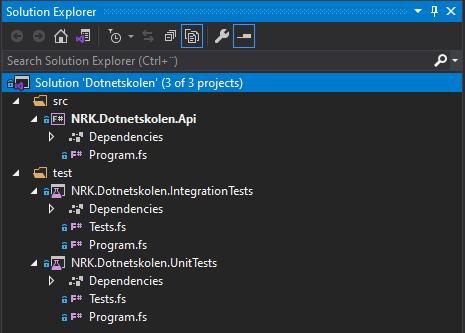

# 🏫 .NET-skolen

## 👋 Innledning

Velkommen til Dotnetskolen!

Dette er et kurs hvor du blir tatt gjennom prosessen av å sette opp og implementere en .NET-løsning fra bunnen av, steg for steg. Målet med kurset er å vise hvordan man kan utføre oppgaver som er vanlige i etableringsfasen av et system, som å:

- Opprette prosjekter og mappestruktur
- Sette opp pakkehåndtering
- Sette opp tester

Som en eksempel-applikasjon skal vi lage et web-API i F# for å hente ut elektronisk programguide (EPG) for NRK TV, med tilhørende enhets- og integrasjonstester. Tanken er at API-et kunne levert datagrunnlaget til en programguide - f.eks. den som vises her: [https://info.nrk.no/presse/tvguide/](https://info.nrk.no/presse/tvguide/)

> Et sekundært mål med dette repoet er at den ferdige eksempel-applikasjonen (som du finner i [branchen ferdig](https://github.com/nrkno/dotnetskolen/tree/ferdig)) kan fungere som et referanse-repo for hvordan å sette opp et .NET-prosjekt.

### 💻 Fremgangsmåte

Vi skal bruke [.NET CLI](https://docs.microsoft.com/en-us/dotnet/core/tools/) til å opprette prosjekter, samt kjøre koden og testene. I tillegg skal vi dokumentere web-API-et vårt ved hjelp av [OpenAPI](https://www.openapis.org/).

Overordnet kommer mappestrukturen til løsningen vår til å se slik ut:

```txt
└── docs (kontrakt for web-API-et)
└── src  (kildekode til web-API-et)
└── test (kildekode til enhets- og integrasjonstestene)
```

### 🚀 Kom i gang

Kurset er forsøkt lagt opp slik at deltakere med ulike bakgrunner og erfaringsnivå skal kunne ha nytte av det.

#### Intro til .NET og F#

Dersom du er helt ny til .NET kan det være nyttig å begynne med å lese:

- [Hva .NET er](#hva-er-net)
- [Hva F# er](#hva-er-f)

#### Installér nødvendige verktøy
  
Før du starter på selve stegene i kurset bør du lese om:

- [Nødvendige verktøy for å gjennomføre kurset](#verktøy)
- [Lokalt oppsett av koden](#lokalt-oppsett-av-koden-valgfritt)

#### Start på kurset

Deretter kan du begynne på selve kurset:

- [Gå til første steg](#steg-1---opprette-api)

> Stegene i kurset gir veiledning, steg for steg, med anvisninger for kommandoer du kan kjøre og referanseimplementasjon av kode du kan kopiere. Enkelte steder er implementasjonen av koden imidlertid utelatt slik at du kan forsøke å implementere den selv. Disse stedene er markert med ☑️. Les mer om hvordan du kan se fullstendig løsningsforslag for hvert steg [her](#se-løsningsforslag).

### ❓ Spørsmål

Lurer du på noe knyttet til kurset? Ta gjerne kontakt på `#dotnetskolen` på Slack, eller opprett tråd på "Discussions" på GitHub:

- [https://nrk.slack.com/messages/dotnetskolen](https://nrk.slack.com/messages/dotnetskolen)
- [https://github.com/nrkno/dotnetskolen/discussions/categories/q-a](https://github.com/nrkno/dotnetskolen/discussions/categories/q-a)

### 🔗 Nyttige lenker

- Microsoft's offisielle dokumentasjon for .NET - [https://docs.microsoft.com/en-us/dotnet/](https://docs.microsoft.com/en-us/dotnet/)
- F# cheat sheet - [http://dungpa.github.io/fsharp-cheatsheet/](http://dungpa.github.io/fsharp-cheatsheet/)
- Innføring i F# - [https://fsharpforfunandprofit.com/site-contents/#understanding-f](https://fsharpforfunandprofit.com/site-contents/#understanding-f)
- Andre kurs i NRK
  - F#-skolen, kurs i F# laget av ansatte i NRK TV - [https://github.com/nrkno/fsharpskolen](https://github.com/nrkno/fsharpskolen)
  - Kubernetes-kurs i regi av plattform i NRK - [https://github.com/nrkno/plattform-k8s-kurs](https://github.com/nrkno/plattform-k8s-kurs)

### 👍👎 Tilbakemeldinger

Har du tilbakemeldinger til kurset? Opprett gjerne en tråd for det her:

- [https://github.com/nrkno/dotnetskolen/discussions/categories/ideas](https://github.com/nrkno/dotnetskolen/discussions/categories/ideas)

### 👩👨 Medvirkende

- [@heidisu](https://github.com/heidisu) - Idé og kvalitetssikring
- [@thomaswolff](https://github.com/thomaswolff) - Primus motor og forfatter

## 📖 Innholdsfortegnelse

- [Hva er .NET?](#hva-er-net)
- [Hva er F#?](#hva-er-f)
- [Hvordan komme i gang med kurset](#hvordan-komme-i-gang)
  - [Nødvendige verktøy](#verktøy)
  - [Lokalt oppsett av koden](#lokalt-oppsett-av-koden-valgfritt)
  - [Se løsningsforslag](#se-løsningsforslag)
- [Steg](#steg)
  - [Steg 1 - Opprette API](#steg-1---opprette-api)
  - [Steg 2 - Opprette testprosjekter](#steg-2---opprette-testprosjekter)
  - [Steg 3 - Opprette solution](#steg-3---opprette-solution)
  - [Steg 4 - Pakkehåndtering](#steg-4---pakkehåndtering)
  - [Steg 5 - Definere domenemodell](#steg-5---definere-domenemodell)
  - [Steg 6 - Enhetstester for domenemodell](#steg-6---enhetstester-for-domenemodell)
  - [Steg 7 - Definere API-kontrakt](#steg-7---definere-api-kontrakt)
  - [Steg 8 - Implementere kontraktstyper](#steg-8---implementere-kontraktstyper)
  - [Steg 9 - Integrasjonstester for web-API](#steg-9---integrasjonstester-for-web-api)
  - [Steg 10 - Implementere web-API](#steg-10---implementere-web-api)

## Hva er .NET?

.NET er en plattform for å utvikle og kjøre applikasjoner, og består av flere ting:

- Programmeringsspråk - som f.eks. C# og F#
- Kompilatorer - programmer som kompilerer kode skrevet i et .NET-programmeringsspråk til CIL ("common intermediate language")
- CIL ("common intermediate language") - et felles lavnivåspråk som alle .NET-programmer blir kompilert til
- CLR ("common language runtime") - kjøretidsmiljø for .NET-programmer som oversetter instruksjonene definert i CIL til maskinkode, og kjører maskinkoden
- BCL ("base class library") - en stor samling biblioteker skrevet av Microsoft som tilbyr standard funksjonalitet som f.eks. datastrukturer (lister, datoer etc.), IO (lesing og skriving av filer, nettverkshåndtering) og sikkerhet (kryptering, sertifikater).


### Versjoner av .NET

Opprinnelig var .NET kun tilgjengelig på Windows. Denne versjonen av .NET omtales som .NET Framework. Etter hvert kom implementasjoner av kjøretidsmiljøet til andre plattformer også, som Mono til Linux og Mac, og Xamarin til Android og iOS. Både Mono og Xamarin var opprinnelig drevet av andre selskaper enn Microsoft. I 2016 lanserte Microsoft en ny versjon av .NET, .NET Core, som er en implementasjon av .NET for alle plattformer (Windows, Mac og Linux). .NET Core gikk gjennom tre hovedversjoner, i parallell med .NET Framework som nådde sin siste versjon, 4.8, i 2019. .NET Framework blir ikke videreutviklet, og i 2020 lanserte Microsoft .NET 5 som er den nyeste versjon av .NET Core. .NET 5 er den versjonen Microsoft vil fortsette å utvikle fremover.

For å definere hva som er tilgjengelig i de ulike versjonene av .NET har Microsoft laget en spesifikasjon, .NET Standard. .NET Standard har flere versjoner, og de ulike versjonene av .NET (.NET Framework, .NET Core, Mono etc.) følger spesifikasjonen i en gitt versjon av .NET Standard. Les mer om .NET Standard, og kompatibilitet på tvers av .NET-versjoner her: [https://docs.microsoft.com/en-us/dotnet/standard/net-standard](https://docs.microsoft.com/en-us/dotnet/standard/net-standard)

#### Kilder

- [https://www.mono-project.com/](https://www.mono-project.com/)
- [https://en.wikipedia.org/wiki/.NET_Core](https://en.wikipedia.org/wiki/.NET_Core)
- [https://en.wikipedia.org/wiki/.NET_Framework](https://en.wikipedia.org/wiki/.NET_Framework)
- [https://en.wikipedia.org/wiki/Common_Intermediate_Language](https://en.wikipedia.org/wiki/Common_Intermediate_Language)
- [https://docs.microsoft.com/en-us/dotnet/standard/clr](https://docs.microsoft.com/en-us/dotnet/standard/clr)
- [https://dotnet.microsoft.com/apps/xamarin](https://dotnet.microsoft.com/apps/xamarin)

## Hva er F#?

F# er et funksjonelt programmeringsspråk for .NET, og er mye brukt i NRK TV og NRK Radio siden det egner seg godt til å drive modellering i [domenedrevet design](https://en.wikipedia.org/wiki/Domain-driven_design). Når man [installerer .NET SDK](#net-sdk) følger kompilator for F# med, og man kan utvikle og kjøre F#-kode. Som nevnt i innledningen skal all koding i dette kurset gjøres i F#.

Dersom F# er nytt for deg, eller du ønsker å friske opp minnet om språket finner du noen nyttige lenker under:

- Innføring i syntaks
  - F# cheat sheet: [http://dungpa.github.io/fsharp-cheatsheet/](http://dungpa.github.io/fsharp-cheatsheet/)
  - F# på 60 sekunder: [https://fsharpforfunandprofit.com/posts/fsharp-in-60-seconds/](https://fsharpforfunandprofit.com/posts/fsharp-in-60-seconds/)
- [https://fsharpforfunandprofit.com](https://fsharpforfunandprofit.com)
  - Nettsted laget av Scott Wlaschin, med mange utfyllende og forklarende artikler om F# og funksjonell programmering. 
  - For mer utfyllende innføring i F# se: [https://fsharpforfunandprofit.com/site-contents/#understanding-f](https://fsharpforfunandprofit.com/site-contents/#understanding-f)

## Hvordan komme i gang med kurset

Veiledningen i dette kurset forutsetter at du har noen verktøy installert på maskinen din. Se gjennom listen under for å sørge for at du har det som trengs.

> Å installere og bruke Git er valgfritt, men er kjekt å ha dersom du ønsker å ha veiledningen, og [løsningsforslag](#se-løsningsforslag), lokalt på maskinen din.

### Verktøy

For å gjennomføre kurset må du ha satt opp følgende:

- [Git (valgfritt)](#Git)
- [.NET SDK](#NET-SDK)
- [En IDE](#IDE)
  - [Rider](https://www.jetbrains.com/rider/download)
  - [Visual Studio](https://visualstudio.microsoft.com/vs/community)
  - [Visual Studio Code](https://code.visualstudio.com/download)

#### Git

Git er et gratis versjonshåndteringssystem som finnes til alle plattformer. Dersom du ønsker å ha instruksjonene til kurset (dokumentet du leser nå), eller se forventet resultat etter å ha gjennomført hvert av de ulike stegene, på din egen maskin trenger du Git installert. Med Git kan du også lage din egen versjon av dette repoet slik som forklart [her](#sjekke-ut-egen-branch).

Du kan laste ned Git her: [https://git-scm.com/downloads](https://git-scm.com/downloads).

Dersom Git er nytt for deg kan det være nyttig å lese denne artikkelen om hvordan man jobber med endringer i et Git-repo: [https://git-scm.com/book/en/v2/Git-Basics-Recording-Changes-to-the-Repository](https://git-scm.com/book/en/v2/Git-Basics-Recording-Changes-to-the-Repository). Det er forøvrig instruksjoner på [slutten av første steg](#lagre-endringer-i-git-valgfritt) for hvordan du kan lagre endringer du gjør underveis i kurset i Git.

#### .NET SDK

Når man installerer .NET har man valget mellom å installere

- .NET runtime - kjøretidsmiljø for .NET-applikasjoner
- .NET SDK - inneholder alt man trenger for å utvikle og kjøre .NET-applikasjoner lokalt, og inkluderer
  - .NET runtime og basebiblioteker (BCL)
  - Kompilatorer
  - .NET CLI - kommandolinjeverktøy for å bygge, kjøre og publisere .NET-applikasjoner

Ettersom du gjennom kurset skal utvikle og kjøre .NET-applikasjoner trenger du .NET SDK installert på maskinen din. Kurset er laget med .NET 5, men de fleste kommandoene fungerer nok med .NET Core, og vil trolig være tilgjengelig i fremtidige versjoner også. Du kan undersøke hvilken versjon av .NET du har lokalt (om noen i det hele tatt) ved å kjøre følgende kommando

``` bash
$ dotnet --version

5.0.103
```

Dersom du ikke har .NET installert på maskinen din, kan du laste det ned her: [https://dotnet.microsoft.com/download/dotnet](https://dotnet.microsoft.com/download/dotnet)

Som nevnt over inkluderer .NET SDK også .NET CLI som gir oss muligheten til å bygge, kjøre og publisere .NET-applikasjoner. For at kurset skal kunne gjennomføres uavhengig av plattform og IDE skal vi bruke .NET CLI til oppsett av løsningen vår. 

Veiledningen forklarer det grunnleggende om kommandoene vi kommer til å bruke i .NET CLI. Dersom du ønsker mer utfyllende informasjon eller oversikt over alle kommandoene kan du lese mer om .NET CLI her: [https://docs.microsoft.com/en-us/dotnet/core/tools/](https://docs.microsoft.com/en-us/dotnet/core/tools/)

#### IDE

For å kunne debugge kode, få syntax highlighting og visning av kompileringsfeil, autocomplete, og kodenavigering er det kjekt å ha en IDE. De mest brukte IDE-ene for .NET er oppsummert i tabellen under.

| Navn | Plattform | Lisens | Download |
| - | - | - | - |
| Visual Studio|Windows | Community-versjon er gratis. Øvrige versjoner krever lisens. |[https://visualstudio.microsoft.com/vs/community](https://visualstudio.microsoft.com/vs/community)|
| Visual Studio Code | Kryssplattform | Gratis | [https://code.visualstudio.com/download](https://code.visualstudio.com/download) |
| Rider | Kryssplattform | Gratis i 30 dager. Deretter kreves lisens. | [https://www.jetbrains.com/rider/download](https://www.jetbrains.com/rider/download) |

Velg den IDE-en som passer dine behov.

> Dersom du skal bruke Visual Studio Code, anbefales det å installere pluginen "Ionide". 
> - Du kan laste ned Ionide her: [https://docs.microsoft.com/en-us/dotnet/fsharp/get-started/get-started-vscode](https://docs.microsoft.com/en-us/dotnet/fsharp/get-started/get-started-vscode)
> - Du kan lese mer om Ionide her: [https://ionide.io/](https://ionide.io/)

> Merk at et vanlig use case for IDE-er er at de også blir brukt til å kompilere og kjøre kode. Instruksjonene i kurset kommer imidlertid til å benytte .NET CLI til dette. Du står selvfølgelig fritt frem til å bygge og kjøre koden ved hjelp av din IDE hvis du ønsker det.

### Lokalt oppsett av koden (valgfritt)

#### Klone repo

Dersom du ønsker dette repoet lokalt på din maskin, kan du gjøre det slik:

``` bash
$ git clone git@github.com:nrkno/dotnetskolen.git # Last ned repo fra GitHub til din maskin

Cloning into 'dotnetskolen'...
remote: Enumerating objects: 9, done.
remote: Counting objects: 100% (9/9), done.
remote: Compressing objects: 100% (5/5), done.
remote: Total 9 (delta 2), reused 4 (delta 1), pack-reused 0
Receiving objects: 100% (9/9), done.
Resolving deltas: 100% (2/2), done.
```

Da skal nå ha `main`-branchen sjekket ut lokalt på din maskin. Det kan du verifisere ved å gå inn i mappen til repoet og liste ut branchene i Git:

``` bash
$ cd dotnetskolen # Gå inn i mappen som repoet ligger i lokalt
$ git branch # List ut alle brancher du har sjekket ut lokalt

* main
```

#### Sjekke ut egen branch

Før du begynner å kode kan du gjerne lage din egen branch med `git checkout -b <branchnavn>`. På denne måten kan du holde dine endringer adskilt fra koden som ligger i repoet fra før, og det er lettere for kursholder å hjelpe deg dersom du har behov for det.

``` bash
$ git checkout -b my-branch

Switched to a new branch 'my-branch'
```

#### Sette opp .gitignore

Vanligvis er det en del filer man ikke ønsker å ha inkludert i Git. Dette er noe man fort merker ved etablering av et nytt system. For å fortelle Git hvilke filer man vil ignorere, oppretter man en `.gitignore`-fil i roten av repoet.

GitHub har et eget repo som inneholder `.gitignore`-filer for ulike typer prosjekter: [https://github.com/github/gitignore](https://github.com/github/gitignore). `.gitignore`-filene GitHub har utarbeidet inneholder filtypene det er vanligst å utelate fra Git for de ulike prosjekttypene. Ettersom dette kurset omhandler .NET kan vi bruke `VisualStudio.gitignore` fra repoet deres.

For å sette opp `.gitignore` i ditt lokale repo:

1. Opprett en tekstfil med navn `.gitignore` i roten av repoet
2. Lim inn innholdet i denne filen: [https://github.com/github/gitignore/blob/master/VisualStudio.gitignore](https://github.com/github/gitignore/blob/master/VisualStudio.gitignore) 
3. Lagre og commite `.gitignore`-filen.

## Steg

Nå som du har installert alle verktøyene du trenger er du klar til å begynne på selve kurset!

### Steg 1 - Opprette API

**Steg 1 av 10** - [🔝 Gå til toppen](#-net-skolen) [⬇ Neste steg](#steg-2---opprette-testprosjekter)

I dette steget starter vi med en mappe helt uten kode, og bruker .NET CLI til å opprette vårt første prosjekt `NRK.Dotnetskolen.Api`.

#### .NET-prosjekter

For å kunne organisere kode i .NET bruker man _prosjekter_. Et prosjekt er en samling med kildekodefiler og eventuelle andre ressursfiler, og alle filene som inngår i prosjektet er referert til i en _prosjektfil_. For F#-prosjekter har slike prosjektfiler filendelsen `.fsproj`.

Når man kompilerer .NET-prosjekter kan man velge mellom to typer output:

- `.exe` - Kjørbar fil ("executable") - et program som kan kjøres
- `.dll` - Klassebibliotek ("dynamically linked library") - en samling med funksjonalitet som kan benyttes av andre programmer

#### Dotnet new

Som nevnt i [innledningen](#innledning) er .NET CLI et kommandolinjeverktøy laget for å utvikle, bygge, kjøre og publisere .NET-applikasjoner. .NET CLI kjøres fra kommandolinjen med kommandoen `dotnet`, og har mange underkommandoer og valg. For å se alle kan du kjøre kommandoen under, eller lese mer her: [https://docs.microsoft.com/en-us/dotnet/core/tools/dotnet](https://docs.microsoft.com/en-us/dotnet/core/tools/dotnet)

``` bash
$ dotnet --help

.NET SDK (5.0.103)
Usage: dotnet [runtime-options] [path-to-application] [arguments]

Execute a .NET application.

runtime-options:
  --additionalprobingpath <path>   Path containing probing policy and assemblies to probe for.
  --additional-deps <path>         Path to additional deps.json file.
  --depsfile                       Path to <application>.deps.json file.
  --fx-version <version>           Version of the installed Shared Framework to use to run the application.
  --roll-forward <setting>         Roll forward to framework version  (LatestPatch, Minor, LatestMinor, Major, LatestMajor, Disable).
  --runtimeconfig                  Path to <application>.runtimeconfig.json file.

path-to-application:
  The path to an application .dll file to execute.

Usage: dotnet [sdk-options] [command] [command-options] [arguments]

Execute a .NET SDK command.

sdk-options:
  -d|--diagnostics  Enable diagnostic output.
  -h|--help         Show command line help.
  --info            Display .NET information.
  --list-runtimes   Display the installed runtimes.
  --list-sdks       Display the installed SDKs.
  --version         Display .NET SDK version in use.

SDK commands:
  add               Add a package or reference to a .NET project.
  build             Build a .NET project.
  build-server      Interact with servers started by a build.
  clean             Clean build outputs of a .NET project.
  help              Show command line help.
  list              List project references of a .NET project.
  msbuild           Run Microsoft Build Engine (MSBuild) commands.
  new               Create a new .NET project or file.
  nuget             Provides additional NuGet commands.
  pack              Create a NuGet package.
  publish           Publish a .NET project for deployment.
  remove            Remove a package or reference from a .NET project.
  restore           Restore dependencies specified in a .NET project.
  run               Build and run a .NET project output.
  sln               Modify Visual Studio solution files.
  store             Store the specified assemblies in the runtime package store.
  test              Run unit tests using the test runner specified in a .NET project.
  tool              Install or manage tools that extend the .NET experience.
  vstest            Run Microsoft Test Engine (VSTest) commands.

Additional commands from bundled tools:
  dev-certs         Create and manage development certificates.
  fsi               Start F# Interactive / execute F# scripts.
  sql-cache         SQL Server cache command-line tools.
  user-secrets      Manage development user secrets.
  watch             Start a file watcher that runs a command when files change.

Run 'dotnet [command] --help' for more information on a command.
```

#### Maler

For å opprette API-prosjektet skal vi bruke `new`-kommandoen i .NET CLI. `dotnet new` oppretter .NET-prosjekter, og som første parameter tar `new`-kommandoen inn hva slags mal prosjektet man oppretter skal følge. Når man installerer .NET SDK får man med et sett med forhåndsdefinerte prosjektmaler for vanlige formål. For å se malene som er installert på din maskin kan du kjøre `dotnet new` slik:

``` bash
$ dotnet new

Templates                                         Short Name               Language          Tags
--------------------------------------------      -------------------      ------------      ----------------------
Console Application                               console                  [C#], F#, VB      Common/Console        
Class library                                     classlib                 [C#], F#, VB      Common/Library        
WPF Application                                   wpf                      [C#], VB          Common/WPF
WPF Class library                                 wpflib                   [C#], VB          Common/WPF
WPF Custom Control Library                        wpfcustomcontrollib      [C#], VB          Common/WPF
WPF User Control Library                          wpfusercontrollib        [C#], VB          Common/WPF
Windows Forms App                                 winforms                 [C#], VB          Common/WinForms       
Windows Forms Control Library                     winformscontrollib       [C#], VB          Common/WinForms       
Windows Forms Class Library                       winformslib              [C#], VB          Common/WinForms       
Worker Service                                    worker                   [C#], F#          Common/Worker/Web     
Unit Test Project                                 mstest                   [C#], F#, VB      Test/MSTest
NUnit 3 Test Project                              nunit                    [C#], F#, VB      Test/NUnit
NUnit 3 Test Item                                 nunit-test               [C#], F#, VB      Test/NUnit
xUnit Test Project                                xunit                    [C#], F#, VB      Test/xUnit
Razor Component                                   razorcomponent           [C#]              Web/ASP.NET
Razor Page                                        page                     [C#]              Web/ASP.NET
MVC ViewImports                                   viewimports              [C#]              Web/ASP.NET
MVC ViewStart                                     viewstart                [C#]              Web/ASP.NET
Blazor Server App                                 blazorserver             [C#]              Web/Blazor
Blazor WebAssembly App                            blazorwasm               [C#]              Web/Blazor/WebAssembly
ASP.NET Core Empty                                web                      [C#], F#          Web/Empty
ASP.NET Core Web App (Model-View-Controller)      mvc                      [C#], F#          Web/MVC
ASP.NET Core Web App                              webapp                   [C#]              Web/MVC/Razor Pages
ASP.NET Core with Angular                         angular                  [C#]              Web/MVC/SPA
ASP.NET Core with React.js                        react                    [C#]              Web/MVC/SPA
ASP.NET Core with React.js and Redux              reactredux               [C#]              Web/MVC/SPA
Razor Class Library                               razorclasslib            [C#]              Web/Razor/Library
ASP.NET Core Web API                              webapi                   [C#], F#          Web/WebAPI
ASP.NET Core gRPC Service                         grpc                     [C#]              Web/gRPC
dotnet gitignore file                             gitignore                                  Config
global.json file                                  globaljson                                 Config
NuGet Config                                      nugetconfig                                Config
Dotnet local tool manifest file                   tool-manifest                              Config
Web Config                                        webconfig                                  Config
Solution File                                     sln                                        Solution
Protocol Buffer File                              proto                                      Web/gRPC

Examples:
    dotnet new mvc --auth Individual
    dotnet new mstest
    dotnet new --help
    dotnet new nunit --help
```

I tillegg til å styre hva slags type prosjekt man vil opprette med `new`-kommandoen, har man mulighet til å styre ting som hvilket språk man ønsker prosjektet skal opprettes for, og i hvilken mappe prosjektet opprettes i. For å se alle valgene man har i `dotnet new` kan du kjøre følgende kommando

``` bash
$ dotnet new --help

Usage: new [options]

Options:
  -h, --help          Displays help for this command.
  -l, --list          Lists templates containing the specified name. If no name is specified, lists all templates.
  -n, --name          The name for the output being created. If no name is specified, the name of the current directory is used.
  -o, --output        Location to place the generated output.
  -i, --install       Installs a source or a template pack.
  -u, --uninstall     Uninstalls a source or a template pack.
  --interactive       Allows the internal dotnet restore command to stop and wait for user input or action (for example to complete authentication).
  --nuget-source      Specifies a NuGet source to use during install.
  --type              Filters templates based on available types. Predefined values are "project", "item" or "other".
  --dry-run           Displays a summary of what would happen if the given command line were run if it would result in a template creation.
  --force             Forces content to be generated even if it would change existing files.
  -lang, --language   Filters templates based on language and specifies the language of the template to create.
  --update-check      Check the currently installed template packs for updates.
  --update-apply      Check the currently installed template packs for update, and install the updates.
```

#### Opprette API-prosjektet

Som du ser av malene som er listet ut over, er det en innebygget mal for web-API som heter `webapi`. For å komme raskt i gang med et prosjekt, eller se hvordan ting er satt opp, kan man bruke `webapi` som mal. Vi kommer imidlertid til å opprette API-et vårt ved å bruke malen `console` for å lære mest mulig om å sette opp prosjektet helt fra bunnen av.

Kjøre følgende kommando for å opprette API-prosjektet

``` bash
$ dotnet new console --language F# --output src/api --name NRK.Dotnetskolen.Api

The template "Console Application" was created successfully.

Processing post-creation actions...
Running 'dotnet restore' on src/api\NRK.Dotnetskolen.Api.fsproj...
  Determining projects to restore...
  Restored C:\Dev\nrkno@github.com\dotnetskolen\src\api\NRK.Dotnetskolen.Api.fsproj (in 101 ms).
Restore succeeded.
```

I kommandoen over brukte vi `--language`-argumentet for å oppgi at vi ønsket et F#-prosjekt. I tillegg brukte vi `--output` for å oppgi hvor vi ønsket at prosjektet skulle ligge relativt til der vi kjører kommandoen fra, og `--name` til å styre navnet på prosjektet.

> Merk at istedenfor `--language`, `--output` og `--name`, kunne vi brukt forkortelsene `-lang`, `-o` og `-n`.

Du skal nå ha en mappestruktur som ser slik ut

```txt
src
└── api
    └── NRK.Dotnetskolen.Api.fsproj
    └── Program.fs
```

Som vi ser av diagrammet over opprettet .NET CLI mappene `src` og `src/api`, med `NRK.Dotnetskolen.Api.fsproj` og `Program.fs` i `src/api`.

> Merk at med mindre noe annet er spesifisert, er alle kommandoene i veiledningen skrevet med forutsetning om at du står i samme mappe når du kjører dem. Dersom du har klonet Git-repoet til kurset er det rotmappen til repoet. Dersom du følger kurset uten å bruke Git er det mappen du bestemmer deg for å kjøre kommandoene i.

##### Prosjektfil

Åpne `NRK.Dotnetskolen.Api.fsproj` for å se innholdet til prosjektfilen til prosjektet du nettopp opprettet:

```xml
<Project Sdk="Microsoft.NET.Sdk">

  <PropertyGroup>
    <OutputType>Exe</OutputType>
    <TargetFramework>net5.0</TargetFramework>
  </PropertyGroup>

  <ItemGroup>
    <Compile Include="Program.fs" />
  </ItemGroup>

</Project>
```

Her ser vi at prosjektet:

- Har outputtypen `exe`
- Skal kompileres til .NET 5
- Består av én fil `Program.fs`

##### Programfilen

For å se hva programmet gjør kan vi åpne `Program.fs` og se på koden:

```f#
// Learn more about F# at http://docs.microsoft.com/dotnet/fsharp

open System

// Define a function to construct a message to print
let from whom =
    sprintf "from %s" whom

[<EntryPoint>]
let main argv =
    let message = from "F#" // Call the function
    printfn "Hello world %s" message
    0 // return an integer exit code
```

Helt i starten av filen ser vi at programmet åpner en modul `System`. Denne modulen er definert i .NET sitt "base class library" - en samling biblioteker som tilbyr mye brukt funksjonalitet, skrevet av Microsoft.

I tillegg ser vi at programmet har to funksjoner:

- `from`
  - Tar inn et parameter `whom`, og returnerer en tekststreng `from <whom>`
- `main`
  - Annotert med `[<EntryPoint>]` - Det er slik .NET vet hvilken funksjon den skal kalle når programmet starter
  - Får inn argumenter gitt til programmet gjennom parmeteret `argv`
  - Deklarerer en verdi `message` som er lik resultatet av å kalle `from`-funksjonen med `F#` som input
  - Skriver tekststrengen `Hello world from F#` til output

> Navnet til prosjektet `NRK.Dotnetskolen.Api.fsproj` følger Microsoft sin navnekonvensjon for programmer og biblioteker i .NET. For å lese mer om denne, og andre navnekonvensjoner i .NET, kan du se her: [https://docs.microsoft.com/en-us/dotnet/standard/design-guidelines/names-of-assemblies-and-dlls](https://docs.microsoft.com/en-us/dotnet/standard/design-guidelines/names-of-assemblies-and-dlls)
>
> Mappestrukturen over er ment som et forslag, og de videre stegene i kurset bygger på denne. Hvis du bruker kurset som inspirasjon eller veiledning til å opprette ditt eget prosjekt, trenger du ikke følge denne mappestrukturen. Hvordan du strukturerer mappene i ditt system er opp til deg, og er avhengig av aspekter som størrelse på systemet, antall prosjekter, og personlige preferanser.

#### Kjøre API-prosjektet

For å kjøre prosjektet som ble opprettet over kan du kjøre følgende kommando

``` bash
$ dotnet run --project src/api/NRK.Dotnetskolen.Api.fsproj

Hello world from F#
```

Alternativt kan du gå til mappen hvor prosjektet ligger, og kjøre `dotnet run` derfra, slik som vist under

``` bash
$ cd src/api
$ dotnet run

Hello world from F#
```

#### Lagre endringer i Git (valgfritt)

Nå som du har fullført det første steget i kurset er det en fin anledning til å lagre endringene du har gjort så langt i Git.

##### Se endringer

Gitt at du fulgte veiledningen for å [sette opp koden lokalt](#lokalt-oppsett-av-koden-valgfritt) før du begynte å kode, kan du kjøre følgende kommando for å se hvilke endringer som er gjort i repoet:

```bash
$ git status

On branch <branchnavn>
Untracked files:
  (use "git add <file>..." to include in what will be committed)
        src/

nothing added to commit but untracked files present (use "git add" to track)
```

I outputen over ser vi at Git har oppdaget at det er opprettet en mappe `src` og innhold i den, men Git overvåker ikke disse per nå (filene er "untracked").

##### Legg til endringer i Git

For å få Git til å overvåke filene vi har opprettet, og deretter se status i Git kan du kjøre følgende kommandoer:

```bash
$ git add .
$ git status

On branch <branchnavn>
Changes to be committed:
  (use "git restore --staged <file>..." to unstage)
        new file:   src/api/NRK.Dotnetskolen.Api.fsproj
        new file:   src/api/Program.fs
```

Nå overvåker Git filene.

##### Lagre endringene

For å lagre nåværende tilstand av filene i en "commit" i Git kan du kjøre følgende kommando:

```bash
$ git commit -m "Opprettet API-prosjekt"

[<branchnavn> 00d11c8] Opprettet API-prosjekt
 2 files changed, 25 insertions(+)
 create mode 100644 src/api/NRK.Dotnetskolen.Api.fsproj
 create mode 100644 src/api/Program.fs
```

##### Se alle historiske endringer i repoet

For å se alle commits i nåværende branch i Git, kan du kjøre følgende kommando:

```bash
$ git log

commit 00d11c82d0179f41883a55ce88e147a73ae60ee2 (HEAD -> <branchnavn>)
Author: Thomas Wolff <thomas.wolff@nrk.no>
Date:   Fri Apr 16 13:43:40 2021 +0200

    Opprettet API-prosjekt
...
```

Tips! Gjenta de tre stegene over med å se endringer, legge dem til, og lagre dem etter å ha fullført hvert steg for å ha bedre oversikt over hva du har vært gjennom i kurset.

#### Se løsningsforslag

Dersom du ønsker å se den forventede tilstanden til repoet etter å ha utført de ulike stegene i kurset, kan du sjekke ut branchen med korresponderende navn som seksjonen du ønsker å se på. F.eks. hvis du vil se hvordan repoet ser ut etter første steg, kan du sjekke ut branchen `steg-1` slik:

``` bash
$ git checkout steg-1

Switched to branch 'steg-1'
```

### Steg 2 - Opprette testprosjekter

**Steg 2 av 10** - [🔝 Gå til toppen](#-net-skolen) [⬆ Forrige steg](#steg-1---opprette-api) [⬇ Neste steg](#steg-3---opprette-solution)

Tester er en viktig del av systemutvikling fordi de hjelper oss med å verifisere at systemet fungerer slik det skal. Når man skriver tester for kode opererer man ofte med to typer tester:

- Enhetstester
- Integrasjonstester

Enhetstester verifiserer at små, isolerte deler av koden fungerer slik den skal. Gjerne én og én funksjon. I dette kurset skal vi bruke enhetstester til å verifisere valideringsregler i domenet vårt

Integrasjonstester verifiserer imidlertid at større deler av systemet fungerer slik det skal, og kan til og med dekke samspill med andre systemer. I dette kurset skal vi bruke integrasjonstester til å verifisere at web-API-et oppfører seg i henhold til [kontrakten vi definerer i steg 7](#steg-7---definere-api-kontrakt).

#### Dotnet new

I dette steget skal vi opprette to testprosjekter

- Ett for enhetstester - `NRK.Dotnetskolen.UnitTests`
- Ett for integrasjonstester - `NRK.Dotnetskolen.IntegrationTests`

For å opprette testprosjektene skal vi igjen bruke `dotnet new`-kommandoen, men denne gangen velger vi en annen [mal](#maler) enn da vi opprettet API-prosjektet. Når man installerer .NET SDK følger det med flere maler for testprosjekter som korresponderer til ulike rammeverk som finnes for å detektere og kjøre tester:

- xUnit
- nUnit
- MSTest

I dette kurset kommer vi til å bruke xUnit. Dette valget er litt vilkårlig ettersom alle rammeverkene over vil være tilstrekkelig til formålet vårt, som er å vise hvordan man kan sette opp testprosjekter og komme i gang med å skrive tester. Dersom du ønsker å vite mer om de ulike testrammeverkene, kan du lese mer om dem her: [https://docs.microsoft.com/en-us/dotnet/core/testing/#testing-tools](https://docs.microsoft.com/en-us/dotnet/core/testing/#testing-tools)

#### Opprette enhetstestprosjekt

Kjør følgende kommando for å opprette enhetstestprosjektet

``` bash
$ dotnet new xunit -lang F# -o test/unit -n NRK.Dotnetskolen.UnitTests

The template "xUnit Test Project" was created successfully.

Processing post-creation actions...
Running 'dotnet restore' on test/unit\NRK.Dotnetskolen.UnitTests.fsproj...
  Determining projects to restore...
  Restored C:\Dev\nrkno@github.com\dotnetskolen\test\unit\NRK.Dotnetskolen.UnitTests.fsproj (in 1.31 sec).
Restore succeeded.
```

Du skal nå ha følgende mappestruktur

```txt
src
└── api
    └── NRK.Dotnetskolen.Api.fsproj
    └── Program.fs
test
└── unit
    └── NRK.Dotnetskolen.UnitTests.fsproj
    └── Program.fs
    └── Tests.fs
```

##### Prosjektfil

Åpne filen `NRK.Dotnetskolen.UnitTests.fsproj`:

```xml
<Project Sdk="Microsoft.NET.Sdk">

  <PropertyGroup>
    <TargetFramework>net5.0</TargetFramework>

    <IsPackable>false</IsPackable>
    <GenerateProgramFile>false</GenerateProgramFile>
  </PropertyGroup>

  <ItemGroup>
    <Compile Include="Tests.fs" />
    <Compile Include="Program.fs" />
  </ItemGroup>

  <ItemGroup>
    <PackageReference Include="Microsoft.NET.Test.Sdk" Version="16.7.1" />
    <PackageReference Include="xunit" Version="2.4.1" />
    <PackageReference Include="xunit.runner.visualstudio" Version="2.4.3">
      <IncludeAssets>runtime; build; native; contentfiles; analyzers; buildtransitive</IncludeAssets>
      <PrivateAssets>all</PrivateAssets>
    </PackageReference>
    <PackageReference Include="coverlet.collector" Version="1.3.0">
      <IncludeAssets>runtime; build; native; contentfiles; analyzers; buildtransitive</IncludeAssets>
      <PrivateAssets>all</PrivateAssets>
    </PackageReference>
  </ItemGroup>

</Project>
```

I prosjektfilen kan vi se at enhetstestprosjektet:

- Skal kompileres til .NET 5
- Inneholder to kildekodefiler
  - `Tests.fs`
  - `Program.fs`
- Har referanser til fire NuGet-pakker
  - `Microsoft.NET.Test.Sdk` - Pakke for å bygge .NET testprosjekter
  - `xunit` - Bibliotek for å skrive enhetstester
  - `xunit.runner.visualstudio` - Pakke for å kjøre Xunit-tester i "Test explorer" i Visual Studio [https://docs.microsoft.com/en-us/visualstudio/test/run-unit-tests-with-test-explorer?view=vs-2019](https://docs.microsoft.com/en-us/visualstudio/test/run-unit-tests-with-test-explorer?view=vs-2019)
  - `coverlet.collector` - bibliotek

> Vi ser nærmere på hva NuGet-pakker er i [steg 4](#steg-4---pakkehåndtering).

##### Testfilen

Åpne filen `Tests.fs`:

```f#
module Tests

open System
open Xunit

[<Fact>]
let ``My test`` () =
    Assert.True(true)

```

Øverst i filen blir det definert en F#-modul `Tests`. I tillegg blir modulene `System` og `Xunit` åpnet, som kommer fra hhv. basebiblioteket til Microsoft, og biblioteket Xunit. Videre blir det definert en test ``` ``My test`` ```. Måten vi ser at det er en test på er ved å se at den er annotert med `[<Fact>]`. Xunit opererer med to annotasjoner for tester:

- `[<Fact>]`
- `[<Theory>]`

Forskjellen på disse blir nærmere forklart i [steget om enhetstester](#steg-6---enhetstester-for-domenemodell).

> Merk at ``` ``<variabelnavn med mellomrom>`` ``` er brukt for å kunne ha et variabelnavn som inneholder mellomrom. På denne måten kan man ha et funksjonsnavn som beskriver testen og samtidig er lesbar for mennesker.

##### Kjøre enhetstestprosjektet

For å kjøre testen i enhetstestprosjektet kan du kjøre følgende kommando

``` bash
$ dotnet test test/unit/NRK.Dotnetskolen.UnitTests.fsproj

  Determining projects to restore...
  All projects are up-to-date for restore.
  Unit -> C:\Dev\nrkno@github.com\dotnetskolen\test\unit\bin\Debug\net5.0\NRK.Dotnetskolen.UnitTests.dll
Test run for C:\Dev\nrkno@github.com\dotnetskolen\test\unit\bin\Debug\net5.0\NRK.Dotnetskolen.UnitTests.dll (.NETCoreApp,Version=v5.0)
Microsoft (R) Test Execution Command Line Tool Version 16.9.1
Copyright (c) Microsoft Corporation.  All rights reserved.

Starting test execution, please wait...
A total of 1 test files matched the specified pattern.

Passed!  - Failed:     0, Passed:     1, Skipped:     0, Total:     1, Duration: 2 ms - Unit.dll (net5.0)
```

På lik linje med `dotnet run`, kan du alternativt gå inn i mappen til enhetstestprosjektet, og kjøre `dotnet test` derfra:

``` bash
$ cd test/unit
$ dotnet test

  Determining projects to restore...
  All projects are up-to-date for restore.
  Unit -> C:\Dev\nrkno@github.com\dotnetskolen\test\unit\bin\Debug\net5.0\NRK.Dotnetskolen.UnitTests.dll
Test run for C:\Dev\nrkno@github.com\dotnetskolen\test\unit\bin\Debug\net5.0\NRK.Dotnetskolen.UnitTests.dll (.NETCoreApp,Version=v5.0)
Microsoft (R) Test Execution Command Line Tool Version 16.9.1
Copyright (c) Microsoft Corporation.  All rights reserved.

Starting test execution, please wait...
A total of 1 test files matched the specified pattern.

Passed!  - Failed:     0, Passed:     1, Skipped:     0, Total:     1, Duration: 2 ms - Unit.dll (net5.0)
```

#### Opprette integrasjonstestprosjekt

For å opprette integrasjonstestprosjektet, kan du kjøre samme kommando som da du [opprettet enhetstestprosjektet](#opprette-enhetstestprosjekt), men bytt ut `Unit` med `Integration` i navnet på testprosjektet, som vist under:

``` bash
$ dotnet new xunit -lang F# -o test/integration -n NRK.Dotnetskolen.IntegrationTests

The template "xUnit Test Project" was created successfully.

Processing post-creation actions...
Running 'dotnet restore' on test/integration\NRK.Dotnetskolen.IntegrationTests.fsproj...
  Determining projects to restore...
  Restored C:\Dev\nrkno@github.com\dotnetskolen\test\integration\NRK.Dotnetskolen.IntegrationTests.fsproj (in 580 ms).
Restore succeeded.
```

Du skal nå ha følgende mappestruktur

```txt
src
└── api
    └── NRK.Dotnetskolen.Api.fsproj
    └── Program.fs
test
└── unit
    └── NRK.Dotnetskolen.UnitTests.fsproj
    └── Program.fs
    └── Tests.fs
└── integration
    └── NRK.Dotnetskolen.IntegrationTests.fsproj
    └── Program.fs
    └── Tests.fs
```

Foreløpig er prosjekt- og test-filene til integrasjonstestprosjektet helt like de fra enhetstestprosjektet (bortsett fra prosjektnavnet). Forskjellen på enhets- og integrasjonstestene blir tydeligere når vi skal skrive testene i hhv. [steg 6](#steg-6---enhetstester-for-domenemodell) og [steg 9](#steg-9---integrasjonstester-for-web-api).

##### Kjøre integrasjonstester

For å kjøre testene i integrasjonstestprosjektet kan du kjøre følgende kommando

``` bash
$ dotnet test test/integration/NRK.Dotnetskolen.IntegrationTests.fsproj

  Determining projects to restore...
  All projects are up-to-date for restore.
  Integration -> C:\Dev\nrkno@github.com\dotnetskolen\test\integration\bin\Debug\net5.0\NRK.Dotnetskolen.IntegrationTests.dll
Test run for C:\Dev\nrkno@github.com\dotnetskolen\test\integration\bin\Debug\net5.0\NRK.Dotnetskolen.IntegrationTests.dll (.NETCoreApp,Version=v5.0)
Microsoft (R) Test Execution Command Line Tool Version 16.9.1
Copyright (c) Microsoft Corporation.  All rights reserved.

Starting test execution, please wait...
A total of 1 test files matched the specified pattern.

Passed!  - Failed:     0, Passed:     1, Skipped:     0, Total:     1, Duration: 2 ms - Integration.dll (net5.0)
```

### Steg 3 - Opprette solution

**Steg 3 av 10** - [🔝 Gå til toppen](#-net-skolen) [⬆ Forrige steg](#steg-2---opprette-testprosjekter) [⬇ Neste steg](#steg-4---pakkehåndtering)

Slik oppsettet er nå, har vi tre prosjekter som er uavhengige av hverandre. Annet enn at de ligger i samme mappe, er det ingenting som kobler dem sammen. For å kunne gjøre operasjoner som å legge til felles pakker og kjøre alle testene for systemet vårt, kan vi knytte prosjektene sammen i en og samme løsning (_solution_). Å ha alle prosjektene i en og samme løsning gir også fordelen av at man kan åpne alle prosjektene samlet i en IDE.

#### Dotnet sln

For å opprette en solution med `dotnet` kan du kjøre følgende kommando:

``` bash
$ dotnet new sln -n Dotnetskolen

The template "Solution File" was created successfully.
```

Du skal nå ha fått filen `Dotnetskolen.sln` slik som vist under

```txt
src
└── api
    └── NRK.Dotnetskolen.Api.fsproj
    └── Program.fs
test
└── unit
    └── NRK.Dotnetskolen.UnitTests.fsproj
    └── Program.fs
    └── Tests.fs
└── integration
    └── NRK.Dotnetskolen.IntegrationTests.fsproj
    └── Program.fs
    └── Tests.fs
└── Dotnetskolen.sln
```

Hvis vi ser på innholdet i `Dotnetskolen.sln` ser vi at det ikke er noen referanser til prosjektene våre enda

```txt

Microsoft Visual Studio Solution File, Format Version 12.00
# Visual Studio Version 16
VisualStudioVersion = 16.6.30114.105
MinimumVisualStudioVersion = 10.0.40219.1
Global
	GlobalSection(SolutionConfigurationPlatforms) = preSolution
		Debug|Any CPU = Debug|Any CPU
		Debug|x64 = Debug|x64
		Debug|x86 = Debug|x86
		Release|Any CPU = Release|Any CPU
		Release|x64 = Release|x64
		Release|x86 = Release|x86
	EndGlobalSection
	GlobalSection(SolutionProperties) = preSolution
		HideSolutionNode = FALSE
	EndGlobalSection
EndGlobal
```

#### Legge til prosjekter i solution

For å legge til referanser til prosjektene du har opprettet kan du kjøre følgende kommandoer

``` bash
$ dotnet sln add src/api/NRK.Dotnetskolen.Api.fsproj

Project `src\api\NRK.Dotnetskolen.Api.fsproj` added to the solution.

$ dotnet sln add test/unit/NRK.Dotnetskolen.UnitTests.fsproj

Project `test\unit\NRK.Dotnetskolen.UnitTests.fsproj` added to the solution.

$ dotnet sln add test/integration/NRK.Dotnetskolen.IntegrationTests.fsproj

Project `test\integration\NRK.Dotnetskolen.IntegrationTests.fsproj` added to the solution.
```

Nå ser vi at `Dotnetskolen.sln` inneholder referanser til prosjektene våre

```txt

Microsoft Visual Studio Solution File, Format Version 12.00
# Visual Studio Version 16
VisualStudioVersion = 16.6.30114.105
MinimumVisualStudioVersion = 10.0.40219.1
Project("{2150E333-8FDC-42A3-9474-1A3956D46DE8}") = "src", "src", "{B029A5BA-0144-4C70-92FB-626C6348BD46}"
EndProject
Project("{F2A71F9B-5D33-465A-A702-920D77279786}") = "NRK.Dotnetskolen.Api", "src\api\NRK.Dotnetskolen.Api.fsproj", "{65DD6510-FFD6-4B5D-B6A0-4D6C94969D77}"
EndProject
Project("{2150E333-8FDC-42A3-9474-1A3956D46DE8}") = "test", "test", "{A53A8A2E-FED1-4E9A-801B-56F9DEB5BC41}"
EndProject
Project("{F2A71F9B-5D33-465A-A702-920D77279786}") = "NRK.Dotnetskolen.UnitTests", "test\unit\NRK.Dotnetskolen.UnitTests.fsproj", "{B469E9C6-8E0D-4129-86BE-3A31F0853361}"
EndProject
Project("{F2A71F9B-5D33-465A-A702-920D77279786}") = "NRK.Dotnetskolen.IntegrationTests", "test\integration\NRK.Dotnetskolen.IntegrationTests.fsproj", "{A7B1B28B-6889-4E4B-B266-ADE3A294A39D}"
EndProject
Global
	GlobalSection(SolutionConfigurationPlatforms) = preSolution
		Debug|Any CPU = Debug|Any CPU
		Debug|x64 = Debug|x64
		Debug|x86 = Debug|x86
		Release|Any CPU = Release|Any CPU
		Release|x64 = Release|x64
		Release|x86 = Release|x86
	EndGlobalSection
	GlobalSection(SolutionProperties) = preSolution
		HideSolutionNode = FALSE
	EndGlobalSection
	GlobalSection(ProjectConfigurationPlatforms) = postSolution
		{65DD6510-FFD6-4B5D-B6A0-4D6C94969D77}.Debug|Any CPU.ActiveCfg = Debug|Any CPU
		{65DD6510-FFD6-4B5D-B6A0-4D6C94969D77}.Debug|Any CPU.Build.0 = Debug|Any CPU
		{65DD6510-FFD6-4B5D-B6A0-4D6C94969D77}.Debug|x64.ActiveCfg = Debug|Any CPU
		{65DD6510-FFD6-4B5D-B6A0-4D6C94969D77}.Debug|x64.Build.0 = Debug|Any CPU
		{65DD6510-FFD6-4B5D-B6A0-4D6C94969D77}.Debug|x86.ActiveCfg = Debug|Any CPU
		{65DD6510-FFD6-4B5D-B6A0-4D6C94969D77}.Debug|x86.Build.0 = Debug|Any CPU
		{65DD6510-FFD6-4B5D-B6A0-4D6C94969D77}.Release|Any CPU.ActiveCfg = Release|Any CPU
		{65DD6510-FFD6-4B5D-B6A0-4D6C94969D77}.Release|Any CPU.Build.0 = Release|Any CPU
		{65DD6510-FFD6-4B5D-B6A0-4D6C94969D77}.Release|x64.ActiveCfg = Release|Any CPU
		{65DD6510-FFD6-4B5D-B6A0-4D6C94969D77}.Release|x64.Build.0 = Release|Any CPU
		{65DD6510-FFD6-4B5D-B6A0-4D6C94969D77}.Release|x86.ActiveCfg = Release|Any CPU
		{65DD6510-FFD6-4B5D-B6A0-4D6C94969D77}.Release|x86.Build.0 = Release|Any CPU
		{B469E9C6-8E0D-4129-86BE-3A31F0853361}.Debug|Any CPU.ActiveCfg = Debug|Any CPU
		{B469E9C6-8E0D-4129-86BE-3A31F0853361}.Debug|Any CPU.Build.0 = Debug|Any CPU
		{B469E9C6-8E0D-4129-86BE-3A31F0853361}.Debug|x64.ActiveCfg = Debug|Any CPU
		{B469E9C6-8E0D-4129-86BE-3A31F0853361}.Debug|x64.Build.0 = Debug|Any CPU
		{B469E9C6-8E0D-4129-86BE-3A31F0853361}.Debug|x86.ActiveCfg = Debug|Any CPU
		{B469E9C6-8E0D-4129-86BE-3A31F0853361}.Debug|x86.Build.0 = Debug|Any CPU
		{B469E9C6-8E0D-4129-86BE-3A31F0853361}.Release|Any CPU.ActiveCfg = Release|Any CPU
		{B469E9C6-8E0D-4129-86BE-3A31F0853361}.Release|Any CPU.Build.0 = Release|Any CPU
		{B469E9C6-8E0D-4129-86BE-3A31F0853361}.Release|x64.ActiveCfg = Release|Any CPU
		{B469E9C6-8E0D-4129-86BE-3A31F0853361}.Release|x64.Build.0 = Release|Any CPU
		{B469E9C6-8E0D-4129-86BE-3A31F0853361}.Release|x86.ActiveCfg = Release|Any CPU
		{B469E9C6-8E0D-4129-86BE-3A31F0853361}.Release|x86.Build.0 = Release|Any CPU
		{A7B1B28B-6889-4E4B-B266-ADE3A294A39D}.Debug|Any CPU.ActiveCfg = Debug|Any CPU
		{A7B1B28B-6889-4E4B-B266-ADE3A294A39D}.Debug|Any CPU.Build.0 = Debug|Any CPU
		{A7B1B28B-6889-4E4B-B266-ADE3A294A39D}.Debug|x64.ActiveCfg = Debug|Any CPU
		{A7B1B28B-6889-4E4B-B266-ADE3A294A39D}.Debug|x64.Build.0 = Debug|Any CPU
		{A7B1B28B-6889-4E4B-B266-ADE3A294A39D}.Debug|x86.ActiveCfg = Debug|Any CPU
		{A7B1B28B-6889-4E4B-B266-ADE3A294A39D}.Debug|x86.Build.0 = Debug|Any CPU
		{A7B1B28B-6889-4E4B-B266-ADE3A294A39D}.Release|Any CPU.ActiveCfg = Release|Any CPU
		{A7B1B28B-6889-4E4B-B266-ADE3A294A39D}.Release|Any CPU.Build.0 = Release|Any CPU
		{A7B1B28B-6889-4E4B-B266-ADE3A294A39D}.Release|x64.ActiveCfg = Release|Any CPU
		{A7B1B28B-6889-4E4B-B266-ADE3A294A39D}.Release|x64.Build.0 = Release|Any CPU
		{A7B1B28B-6889-4E4B-B266-ADE3A294A39D}.Release|x86.ActiveCfg = Release|Any CPU
		{A7B1B28B-6889-4E4B-B266-ADE3A294A39D}.Release|x86.Build.0 = Release|Any CPU
	EndGlobalSection
	GlobalSection(NestedProjects) = preSolution
		{65DD6510-FFD6-4B5D-B6A0-4D6C94969D77} = {B029A5BA-0144-4C70-92FB-626C6348BD46}
		{B469E9C6-8E0D-4129-86BE-3A31F0853361} = {A53A8A2E-FED1-4E9A-801B-56F9DEB5BC41}
		{A7B1B28B-6889-4E4B-B266-ADE3A294A39D} = {A53A8A2E-FED1-4E9A-801B-56F9DEB5BC41}
	EndGlobalSection
EndGlobal
```

#### Solution i Visual Studio

Bildet under viser hvordan "Solution explorer" i Visual Studio viser løsningen.



### Steg 4 - Pakkehåndtering

**Steg 4 av 10** - [🔝 Gå til toppen](#-net-skolen) [⬆ Forrige steg](#steg-3---opprette-solution) [⬇ Neste steg](#steg-5---definere-domenemodell)

Siden vi har behov for å installere NuGet-pakker senere i kurset, skal vi sette opp pakkehåndteringsverktøyet Paket for løsningen.

#### NuGet og Paket

Basebiblioteket i .NET inneholder mye grunnleggende funksjonalitet, men det inneholder ikke alt. For å slippe å skrive kode for mye brukt funksjonalitet på nytt hver gang man trenger den, er det en fordel om utviklere over hele verden kan dele kode med hverandre. De facto måte å dele kode i .NET på er via "NuGet". NuGet er både et offentlig repo for kode utviklet av tredjeparter (tilgjengelig på [https://www.nuget.org/](https://www.nuget.org/)), og et verktøy for å laste opp og ned "NuGet-pakker" fra dette repoet.

Nuget som verktøy for å håndtere pakker i et prosjekt har imidlertid noen utfordringer:

- Transitive avhengigheter - Dersom et prosjekt har en avhengighet til `SomeNuGetPackage`, og `SomeNuGetPackage` har en avhengighet til `SomeOtherNuGetPackage`, er `SomeOtherNuGetPackage` en transitiv avhengighet i prosjektet. NuGet skiller ikke transitive avhengigheter fra direkte avhengigheter i `packages.config`. Dermed har man ikke kontroll på hvilke avhengigheter i `packages.config` som er direkte, og hvilke som er transitive.
- En annen utfordring med NuGet er at dersom to pakker refererer ulike versjoner av en annen pakke, vil NuGet velge den nyeste versjonen av de to pakkereferansene.
- I tillegg må hvert prosjekt i en solution definere hvilke avhengigheter det har, og hvilken versjon. Dermed kan prosjekter i samme solution ha ulike versjoner av samme pakke. Dette kan skape problemer.

Verktøyet "Paket" forsøker å løse utfordringene nevnt over, og er mye brukt i NRK TV og NRK Radio. Derfor blir Paket brukt i dette kurset.

> Merk at selv om man bruker Paket som verktøy for å håndtere tredjepartsavhengigheter i en .NET-løsning, benytter man fortsatt NuGet sitt offentlige repo for å laste opp og ned avhengighetene.

##### Kilder

- [https://fsprojects.github.io/Paket/faq.html#I-do-not-understand-why-I-need-Paket-to-manage-my-packages-Why-can-t-I-just-use-NuGet-exe-and-packages-config](https://fsprojects.github.io/Paket/faq.html#I-do-not-understand-why-I-need-Paket-to-manage-my-packages-Why-can-t-I-just-use-NuGet-exe-and-packages-config)

#### Sette opp Paket

Paket finnes som en utvidelse (også kalt "tool") til .NET CLI. Utvidelser i .NET CLI kan enten installeres som globale (tilgjengelig for alle .NET-løsninger på maskinen), eller lokale (kun for prosjektet utvidelsen blir installert i). I dette kurset installerer vi Paket lokalt for vår løsning. Fordelen med dette er at versjonen av Paket vi installerer kun gjelder for denne løsningen. Det gjør at andre løsninger på samme maskin kan ha andre versjoner av Paket. Dersom løsningen ligger på Git, vil i tillegg andre som kloner repoet kunne kjøre `dotnet tool restore`, og få installert alle verktøyene de trenger.

##### Opprette dotnet tool manifest

Lokale utvidelser av .NET CLI defineres i en egen fil `dotnet-tools.json` som ligger i en mappe `.config`. Ettersom denne filen ikke finnes enda, oppretter vi den ved å kjøre følgende kommando

``` bash
$ dotnet new tool-manifest

The template "Dotnet local tool manifest file" was created successfully.
```

Du skal nå ha fått `dotnet-tools.json`-filen i `.config`-mappen slik som vist under.

```txt
└── .config
    └── dotnet-tools.json
src
└── ...
test
└── ...
└── Dotnetskolen.sln
```

##### Legge til Paket som tool i dotnet

`dotnet-tools.json` inneholder imidlertid ingen tools enda

``` json
{
  "version": 1,
  "isRoot": true,
  "tools": {}
}
```

For å legge til Paket i listen over tools løsningen skal ha kan du kjøre følgende kommando

``` bash
$ dotnet tool install paket

You can invoke the tool from this directory using the following commands: 'dotnet tool run paket' or 'dotnet paket'.
Tool 'paket' (version '5.257.0') was successfully installed. Entry is added to the manifest file C:\Dev\nrkno@github.com\dotnetskolen\.config\dotnet-tools.json. 
```

Nå ser vi at Paket er lagt til i listen over tools i `dotnet-tools.json`

```json
{
  "version": 1,
  "isRoot": true,
  "tools": {
    "paket": {
      "version": "5.257.0",
      "commands": [
        "paket"
      ]
    }
  }
}
```

##### Installere Paket

For å installere Paket på maskinen din kan du kjøre følgende kommando

``` bash
$ dotnet tool restore

Tool 'paket' (version '5.257.0') was restored. Available commands: paket

Restore was successful.
```

Paket bruker filen `paket.dependencies` til å holde oversikt over hvilken avhengigheter løsningen har. For å opprette denne kan du kjøre følgende kommando

``` bash
$ dotnet paket init

Paket version 5.257.0
Saving file C:\Dev\nrkno@github.com\dotnetskolen\paket.dependencies
Performance:
 - Runtime: 500 milliseconds
```

Du skal nå ha følgende filer i mappen din

```txt
└── .config
    └── dotnet-tools.json
src
└── ...
test
└── ...
└── Dotnetskolen.sln
└── paket.dependencies
```

##### .NET 5

På tidspunktet dette kurset ble skrevet legger ikke Paket inn .NET 5 i `paket.dependencies` ved kjøring av `dotnet paket init`. Dette kan vi se ved å åpne `paket.dependencies` og se på hva som er lagt inn for `framework`:

```txt

source https://api.nuget.org/v3/index.json

storage: none
framework: netcoreapp3.1, netstandard2.0, netstandard2.1
```

Dersom du kjører .NET 5 på din maskin, sørg for å legge til `net5` på starten av verdien for `framework`, slik:

```txt

source https://api.nuget.org/v3/index.json

storage: none
framework: net5, netcoreapp3.1, netstandard2.0, netstandard2.1
```

#### Migrere pakker fra NuGet til Paket

Da vi opprettet testprosjektene i [steg 2](#steg-2---opprette-testprosjekter), ble det lagt til referanser til nødvendige NuGet-pakker. Malene i .NET SDK benytter NuGet som pakkehåndteringssystem, og dermed ble disse prosjektreferansene lagt til i `.fsproj`-filene til testprosjektene. 

`test\unit\NRK.Dotnetskolen.UnitTests.fsproj`:

```xml
<Project Sdk="Microsoft.NET.Sdk">

  <PropertyGroup>
    <TargetFramework>net5.0</TargetFramework>

    <IsPackable>false</IsPackable>
    <GenerateProgramFile>false</GenerateProgramFile>
  </PropertyGroup>

  <ItemGroup>
    <Compile Include="Tests.fs" />
    <Compile Include="Program.fs" />
  </ItemGroup>

  <ItemGroup>
    <PackageReference Include="Microsoft.NET.Test.Sdk" Version="16.7.1" />
    <PackageReference Include="xunit" Version="2.4.1" />
    <PackageReference Include="xunit.runner.visualstudio" Version="2.4.3">
      <IncludeAssets>runtime; build; native; contentfiles; analyzers; buildtransitive</IncludeAssets>
      <PrivateAssets>all</PrivateAssets>
    </PackageReference>
    <PackageReference Include="coverlet.collector" Version="1.3.0">
      <IncludeAssets>runtime; build; native; contentfiles; analyzers; buildtransitive</IncludeAssets>
      <PrivateAssets>all</PrivateAssets>
    </PackageReference>
  </ItemGroup>

</Project>
```

Siden vi ønsker å benytte Paket til å håndtere pakkene i løsningen vår, må vi migrere disse pakkene til Paket. Det gjør vi ved å fjerne pakkereferansene fra `.fsproj`-filene, og legge dem til via Paket istedenfor.

##### Fjerne pakkereferanser via NuGet

For å fjerne pakkereferansene fra enhetstestprosjektet

1. Åpne filen `test\unit\NRK.Dotnetskolen.UnitTests.fsproj`
2. Fjern det siste `<ItemGroup>`-elementet - det som inneholder referanser til `Microsoft.NET.Test.Sdk`, `xunit`, `xunit.runner.visualstudio` og `coverlet.collector`
3. Lagre prosjektfilen

Gjenta stegene over for `test\integration\NRK.Dotnetskolen.IntegrationTests.fsproj` for å fjerne pakkereferansene fra integrasjonstestprosjektet.

##### Legge til pakkereferanser via Paket

###### Enhetstestprosjektet

Kjør følgende kommandoer for å legge til pakkereferansene i enhetstestprosjektet via Paket:

```bash

$ dotnet paket add FSharp.Core --project test\unit\NRK.Dotnetskolen.UnitTests.fsproj
...

$ dotnet paket add Microsoft.NET.Test.Sdk --project test\unit\NRK.Dotnetskolen.UnitTests.fsproj
...

$ dotnet paket add xunit --project test\unit\NRK.Dotnetskolen.UnitTests.fsproj
...

$ dotnet paket add xunit.runner.visualstudio --project test\unit\NRK.Dotnetskolen.UnitTests.fsproj
...

$ dotnet paket add coverlet.collector --project test\unit\NRK.Dotnetskolen.UnitTests.fsproj
...
```

> Merk at NuGet-pakken `FSharp.Core` ikke var listet ut i `.fsproj`-filene til enhets- og integrasjonstestprosjektene. Vi er imidlertid avhengig av å ha denne pakken for å få kjørt testene. Derfor er den lagt til eksplisitt via Paket over.

###### Integrasjontestprosjektet

Gjenta kommandoene for integrasjonstestprosjektet ved å bytte ut `test\unit\NRK.Dotnetskolen.UnitTests.fsproj` med `test\integration\NRK.Dotnetskolen.IntegrationTests.fsproj`:

```bash

$ dotnet paket add FSharp.Core --project test\integration\NRK.Dotnetskolen.IntegrationTests.fsproj
...

$ dotnet paket add Microsoft.NET.Test.Sdk --project test\integration\NRK.Dotnetskolen.IntegrationTests.fsproj
...

$ dotnet paket add xunit --project test\integration\NRK.Dotnetskolen.IntegrationTests.fsproj
...

$ dotnet paket add xunit.runner.visualstudio --project test\integration\NRK.Dotnetskolen.IntegrationTests.fsproj
...

$ dotnet paket add coverlet.collector --project test\integration\NRK.Dotnetskolen.IntegrationTests.fsproj
...
```

Verifiser at testprosjektene fortsatt kjører ved å kjøre `dotnet test` i rotmappen din:

```bash
$ dotnet test

  Determining projects to restore...
  All projects are up-to-date for restore.
  NRK.Dotnetskolen.UnitTests -> C:\Dev\nrkno@github.com\dotnetskolen\test\unit\bin\Debug\net5.0\NRK.Dotnetskolen.UnitTests.dll
  NRK.Dotnetskolen.IntegrationTests -> C:\Dev\nrkno@github.com\dotnetskolen\test\integration\bin\Debug\net5.0\NRK.Dotnetskolen.IntegrationTests.dll
Test run for C:\Dev\nrkno@github.com\dotnetskolen\test\unit\bin\Debug\net5.0\NRK.Dotnetskolen.UnitTests.dll (.NETCoreApp,Version=v5.0)
Test run for C:\Dev\nrkno@github.com\dotnetskolen\test\integration\bin\Debug\net5.0\NRK.Dotnetskolen.IntegrationTests.dll (.NETCoreApp,Version=v5.0)
Microsoft (R) Test Execution Command Line Tool Version 16.9.1
Copyright (c) Microsoft Corporation.  All rights reserved.   

Microsoft (R) Test Execution Command Line Tool Version 16.9.1
Copyright (c) Microsoft Corporation.  All rights reserved.   

Starting test execution, please wait...
Starting test execution, please wait...
A total of 1 test files matched the specified pattern.
A total of 1 test files matched the specified pattern.


Passed!  - Failed:     0, Passed:     1, Skipped:     0, Total:     1, Duration: 1 ms - NRK.Dotnetskolen.UnitTests.dll (net5.0)       
Passed!  - Failed:     0, Passed:     1, Skipped:     0, Total:     1, Duration: 1 ms - NRK.Dotnetskolen.IntegrationTests.dll (net5.0)
```

Nå er du klar til å legge til avhengigheter i prosjektet ditt!

> Merk at vi kunne ha latt være å opprette testprosjektene med malen `xunit`, og heller satt opp testprosjektene fra bunnen av ved å bruke `console`-malen. Da hadde vi unngått å måtte migrere NuGet-pakkene til Paket. Kurset er imidlertid lagt opp på denne måten for å illustrere bruken av ulike maler i .NET SDK.

### Steg 5 - Definere domenemodell

**Steg 5 av 10** - [🔝 Gå til toppen](#-net-skolen) [⬆ Forrige steg](#steg-4---pakkehåndtering) [⬇ Neste steg](#steg-6---enhetstester-for-domenemodell)

Vi skal lage et API for å hente ut en forenklet elektronisk programguide (EPG) for ulike kanaler i NRK TV. Tanken er at dette API-et kunne levert datagrunnlaget til en programguide - f.eks. den som vises her: [https://info.nrk.no/presse/tvguide/](https://info.nrk.no/presse/tvguide/)

> Modellen vi bruker for EPG i dette kurset er forenklet sammenliknet med [den som benyttes i PS API](http://psapi-granitt-prod-we.cloudapp.net/swagger/ui/index#/Epg), og er kun brukt som eksempel.

En EPG kan sees på som en liste med sendinger, og for vårt eksempel inneholder en sending følgende felter:

- Tittel - Tittelen til programmet. Må være mellom 5 og 100 tegn (inklusiv), og kan kun bestå av store og små bokstaver, tall, og enkelte spesialtegn: `, . : - !`
- Kanal - Kanalen sendingen går på. I vårt tilfelle begrenses mulige kanaler til NRK1 og NRK2, og må skrives med store bokstaver.
- Startdato- og tidspunkt - dato og tidspunkt for når sendingen starter.
- Sluttdato- og tidspunkt - dato og tidspunkt for når sendingen slutter. Må være etter startdato- og tidspunkt.

#### Domenemodell i F#

Nå som vi har spesifisert domenet vårt, kan vi modellere det i F#. Start med å opprett en ny fil `Domain.fs` under `src/api`:

```txt
└── .config
    └── ...
src
└── api
    └── Domain.fs
    └── NRK.Dotnetskolen.Api.fsproj
    └── Program.fs
test
└── ...
└── Dotnetskolen.sln
└── paket.dependencies
```

Lim inn innholdet under i `Domain.fs`:

```f#
namespace NRK.Dotnetskolen

module Domain = 

    open System

    type Sending = {
        Tittel: string
        Kanal: string
        StartTidspunkt: DateTimeOffset
        SluttTidspunkt: DateTimeOffset
    }

    type Epg = Sending list
```

Over definerer vi en F#-modul `Domain` i namespacet `NRK.Dotnetskolen`. I `Domain`-modulen definerer vi domenemodellen vår, som består av to typer:

- `Sending` - modellerer et enkelt innslag i EPG-en, og inneholder feltene som ble definert i forrige seksjon
  - Tittel
  - Kanal
  - StartTidspunkt
  - SluttTidspunkt
- `Epg` - en liste med sendinger

Vi åpnet også modulen `System` for å få tilgang til typen `DateTimeOffset`.

> Legg merke til innrykket på linjene etter `module Domain =`. Dette inntrykket er påkrevd av F# for at koden skal kompilere riktig.

Inkluder `Domain.fs` i api-prosjektet ved å legge til `<Compile Include="Domain.fs" />` i `src\api\NRK.Dotnetskolen.Api.fsproj` slik som vist under:

```xml
<Project Sdk="Microsoft.NET.Sdk">

  <PropertyGroup>
    <OutputType>Exe</OutputType>
    <TargetFramework>net5.0</TargetFramework>
  </PropertyGroup>

  <ItemGroup>
    <Compile Include="Domain.fs" />
    <Compile Include="Program.fs" />
  </ItemGroup>

</Project>
```

> Merk at rekkefølgen filer blir inkludert i F#-prosjektfiler på har betydning. Dersom `modul A` er definert i `ModulA.fs` og `modul B` er definert i `ModulB.fs`, og `modul A` skal kunne åpne `modul B` må `ModulB.fs` ligge før `ModulA.fs` i prosjektfilen.
>
> Moduler i F# blir kompilert til det samme som statiske klasser i C#.

#### Opprette en EPG

Nå som vi har definert domenemodellen vår, skal vi se hvordan vi kan ta den i bruk. Åpne `Program.fs` i web-API-prosjektet og legg til følgende `open`-statement under `open System`:

```f#
open NRK.Dotnetskolen.Domain
```

Endre deretter `main`-funksjonen til å opprette en `EPG`-verdi slik:

```f#
[<EntryPoint>]
let main argv =
    let epg = [
        {
            Tittel = "Dagsrevyen"
            Kanal = "NRK1"
            StartTidspunkt = DateTimeOffset.Parse("2021-04-16T19:00:00+02:00")
            SluttTidspunkt = DateTimeOffset.Parse("2021-04-16T19:30:00+02:00")
        }
    ]
    printfn "%A" epg
    0 // return an integer exit code
```

Her oppretter vi en variabel `epg` som er en liste med sendinger, slik vi definerte i `Domain.fs`.

Kjør API-prosjektet igjen med følgende kommando, og se at `epg`-verdien blir skrevet til terminalen.

``` bash
$ dotnet run --project src/api/NRK.Dotnetskolen.Api.fsproj

[{ Tittel = "Dagsrevyen"
   Kanal = "NRK1"
   StartTidspunkt = 16.04.2021 19:00:00 +02:00   
   SluttTidspunkt = 16.04.2021 19:30:00 +02:00 }]
```

### Steg 6 - Enhetstester for domenemodell

**Steg 6 av 10** - [🔝 Gå til toppen](#-net-skolen) [⬆ Forrige steg](#steg-5---definere-domenemodell) [⬇ Neste steg](#steg-7---definere-api-kontrakt)

Domenemodellen som ble innført i [forrige steg](#steg-5---definere-domenemodell) inneholder både strukturen til EPG-en, og valideringsreglene knyttet til dem. Så langt har vi kun modellert strukturen til domenemodellen i F# (at EPG består av en liste med sendinger, og hvilke felter hver sending inneholder). I dette steget skal vi implementere valideringsreglene i F#, og verifisere at vi har implementert dem riktig ved hjelp av enhetstester.

#### Regler i domenet vårt

Vi ønsker å verifisere følgende regler fra domenet vårt:

- Tittel
  - Må bestå av 5-100 tegn (inklusiv)
  - Kan kun bestå av store og små bokstaver, tall, og følgende spesialtegn: `, . : - !`
- Kanal
  - `NRK1` eller `NRK2`.
  - Kun store bokstaver er lov.
- Sendetidspunkt
  - Sluttidspunkt skal være etter starttidspunkt

#### Tittel

La oss begynne med å verifisere at vi implementerer valideringsreglene for tittel riktig.

##### Enhetstester

Ettersom tittel har lengdebegrensninger er det viktig å teste grensetilfellene til lengden. I tillegg er det viktig å teste at kun gyldige tegn er lov. Erstatt den eksisterende testen i `Tests.fs` i enhetstestprosjektet med testene under.

```f#
[<Theory>]
[<InlineData("abc12")>]
[<InlineData(".,-:!")>]
[<InlineData("ABCDEFGHIJABCDEFGHIJABCDEFGHIJABCDEFGHIJABCDEFGHIJABCDEFGHIJABCDEFGHIJABCDEFGHIJABCDEFGHIJABCDEFGHIJ")>]
let ``isTitleValid valid title returns true`` (title: string) =
    let isTitleValid = isTitleValid title

    Assert.True isTitleValid

[<Theory>]
[<InlineData("abcd")>]
[<InlineData("@$%&/")>]
[<InlineData("abcdefghijabcdefghijabcdefghijabcdefghijabcdefghijabcdefghijabcdefghijabcdefghijabcdefghijabcdefghija")>]
let ``isTitleValid invalid title returns false`` (title: string) =
    let isTitleValid = isTitleValid title

    Assert.False isTitleValid
```

Her har vi definert to enhetstester som begge tester funksjonen `isTitleValid`. Den første testen verifiserer at `isTitleValid` returnerer `true` når tittelen _er_ gyldig, mens den andre verifiserer det motsatte tilfellet. I xUnit annoterer man testfunksjoner med enten `[<Fact>]` eller `[<Theory>]`. xUnit definerer `Fact`-tester som tester som alltid passerer, mens `Theory`-tester kun passerer for gitte input. Over har vi brukt `Theory`-attributtet på begge testene.

Hvis du forsøker å kjøre testene, vil du se at testprosjektet ikke kompilerer fordi vi verken har referanse til API-prosjektet (hvor domenet vårt er definert) eller har definert funksjonen `isTitleValid` enda.

```bash
$ dotnet test test/unit/NRK.Dotnetskolen.UnitTests.fsproj

  Determining projects to restore...
  All projects are up-to-date for restore.
C:\Dev\nrkno@github.com\dotnetskolen\test\unit\Tests.fs(13,24): error FS0039: The value or constructor 'isTitleValid' is not defined. [C:\Dev\nrkno@github.com\dotnetskolen\test\unit\NRK.Dotnetskolen.UnitTests.fsproj]
C:\Dev\nrkno@github.com\dotnetskolen\test\unit\Tests.fs(26,24): error FS0039: The value or constructor 'isTitleValid' is not defined. [C:\Dev\nrkno@github.com\dotnetskolen\test\unit\NRK.Dotnetskolen.UnitTests.fsproj]
```

##### Implementere isTitleValid

For å validere en tittel bruker vi et regulært uttrykk som reflekterer reglene i domenet vårt. Åpne filen `Domain.fs` i API-prosjektet, og legg til følgende `open`-statement under `open system`:

```f#
open System
open System.Text.RegularExpressions
```

Lim deretter inn følgende kode på slutten av filen:

```f#
...
let isTitleValid (title: string) : bool =
    let titleRegex = Regex(@"^[\p{L}0-9\.,-:!]{5,100}$")
    titleRegex.IsMatch(title)
```

Det regulære uttrykket lister opp hvilke tegn som er gyldige i en gruppe (tegnene mellom mellom `[` og `]`):

- `\p{L}` - syntaks for å spesifisere enhver bokstav i Unicode
- `0-9` - tall
- `\.,-:!` - spesialtegnene vi tillater

I tillegg spesifiserer `{5,100}` at vi tillater 5-100 av tegnene i gruppen over.

##### Legge til prosjektreferanse

For at enhetstestprosjektet skal få tilgang til funksjonen vi nettopp definerte i `Domain.fs` må vi legge til en prosjektreferanse til API-prosjektet i enhetstestprosjektet. Det kan vi gjøre vha. .NET CLI med følgende kommando:

```bash
$ dotnet add .\test\unit\NRK.Dotnetskolen.UnitTests.fsproj reference .\src\api\NRK.Dotnetskolen.Api.fsproj

Reference `..\..\src\api\NRK.Dotnetskolen.Api.fsproj` added to the project.
```

Du kan se effekten av kommandoen over ved å åpne `test\unit\NRK.Dotnetskolen.UnitTests.fsproj`:

```xml
<?xml version="1.0" encoding="utf-8"?>
<Project Sdk="Microsoft.NET.Sdk">
  <PropertyGroup>
    <TargetFramework>net5.0</TargetFramework>
    <IsPackable>false</IsPackable>
    <GenerateProgramFile>false</GenerateProgramFile>
  </PropertyGroup>
  <ItemGroup>
    <Compile Include="Tests.fs" />
    <Compile Include="Program.fs" />
  </ItemGroup>
  <ItemGroup>
    <ProjectReference Include="..\..\src\api\NRK.Dotnetskolen.Api.fsproj" />
  </ItemGroup>
  <Import Project="..\..\.paket\Paket.Restore.targets" />
</Project>
```

##### Åpne modul

I tillegg til å legge til en referanse til API-prosjektet i enhetstestprosjektet, må vi åpne `NRK.Dotnetskolen.Domain`-modulen i `Tests.fs`. Det kan du gjøre ved å legge til `open NRK.Dotnetskolen.Domain` under `open Xunit` i `Tests.fs`:

```f#
module Tests

open Xunit
open NRK.Dotnetskolen.Domain
...
```

Nå skal testene kjøre vellykket:

```bash
$ dotnet test test/unit/NRK.Dotnetskolen.UnitTests.fsproj

  Determining projects to restore...
  All projects are up-to-date for restore.
  NRK.Dotnetskolen.Api -> C:\Dev\nrkno@github.com\dotnetskolen\src\api\bin\Debug\net5.0\NRK.Dotnetskolen.Api.dll
  NRK.Dotnetskolen.UnitTests -> C:\Dev\nrkno@github.com\dotnetskolen\test\unit\bin\Debug\net5.0\NRK.Dotnetskolen.UnitTests.dll
Test run for C:\Dev\nrkno@github.com\dotnetskolen\test\unit\bin\Debug\net5.0\NRK.Dotnetskolen.UnitTests.dll (.NETCoreApp,Version=v5.0)
Microsoft (R) Test Execution Command Line Tool Version 16.9.1
Copyright (c) Microsoft Corporation.  All rights reserved.

Starting test execution, please wait...
A total of 1 test files matched the specified pattern.

Passed!  - Failed:     0, Passed:     6, Skipped:     0, Total:     6, Duration: 6 ms - NRK.Dotnetskolen.UnitTests.dll (net5.0)
```

#### Kanal

Reglene for kanal er ganske enkle ettersom det kun er to gyldige kanaler, og disse kun kan skrives med store bokstaver.

##### Enhetstester

For å teste valideringsreglen for kanal trenger vi én positiv test per gyldige kanal, en negativ test for en kanal med små bokstaver, og en negativ test for en ugyldig kanal. Utvid `Tests.fs` i med følgende tester for kanal:

```f#
...
[<Theory>]
[<InlineData("NRK1")>]
[<InlineData("NRK2")>]
let ``isChannelValid valid channel returns true`` (channel: string) =
    let isChannelValid = isChannelValid channel

    Assert.True isChannelValid

[<Theory>]
[<InlineData("nrk1")>]
[<InlineData("NRK3")>]
let ``isChannelValid invalid channelr returns false`` (channel: string) =
    let isChannelValid = isChannelValid channel

    Assert.False isChannelValid
```

##### Implementasjon av isChannelValid

Før vi kjører testene igjen, definerer vi skallet for `isChannelValid` i `Domain.fs`:

```f#
...
let isChannelValid (channel: string) : bool =
  // Implementasjon her
```

☑️ Implementér `isChannelValid` slik at enhetstestene passerer.

```bash
$ dotnet test .\test\unit\NRK.Dotnetskolen.UnitTests.fsproj

  Determining projects to restore...
  All projects are up-to-date for restore.
  NRK.Dotnetskolen.Api -> C:\Dev\nrkno@github.com\dotnetskolen\src\api\bin\Debug\net5.0\NRK.Dotnetskolen.Api.dll
  NRK.Dotnetskolen.UnitTests -> C:\Dev\nrkno@github.com\dotnetskolen\test\unit\bin\Debug\net5.0\NRK.Dotnetskolen.UnitTests.dll
Test run for C:\Dev\nrkno@github.com\dotnetskolen\test\unit\bin\Debug\net5.0\NRK.Dotnetskolen.UnitTests.dll (.NETCoreApp,Version=v5.0)
Microsoft (R) Test Execution Command Line Tool Version 16.9.1
Copyright (c) Microsoft Corporation.  All rights reserved.

Starting test execution, please wait...
A total of 1 test files matched the specified pattern.

Passed!  - Failed:     0, Passed:    10, Skipped:     0, Total:    10, Duration: 8 ms - NRK.Dotnetskolen.UnitTests.dll (net5.0)
```

#### Sendetidspunkter

Det siste vi skal validere i domenet vårt er at sluttidspunkt er etter starttidspunkt.

##### Enhetstester

Under følger én enhetstest for validering av sendetidspunkter i `Tests.fs`:

```f#
...
[<Fact>]
let ``areStartAndEndTimesValid start before end returns true`` () =
    let startTime = DateTimeOffset.Now
    let endTime = startTime.AddMinutes 30.

    let areStartAndSluttTidspunktValid = areStartAndEndTimesValid startTime endTime

    Assert.True areStartAndSluttTidspunktValid
```

☑️ Legg til flere enhetstester du mener er nødvendig for å verifisere at validering av start- og sluttidspunkt er korrekt.

> Merk at her bruker vi `[<Fact>]`-attributtet istedenfor `[<Theory>]`. `[<InlineData>]`-attributtet som man bruker med `[<Theory>]`-attributtet krever verdier som er konstanse ved kompilering. Ettersom vi benytter `DateTimeOffset`-objekter (som ikke er konstante ved kompilering) som input til `areStartAndEndTimesValid`, bruker vi derfor `[<Fact>]`-attributtet.

##### Implementasjon av areStartAndEndTimesValid

Funksjonen for å validere sendetidspunktene må undersøke om sluttidspunktet er større enn starttidspunktet. Lim inn skallet til `areStartAndEndTimesValid` i `Domain.fs`:

```f#
...
let areStartAndEndTimesValid (startTime: DateTimeOffset) (endTime: DateTimeOffset) =
  // Implementasjon her
```

☑️ Implementér `areStartAndEndTimesValid` og få enhetstestene til å passere.

```bash
$ dotnet test .\test\unit\NRK.Dotnetskolen.UnitTests.fsproj

  Determining projects to restore...
  All projects are up-to-date for restore.
  NRK.Dotnetskolen.Api -> C:\Dev\nrkno@github.com\dotnetskolen\src\api\bin\Debug\net5.0\NRK.Dotnetskolen.Api.dll
  NRK.Dotnetskolen.UnitTests -> C:\Dev\nrkno@github.com\dotnetskolen\test\unit\bin\Debug\net5.0\NRK.Dotnetskolen.UnitTests.dll
Test run for C:\Dev\nrkno@github.com\dotnetskolen\test\unit\bin\Debug\net5.0\NRK.Dotnetskolen.UnitTests.dll (.NETCoreApp,Version=v5.0)
Microsoft (R) Test Execution Command Line Tool Version 16.9.1
Copyright (c) Microsoft Corporation.  All rights reserved.

Starting test execution, please wait...
A total of 1 test files matched the specified pattern.

Passed!  - Failed:     0, Passed:    13, Skipped:     0, Total:    13, Duration: 10 ms - NRK.Dotnetskolen.UnitTests.dll (net5.0)
```

#### Validere en sending

Nå som vi har funksjoner for å validere de ulike feltene i en sending, kan vi lage en funksjon som validerer en hel sending.

##### Enhetstester

Siden vi har skrevet enhetstester for valideringsfunksjonene til de ulike delene av en sending, kan enhetstestene for validering av hele sendingen være ganske enkle. 

☑️ Skriv én positiv test for en gyldig sending, og én negativ test for en ugyldig sending i `Tests.fs` som antar at det finnes en funksjon `isTransmissionValid` i `Domain.fs`

##### Implementasjon av isTransmissionValid

Legg til følgende skall for `isTransmissionValid` i `Domain.fs`:

```f#
...
let isTransmissionValid (transmission: Sending) : bool =
  // Implementasjon her
```

☑️ Implementér `isTransmissionValid`, og få enhetstestene til å passere:

```bash
$ dotnet test .\test\unit\NRK.Dotnetskolen.UnitTests.fsproj 

  Determining projects to restore...
  All projects are up-to-date for restore.
  NRK.Dotnetskolen.Api -> C:\Dev\nrkno@github.com\dotnetskolen\src\api\bin\Debug\net5.0\NRK.Dotnetskolen.Api.dll
  NRK.Dotnetskolen.UnitTests -> C:\Dev\nrkno@github.com\dotnetskolen\test\unit\bin\Debug\net5.0\NRK.Dotnetskolen.UnitTests.dll
Test run for C:\Dev\nrkno@github.com\dotnetskolen\test\unit\bin\Debug\net5.0\NRK.Dotnetskolen.UnitTests.dll (.NETCoreApp,Version=v5.0)
Microsoft (R) Test Execution Command Line Tool Version 16.9.1
Copyright (c) Microsoft Corporation.  All rights reserved.

Starting test execution, please wait...
A total of 1 test files matched the specified pattern.

Passed!  - Failed:     0, Passed:    15, Skipped:     0, Total:    15, Duration: 12 ms - NRK.Dotnetskolen.UnitTests.dll (net5.0)
```

### Steg 7 - Definere API-kontrakt

**Steg 7 av 10** - [🔝 Gå til toppen](#-net-skolen) [⬆ Forrige steg](#steg-6---enhetstester-for-domenemodell) [⬇ Neste steg](#steg-8---implementere-kontraktstyper)

For å dokumentere hva API-et vårt tilbyr av operasjoner og responser skal vi lage en API-kontrakt. I NRK TV og NRK Radio definerer vi API-kontrakter ved bruk av OpenAPI ([https://www.openapis.org/](https://www.openapis.org/)).

#### Operasjoner

For å begrense omfanget av API-et vårt skal vi ha kun én operasjon i det:

- Hent EPG på en gitt dato

#### Responser

Responsen til denne operasjonen vil bestå av to lister med sendinger, én for hver kanal i domenet vårt, hvor hver sending har:

- Tittel - tekststreng som følger reglene definert i [domenemodellen vår](#steg-5---definere-domenemodell).
- Startdato- og tidspunkt - tekststreng som følger datoformatet i [RFC 3339](https://tools.ietf.org/html/rfc3339#section-5.6).
- Sluttdato- og tidspunkt - tekststreng som følger datoformatet i [RFC 3339](https://tools.ietf.org/html/rfc3339#section-5.6). Er garantert å være større enn startdato- og tidspunkt.

#### JSON Schema

Før vi definerer selve kontrakten til API-et i en OpenAPI-spesifikasjon, skal vi definere et [JSON Schema](https://json-schema.org/) for innholdet i responsen til operasjonen i API-et vårt. Dette er vist under.

```json
{
    "$schema": "https://json-schema.org/draft/2020-12/schema",
    "type": "object",
    "properties": {
        "nrk1": {
            "type": "array",
            "items": {
                "$ref": "#/components/schemas/Sending"
            }
        },
        "nrk2": {
            "type": "array",
            "items": {
                "$ref": "#/components/schemas/Sending"
            }
        }
    },
    "required": [
        "nrk1",
        "nrk2"
    ],
    "components": {
        "schemas": {
            "Tittel": {
                "type": "string",
                "pattern": "^[\\p{L}0-9\\.,-:!]{5,100}$",
                "example": "Dagsrevyen",
                "description": "Programtittel"
            },
            "Sending": {
                "type": "object",
                "properties": {
                    "tittel": {
                        "$ref": "#/components/schemas/Tittel"
                    },
                    "startTidspunkt": {
                        "type": "string",
                        "format": "date-time",
                        "description": "Startdato- og tidspunkt for sendingen."
                    },
                    "sluttTidspunkt": {
                        "type": "string",
                        "format": "date-time",
                        "description": "Sluttdato- og tidspunkt for sendingen. Er alltid større enn sendingens startdato- og tidspunkt."
                    }
                },
                "required": [
                    "tittel",
                    "startTidspunkt",
                    "sluttTidspunkt"
                ]
            }
        }
    }
}
```

Her ser vi at responsen består av et objekt med to felter: `nrk1` og `nrk2`, som begge er en liste med sendingene på de respektive kanalene. Hver sending inneholder en tittel, samt start- og sluttidspunkt. Hver av feltene er tekststrenger som følger valideringsreglene vi har definert i domenet vårt. `Tittel` har `pattern` lik det regulære uttrykket vi benyttet i `isTitleValid` i `Domain.fs`. `StartTidspunkt` og `SluttTidspunkt` har `format: "date-time"`, som følger datoformatet i [RFC 3339](https://tools.ietf.org/html/rfc3339#section-5.6).

Foreløpig skal vi ikke gjøre noe mer med JSON schemaet enn å ha det som dokumentasjon på API-et vårt. Lag en ny mappe `docs` i rotmappen din med en ny fil `epg.schema.json` hvor du limer inn JSON schemaet over. Du skal nå ha følgende mappehierarki:

```txt
└── .config
    └── ...
└── docs
    └── epg.schema.json
└── src
    └── ...
└── test
    └── ...
└── Dotnetskolen.sln
└── paket.dependencies
```

#### OpenAPI-kontrakt

Nå som vi har formatet på innholdet i responsen vår, kan vi definere Open API-spesifikasjonen for API-et vårt. La oss starte med å opprett en ny fil `openapi.json` i `docs`-mappen. Du skal nå ha følgende mappehierarki:

```txt
└── .config
    └── ...
└── docs
    └── epg.schema.json
    └── openapi.json
└── src
    └── ...
test
    └── ...
└── Dotnetskolen.sln
└── paket.dependencies
``` definere litt metadata for kontrakten:

```

Lim inn følgende JSON i `openapi.json`:

```json
{
    "openapi": "3.1.0",
    "info": {
        "title": "Dotnetskolen EPG-API",
        "description": "API for å hente ut EPG for kanalene NRK1 og NRK2 i NRKTV",
        "version": "0.0.1"
    }
}
```

Her oppgir vi hvilken versjon av OpenAPI vi benytter, og litt metadata om API-et vårt. Fortsett med å legg til definisjon av hvilke URL-er som er eksponert i API-et vårt:

```json
{
    "openapi": "3.1.0",
    "info": {
        "title": "Dotnetskolen EPG-API",
        "description": "API for å hente ut EPG for kanalene NRK1 og NRK2 i NRKTV",
        "version": "0.0.1"
    },
    "paths": {
        "/epg/{dato}": {
            "get": {
            }
        }
    }
}
```

Her har vi spesifisert at API-et vårt eksponerer URL-en `/epg/{dato}` for HTTP `GET`-forespørsler. La oss fortsette med å spesifisere parameteret `dato`:

```json
{
    "openapi": "3.1.0",
    "info": {
        "title": "Dotnetskolen EPG-API",
        "description": "API for å hente ut EPG for kanalene NRK1 og NRK2 i NRKTV",
        "version": "0.0.1"
    },
    "paths": {
        "/epg/{dato}": {
            "get": {
                "parameters": [
                    {
                        "description": "Dato slik den er definert i [RFC 3339](https://tools.ietf.org/html/rfc3339#section-5.6). Eksempel: 2021-11-15.",
                        "in": "path",
                        "name": "dato",
                        "required": true,
                        "schema": {
                            "type": "string",
                            "format": "date"
                        },
                        "example": "2021-11-15"
                    }
                ]
            }
        }
    }
}
```

Her har vi spesifisert `dato`-parameteret vårt, og sagt at:

- Det er påkrevd
- At det er en tekststreng som oppfyller formatet `date` i OpenAPI
- `2021-11-15` er et eksempel på en gyldig dato

Nå kan vi legge til hvilke responser endepunktet har: `200 OK` med EPG eller `400 Bad Request` ved ugyldig dato.

```json
{
    "openapi": "3.1.0",
    "info": {
        "title": "Dotnetskolen EPG-API",
        "description": "API for å hente ut EPG for kanalene NRK1 og NRK2 i NRKTV",
        "version": "0.0.1"
    },
    "paths": {
        "/epg/{dato}": {
            "get": {
                "parameters": [
                    {
                        "description": "Dato slik den er definert i [RFC 3339](https://tools.ietf.org/html/rfc3339#section-5.6). Eksempel: 2021-11-15.",
                        "in": "path",
                        "name": "dato",
                        "required": true,
                        "schema": {
                            "type": "string",
                            "format": "date"
                        },
                        "example": "2021-11-15"
                    }
                ],
                "responses": {
                    "200": {
                        "content": {
                            "application/json": {
                                "schema": {
                                    "$ref": "./epg.schema.json"
                                }
                            }
                        },
                        "description": "OK"
                    },
                    "400": {
                        "content": {
                            "text/plain": {
                                "schema": {
                                    "type": "string",
                                    "example": "\"Ugyldig dato\""
                                }
                            }
                        },
                        "description": "Bad Request"
                    }
                }
            }
        }
    }
}
```

Til slutt legger vi til en ID for operasjonen, og en tekstlig beskrivelse av den.

```json
{
    "openapi": "3.1.0",
    "info": {
        "title": "Dotnetskolen EPG-API",
        "description": "API for å hente ut EPG for kanalene NRK1 og NRK2 i NRKTV",
        "version": "0.0.1"
    },
    "paths": {
        "/epg/{dato}": {
            "get": {
                "parameters": [
                    {
                        "description": "Dato slik den er definert i [RFC 3339](https://tools.ietf.org/html/rfc3339#section-5.6). Eksempel: 2021-11-15.",
                        "in": "path",
                        "name": "dato",
                        "required": true,
                        "schema": {
                            "type": "string",
                            "format": "date"
                        },
                        "example": "2021-11-15"
                    }
                ],
                "responses": {
                    "200": {
                        "content": {
                            "application/json": {
                                "schema": {
                                    "$ref": "./epg.schema.json"
                                }
                            }
                        },
                        "description": "OK"
                    },
                    "400": {
                        "content": {
                            "text/plain": {
                                "schema": {
                                    "type": "string",
                                    "example": "\"Ugyldig dato\""
                                }
                            }
                        },
                        "description": "Bad Request"
                    }
                },
                "operationId": "hentEpgPåDato",
                "description": "Henter EPG for NRK1 og NRK 2 på den oppgitte datoen. Returnerer 400 dersom dato er ugyldig. Listen med sendinger for en kanal er tom dersom det ikke finnes noen sendinger på den gitte dagen."
            }
        }
    }
}
```

> OpenAPI-kontrakten over er inspirert av kontrakten til `PSINT Transmissions API` som er definert her: [https://github.com/nrkno/psint-documentation/blob/master/public/documentation/openapi/psint-transmissions-api/openapi.json](https://github.com/nrkno/psint-documentation/blob/master/public/documentation/openapi/psint-transmissions-api/openapi.json)
>
> I tillegg er den validert ved hjelp av dette verktøyet: [https://editor.swagger.io/](https://editor.swagger.io/)
>
> Merk at OpenAPI-kontrakten over benytter versjon `3.1.0` av OpenAPI. `OpenAPI 3.1.0` ble lansert 16. februar 2021, og det vil ta noe tid før det er støtte for denne i tooling som `WebGUI` og linting. Derfor vil f.eks. Visual Studio Code vise en valideringsfeil i filen `openapi.json`. Takk til [@laat](https://github.com/laat) som poengterte det.

### Steg 8 - Implementere kontraktstyper

**Steg 8 av 10** - [🔝 Gå til toppen](#-net-skolen) [⬆ Forrige steg](#steg-7---definere-api-kontrakt) [⬇ Neste steg](#steg-9---integrasjonstester-for-web-api)

I [steg-5](#steg-5---definere-domenemodell) definerte vi domenemodellen vår som en F#-type. Domenemodellen representerer EPG-en slik vi konseptuelt tenker på den, både når det gjelder  struktur og regler for gyldige tilstander. API-kontrakter er ikke nødvendigvis en-til-en med domenemodeller.

1. For det første kan strukturen til typene i API-et være annerledes enn i domenemodellen. Dette ser vi i vårt tilfelle hvor domenemodellen har alle sendinger, på tvers av kanaler, i én liste, mens API-kontrakten har én liste med sendinger per kanal.
2. I tillegg er vi begrenset til å representere data med tekst i API-et ettersom HTTP er en tekstbasert protokoll. For eksempel benytter vi en `DateTimeOffset` til å representere start- og sluttidspunkt i domenemodellen vår, mens vi benytter `string` i OpenAPI-kontrakten vår.

For at vi skal kunne oversette domenemodellen til OpenAPI-kontrakten skal vi innføre en egen F#-type som reflekterer typene i OpenAPI-kontrakten vår. Generelt blir typer som representerer dataene våre slik vi kommuniserer med andre systemer på kalt "data transfer objects", eller "DTO".

Start med å opprett en fil `Dto.fs` i mappen `src/api`:

```txt
└── .config
    └── ...
└── docs
    └── ...
src
└── api
    └── Domain.fs
    └── Dto.fs
    └── NRK.Dotnetskolen.Api.fsproj
    └── Program.fs
test
└── ...
└── Dotnetskolen.sln
└── paket.dependencies
```

Lim inn innholdet under i `Dto.fs`:

```f#
namespace NRK.Dotnetskolen

module Dto =

  type SendingDto = {
      Tittel: string
      StartTidspunkt: string
      SluttTidspunkt: string
  }

  type EpgDto = {
    Nrk1: SendingDto list
    Nrk2: SendingDto list
  }
```

På samme måte som da vi [opprettet domenemodellen](#steg-5---definere-domenemodell), må vi legge til `Dto.fs` i prosjektfilen til API-prosjektet:

```xml
<Project Sdk="Microsoft.NET.Sdk">

  <PropertyGroup>
    <OutputType>Exe</OutputType>
    <TargetFramework>net5.0</TargetFramework>
  </PropertyGroup>

  <ItemGroup>
    <Compile Include="Domain.fs" />
    <Compile Include="Dto.fs" />
    <Compile Include="Program.fs" />
  </ItemGroup>

</Project>
```

### Steg 9 - Integrasjonstester for web-API

**Steg 9 av 10** - [🔝 Gå til toppen](#-net-skolen) [⬆ Forrige steg](#steg-8---implementere-kontraktstyper) [⬇ Neste steg](#steg-10---implementere-web-api)

Før vi faktisk implementerer web-API-et skal vi skrive integrasjonstester som verifiserer at API-et oppfyller kontrakten vi definerte i forrige steg. Det skal vi gjøre ved å

1. Kjøre web-API-et vårt på en webserver som kjører i minnet under testen
2. Sende forespørsler mot denne webserveren, og verifisere at responsene vi får i retur oppfyller OpenAPI-kontrakten

Siden vi gir hele web-API-et vårt som input til denne webserveren er responsene vi får på samme format som web-API-et svarer med i et deployet miljø, og dermed kan vi være trygge på at API-et oppfyller kontrakten vi har definert også når det deployes.

> Webserveren vi skal kjøre i integrasjonstestene er dokumentert her: [https://docs.microsoft.com/en-us/dotnet/api/microsoft.aspnetcore.testhost.testserver?view=aspnetcore-5.0](https://docs.microsoft.com/en-us/dotnet/api/microsoft.aspnetcore.testhost.testserver?view=aspnetcore-5.0)
>
> Inspirasjonen til å skrive integrasjonstestene på måten beskrevet over er hentet fra denne artikkelen skrevet av Microsoft: [https://docs.microsoft.com/en-us/aspnet/core/test/integration-tests?view=aspnetcore-5.0](https://docs.microsoft.com/en-us/aspnet/core/test/integration-tests?view=aspnetcore-5.0)

#### Endre prosjekttyper

Fra og med .NET Core opererer .NET med ulike SDK-prosjekttyper avhengig av hva slags type applikasjon man ønsker å utvikle. Via de ulike prosjekttype får man tilgang til forskjellig funksjonalitet knyttet til kompilering og publisering av prosjektene. Da vi opprettet API- og enhetstestprosjektene fikk vi prosjekter med den grunnleggende prosjekttypen `.NET SDK`. Siden vi i dette steget er avhengig av funksjonalitet som finnes i `.NET Web SDK` skal vi endre prosjekttypene til API- og enhetstestprosjektene.

Åpne filen `src/api/NRK.Dotnetskolen.Api.fsproj`, og endre `Sdk`-attributtet på `Project`-elementet fra `Microsoft.NET.Sdk` til `Microsoft.NET.Sdk.Web`:

```xml
<Project Sdk="Microsoft.NET.Sdk.Web">
  <PropertyGroup>
    <OutputType>Exe</OutputType>
    <TargetFramework>net5.0</TargetFramework>
  </PropertyGroup>
  <ItemGroup>
    <Compile Include="Domain.fs" />
    <Compile Include="Dto.fs" />
    <Compile Include="Program.fs" />
  </ItemGroup>
</Project>
```

Gjenta steget over for `test/unit/NRK.Dotnetskolen.IntegrationTests.fsproj` for å endre SDK-prosjekttypen til integrasjonstestprosjektet:

```xml
<?xml version="1.0" encoding="utf-8"?>
<Project Sdk="Microsoft.NET.Sdk.Web">
  <PropertyGroup>
    <TargetFramework>net5.0</TargetFramework>
    <IsPackable>false</IsPackable>
    <GenerateProgramFile>false</GenerateProgramFile>
  </PropertyGroup>
  <ItemGroup>
    <Compile Include="Tests.fs" />
    <Compile Include="Program.fs" />
  </ItemGroup>
  <Import Project="..\..\.paket\Paket.Restore.targets" />
</Project>
```

> Du kan lese mer om de ulike prosjekttypene i .NET her: [https://docs.microsoft.com/en-us/dotnet/core/project-sdk/overview](https://docs.microsoft.com/en-us/dotnet/core/project-sdk/overview)

#### Sette opp skall for web-API

Som vi skal se nærmere på i [steg 10](#steg-10---implementere-web-api) under [modellen til .NET](#modellen-til-net) representeres hele web-API-et vårt gjennom et objekt som implementerer interfacet `IHost`, og vi konfigurerer vi en slik host i .NET ved hjelp av to funksjoner:

- `configureApp`
- `configureServices`

For å sette opp en webserver i integrasjonstestene som kjører web-API-et vårt, er vi avhengig av å kunne gi web-API-et vårt som input til den. Det skal vi gjøre ved å opprette en host som konfigureres med funksjonene `configureApp` og `configureServices` fra web-API-et vårt.

Åpne `Program.fs` i API-prosjektet og erstatt innholdet i filen med følgende:

```f#
namespace NRK.Dotnetskolen.Api

module Program = 

    open System
    open NRK.Dotnetskolen.Domain

    open Microsoft.AspNetCore.Hosting
    open Microsoft.Extensions.DependencyInjection
    open Microsoft.AspNetCore.Builder

    let configureApp (webHostContext: WebHostBuilderContext) (app: IApplicationBuilder) =
        ()

    let configureServices (webHostContext: WebHostBuilderContext) (services: IServiceCollection) =
        ()

    [<EntryPoint>]
    let main argv =    
        let epg = [
            {
                Tittel = "Dagsrevyen"
                Kanal = "NRK1"
                StartTidspunkt = DateTimeOffset.Parse("2021-04-16T19:00:00+02:00")
                SluttTidspunkt = DateTimeOffset.Parse("2021-04-16T19:30:00+02:00")
            }
        ]
        printfn "%A" epg
        0 // return an integer exit code
```

Her oppretter vi modulen `Program` i namespacet `NRK.Dotnetskolen.Api`. `Program`-modulen inneholder funksjonene `configureApp` og `configureServices`, samt `main`-funksjonen fra tidligere. Foreløpig skal vi la `configureApp`- og `configureServices`-funksjonene forbli tomme, men vi kommer tilbake til å implementere dem i [steg 10](#steg-10---implementere-web-api).

#### Legge til avhengigheter

For å kunne kjøre integrasjonstestene våre er vi avhengig av et par NuGet-pakker og en prosjektreferanse til web-API-et. De følgende avsnittene forklarer hvordan du legger dem til.

##### Microsoft.AspNetCore.Mvc.Testing

For å få tilgang til webserveren vi skal kjøre under integrasjonstestene er vi avhengig av NuGet-pakken `Microsoft.AspNetCore.Mvc.Testing`.

Kjør følgende kommando fra rotenmappen din for å installere pakken:

```bash
$ dotnet paket add Microsoft.AspNetCore.Mvc.Testing --project .\test\integration\NRK.Dotnetskolen.IntegrationTests.fsproj
...
```

##### JsonSchema.Net

For å kunne validere at responsen fra web-API-et er i henhold til OpenAPI-kontrakten, skal vi benytte NuGet-pakken `JsonSchema.Net`. Installer denne pakken ved å kjøre følgende kommando fra rotmappen din:

```bash
$ dotnet paket add JsonSchema.Net --project .\test\integration\NRK.Dotnetskolen.IntegrationTests.fsproj
...
```

##### Referanse til API-prosjektet

For å kunne referere til startpunktet til API-prosjektet må vi legge til en prosjektreferanse fra integrasjonstestprosjektet.

Kjør følgende kommando fra rotmappen din:

```bash
$ dotnet add .\test\integration\NRK.Dotnetskolen.IntegrationTests.fsproj reference .\src\api\NRK.Dotnetskolen.Api.fsproj
...
```

#### Sette opp integrasjonstester

Nå er vi klare til å kunne sette opp integrasjonstestene. Åpne `Tests.fs` i integrasjonstestprosjektet, og erstatt innholdet i filen med koden under:

```f#
module Tests

open System
open System.IO
open Microsoft.AspNetCore.Hosting
open Xunit
open NRK.Dotnetskolen.Api

let createWebHostBuilder () =
    WebHostBuilder()
        .UseContentRoot(Directory.GetCurrentDirectory()) 
        .UseEnvironment("Test")
        .Configure(Program.configureApp)
        .ConfigureServices(Program.configureServices)
```

Her definerer vi en funksjon `createWebHostBuilder` som returnerer en `IWebHostBuilder`. `IWebHostBuilder` returnerer et `IHost`-objekt i funksjonen `Build`, som vi skal bruke snart. I `createWebHostBuilder` konfigurerer vi `IWebHostBuilder` til å bruke `configureApp` og `configureServices`-funksjonene i web-API-et vårt. Vi skal bruke `createWebHostBuilder`-funksjonen til å opprette testserveren vår, og kjøre integrasjonstestene mot den.

#### Test 1 - Verifisere at endepunktet finnes

I den første integrasjonstesten skal vi sende en forespørsel til API-et vårt som henter ut EPG-en for dagen i dag, og validere at vi får 200 OK tilbake. Start med å legg til følgende "open"-statement etter `open System.IO` i `Tests.fs`-filen.

```f#
open System.Net
open Microsoft.AspNetCore.TestHost
```

Legg deretter til følgende test etter `createWebHostBuilder`-funksjonen i `Tests.fs`-filen:

```f#
[<Fact>]
let ``Get EPG today returns 200 OK`` () =
    use testServer = new TestServer(createWebHostBuilder())
    use client = testServer.CreateClient()
    let todayAsString = DateTimeOffset.Now.ToString "yyyy-MM-dd"
    let url = sprintf "/epg/%s" todayAsString

    let response = client.GetAsync(url) |> Async.AwaitTask |> Async.RunSynchronously

    response.EnsureSuccessStatusCode() |> ignore
```

`Tests.fs` i integrasjonstestprosjektet skal nå se slik ut:

```f#
module Tests

open System
open System.IO
open System.Net
open Microsoft.AspNetCore.TestHost
open Microsoft.AspNetCore.Hosting
open Xunit
open NRK.Dotnetskolen.Api

let createWebHostBuilder () =
    WebHostBuilder()
        .UseContentRoot(Directory.GetCurrentDirectory()) 
        .UseEnvironment("Test")
        .Configure(Program.configureApp)
        .ConfigureServices(Program.configureServices)

[<Fact>]
let ``Get EPG today returns 200 OK`` () =
    use testServer = new TestServer(createWebHostBuilder())
    use client = testServer.CreateClient()
    let todayAsString = DateTimeOffset.Now.ToString "yyyy-MM-dd"
    let url = sprintf "/epg/%s" todayAsString

    let response = client.GetAsync(url) |> Async.AwaitTask |> Async.RunSynchronously

    response.EnsureSuccessStatusCode() |> ignore
```

Her bruker vi `createWebHostBuilder`-funksjonen til å opprette en testserver, og benytter testserveren til å opprette en HTTP-klient. Videre benytter vi HTTP-klienten til å sende en GET-forespørsel til `/epg/<dagens dato>`. Vi forventer å få 200 OK i respons, og verifiserer dette ved å kalle `response.EnsureSuccessStatusCode()`.

> Merk at vi bruke `use`-kodeordet når vi oppretter testserveren og HTTP-klienten. Dette sørger for at kompilatoren rydder opp ressursene som disse to objektene bruker når testen er ferdig.

Kjør integrasjonstesten med følgende kommando:

```bash
$ dotnet test .\test\integration\NRK.Dotnetskolen.IntegrationTests.fsproj
...
Failed Tests.Get EPG today returns 200 OK [124 ms]
  Error Message:
   System.Net.Http.HttpRequestException : Response status code does not indicate success: 404 (Not Found).
  Stack Trace:
     at System.Net.Http.HttpResponseMessage.EnsureSuccessStatusCode()
   at Tests.Get EPG today returns 200 OK() in C:\Dev\nrkno@github.com\dotnetskolen2\test\integration\Tests.fs:line 27

Failed!  - Failed:     1, Passed:     0, Skipped:     0, Total:     1, Duration: 124 ms - NRK.Dotnetskolen.IntegrationTests.dll (net5.0)
```

Som vi ser over feiler testen foreløpig ettersom web-API-et returnerer `404 (Not Found)`.

#### Test 2 - Verifisere format på EPG-respons

I denne testen skal vi verifisere at responsen API-et gir følger formatet vi har spesifisert i OpenAPI-kontrakten vår. Start med å inkludér JsonSchema-et for responsen vår i integrasjonstestprosjektet ved å legg til følgende i slutten av samme `ItemGroup` som `Program.fs` og `Tests.fs` i prosjektfilen til integrasjonstestprosjektet:

```xml
...
<Content Include="../../docs/epg.schema.json">
      <CopyToOutputDirectory>Always</CopyToOutputDirectory>
</Content>
...
```

Legg deretter til følgende "open"-statement i `Tests.fs`:

```f#
open Json.Schema
open System.Text.Json
```

Legg til slutt til følgende test i `Test.fs`-klassen:

```f#
[<Fact>]
let ``Get EPG today return valid response`` () =
    use testServer = new TestServer(createWebHostBuilder())
    use client = testServer.CreateClient()
    let todayAsString = DateTimeOffset.Now.ToString "yyyy-MM-dd"
    let url = sprintf "/epg/%s" todayAsString
    let jsonSchema = JsonSchema.FromFile "./epg.schema.json"

    let response = client.GetAsync(url) |> Async.AwaitTask |> Async.RunSynchronously

    response.EnsureSuccessStatusCode() |> ignore
    let bodyAsString = response.Content.ReadAsStringAsync() |> Async.AwaitTask |> Async.RunSynchronously
    let bodyAsJsonDocument = JsonDocument.Parse(bodyAsString).RootElement
    let isJsonValid = jsonSchema.Validate(bodyAsJsonDocument, ValidationOptions(RequireFormatValidation = true)).IsValid
    
    Assert.True(isJsonValid)
```

Denne testen bygger på den første testen vi skrev, og validerer i tillegg at responsen følger JsonSchema-et som vi definerte i OpenAPI-kontrakten:

- `let jsonSchema = JsonSchema.FromFile "./epg.schema.json"` oppretter en .NET-representasjon av JSON Schemaet vi definerte i [kapittel 7](#steg-7---definere-api-kontrakt)
- `let bodyAsString = response.Content.ReadAsStringAsync() |> Async.AwaitTask |> Async.RunSynchronously` henter ut innholdet i responsen som en `string`
- `let bodyAsJsonDocument = JsonDocument.Parse(bodyAsString).RootElement` oppretter en .NET-representasjon av JSON-dokumentet som API-et returnerer, og henter en referanse til rotelementet i JSON-dokumentet
- `let isJsonValid = jsonSchema.Validate(bodyAsJsonDocument, ValidationOptions(RequireFormatValidation = true)).IsValid` benytter JSON Schemaet vårt til å validere om JSON-objektet som web-API-et returnerte tilfredstiller API-kontrakten

Kjør integrasjonstestene igjen for å verifisere at integrasjonstestene kompilerer:

```bash
$ dotnet test .\test\integration\NRK.Dotnetskolen.IntegrationTests.fsproj
...
[xUnit.net 00:00:01.20]     Tests.Get EPG today returns 200 OK [FAIL]
[xUnit.net 00:00:01.31]     Tests.Get EPG today return valid response [FAIL]
  Failed Tests.Get EPG today returns 200 OK [93 ms]
  Error Message:
   System.Net.Http.HttpRequestException : Response status code does not indicate success: 404 (Not Found).
  Stack Trace:
     at System.Net.Http.HttpResponseMessage.EnsureSuccessStatusCode()
   at Tests.Get EPG today returns 200 OK() in C:\Dev\nrkno@github.com\dotnetskolen2\test\integration\Tests.fs:line 29
  Failed Tests.Get EPG today return valid response [110 ms]
  Error Message:
   System.Net.Http.HttpRequestException : Response status code does not indicate success: 404 (Not Found).
  Stack Trace:
     at System.Net.Http.HttpResponseMessage.EnsureSuccessStatusCode()
   at Tests.Get EPG today return valid response() in C:\Dev\nrkno@github.com\dotnetskolen2\test\integration\Tests.fs:line 41

Failed!  - Failed:     2, Passed:     0, Skipped:     0, Total:     2, Duration: 203 ms - NRK.Dotnetskolen.IntegrationTests.dll (net5.0)
```

#### Test 3 - Verifisere at dato valideres

I den siste testen skal vi verifisere at API-et validerer datoen som oppgis i URL-en. Utvid `Tests.fs` med følgende test:

```f#
[<Fact>]
let ``Get EPG invalid date returns bad request`` () =
    use testServer = new TestServer(createWebHostBuilder())
    use client = testServer.CreateClient()
    let invalidDateAsString = "2021-13-32"
    let url = sprintf "/epg/%s" invalidDateAsString

    let response = client.GetAsync(url) |> Async.AwaitTask |> Async.RunSynchronously

    Assert.Equal(HttpStatusCode.BadRequest, response.StatusCode)
```

Her sender vi inn en ugyldig dato, og forventer å få 400 Bad Request som respons.

Kjør integrasjonstestene igjen for å verifisere at de kompilerer:

```bash
$ dotnet test .\test\integration\NRK.Dotnetskolen.IntegrationTests.fsproj
...
Failed!  - Failed:     3, Passed:     0, Skipped:     0, Total:     3, Duration: 212 ms - NRK.Dotnetskolen.IntegrationTests.dll (net5.0)
```

Nå som vi har skrevet integrasjonstester som verifiserer at API-et oppfyller kontrakten, la oss implementere web-API-et!

### Steg 10 - Implementere web-API

**Steg 10 av 10** - [🔝 Gå til toppen](#-net-skolen) [⬆ Forrige steg](#steg-9---integrasjonstester-for-web-api)

I [forrige steg](#steg-9---integrasjonstester-for-web-api) opprettet vi et skall for web-API-et gjennom funksjonene `configureApp` og `configureServices` i `Program.fs` slik at vi kunne opprette en testserver i integrasjonsprosjektet. Selve programmet i web-API-prosjektet har imidlertid ikke tatt i bruk disse funksjonene, og laget en host basert på dem. Det kan du verifisere ved å starte API-prosjektet med følgende kommando:

```bash
$ dotnet run --project .\src\api\NRK.Dotnetskolen.Api.fsproj

[{ Tittel = "Dagsrevyen"
   Kanal = "NRK1"
   StartTidspunkt = 16.04.2021 19:00:00 +02:00   
   SluttTidspunkt = 16.04.2021 19:30:00 +02:00 }]
```

Det eneste programmet i API-prosjektet gjør er å printe EPG-verdien vi opprettet på slutten av [steg 5](#definere-domenemodell):

```f#
...
[<EntryPoint>]
let main argv =
    let epg = [
        {
            Tittel = "Dagsrevyen"
            Kanal = "NRK1"
            StartTidspunkt = DateTimeOffset.Parse("2021-04-16T19:00:00+02:00")
            SluttTidspunkt = DateTimeOffset.Parse("2021-04-16T19:30:00+02:00")
        }
    ]
    printfn "%A" epg
    0 // return an integer exit code
```

#### Modellen til .NET

Før vi går videre med å implementere forretningslogikken i web-API-et vårt, skal vi se på noen grunnleggende konsepter som er brukt i .NET for å lage applikasjoner.

##### Host

Når vi utvikler og kjører en applikasjon har vi behov for tilgang til felles ressurser som konfigurasjon, avhengigheter og logging. I tillegg ønsker vi å ha kontroll på hvordan prosessen til applikasjonen vår starter og slutter. Microsoft tilbyr et objekt, `IHost`, som holder styr på disse tingene for oss. Typisk bygger man opp og starter et `IHost`-objekt i `Program.fs`. Det skal vi gjøre nå i en ny funksjon vi kaller `createHostBuilder`. Denne er en parallell til funksjonen `createWebHostBuilder` fra integrasjonstestprosjektet vårt.

Åpne `Program.fs` i web-API-prosjektet og legg til følgende `open`-statement:

```f#
open Microsoft.Extensions.Hosting
```

Legg deretter til funksjonen `createHostBuilder` etter `configureServices`-funksjonen:

```f#
...
let configureServices (webHostContext: WebHostBuilderContext) (services: IServiceCollection) =
    ()

let createHostBuilder args =
    Host.CreateDefaultBuilder(args)
        .ConfigureWebHostDefaults(fun webBuilder -> 
            webBuilder
                .Configure(configureApp)
                .ConfigureServices(configureServices)
            |> ignore
        )
...
```

I `createHostBuilder`-funksjonen kaller vi funksjonen `Host.CreateDefaultBuilder` hvor vi sender med eventuelle argumenter gitt inn gjennom `args`. `CreateDefaultBuilder` kommer fra biblioteket til Microsoft, og sørger for å lese konfigurasjon, sette opp grunnleggende logging, og setter filstien til ressursfilene til applikasjonen.

Deretter kaller vi `ConfigureWebHostDefaults` som bl.a. sørger for å sette opp Kestrel som web-server for applikasjonen vår og tillate serving av statiske filer. `ConfigureWebHostDefaults` tar som argument en funksjon som gir oss tilgang til `IWebHostBuilder`-objektet som blir brukt for å bygge web-applikasjonen vår. Dette gir oss mulighet til å konfigurere web-applikasjonen etter våre behov.

`IWebHostBuilder`-objektet har flere funksjoner, men de som er mest relevante for oss i denne omgang er `Configure` og `ConfigureServices` for å konfigurere hhv. pipelinen av middleware, og avhengigheter i applikasjonen vår. Dette blir forklart nærmere i de to neste avsnittene.

> Du kan lese mer om `Host`-konseptet og hva det innebærer her: [https://docs.microsoft.com/en-us/aspnet/core/fundamentals/host/generic-host?view=aspnetcore-5.0](https://docs.microsoft.com/en-us/aspnet/core/fundamentals/host/generic-host?view=aspnetcore-5.0)

##### Middleware pipeline

Web-applikasjoner i .NET er konfigurerbare og modulære, og gjennom å konfigurere disse modulene har man kontroll på hvordan HTTP-forespørsler blir prosessert helt fra de kommer inn til serveren, og til HTTP-responsen blir sendt tilbake til klienten. Modulene i denne sammenhengen kalles mellomvare (eller "middleware" på engelsk), og de henger sammen i en lenket liste hvor HTTP-forespørslen blir prosessert suksessivt av mellomvarene i listen. Denne lenkede listen blir omtalt som "middleware pipeline".

Alle mellomvarer har i utgangspunktet anledning til å prosessere HTTP-forespørslen både før og etter den neste mellomvaren i listen prosesserer den, og kan på den måten være med å påvirke responsen som blir sendt tilbake til klienten. Enhver mellomvare har ansvar for å kalle den neste mellomvaren. På denne måten kan en mellomvare stoppe videre prosessering av forespørslen også. Et eksempel på en slik mellomvare er autentisering, hvor man ikke sender forespørslen videre i pipelinen dersom den ikke er tilstrekkelig autentisert.

Måten man setter opp middleware pipelinen i .NET på er gjennom `Configure`-funksjonen i `IWebHostBuilder`-objektet.

> Du kan lese mer om middleware i .NET-web-applikasjoner her: [https://docs.microsoft.com/en-us/aspnet/core/fundamentals/middleware/?view=aspnetcore-5.0](https://docs.microsoft.com/en-us/aspnet/core/fundamentals/middleware/?view=aspnetcore-5.0)

##### Dependency injection

Et mye brukt prinsipp i programvareutvikling er "Inversion of control" (IoC), som kort fortalt går ut på at man skal la kontrollen over implementasjonen av avhengighetene man har i koden sin ligge på utsiden av der man har behov for avhengigheten. På denne måten kan man endre hva som implementerer avhengigheten man har, og man kan enklere enhetsteste koden sin fordi man kan sende inn fiktive implementasjoner av avhengighetene.

Et eksempel på dette er dersom man har en funksjon `isLoginValid` for å validere brukernavn og passord som kommer inn fra et innloggingsskjema, har man behov for å hente entiteten som korresponderer til det oppgitte brukernavnet fra brukerdatabasen. Ved å ta inn en egen funksjon `getUser` i `ValidateLogin` har man gitt kontrollen over hvordan `getUser` skal implementeres til utsiden av `ValidateLogin`-funksjonen.

```f#
let isLoginValid (getUser: string -> UserEntity) (username: string) (password: string) : bool ->
...
```

En måte å oppnå IoC på er å bruke "dependency injection" (DI). Da sender man inn de nødvendige avhengighetene til de ulike delene av koden sin fra utsiden. Dersom en funksjon `A` har avhengiheter funksjonene `B` og `C`, og `B` og `C` har hhv. avhengiheter til funksjonene `D` og `E`, må man ha implementasjoner for `B`, `C`, `D` og `E` for å kunne kalle funksjon `A`. Disse avhengighetene danner et avhengighetstre, og dersom man skal kalle en funksjon man på toppen treet er nødt til å ha implementasjoner av alle de interne nodene og alle løvnodene i avhengighetstreet. For hver toppnivåfunksjon (som `A`) man har i applikasjonen sin, vil man ha et avhengighetstre.

 Den delen av applikasjonen som har ansvar for å tilfredsstille alle avhengighetene til alle toppnivåfunksjoner i applikasjonen kalles "composition root". Vi ser nærmere på hva man kan bruke som "composition root" i .NET i [avsnittet om å implemetere avhengighetene til API-et vårt](#implementere-avhengigheter).

> Du kan lese mer om "dependency injection" her: [https://docs.microsoft.com/en-us/aspnet/core/fundamentals/dependency-injection?view=aspnetcore-5.0](https://docs.microsoft.com/en-us/aspnet/core/fundamentals/dependency-injection?view=aspnetcore-5.0)

#### Implementere web-API

Nå som vi har blitt kjent med de grunnleggende konseptene i .NET-applikasjoner, kan vi starte å sette sammen vårt eget web-API. For å gjøre det trenger vi en middleware pipeline som kan behandle HTTP-forespørslene som kommer inn til API-et vårt. .NET sitt standard rammeverk for web-applikasjoner er ASP.NET MVC. Vi kunne brukt ASP.NET MVC, men det er objektorientert, og siden vi bruker F# og skriver funksjonell kode skal vi benytte Giraffe istedenfor, som er et tredjeparts funksjonelt web-rammeverk for .NET.

##### Installere Giraffe

Giraffe er publisert som en NuGet-pakke, og for å installere den i API-prosjektet vårt kan du kjøre følgende kommando fra rotmappen din:

```bash
$ dotnet paket add giraffe --project .\src\api\NRK.Dotnetskolen.Api.fsproj
...
```

##### Legge til Giraffe i middleware pipeline

Nå som Giraffe er installert, kan vi ta det i bruk i web-API-et vårt. Start med å åpne `Giraffe`-modulen i `Program.fs` ved å legge til følgende linje under de andre "open"-statementene:

```f#
...
open Giraffe
...
```

For at Giraffe skal ha tilgang til sine avhengigheter må vi registrere dem i `IServiceCollection`-objektet i `configureServices`-funksjonen. Gjør det ved å kalle funksjonen `services.AddGiraffe()` i `configureServices`-funksjonen i `Program.fs`:

```f#
let configureServices (webHostContext: WebHostBuilderContext) (services: IServiceCollection) =
    services.AddGiraffe() |> ignore
```

> `services.AddGiraffe()` returnerer `IServiceCollection`-objektet. Ettersom `configureServices`-funksjonen ikke skal returnere noe legger vi til `|> ignore` for å overse returverdien til `AddGiraffe`

Nå kan vi legge til Giraffe i middleware pipelinen vår. Det gjør vi ved å kalle `UseGiraffe`-funksjonen på `IApplicationBuilder`-objektet i `configureApp`-funksjonen:

```f#
let configureApp (webHostContext: WebHostBuilderContext) (app: IApplicationBuilder) =
    let webApp = route "/ping" >=> text "pong"
    app.UseGiraffe webApp
```

I `configureApp`-funksjonen over har vi laget et endepunkt som svarer på `/ping` og returner tekststrengen `pong`. Legg merke til at `UseGiraffe`-funksjonen tar inn `webApp` som et argument. `webApp` er en `HttpHandler`, som er Giraffe sin funksjonelle ekvivalent til middleware i .NET. En `HttpHandler` i Giraffe er en funksjon med to parametere:

- `next: HttpFunc` - Neste `HttpHandler` i Giraffe sin pipeline
- `ctx: HttpContext` - Representasjon av HTTP-forespørslen

`HttpHandler` i Giraffe har samme ansvar som middleware i .NET:

- Håndtere innkommende HTTP-forespørsler, og konstruere aktuell respons
- Ev. kalle neste `HttpHandler` i Giraffe-pipelinen

I `webApp` over setter vi sammen en `HttpHandler` av to funksjoner ved hjelp av `>=>`-operatoren:

- `route` - Kaller `next` dersom `path`-delen i URL-en (`/ping`) til den innkommende HTTP-forespørslen matcher tekststrengen den får oppgitt
- `text` - Sørger for å skrive tekststrengen den får oppgitt (`pong`) til HTTP-responsen

`>=>` er F#-syntaks for å kombinere to funksjoner som returnerer [monader](https://en.wikipedia.org/wiki/Monad_(functional_programming)).

> Merk at Giraffe sin pipeline kjører i én middlevare i .NET, og at middleware pipelinen til .NET kan inneholde flere middlewares enn Giraffe.

##### Bygge og starte host

For å ta i bruk web-applikasjonen vi nå har bygd i programmet vårt bygger vi hosten vår, og starter den slik:

```f#
...
let main argv =
    createHostBuilder(argv).Build().Run()
    0
```

##### Kjøre API-et

Start API-et fra med følgende kommando:

```bash
$ dotnet run --project .\src\api\NRK.Dotnetskolen.Api.fsproj

info: Microsoft.Hosting.Lifetime[0]
      Now listening on: https://localhost:5001
info: Microsoft.Hosting.Lifetime[0]
      Now listening on: http://localhost:5000
info: Microsoft.Hosting.Lifetime[0]
      Application started. Press Ctrl+C to shut down.
info: Microsoft.Hosting.Lifetime[0]
      Hosting environment: Development
info: Microsoft.Hosting.Lifetime[0]
      Content root path: C:\Dev\nrkno@github.com\dotnetskolen\src\api
```

Dette starter web-API-et på `http://localhost:5000`. Verifiser at API-et fungerer ved å gå til [http://localhost:5000/ping](http://localhost:5000/ping) i nettleseren din og se at svaret er `pong`.

> Merk at dersom du forsøker å åpne applikasjonen på [https://localhost:5001](https://localhost:5001) kan du få beskjed om at nettleseren din ikke stoler på sertifikatet. For å komme rundt dette må man sette opp "self signed"-sertifikat på maskinen. Microsoft har skrevet en artikkel om hvordan å gjøre det [her](https://docs.microsoft.com/en-us/dotnet/core/additional-tools/self-signed-certificates-guide). Merk at å sette opp "self signed"-sertifikat er ikke en del av dette kurset.

##### Definere route fra API-kontrakt

Dersom vi ser på API-kontrakten vi definerte i [steg 7](#steg-7---definere-api-kontrakt) inneholder den én operasjon `/epg/{dato}` som returnerer `200 OK` med den aktuelle EPG-en dersom alt er OK, og `400 Bad Request` dersom den ikke klarer å parse datoen:

```json
...
    "paths": {
        "/epg/{dato}": {
            "get": {
                ...
                "responses": {
                    "200": {
                    ...
                        "description": "OK"
                    },
                    "400": {
                        ...
                        "description": "Bad Request"
                    }
                }
                ...
                "description": "Henter EPG for NRK1 og NRK 2 på den oppgitte datoen. Returnerer 400 dersom dato er ugyldig. Listen med sendinger for en kanal er tom dersom det ikke finnes noen sendinger på den gitte dagen."
            }
        }
    }
}
```

Det er to ting som definerer operasjonen i API-et vårt:

1. URL-en `/epg/{dato}`
2. At den er tilgjengelig gjennom HTTP `GET`-verbet

Dette kan vi bruke når vi skal definere operasjonen i Giraffe:

```f#
let configureApp (webHostContext: WebHostBuilderContext) (app: IApplicationBuilder) =
    let webApp = GET >=> routef "/epg/%s" (fun date -> text date)
    app.UseGiraffe webApp
```

Her spesifiserer vi at vi ønsker å kjøre den anonyme funksjonen `fun date -> text date` for HTTP `GET`-forespørsler til URL-en `/epg/%s`, hvor `%s` matcher tekststrengen oppgitt i URL-en etter `/epg/`.

Start API-et igjen og se hva som skjer dersom du går til [http://localhost:5000/epg/2021-01-01](http://localhost:5000/epg/2021-01-01) i nettleseren.

```bash
$ dotnet run --project .\src\api\NRK.Dotnetskolen.Api.fsproj
...
```

Vi kan også se at integrasjonstesten som verifiserer om API-et vårt svarer på `/epg/{dato}` nå passerer ved å kjøre følgende kommando:

```bash
$ dotnet test .\test\integration\NRK.Dotnetskolen.IntegrationTests.fsproj
...
Failed!  - Failed:     2, Passed:     1, Skipped:     0, Total:     3, Duration: 214 ms - NRK.Dotnetskolen.IntegrationTests.dll (net5.0)
```

##### Implementere HTTP Handler for /epg/{dato}

Den anonyme funksjonen som håndterer HTTP GET-forespørsler til `/epg/{dato}` gir ikke så mye verdi slik den står nå. La oss gå videre med å implementere operasjonen slik den er definert i API-kontrakten vår. Overordnet ønsker vi at funksjonen skal gjøre følgende:

1. Validere datoen som er oppgitt i URL-en, og returnere `400 Bad Request` dersom den er ugyldig
2. Hente sendinger for den oppgitte datoen
3. Returnere EPG på JSON-format som oppfyller API-kontrakten vår

###### Flytte HttpHandler til egen modul

La oss starte med å trekke ut den anonyme funksjonen til en egen funksjon `epgHandler` som vi legger i en ny modul `HttpHandlers`. Opprett en ny fil `HttpHandlers.fs` som du legger i mappen `src/api` slik:

```txt
...
src
└── api
    └── NRK.Dotnetskolen.Api.fsproj
    └── Domain.fs
    └── Dto.fs
    └── HttpHandlers.fs
    └── Program.fs
...
```

Husk å legg til `HttpHandlers.fs` i prosjektfilen til API-prosjektet:

```xml
<Project Sdk="Microsoft.NET.Sdk">

  <PropertyGroup>
    <OutputType>Exe</OutputType>
    <TargetFramework>net5.0</TargetFramework>
  </PropertyGroup>

  <ItemGroup>
    <Compile Include="Domain.fs" />
    <Compile Include="Dto.fs" />
    <Compile Include="HttpHandlers.fs" />
    <Compile Include="Program.fs" />
  </ItemGroup>

</Project>
```

Legg til følgende kode i `HttpHandlers.fs`:

```f#
namespace NRK.Dotnetskolen.Api

module HttpHandlers =

    open Microsoft.AspNetCore.Http
    open Giraffe

    let epgHandler (dateAsString : string) : HttpHandler =
        fun (next : HttpFunc) (ctx : HttpContext) ->
            (text dateAsString) next ctx
```

Returverdien av `epgHandler` er foreløpig lik som den anonyme funksjonen vi hadde i `Program.fs`, men nå har vi anledning til å utvide den uten at koden i `Program.fs` blir uoversiktlig. Legg merke til det vi nevnte tidligere: at Giraffe har sin egen middleware pipeline. På tilsvarende måte som .NET legger Giraffe opp til at vi: 

- Først spesifiserer hva vi ønsker å returnere i HTTP-responsen `text dateAsString`
- Deretter kaller vi neste `HttpHandler` i pipelinen `next` hvor vi gir inn `HttpContext`-verdien `ctx`.

Åpne modulen `HttpHandlers` i `Program.fs` og kall funksjonen `epgHandler` istedenfor den anonyme funksjonen vi hadde:

```f#
...
open NRK.Dotnetskolen.Api.HttpHandlers

let configureApp (webHostContext: WebHostBuilderContext) (app: IApplicationBuilder) =
    let webApp = GET >=> routef "/epg/%s" epgHandler
    app.UseGiraffe webApp
```

###### Validere dato

La oss fortsette med å validere datoen vi får inn i `epgHandler`-funksjonen. Lim inn følgende `open`-statements, og `parseAsDateTIme`-funksjonen under før `epgHandler`-funksjonen i `HttpHandlers.fs`:

```f#
open System
open System.Globalization
open System.Threading.Tasks
...
let parseAsDateTime (dateAsString : string) : DateTime option =
    try
        let date = DateTime.ParseExact(dateAsString, "yyyy-MM-dd", CultureInfo.InvariantCulture, DateTimeStyles.None)
        Some date
    with
    | _ -> None
```

`parseAsDateTime`-funksjonen forsøker å parse tekststrengen vi har fått inn i URL-en til en dato på formatet `yyyy-MM-dd` og returnerer en `DateTime option` verdi som indkerer om det gikk bra eller ikke. `parseAsDateTime` benytter `DateTime.ParseExact`-funksjonen fra basebiblioteket til Microsoft. `DateTime.ParseExact` kaster en `Exception` dersom den oppgitte `string`-verdien ikke matcher det oppgitte formatet. Derfor har vi en `try/with`-blokk rundt kallet til funksjonen, og returnerer `None` (ingen verdi) dersom `DateTime.ParseExact` kaster `Exception`, og `Some date` dersom funksjonkallet lykkes. 

Nå kan vi bruke `parseAsDateTime`-funksjonen i `epgHandler` til å returnere `400 Bad Request` dersom datoen er ugyldig:

```f#
let epgHandler (dateAsString : string) : HttpHandler =
    fun (next : HttpFunc) (ctx : HttpContext) ->
        match (parseAsDateTime dateAsString) with
        | Some date -> (text dateAsString) next ctx
        | None -> RequestErrors.badRequest (text "Invalid date") (Some >> Task.FromResult) ctx
```

`None`-casen i koden over illustrerer et tilfelle hvor vi _ikke_ kaller neste middleware i pipelinen. Dersom den oppgitte datoen er ugyldig, setter vi statuskoden til `400` og skriver `Invalid date` til response body, før vi bryter videre prosessering av middleware i Giraffe ved å lage en tom middleware `Some >> Task.FromResult` som returnerer umiddelbart.

Kjør integrasjonstestene på nytt, og se at testen som verifiserer at API-et vårt responderer med `400 Bad Request` med en ugyldig dato også passerer nå:

```bash
$ dotnet test .\test\integration\NRK.Dotnetskolen.IntegrationTests.fsproj
...
Failed!  - Failed:     1, Passed:     2, Skipped:     0, Total:     3, Duration: 244 ms - NRK.Dotnetskolen.IntegrationTests.dll (net5.0)
```

###### Hente EPG

Nå som vi har validert at datoen vi får inn er gyldig kan vi gå videre med å hente sendinger for den oppgitte datoen. Siden det å hente sendinger for en gitt dato kan implementeres på flere måter (kalle web-tjeneste, spørre database, hente fra fil), benytter vi IoC-prinsippet, og sier at dette er en funksjon vi må få inn til `epgHandler`. Vi definerer denne funksjonen som `getEpgForDate: DateTime -> Epg` hvor `Epg` er typen fra domenemodellen vår. Utvid `epgHandler` med denne avhengigheten slik som vist under:

```f#
...
open NRK.Dotnetskolen.Domain
...
let epgHandler (getEpgForDate: DateTime -> Epg) (dateAsString : string) : HttpHandler =
    fun (next : HttpFunc) (ctx : HttpContext) ->
        match (parseAsDateTime dateAsString) with
        | Some date -> (text dateAsString) next ctx
        | None -> RequestErrors.badRequest (text "Invalid date") (Some >> Task.FromResult) ctx
```

Nå kan vi kalle `getEpgForDate` med den validerte datoen for å få alle sendingene for den gitte datoen slik som vist under:

```f#
let epgHandler (getEpgForDate: DateTime -> Epg) (dateAsString : string) : HttpHandler =
    fun (next : HttpFunc) (ctx : HttpContext) ->
        match (parseAsDateTime dateAsString) with
        | Some date -> 
            let epg = getEpgForDate date
            (text dateAsString) next ctx
        | None -> RequestErrors.badRequest (text "Invalid date") (Some >> Task.FromResult) ctx
```

###### Returnere JSON som oppfyller API-kontrakten

Det eneste som gjenstår i `epgHandler` nå er å mappe fra domenemodellen til kontraktstypen vår, og returnere kontraktstypen som JSON.

Vi begynner med å mappe fra domenemodellen til kontraktstypen vår. Utvid `Dto.fs` med en funksjon `fromDomain` som tar inn et `Epg`-objekt og returnerer et `EpgDto`-objekt:

```f#
...
let fromDomain (domain: Domain.Epg) : EpgDto =
  // Implementasjon her
...
```

☑️ Implementér `fromDomain`-funksjonen.

> 💡Tips!
>
> - For å konvertere en `DateTimeOffset` til `string` på riktig format, kan man bruke `ToString("o")` på en `DateTimeOffset`-verdi slik: `let dateTimeOffsetAsString = myDateTimeOffset.ToString("o")`
> - Husk at `EpgDto`-typen har to felter: ett for `Nrk1` og ett for `Nrk2`, og at sendingene i `Epg`-typen må filtreres før de settes i de to feltene. Funksjonen `List.filter` kan brukes til å filtrere elementer i en liste.
> - Dersom man har en liste med sendinger for en gitt kanal, kan man bruke `List.map` til å mappe en `Sending`-verdi til en `SendingDto`-verdi.

Nå som vi har implementert `fromDomain`-funksjonen kan vi bruke den i `epgHandler`. Legg til følgende `open`-statement, og bruk `fromDomain` i `epgHandler` i `HttpHandlers.fs` slik:

```f#
...
open NRK.Dotnetskolen.Dto
...
let epgHandler (getEpgForDate: DateTime -> Epg) (dateAsString : string) : HttpHandler =
    fun (next : HttpFunc) (ctx : HttpContext) ->
        match (parseAsDateTime dateAsString) with
        | Some date -> 
            let epg = getEpgForDate date
            let dto = fromDomain epg
            (text dateAsString) next ctx
        | None -> RequestErrors.badRequest (text "Invalid date") (Some >> Task.FromResult) ctx
```

Det siste vi må gjøre er å serialisere kontraktstypen vår til JSON. Giraffe har en hjelpefunksjon `json` for å gjøre dette:

```f#
let epgHandler (getEpgForDate: DateTime -> Epg) (dateAsString : string) : HttpHandler =
    fun (next : HttpFunc) (ctx : HttpContext) ->
        match (parseAsDateTime dateAsString) with
        | Some date ->
            let epg = getEpgForDate date
            let dto = fromDomain epg
            (json dto) next ctx
        | None -> RequestErrors.badRequest (text "Invalid date") (Some >> Task.FromResult) ctx
```

Skrevet med `|>`-operatoren i F# ser `epgHandler`-funksjonen slik ut:

```f#
let epgHandler (getEpgForDate : DateTime -> Epg) (dateAsString : string) : HttpHandler =
    fun (next : HttpFunc) (ctx : HttpContext) ->
        match (parseAsDateTime dateAsString) with
        | Some date -> 
            let response = date
                            |> getEpgForDate 
                            |> fromDomain
                            |> json
            response next ctx
        | None -> RequestErrors.badRequest (text "Invalid date") (Some >> Task.FromResult) ctx
```

##### Implementere avhengigheter

I steget [hente EPG](#hente-epg) definerte vi at funksjonen `epgHandler` hadde en avhengighet til en funksjon `getEpgForDate: DateTime -> Epg`. Husk fra [kapitlet om "dependency injection"](#dependency-injection) at vi må sørge for at slike avhengigheter er tilfredsstilt når vi kaller funksjonen.

`epgHandler`-funksjonen blir kalt av Giraffe, og vi oppgir `epgHandler` til Giraffe i `configureApp`-funksjonen i `Program.fs`. Dermed må vi også sende inn implementasjonen av `getEpgForDate`-funksjonen her. Gitt en implementasjon av `getEpgForDate` har vi i alle fall to måter å få tak i den i `configureApp`-funksjonen, og sende den inn som parameter til `epgHandler`:

1. Sende inn implementasjonen av `getEpgForDate` som parameter til `configureApp`-funksjonen.
2. Registrere `getEpgForDate`-funksjonen i `IServiceCollection` i `configureServices`, og bruke `ApplicationServices`-feltet i `IApplicationBuilder`-parameteret til `configureApp` for å hente ut `getEpgForDate`-funksjonen derfra.

Ettersom `getEpgForDate` kun er en funksjon, og vi lager en såpass liten og enkel applikasjon i dette kurset, kommer vi til å gå videre med alternativ #1. Dersom man har et større prosjekt med flere avhengigheter, eller har avhengigheter som er sterkt knyttet til hvordan dependency injection er løst i .NET (slik som Azure-bibliotekene til Microsoft), er det mer hensiktsmessig å gå for alternativ #2.

###### Implementere `getEpgForDate`

La oss begynne med å definere funksjonen `getEpgForDate` i en ny fil `Services.fs`:

```txt
...
src
└── api
    └── NRK.Dotnetskolen.Api.fsproj
    └── Domain.fs
    └── Dto.fs
    └── HttpHandlers.fs
    └── Program.fs
    └── Services.fs
...
```

Husk å legg til `Services.fs` i prosjektfilen til API-prosjektet:

```xml
<Project Sdk="Microsoft.NET.Sdk">

  <PropertyGroup>
    <OutputType>Exe</OutputType>
    <TargetFramework>net5.0</TargetFramework>
  </PropertyGroup>

  <ItemGroup>
    <Compile Include="Domain.fs" />
    <Compile Include="Dto.fs" />
    <Compile Include="Services.fs" />
    <Compile Include="HttpHandlers.fs" />
    <Compile Include="Program.fs" />
  </ItemGroup>

</Project>
```

Legg til følgende kode i `Services.fs`:

```f#
namespace NRK.Dotnetskolen.Api

module Services =

    open System
    open NRK.Dotnetskolen.Domain

    let getEpgForDate (date : DateTime) : Epg =
      []
```

Foreløpig returnerer vi bare en tom liste slik at vi kan se hvordan vi kan benytte `getEpgForDate` i `epgHandler`.

Legg til følgende `open`-statement i `Program.fs` i API-prosjektet:

```f#
...
open NRK.Dotnetskolen.Api.Services
...
```

Utvid deretter `configureApp`-funksjonen til å ta inn et parameter `getEpgForDate` og send det inn til `epgHandler`, slik:

```f#
let configureApp (getEpgForDate: DateTime -> Epg) (webHostContext: WebHostBuilderContext) (app: IApplicationBuilder) =
    let webApp = GET >=> routef "/epg/%s" (epgHandler getEpgForDate)
    app.UseGiraffe webApp
```

Til slutt må vi utvide `CreateHostBuilder`-funksjonen til å sende inn implementasjonen av `getEpgForDate` til `configureApp`, slik:

```f#
let CreateHostBuilder args =
    Host.CreateDefaultBuilder(args)
        .ConfigureWebHostDefaults(fun webBuilder -> 
            webBuilder
                .Configure(configureApp getEpgForDate)
                .ConfigureServices(configureServices)
            |> ignore
        )
```

Kjør web-API-et med følgende kommando, og gå til [http://localhost:5000/epg/2021-04-23](http://localhost:5000/epg/2021-04-23) for å se hva API-et returnerer.

```bash
$ dotnet run --project src/api/NRK.Dotnetskolen.Api.fsproj
...
```

La oss gå videre med å implementere `getEpgForDate`.

Oppgaven til `getEpgForDate` er å filtrere sendinger på den oppgitte datoen, men hvor skal den få sendingene fra? På tilsvarende måte som vi gjorde i `epgHandler`-funksjonen i `HttpHandlers`, kan vi her si at vi ønsker å delegere ansvaret til å faktisk hente sendinger til noen andre. Dette kan vi gjøre ved å ta inn en funksjon `getAllTransmissions: () -> Epg` i `getEpgForDate`:

```f#
...
let getEpgForDate (getAllTransmissions : unit -> Epg) (date : DateTime) : Epg =
    let allTransmissions = getAllTransmissions ()
    ...
```

☑️ Fullfør implementasjonen for `getEpgForDate` og sørg for at Epg-verdien som returneres kun har sendinger som starter på den oppgitte datoen `date`.

> 💡Tips!
>
> - `List.filter` kan være til hjelp for å filtrere sendingene fra `getAllTransmissions`

###### Implementere getAllTransmissions

Nå kan vi bestemme hvor vi skal hente sendinger fra. Skal vi hente dem fra en web-tjeneste, database, fil? `getAllTransmissions`-funksjonen skjuler denne implementasjonsdetaljen fra resten av koden vår. For eksemplet vårt i dette kurset er det tilstrekkelig å definere sendinger i en egen fil `DataAccess.fs` og implementere `getAllTransmissions` der.

Opprett `DataAccess.fs` i `src/api`:

```txt
...
src
└── api
    └── NRK.Dotnetskolen.Api.fsproj
    └── DataAccess.fs
    └── Domain.fs
    └── Dto.fs
    └── HttpHandlers.fs
    └── Program.fs
    └── Services.fs
...
```

Husk å legg til `DataAccess.fs` i prosjektfilen til API-prosjektet:

```xml
<Project Sdk="Microsoft.NET.Sdk">

  <PropertyGroup>
    <OutputType>Exe</OutputType>
    <TargetFramework>net5.0</TargetFramework>
  </PropertyGroup>

  <ItemGroup>
    <Compile Include="Domain.fs" />
    <Compile Include="DataAccess.fs" />
    <Compile Include="Dto.fs" />
    <Compile Include="Services.fs" />
    <Compile Include="HttpHandlers.fs" />
    <Compile Include="Program.fs" />
  </ItemGroup>

</Project>
```

Vi later som at vi henter sendingene våre fra en database, og implementerer derfor egne typer som representerer hvordan sendingene og EPG-en er lagret i databasen:

```f#
namespace NRK.Dotnetskolen.Api

module DataAccess = 

    open System

    type SendingEntity = {
        Tittel: string
        Kanal: string
        StartTidspunkt: string
        SluttTidspunkt: string
    }

    type EpgEntity = SendingEntity list
```

Deretter kan vi definere noen sendinger i en egen liste vi kaller `database`:

```f#
...
let database = 
    [
        {
            Tittel = "Testprogram"
            Kanal = "NRK1"
            StartTidspunkt = "2021-04-12T13:00:00Z"
            SluttTidspunkt = "2021-04-12T13:30:00Z"
        }
        {
            Tittel = "Testprogram"
            Kanal = "NRK2"
            StartTidspunkt = "2021-04-12T14:00:00Z"
            SluttTidspunkt = "2021-04-12T15:00:00Z"
        }
        {
            Tittel = "Testprogram"
            Kanal = "NRK3"
            StartTidspunkt = "2021-04-12T14:00:00Z"
            SluttTidspunkt = "2021-04-12T16:30:00Z"
        }
    ]
```

Nå kan vi implementere `getAllTransmissions`-funksjonen:

```f#
...
open NRK.Dotnetskolen.Domain
...
let getAllTransmissions () : Epg =
  // Implementasjon her
```

Legg merke til at `getAllTransmissions`-funksjonen skal returnere en verdi av typen `Epg` fra `Domain`-modulen.

☑️ Implementér `getAllTransmissions`-funksjonen.

[comment]: <> (To do: fiks denne veiledningen dersom du innfører `Create`-funksjon i Domain.fs)
> Tips: det kan være lurt å skrive en funksjon `toDomain` som mapper en `EpgEntity`-verdi til `Epg`-verdi. Husk i den forbindelse å validére om `Epg`-verdien er gyldig i ettertid. Vi kan ikke garantere datakvaliteten til databasen.

###### Registrere avhengigheter

Ettersom vi innførte `getAllTransmissions` som en avhengighet til `getEpgForDate`, må vi endre `CreateHostBuilder` slik at `getEpgForDate` får inn denne avhengigheten.

Legg til følgende `open`-statement, og utvid `CreateHostBuilder` i `Program.fs` i web-API-prosjektet til å sende inn `getAllTransmissions` fra `DataAccess`-modulen til `getEpgForDate`:

```f#
...
open NRK.Dotnetskolen.Api.DataAccess
...
let CreateHostBuilder args =
    Host.CreateDefaultBuilder(args)
        .ConfigureWebHostDefaults(fun webBuilder -> 
            webBuilder
                .Configure(configureApp (getEpgForDate getAllTransmissions))
                .ConfigureServices(configureServices)
            |> ignore
        )
```

Merk at over har vi kalt `getEpgForDate` med `getAllTransmissions`, og fått en ny funksjon i retur som tar inn en `DateTime` og returnerer en `Epg`-verdi. Det å sende inn et subsett av parameterene til en funksjon, og få en funksjon i retur som tar inn de resterende parameterene kalles "partial application". Du kan lese mer om "partial application" av funksjoner i F# her: [https://docs.microsoft.com/en-us/dotnet/fsharp/language-reference/functions/#partial-application-of-arguments](https://docs.microsoft.com/en-us/dotnet/fsharp/language-reference/functions/#partial-application-of-arguments)

##### Fikse tester

Ettersom vi har innført `getEpgForDate` som parameter til `configureApp`-funksjonen, må vi sende inn det parameteret når vi lager `IWebHostBuilder` i `createWebHostBuilder`-funksjonen i `Tests.fs` i integrasjonstestprosjektet. Legg til følgende `open`-statements, og utvid `createWebHostBuilder`-funksjonen slik:

```f#
...
open NRK.Dotnetskolen.Domain
open NRK.Dotnetskolen.Api.Services
...
let createWebHostBuilder () =
    WebHostBuilder()
        .UseContentRoot(Directory.GetCurrentDirectory()) 
        .UseEnvironment("Test")
        .Configure(Program.configureApp (getEpgForDate getAllTransmissions))
        .ConfigureServices(Program.configureServices)
        .ConfigureServices(configureTestServices)
```

Kjør testene på nytt med følgende kommando, og se om alle testene passerer nå:

```bash
$ dotnet test test/integration/NRK.Dotnetskolen.IntegrationTests.fsproj

Passed!  - Failed:     0, Passed:     3, Skipped:     0, Total:     3, Duration: 214 ms - NRK.Dotnetskolen.IntegrationTests.dll (net5.0)
```

#### Benytte egne avhengigheter i integrasjonstester

Et problem med integrasjonstestene våre slik de er nå er at vi ikke har kontroll på avhengighetene til applikasjonen under kjøringen av integrasjonstestene. Mer konkret brukte vi den faktiske dataaksessen til web-API-et da vi kjørte testene. I et faktisk system ville ikke dataene være hardkodet i web-API-et, men heller lagret i den database eller liknende. For å slippe å være avhengig av en database ved kjøring av integrasjonstestene, kan vi endre hosten vi bruker i integrasjonstestene til å benytte et datalager vi spesifiserer i testene istedenfor å bruke det datalageret web-API-et er konfigurert til å bruke.

##### Implementere mock av getAllTransmissions

La oss implementere vår egen `getAllTransmissions`-funksjon i integrasjonstestprosjektet, og få `getEpgForDate` til å bruke den istedenfor.

Opprett filen `Mock.fs` i mappen `/test/integration`:

```txt
...
test
└── unit
    └── ...
└── integration
    └── Mock.fs
    └── NRK.Dotnetskolen.IntegrationTests.fsproj
    └── Program.fs
    └── Tests.fs
└── Dotnetskolen.sln
```

Husk å legg til `Mock.fs` i prosjektfilen til integrasjonstestprosjektet:

```xml
<?xml version="1.0" encoding="utf-8"?>
<Project Sdk="Microsoft.NET.Sdk.Web">
  <PropertyGroup>
    <TargetFramework>net5.0</TargetFramework>
    <IsPackable>false</IsPackable>
    <GenerateProgramFile>false</GenerateProgramFile>
  </PropertyGroup>
  <ItemGroup>
    <Compile Include="Mock.fs" />
    <Compile Include="Tests.fs" />
    <Compile Include="Program.fs" />
    <Content Include="../../docs/epg.schema.json">
      <CopyToOutputDirectory>Always</CopyToOutputDirectory>
    </Content>
  </ItemGroup>
  <ItemGroup>
    <ProjectReference Include="..\..\src\api\NRK.Dotnetskolen.Api.fsproj" />
  </ItemGroup>
  <Import Project="..\..\.paket\Paket.Restore.targets" />
</Project>
```

Lim inn følgende kode i `Mock.fs` hvor vi hardkoder noen sendinger som alltid har dagens dato:

```f#
namespace NRK.Dotnetskolen.IntegrationTests

module Mock =

    open System
    open NRK.Dotnetskolen.Domain

    let getAllTransmissions () : Epg =
        let now = DateTimeOffset.Now
        [
            // Sendinger tilbake i tid
            {
                Tittel = "Testprogram"
                Kanal = "NRK1"
                StartTidspunkt = now.AddDays(-10.)
                SluttTidspunkt = now.AddDays(-10.).AddMinutes(30.)
            }
            {
                Tittel = "Testprogram"
                Kanal = "NRK2"
                StartTidspunkt = now.AddDays(-10.)
                SluttTidspunkt = now.AddDays(-10.).AddMinutes(30.)
            }
            // Sendinger i dag
            {
                Tittel = "Testprogram"
                Kanal = "NRK1"
                StartTidspunkt = now
                SluttTidspunkt = now.AddMinutes(30.)
            }
            {
                Tittel = "Testprogram"
                Kanal = "NRK2"
                StartTidspunkt = now
                SluttTidspunkt = now.AddMinutes(30.)
            }
            // Sendinger tilbake i tid
            {
                Tittel = "Testprogram"
                Kanal = "NRK1"
                StartTidspunkt = now.AddDays(10.)
                SluttTidspunkt = now.AddDays(10.).AddMinutes(30.)
            }
            {
                Tittel = "Testprogram"
                Kanal = "NRK2"
                StartTidspunkt = now.AddDays(10.)
                SluttTidspunkt = now.AddDays(10.).AddMinutes(30.)
            }
        ]
```

##### Benytte mock av getAllTransmissions

Nå som vi har vår egen implementasjon av `getAllTransmissions`, kan vi konfigurere `getEpgForDate` til å bruke denne implementasjonen istedenfor den fra web-API-prosjektet. Det gjør vi ved å bytte ut `open`-statementen `open NRK.Dotnetskolen.Api.DataAccess` med `open NRK.Dotnetskolen.IntegrationTests.Mock`, slik:

```f#
...
open NRK.Dotnetskolen.IntegrationTests.Mock
...
```

Dette sørger for at `getAllTransmissions` blir hentet fra `Mock`-modulen vår i integrasjonstestprosjektet istedenfor å bruke `DataAccess`-modulen i API-et vårt.

Dersom du kjører integrasjonstestene igjen, skal de fortsatt passere:

```bash
$ dotnet test test/integration/NRK.Dotnetskolen.IntegrationTests.fsproj

Passed!  - Failed:     0, Passed:     3, Skipped:     0, Total:     3, Duration: 296 ms - NRK.Dotnetskolen.IntegrationTests.dll (net5.0)
```

Gratulerer! 🎉

Du har nå implementert et web-API i F#, med enhets- og integrasjonstester, API-dokumentasjon i OpenAPI, og gjort alt ved hjelp av .NET CLI.
