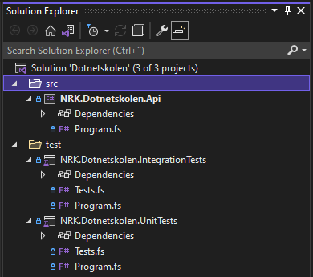

# 🏫 School of .NET

## 👋 Introduction

Welcome to the School of .NET!

This course will guide you step by step through the process of setting up and implementing a .NET solution from scratch. The goal is to demonstrate common tasks involved in the initial phase of system development, such as:

- Creating projects and structuring folders
- Adding NuGet packages
- Setting up tests

As an example application, we will build a web API in F# to retrieve the electronic program guide (EPG) for NRK TV, along with related unit and integration tests. The idea is that the API could deliver the data for a program guide - e.g the one shown here: <https://info.nrk.no/presse/tvguide/>

> A secondary goal of this repository is that the completed example application (available in the [ferdig-branch](https://github.com/nrkno/dotnetskolen/tree/ferdig)) can serve as a boilerplate repository when setting up a new .NET project.

### 💻 Approach

We will use the [.NET CLI](https://docs.microsoft.com/en-us/dotnet/core/tools/) to create projects, run the code and tests, and document our web API using [OpenAPI](https://www.openapis.org/).

The overall structure of our solution will be as follows:

```txt
└── docs  (contract for the web API)  
└── src   (code for the web API)  
└── test  (code for unit and integration tests)  
```

We recommend following this guide [on GitHub](https://github.com/nrkno/dotnetskolen), as the GitHub view supports embedded links and provides a table of contents that remains visible in the top left while browsing the guide.

### 🚀 Get started

To do this course, you need [.NET 9 SDK](https://dotnet.microsoft.com/download/dotnet), a text editor, and a terminal. Once you have this, go to [Step 1 - Create API](#step-1---create-api) and follow the instructions. For alternative starting points, see [alternative starting points](#-alternative-starting-points).

> The course provides step-by-step guidance, including commands you can run in the terminal and reference implementations of code you can copy. However, in some sections, the code implementation is intentionally omitted to encourage you to implement it yourself. These sections are marked with ☑️. Read more about how to see the complete solution for each step [here](#see-solution-suggestions).

> If you need more details about how to set up your computer to do the course, see [Details about setting up your computer](/docs/en/setup-details.md).

> If you are completely new to .NET, it may be helpful to start by reading:
>
> - [What is .NET](/docs/en/what-is-dotnet.md)
> - [What is F#](/docs/en/what-is--fsharp.md)

#### 📍 Alternative starting points

This workshop covers a variety of topics, and completing all the steps may take some time. Fortunately, solution suggestions are available for each step, allowing you to start at any point by checking out the branch with the solution for the previous step and continuing from there. Read more about how to [clone this repo](https://github.com/nrkno/dotnetskolen/blob/nnug/docs/en/setup-details.md#-local-setup-of-the-code-optional) and [check out the solution suggestions](#see-solution-suggestions).

Below are some recommended alternative starting points, depending on which topics you want to explore further.

> Note: If you start at step 5 or later, make sure to run `dotnet tool restore` before proceeding with the instructions.

##### Project and Solution setup with .NET CLI

If you want to learn how to use the .NET CLI to create projects and solutions, follow these steps:

- [Step 1 - Create API](#step-1---create-api)
- [Step 2 - Create test projects](#step-2---create-test-projects)
- [Step 3 - Create solution](#step-3---create-solution)

##### Domain Modeling and Unit Tests

To learn more about domain modeling in F# and writing unit tests, follow these steps:

- [Step 4 - Define the domain model](#step-4---defining-the-domain-model)
- [Step 5 - Unit tests for the domain model](#step-5---unit-tests-for-the-domain-model)

##### API Contracts

If you're interested in documenting your API with OpenAPI and modeling contract types, follow these steps:

- [Step 6 - Define API contract](#step-6---define-api-contract)
- [Step 7 - Implement contract types](#step-7---implement-contract-types)

##### .NET 9 and Minimal APIs

If you are interested in .NET 9's hosting model, Minimal API, and how you can test your API with integration tests, follow these steps:

- [Step 8 - Outlining the web API](#step-8---outlining-the-web-api)
- [Step 9 - Implementing the web API](#step-9---implementing-the-web-api)

##### Additional tasks

For even more challenges, check out these tasks:

- [Extra tasks](#extra tasks)
  - [Step 10 - Follow principles of domain-driven design](#step-10---follow-principles-of-domain-driven-design)
  - [Step 11 - Graphical representation of OpenAPI documentation](#step-11---graphical-representation-of-openapi-documentation)

### ❓ Questions

Do you have questions about the course? Feel free to start a thread under "Discussions" in this repository!

- <https://github.com/nrkno/dotnetskolen/discussions/categories/q-a>

### 💡 Tips and Tricks

Useful [tips and tricks can be found here](/docs/en/tips-and-tricks.md)

### 🔗 Useful links

- Microsoft's official documentation for .NET - <https://docs.microsoft.com/en-us/dotnet/>
- F# Cheat Sheet - <http://dungpa.github.io/fsharp-cheatsheet/>
- Introduction to F# - <https://fsharpforfunandprofit.com/site-contents/#understanding-f>
- Other courses in NRK
  - School of F#, a course in F# created by employees of NRK TV - <https://github.com/nrkno/fsharpskolen>
  - GitHub Actions 101, created by [@teodor-elstad](https://github.com/teodor-elstad) <https://github.com/teodor-elstad/github-actions-101>

### 👍👎 Feedback

Do you have feedback on the course? Please create a thread for it here:

- <https://github.com/nrkno/dotnetskolen/discussions/categories/ideas>

### 👩👨 Contributors

- [@heidisu](https://github.com/heidisu) - Idea and quality assurance
- [@thomaswolff](https://github.com/thomaswolff) - Author

### 🙌 Thank you

- Thank you to everyone who has provided constructive and useful feedback for this course.

### 📝 License

All documentation (including this guide) and source code in this repository are released under the [MIT License](/LICENCE).

## 📖 Table of Contents

- [Steps](#steps)
  - [Step 1 - Create API](#step-1---create-api)
  - [Step 2 - Create test projects](#step-2---create-test-projects)
  - [Step 3 - Create solution](#step-3---create-solution)
  - [Step 4 - Define a domain model](#step-4---defining-the-domain-model)
  - [Step 5 - Unit tests for the domain model](#step-5---unit-tests-for-the-domain-model)
  - [Step 6 - Define API contract](#step-6---define-api-contract)
  - [Step 7 - Implement contract types](#step-7---implement-contract-types)
  - [Step 8 - Outlining the web API](#step-8---outlining-the-web-api)
  - [Step 9 - Implementing the web API](#step-9---implementing-the-web-api)

- [Extra tasks](#extra-tasks)
  - [Step 10 - Follow principles of domain-driven design](#step-10---follow-principles-of-domain-driven-design)
  - [Step 11 - Graphical representation of OpenAPI documentation](#step-11---graphical-representation-of-openapi-documentation)

## Steps

Now that you've installed all the necessary tools, you're ready to begin the course!

### Step 1 - Create API

**Step 1 of 9** - [🔝 Go to top](#-school-of-net) [⬇ Next step](#step-2---create-test-projects)

In this step, we'll begin with an empty folder and use the .NET CLI to create our first project `NRK.Dotnetskolen.Api`.

#### .NET version

Because this guide targets .NET 9, and you may have multiple .NET versions installed, we need to tell the .NET CLI to use .NET 9 when running the commands in this guide. To do this, create a global.json file in the root of the repository with the following content:

```json¨
{
    "sdk": {
        "version": "9.0.0",
        "rollForward": "latestMinor"
    }
}
```

Here we specify that we initially want to use version `9.0.0` of the .NET SDK. Additionally, by setting `rollForward: latestMinor`, we ensure that the highest available version of .NET 9 on your machine is used.

> You can read more about `global.json` here: <https://docs.microsoft.com/en-us/dotnet/core/tools/global-json>

#### .NET projects

In .NET, code is organized into _projects_. A project is a collection of source code files, and any other resource files, and all the files that are part of the project are referenced in a _project file_. For F# projects, such project files have the file extension `.fsproj`.

When compiling .NET projects, you can choose between two types of output:

- Executable file (_executable_) - a program that can be run
- Class library (_dynamically linked library_) - a collection of functionality that can be used by other programs

#### dotnet new

As mentioned in the [introduction](#-approach), the .NET CLI is a command-line tool designed to develop, build, run, and publish .NET applications. The .NET CLI is run from the command line with the `dotnet` command, and has many subcommands and options. To see them all, you can run the command below, or read more here: <https://docs.microsoft.com/en-us/dotnet/core/tools/dotnet>

```bash
dotnet --help
```

```bash
Usage: dotnet [runtime-options] [path-to-application] [arguments]

Execute a .NET application.

runtime-options:
  --additionalprobingpath <path>   Path containing probing policy and assemblies to probe for.
  --additional-deps <path>         Path to additional deps.json file.
  --depsfile                       Path to <application>.deps.json file.
  --fx-version <version>           Version of the installed Shared Framework to use to run the application.
  --roll-forward <setting>         Roll forward to framework version  (LatestPatch, Minor, LatestMinor, Major, LatestMajor, Disable).
  --runtimeconfig                  Path to <application>.runtimeconfig.json file.

path-to-application:
  The path to an application .dll file to execute.

Usage: dotnet [sdk-options] [command] [command-options] [arguments]

Execute a .NET SDK command.

sdk-options:
  -d|--diagnostics  Enable diagnostic output.
  -h|--help         Show command line help.
  --info            Display .NET information.
  --list-runtimes   Display the installed runtimes.
  --list-sdks       Display the installed SDKs.
  --version         Display .NET SDK version in use.

SDK commands:
  add               Add a package or reference to a .NET project.
  build             Build a .NET project.
  build-server      Interact with servers started by a build.
  clean             Clean build outputs of a .NET project.
  format            Apply style preferences to a project or solution.
  help              Opens the reference page in a browser for the specified command.
  list              List packages or references of a .NET project.
  msbuild           Run Microsoft Build Engine (MSBuild) commands.
  new               Create a new .NET project or file.
  nuget             Provides additional NuGet commands.
  pack              Create a NuGet package.
  publish           Publish a .NET project for deployment.
  remove            Remove a package or reference from a .NET project.
  restore           Restore dependencies specified in a .NET project.
  run               Build and run a .NET project output.
  sdk               Manage .NET SDK installation.
  sln               Modify Visual Studio solution files.
  store             Store the specified assemblies in the runtime package store.
  test              Run unit tests using the test runner specified in a .NET project.
  tool              Install or manage tools that extend the .NET experience.
  vstest            Run Microsoft Test Engine (VSTest) commands.
  workload          Manage optional workloads.

Additional commands from bundled tools:
  dev-certs         Create and manage development certificates.
  fsi               Start F# Interactive / execute F# scripts.
  user-jwts         Manage JSON Web Tokens in development.
  user-secrets      Manage development user secrets.
  watch             Start a file watcher that runs a command when files change.

Run 'dotnet [command] --help' for more information on a command.
```

#### Templates

To create the API project, we'll use the `new` command in the .NET CLI. The `dotnet new` command is used to generate .NET projects, with the first parameter specifying the template for the project.

When you install the .NET SDK, it comes with a set of predefined project templates for common use cases. To see the available templates on your machine, run the following command:

```bash
dotnet new list
```

```bash
These templates matched your input:

Template Name                               Short Name                  Language    Tags
------------------------------------------  --------------------------  ----------  -------------------------------------------------------
.NET Aspire App Host                        aspire-apphost              [C#]        Common/.NET Aspire/Cloud
.NET Aspire Empty App                       aspire                      [C#]        Common/.NET Aspire/Cloud/Web/Web API/API/Service
.NET Aspire Service Defaults                aspire-servicedefaults      [C#]        Common/.NET Aspire/Cloud/Web/Web API/API/Service
.NET Aspire Starter App                     aspire-starter              [C#]        Common/.NET Aspire/Blazor/Web/Web API/API/Service/Cloud
.NET Aspire Test Project (MSTest)           aspire-mstest               [C#]        Common/.NET Aspire/Cloud/Web/Web API/API/Service/Test
.NET Aspire Test Project (NUnit)            aspire-nunit                [C#]        Common/.NET Aspire/Cloud/Web/Web API/API/Service/Test
.NET Aspire Test Project (xUnit)            aspire-xunit                [C#]        Common/.NET Aspire/Cloud/Web/Web API/API/Service/Test
API Controller                              apicontroller               [C#]        Web/ASP.NET
ASP.NET Core Empty                          web                         [C#],F#     Web/Empty
ASP.NET Core gRPC Service                   grpc                        [C#]        Web/gRPC/API/Service
ASP.NET Core Web API                        webapi                      [C#],F#     Web/WebAPI/Web API/API/Service
ASP.NET Core Web API (native AOT)           webapiaot                   [C#]        Web/Web API/API/Service
ASP.NET Core Web App (Model-View-Contro...  mvc                         [C#],F#     Web/MVC
ASP.NET Core Web App (Razor Pages)          webapp,razor                [C#]        Web/MVC/Razor Pages
ASP.NET Core with Angular                   angular                     [C#]        Web/MVC/SPA
ASP.NET Core with React.js                  react                       [C#]        Web/MVC/SPA
ASP.NET Core with React.js and Redux        reactredux                  [C#]        Web/MVC/SPA
Blazor Server App                           blazorserver                [C#]        Web/Blazor
Blazor Server App Empty                     blazorserver-empty          [C#]        Web/Blazor/Empty
Blazor Web App                              blazor                      [C#]        Web/Blazor/WebAssembly
Blazor WebAssembly App Empty                blazorwasm-empty            [C#]        Web/Blazor/WebAssembly/PWA/Empty
Blazor WebAssembly Standalone App           blazorwasm                  [C#]        Web/Blazor/WebAssembly/PWA
Class Library                               classlib                    [C#],F#,VB  Common/Library
Console App                                 console                     [C#],F#,VB  Common/Console
dotnet gitignore file                       gitignore,.gitignore                    Config
Dotnet local tool manifest file             tool-manifest                           Config
EditorConfig file                           editorconfig,.editorconfig              Config
global.json file                            globaljson,global.json                  Config
MSBuild Directory.Build.props file          buildprops                              MSBuild/props
MSBuild Directory.Build.targets file        buildtargets                            MSBuild/props
MSBuild Directory.Packages.props file       packagesprops                           MSBuild/packages/props/CPM
MSTest Playwright Test Project              mstest-playwright           [C#]        Test/MSTest/Playwright/Desktop/Web
MSTest Test Class                           mstest-class                [C#],F#,VB  Test/MSTest
MSTest Test Project                         mstest                      [C#],F#,VB  Test/MSTest/Desktop/Web
MVC Controller                              mvccontroller               [C#]        Web/ASP.NET
MVC ViewImports                             viewimports                 [C#]        Web/ASP.NET
MVC ViewStart viewstart [C#] Web/ASP.NET
NuGet Config                                nugetconfig,nuget.config                Config
NUnit 3 Test Item                           nunit-test                  [C#],F#,VB  Test/NUnit
NUnit 3 Test Project                        nunit                       [C#],F#,VB  Test/NUnit/Desktop/Web
NUnit Playwright Test Project               nunit-playwright            [C#]        Test/NUnit/Playwright/Desktop/Web
Protocol Buffer File                        proto                                   Web/gRPC
Razor Class Library                         razorclasslib               [C#]        Web/Razor/Library/Razor Class Library
Razor Component                             razorcomponent              [C#]        Web/ASP.NET
Razor Page                                  page                        [C#]        Web/ASP.NET
Razor View                                  view                        [C#]        Web/ASP.NET
Solution File                               sln,solution                            Solution
Web Config                                  webconfig                               Config
Windows Forms App                           winforms                    [C#],VB     Common/WinForms
Windows Forms Class Library                 winformslib                 [C#],VB     Common/WinForms
Windows Forms Control Library               winformscontrollib          [C#],VB     Common/WinForms
Worker Service                              worker                      [C#],F#     Common/Worker/Web
WPF Application                             wpf                         [C#],VB     Common/WPF
WPF Class Library                           wpflib                      [C#],VB     Common/WPF
WPF Custom Control Library                  wpfcustomcontrollib         [C#],VB     Common/WPF
WPF User Control Library                    wpfusercontrollib           [C#],VB     Common/WPF
xUnit Test Project                          xunit                       [C#],F#,VB  Test/xUnit/Desktop/Web
```

In addition to specifying the type of project you want with the `new` command, you can also control various options, such as the programming language for the project and the target folder where it will be created.

To view all available options in `dotnet new`, run the following command

```bash
dotnet new --help
```

```bash
Description:
  Template Instantiation Commands for .NET CLI.

Usage:
  dotnet new [<template-short-name> [<template-args>...]] [options]
  dotnet new [command] [options]

Arguments:
  <template-short-name>  A short name of the template to create.
  <template-args>        Template specific options to use.

Options:
  -o, --output <output>    Location to place the generated output.
  -n, --name <name>        The name for the output being created. If no name is specified, the name of the output directory is used.
  --dry-run                Displays a summary of what would happen if the given command line were run if it would result in a template
                           creation.
  --force                  Forces content to be generated even if it would change existing files.
  --no-update-check        Disables checking for the template package updates when instantiating a template.
  --project <project>      The project that should be used for context evaluation.
  -v, --verbosity <LEVEL>  Sets the verbosity level. Allowed values are q[uiet], m[inimal], n[ormal], and diag[nostic]. [default: normal]
  -d, --diagnostics        Enables diagnostic output.
  -?, -h, --help           Show command line help.

Commands:
  create <template-short-name> <template-args>  Instantiates a template with given short name. An alias of 'dotnet new <template name>'.
  install <package>                             Installs a template package.
  uninstall <package>                           Uninstalls a template package.
  update                                        Checks the currently installed template packages for update, and install the updates.
  search <template-name>                        Searches for the templates on NuGet.org.
  list <template-name>                          Lists templates containing the specified template name. If no name is specified, lists all
                                                templates.
  details <package-identifier>                  Provides the details for specified template package.
                                                      The command checks if the package is installed locally, if it was not found, it
                                                searches the configured NuGet feeds.
```

#### Creating the API project

As you can see from the templates listed above, there is a built-in template for web API called `webapi`. To get started quickly with a project, or to see how a standard .NET API is set up, you can use `webapi` as a template. However, we will create our API from scratch using the `console` template to learn as much as possible about the various components.

Run the following command to create the API project

```bash
dotnet new console --language F# --output src/api --name NRK.Dotnetskolen.Api
```

```bash
The template "Console App" was created successfully.

Processing post-creation actions...
Running 'dotnet restore' on src\api\NRK.Dotnetskolen.Api.fsproj...
  Determining projects to restore...
  Restored C:\Dev\nrkno@github.com\dotnetskolen\src\api\NRK.Dotnetskolen.Api.fsproj (in 101 ms).
Restore succeeded.
```

In the command above, we used the `--language` argument to specify that we wanted an F# project. We also used `--output` to specify where we wanted the project to be located relative to where we are running the command from, and `--name` to specify the name of the project.

> Note that instead of `--language`, `--output` and `--name`, we could have used the abbreviations `-lang`, `-o` and `-n`.

You should now have a folder structure that looks like this

```txt
src
└── api
    └── NRK.Dotnetskolen.Api.fsproj
    └── Program.fs
```

As we can see from the diagram above, the .NET CLI created the folders `src` and `src/api`, with `NRK.Dotnetskolen.Api.fsproj` and `Program.fs` in `src/api`.

> Note that unless otherwise specified, all commands in the tutorial are written assuming that you are in the same directory when you run them. If you have cloned the Git repo for the course, this is the root directory of the repo. If you are following the course without using Git, this is the directory you decide to run the commands in.

##### Project file

Open `NRK.Dotnetskolen.Api.fsproj` to see the contents of the project file of the project you just created:

```xml
<Project Sdk="Microsoft.NET.Sdk">

  <PropertyGroup>
    <OutputType>Exe</OutputType>
    <TargetFramework>net9.0</TargetFramework>
  </PropertyGroup>

  <ItemGroup>
    <Compile Include="Program.fs" />
  </ItemGroup>

</Project>
```

Here we see that the project:

- Has output type `exe` - the project is compiled into an executable file
- Is set to be compiled for .NET 9.
- Consists of one file `Program.fs`

##### The program file

To see what the program does, we can open `Program.fs` and look at the code:

```f#
// For more information see https://aka.ms/fsharp-console-apps
printfn "Hello from F#"
```

The template added only one line to `Program.fs` that outputs the text string `Hello world from F#`. In other programming languages, you may be used to seeing a `main`-function or something similar, but that’s not the case here. This is because F# uses an implicit entry point located at the top of the file, executing code line by line as written. However, F# also supports explicit entry points if needed. Learn more about it here: <https://docs.microsoft.com/en-us/dotnet/fsharp/language-reference/functions/entry-point#implicit-entry-point>
> The name of the project `NRK.Dotnetskolen.Api.fsproj` follows Microsoft's naming convention for programs and libraries in .NET. To read more about this, and other naming conventions in .NET, you can see here: <https://docs.microsoft.com/en-us/dotnet/standard/design-guidelines/names-of-assemblies-and-dlls>
>
> The folder structure shown above is a suggestion, and the next steps in the course are based on it. However, if you're using this course as inspiration or guidance for your own project, you don’t have to follow this structure exactly. How you organize your folders is entirely up to you and should be based on factors such as system size, the number of projects, and personal preference.

#### Running the API project

To run the project created above you can run the following command

```bash
dotnet run --project src/api/NRK.Dotnetskolen.Api.fsproj
```

```bash
Hello world from F#
```

Alternatively, you can go to the folder where the project is located, and run `dotnet run` from there, as shown below

```bash
cd src/api
dotnet run
```

```bash
Hello world from F#
```

#### Save changes to Git (optional)

Now that you have completed the first step in the course, it is a good time to commit the changes you have made so far in Git.

##### See changes

Given that you followed the guide to [set up the code locally](https://github.com/nrkno/dotnetskolen/blob/nnug/docs/en/setup-details.md#-local-setup-of-the-code-optional) before you started coding, you can run the following command to see what changes have been made to the repo:

```bash
git status
```

```bash
On branch <branchnavn>
Untracked files:
  (use "git add <file>..." to include in what will be committed)
        global.json
        src/

nothing added to commit but untracked files present (use "git add" to track)
```

In the output above, we see that Git has detected that a folder `src` and its contents have been created, but Git is not currently tracking these (the files are "untracked").

##### Add changes to Git

To have Git track the files we have created, and then see the status in Git, you can run the following commands:

```bash
git add .
git status
```

```bash
Changes to be committed:
  (use "git restore --staged <file>..." to unstage)
        new file:   global.json
        new file: src/api/NRK.Dotnetskolen.Api.fsproj
        new file:   src/api/Program.fs
```

Now Git is tracking the files.

##### Save the changes

To save the current state of the files in a "commit" in Git you can run the following command:

```bash
git commit -m "Created API project"
```

```bash
[<branchname> 00d11c8] Created API project
 2 files changed, 25 insertions(+)
 create mode 100644 src/api/NRK.Dotnetskolen.Api.fsproj
 create mode 100644 src/api/Program.fs
```

##### See all historical changes in the repo

To see all commits in the current branch in Git, you can run the following command:

```bash
git log
```

```bash
commit 00d11c82d0179f41883a55ce88e147a73ae60ee2 (HEAD -> <branchnavn>)
Author: Thomas Wolff <thomas.wolff@nrk.no>
Date: Fri Apr 16 13:43:40 2021 +0200

    Created API project
...
```

> 💡 Tip! Repeat the three steps above of viewing changes, adding them, and saving them after completing each step to have a better overview of what you have been through in the course.

#### See solution suggestions

If you want to see the expected state of the repo after performing the various steps in the course, you can check out the branch with the corresponding name as the section you want to look at. For example, if you want to see how the repo looks after the first step, you can check out the branch `step-1` like this:

```bash
git checkout step-1
```

```bash
Switched to branch 'step-1'
```

### Step 2 - Create test projects

**Step 2 of 9** - [🔝 Go to top](#-school-of-net) [⬆ Previous step](#step-1---create-api) [⬇ Next step](#step-3---create-solution)

Tests are an important part of system development because they help us verify that the system works as intended. When writing tests for code, we often operate with two types of tests:

- Unit tests
- Integration tests

Unit tests ensure that small, isolated pieces of code works as intended, typically testing one function at a time. In this course, we’ll use unit tests to validate the validation rules within our domain.

Integration tests, on the other hand, verify that larger parts of the system work as expected, including interactions with external systems. Here, we’ll use integration tests to confirm that the web API behaves according to the [contract we define in step 6](#step-6---define-api-contract).

#### dotnet new

In this step we will create two test projects

- One for unit tests - `NRK.Dotnetskolen.UnitTests`
- One for integration tests - `NRK.Dotnetskolen.IntegrationTests`

To create the test projects, we will again use the `dotnet new` command, but this time we will choose a different [template](#templates) than when we created the API project. When you install the .NET SDK, it comes with several test project templates that correspond to different frameworks available for detecting and running tests:

- xUnit
- nUnit
- MSTest

In this course we will use xUnit. This choice is somewhat arbitrary as all of the frameworks above will suffice for our purpose, which is to show how to set up test projects and get started writing tests. If you want to know more about the different testing frameworks, you can read more about them here: <https://docs.microsoft.com/en-us/dotnet/core/testing/#testing-tools>

#### Creating the unit test project

Run the following command to create the unit test project

```bash
dotnet new xunit -lang F# -o test/unit -n NRK.Dotnetskolen.UnitTests
```

```bash
The template "xUnit Test Project" was created successfully.

Processing post-creation actions...
Running 'dotnet restore' on test/unit/NRK.Dotnetskolen.UnitTests.fsproj...
  Determining projects to restore...
  Restored C:\Dev\nrkno@github.com\dotnetskolen\test\unit\NRK.Dotnetskolen.UnitTests.fsproj (in 1.31 sec).
Restore succeeded.
```

You should now have the following folder structure

```txt
src
└── api
    └── NRK.Dotnetskolen.Api.fsproj
    └── Program.fs
test
└── unit
    └── NRK.Dotnetskolen.UnitTests.fsproj
    └── Program.fs
    └── Tests.fs
```

##### Project file

Open the file `NRK.Dotnetskolen.UnitTests.fsproj`:

```xml
<Project Sdk="Microsoft.NET.Sdk">

  <PropertyGroup>
    <TargetFramework>net9.0</TargetFramework>
    <IsPackable>false</IsPackable>
    <GenerateProgramFile>false</GenerateProgramFile>
  </PropertyGroup>

  <ItemGroup>
    <Compile Include="Tests.fs" />
    <Compile Include="Program.fs" />
  </ItemGroup>

  <ItemGroup>
    <PackageReference Include="coverlet.collector" Version="6.0.2" />
    <PackageReference Include="Microsoft.NET.Test.Sdk" Version="17.12.0" />
    <PackageReference Include="xunit" Version="2.9.2" />
    <PackageReference Include="xunit.runner.visualstudio" Version="2.8.2" />
  </ItemGroup>

</Project>
```

In the project file, we can see that the unit test project:

- Is set to be compiled for .NET 9.
- Contains two source code files
  - `Tests.fs`
  - `Program.fs`
- Has references to four NuGet packages
  - `coverlet.collector` - library to get code coverage statistics for projects <https://docs.microsoft.com/en-us/dotnet/core/testing/unit-testing-code-coverage?tabs=windows>
  - `Microsoft.NET.Test.Sdk` - Package for building .NET test projects
  - `xunit` - Library for writing unit tests
  - `xunit.runner.visualstudio` - Library for running Xunit tests in "Test explorer" in Visual Studio <https://docs.microsoft.com/en-us/visualstudio/test/run-unit-tests-with-test-explorer?view=vs-2019>

##### The test file

Open the `Tests.fs` file:

```f#
module Tests

open System
open Xunit

[<Fact>]
let ``My test`` () =
    Assert.True(true)

```

At the top of the file, an F# module `Tests` is defined. In addition, the modules `System` and `Xunit` are opened, which come from the Microsoft base library and the Xunit library, respectively. Furthermore, a test ``` ``My test`` ``` is defined. The way we see that it is a test is by seeing that it is annotated with `[<Fact>]`. Xunit operates with two annotations for tests:

- `[<Fact>]`
- `[<Theory>]`

The difference between these is explained in more detail in the [unit testing step](#step-5---unit-tests-for-the-domain-model).

> Note that ``` ``<variable name with spaces>`` ``` allows variable names to contain spaces. This enables you to write function names that clearly describe the test while remaining human-readable.".

##### Running the unit test project

To run the test in the unit test project you can use the following command

```bash
dotnet test test/unit/NRK.Dotnetskolen.UnitTests.fsproj
```

```bash
Restore complete (0,3s)
  NRK.Dotnetskolen.UnitTests succeeded (2.0s) → test\unit\bin\Debug\net9.0\NRK.Dotnetskolen.UnitTests.dll
[xUnit.net 00:00:00.00] xUnit.net VSTest Adapter v2.8.2+699d445a1a (64-bit .NET 9.0.1)
[xUnit.net 00:00:00.51] Discovering: NRK.Dotnetskolen.UnitTests
[xUnit.net 00:00:00.54] Discovered: NRK.Dotnetskolen.UnitTests
[xUnit.net 00:00:00.54] Starting: NRK.Dotnetskolen.UnitTests
[xUnit.net 00:00:00.69] Finished: NRK.Dotnetskolen.UnitTests
  NRK.Dotnetskolen.UnitTests test succeeded (1.8s)

Test summary: total: 1; failed: 0; succeeded: 1; skipped: 0; duration: 1,8s
Build succeeded in 4,5s
```

Similar to `dotnet run`, you can alternatively go into the folder of the unit test project, and run `dotnet test` from there:

```bash
cd test/unit
dotnet test
```

```bash
Restore complete (0,3s)
  NRK.Dotnetskolen.UnitTests succeeded (0.4s) → bin\Debug\net9.0\NRK.Dotnetskolen.UnitTests.dll
[xUnit.net 00:00:00.00] xUnit.net VSTest Adapter v2.8.2+699d445a1a (64-bit .NET 9.0.1)
[xUnit.net 00:00:00.50] Discovering: NRK.Dotnetskolen.UnitTests
[xUnit.net 00:00:00.52] Discovered: NRK.Dotnetskolen.UnitTests
[xUnit.net 00:00:00.53] Starting: NRK.Dotnetskolen.UnitTests
[xUnit.net 00:00:00.68] Finished: NRK.Dotnetskolen.UnitTests
  NRK.Dotnetskolen.UnitTests test succeeded (1.7s)

Test summary: total: 1; failed: 0; succeeded: 1; skipped: 0; duration: 1,7s
Build succeeded in 2,9s
```

#### Creating the integration test project

To create the integration test project, you can run the same command as when you [created the unit test project](#creating-the-unit-test-project), but replace `Unit` with `Integration` in the test project name, as shown below:

```bash
dotnet new xunit -lang F# -o test/integration -n NRK.Dotnetskolen.IntegrationTests
```

```bash
The template "xUnit Test Project" was created successfully.

Processing post-creation actions...
Running 'dotnet restore' on test\integration\NRK.Dotnetskolen.IntegrationTests.fsproj...
  Determining projects to restore...
  Restored C:\Dev\nrkno@github.com\dotnetskolen\test\integration\NRK.Dotnetskolen.IntegrationTests.fsproj (in 580 ms).
Restore succeeded.
```

You should now have the following folder structure

```txt
src
└── api
    └── NRK.Dotnetskolen.Api.fsproj
    └── Program.fs
test
└── unit
    └── NRK.Dotnetskolen.UnitTests.fsproj
    └── Program.fs
    └── Tests.fs
└── integration
    └── NRK.Dotnetskolen.IntegrationTests.fsproj
    └── Program.fs
    └── Tests.fs
```

For now, the project and test files for the integration test project are exactly the same as those for the unit test project (except for the project name). The difference between unit and integration tests becomes clearer when we write the tests in [step 5](#step-5---unit-tests-for-the-domain-model) and [step 9](#step-9---implementing-the-web-api), respectively.

##### Running the integration tests

To run the tests in the integration test project, you can use the following command

```bash
dotnet test test/integration/NRK.Dotnetskolen.IntegrationTests.fsproj
```

```bash
Restore complete (0,3s)
  NRK.Dotnetskolen.IntegrationTests succeeded (2.0s) → test\integration\bin\Debug\net9.0\NRK.Dotnetskolen.IntegrationTests.dll
[xUnit.net 00:00:00.00] xUnit.net VSTest Adapter v2.8.2+699d445a1a (64-bit .NET 9.0.1)
[xUnit.net 00:00:00.54] Discovering: NRK.Dotnetskolen.IntegrationTests
[xUnit.net 00:00:00.56] Discovered: NRK.Dotnetskolen.IntegrationTests
[xUnit.net 00:00:00.57] Starting: NRK.Dotnetskolen.IntegrationTests
[xUnit.net 00:00:00.72] Finished: NRK.Dotnetskolen.IntegrationTests
  NRK.Dotnetskolen.IntegrationTests test succeeded (1.8s)

Test summary: total: 1; failed: 0; succeeded: 1; skipped: 0; duration: 1,8s
Build succeeded in 4,6s
```

### Step 3 - Create solution

**Step 3 of 9** - [🔝 Go to top](#-school-of-net) [⬆ Previous step](#step-2---create-test-projects) [⬇ Next step](#step-4---defining-the-domain-model)

Right now, we have three projects that are independent of each other. Other than being in the same folder, there is nothing that connects them. In order to be able to do operations such as adding shared packages and running all the tests for our system, we can link the projects together in a _solution_. Having all the projects in a solution gives the advantage of being able to open all the projects together in an IDE.

#### dotnet sln

To create a solution with `dotnet` you can run the following command:

```bash
dotnet new sln -n Dotnetskolen
```

```bash
The template "Solution File" was created successfully.
```

You should now have the file `Dotnetskolen.sln` as shown below.

```txt
src
└── api
    └── NRK.Dotnetskolen.Api.fsproj
    └── Program.fs
test
└── unit
    └── NRK.Dotnetskolen.UnitTests.fsproj
    └── Program.fs
    └── Tests.fs
└── integration
    └── NRK.Dotnetskolen.IntegrationTests.fsproj
    └── Program.fs
    └── Tests.fs
└── Dotnetskolen.sln
```

If we look at the content of `Dotnetskolen.sln` we see that there are no references to our projects yet.

```txt

Microsoft Visual Studio Solution File, Format Version 12.00
# Visual Studio Version 17
VisualStudioVersion = 17.0.31903.59
MinimumVisualStudioVersion = 10.0.40219.1
Global
        GlobalSection(SolutionConfigurationPlatforms) = preSolution
                Debug|Any CPU = Debug|Any CPU
                Release|Any CPU = Release|Any CPU
        EndGlobalSection
        GlobalSection(SolutionProperties) = preSolution
                HideSolutionNode = FALSE
        EndGlobalSection
EndGlobal

```

#### Adding projects to the solution

To add references to the projects you have created you can run the following commands

##### Add the API Project

```bash
dotnet sln add src/api/NRK.Dotnetskolen.Api.fsproj
```

```bash
Project `src\api\NRK.Dotnetskolen.Api.fsproj` added to the solution.
```

##### Add the unit test project

```bash
dotnet sln add test/unit/NRK.Dotnetskolen.UnitTests.fsproj
```

```bash
Project `test\unit\NRK.Dotnetskolen.UnitTests.fsproj` added to the solution.
```

##### Add the integration test project

```bash
dotnet sln add test/integration/NRK.Dotnetskolen.IntegrationTests.fsproj
```

```bash
Project `test\integration\NRK.Dotnetskolen.IntegrationTests.fsproj` added to the solution.
```

Now we see that `Dotnetskolen.sln` contains references to our projects

```txt

Microsoft Visual Studio Solution File, Format Version 12.00
# Visual Studio Version 17
VisualStudioVersion = 17.0.31903.59
MinimumVisualStudioVersion = 10.0.40219.1
Project("{2150E333-8FDC-42A3-9474-1A3956D46DE8}") = "src", "src", "{602F7DA2-73CF-4DA2-82E5-D392DE47E0BC}"
EndProject
Project("{F2A71F9B-5D33-465A-A702-920D77279786}") = "NRK.Dotnetskolen.Api", "src\api\NRK.Dotnetskolen.Api.fsproj", "{618BF895-AEA1-4086-8904-89DD317B2429}"
EndProject
Project("{2150E333-8FDC-42A3-9474-1A3956D46DE8}") = "test", "test", "{10963520-731D-442B-B808-DA74BDD9207D}"
EndProject
Project("{F2A71F9B-5D33-465A-A702-920D77279786}") = "NRK.Dotnetskolen.UnitTests", "test\unit\NRK.Dotnetskolen.UnitTests.fsproj", "{95B87F0E-15B8-4646-98F0-E8DAACA5526D}"
EndProject
Project("{F2A71F9B-5D33-465A-A702-920D77279786}") = "NRK.Dotnetskolen.IntegrationTests", "test\integration\NRK.Dotnetskolen.IntegrationTests.fsproj", "{391F46FA-9684-460E-B6A2-99EF7363693F}"
EndProject
Global
        GlobalSection(SolutionConfigurationPlatforms) = preSolution
                Debug|Any CPU = Debug|Any CPU
                Release|Any CPU = Release|Any CPU
        EndGlobalSection
        GlobalSection(SolutionProperties) = preSolution
                HideSolutionNode = FALSE
        EndGlobalSection
        GlobalSection(ProjectConfigurationPlatforms) = postSolution
                {618BF895-AEA1-4086-8904-89DD317B2429}.Debug|Any CPU.ActiveCfg = Debug|Any CPU
                {618BF895-AEA1-4086-8904-89DD317B2429}.Debug|Any CPU.Build.0 = Debug|Any CPU
                {618BF895-AEA1-4086-8904-89DD317B2429}.Release|Any CPU.ActiveCfg = Release|Any CPU
                {618BF895-AEA1-4086-8904-89DD317B2429}.Release|Any CPU.Build.0 = Release|Any CPU
                {95B87F0E-15B8-4646-98F0-E8DAACA5526D}.Debug|Any CPU.ActiveCfg = Debug|Any CPU
                {95B87F0E-15B8-4646-98F0-E8DAACA5526D}.Debug|Any CPU.Build.0 = Debug|Any CPU
                {95B87F0E-15B8-4646-98F0-E8DAACA5526D}.Release|Any CPU.ActiveCfg = Release|Any CPU
                {95B87F0E-15B8-4646-98F0-E8DAACA5526D}.Release|Any CPU.Build.0 = Release|Any CPU
                {391F46FA-9684-460E-B6A2-99EF7363693F}.Debug|Any CPU.ActiveCfg = Debug|Any CPU
                {391F46FA-9684-460E-B6A2-99EF7363693F}.Debug|Any CPU.Build.0 = Debug|Any CPU
                {391F46FA-9684-460E-B6A2-99EF7363693F}.Release|Any CPU.ActiveCfg = Release|Any CPU
                {391F46FA-9684-460E-B6A2-99EF7363693F}.Release|Any CPU.Build.0 = Release|Any CPU
        EndGlobalSection
        GlobalSection(NestedProjects) = preSolution
                {618BF895-AEA1-4086-8904-89DD317B2429} = {602F7DA2-73CF-4DA2-82E5-D392DE47E0BC}
                {95B87F0E-15B8-4646-98F0-E8DAACA5526D} = {10963520-731D-442B-B808-DA74BDD9207D}
                {391F46FA-9684-460E-B6A2-99EF7363693F} = {10963520-731D-442B-B808-DA74BDD9207D}
        EndGlobalSection
EndGlobal

```

#### Solution i Visual Studio

The image below shows how the "Solution explorer" in Visual Studio displays the solution.



### Step 4 - Defining the domain model

**Step 4 of 9** - [🔝 Go to top](#-school-of-net) [⬆ Previous step](#step-3---create-solution) [⬇ Next step](#step-5---unit-tests-for-the-domain-model)

We are going to create an API to retrieve a simplified electronic program guide (EPG) for various channels on NRK TV. The idea is that the API could deliver the data for a program guide - e.g the one shown here: <https://info.nrk.no/presse/tvguide/>

> The model we use for the EPG in this course is simplified compared to [the one used in the PS API](https://webapp-ps-granitt-api-prod-we.azurewebsites.net/swagger/ui/index#/Epg), and is used as an example only.

An EPG can be seen as a list of transmissions, and for our example in this course, a transmission contains the following fields:

- Title - The title of the program. Must be between 5 and 100 characters (inclusive), and can only consist of uppercase and lowercase letters, numbers, and some special characters: `, . : - !`
- Channel - The channel that the transmission is broadcasted on. In our case, possible channels are limited to NRK1 and NRK2, and must be written in capital letters.
- Start date and time - date and time when the transmission starts to air.
- End date and time - date and time when the transmission ends. Must be after the start date and time.

#### Domain model in F#

Now that we have specified our domain, we can model it in F#. Start by creating a new file `Domain.fs` under `src/api`:

```txt
└── .config
    └── ...
src
└── api
    └── Domain.fs
    └── NRK.Dotnetskolen.Api.fsproj
    └── Program.fs
test
└── ...
└── Dotnetskolen.sln
```

Paste the content below into `Domain.fs`:

```f#
namespace NRK.Dotnetskolen

module Domain =

    open System

    type Transmission = {
        Title: string
        Channel: string
        StartTime: DateTimeOffset
        EndTime: DateTimeOffset
    }

    type Epg = Transmission list
```

Above we define an F# module `Domain` in the namespace `NRK.Dotnetskolen`. In the `Domain` module we define our domain model, which consists of two types:

- `Transmission` - models a single item in the EPG, and contains the fields defined in the previous section
  - Title
  - Channel
  - StartTime
  - EndTime
- `Epg` - a list of transmissions

We also opened the `System` module to access the `DateTimeOffset` type.

> Notice the indentation on the lines after `module Domain =`. This indentation is required by F# for the code to compile correctly.

Include `Domain.fs` in the API project by adding `<Compile Include="Domain.fs" />` in `src/api/NRK.Dotnetskolen.Api.fsproj` as shown below:

```xml
<Project Sdk="Microsoft.NET.Sdk">

  <PropertyGroup>
    <OutputType>Exe</OutputType>
    <TargetFramework>net9.0</TargetFramework>
  </PropertyGroup>

  <ItemGroup>
    <Compile Include="Domain.fs" />
    <Compile Include="Program.fs" />
  </ItemGroup>

</Project>
```

> Note that the order in which files are included in F# project files matters. If `module A` is defined in `ModuleA.fs` and `module B` is defined in `ModuleB.fs`, and `module A` is to be able to open `module B`, `ModuleB.fs` must come before `ModuleA.fs` in the project file.
>
> Modules in F# are compiled to the same CIL as static classes in C#.

#### Creating an EPG

Now that we have defined our domain model, let's see how we can put it to use. Open `Program.fs` in the web API project and replace the contents with the following code:

```f#
open System
open NRK.Dotnetskolen.Domain

let epg = [
    {
        Title = "Dagsrevyen"
        Channel = "NRK1"
        StartTime = DateTimeOffset.Parse("2021-04-16T19:00:00+02:00")
        EndTime = DateTimeOffset.Parse("2021-04-16T19:30:00+02:00")
    }
]
printfn "%A" epg
```

Here we create a variable `epg` which is a list of transmissions, as we defined in `Domain.fs`.

Run the API project again with the following command, and see that the `epg` value is written to the terminal.

```bash
dotnet run --project src/api/NRK.Dotnetskolen.Api.fsproj
```

```bash
[{ Title = "Dagsrevyen"
   Channel = "NRK1"
   StartTime = 16.04.2021 19:00:00 +02:00
   EndTime = 16.04.2021 19:30:00 +02:00 }]
```

> Note that some people have reported problems with error messages in Rider after adding the line `open NRK.Dotnetskolen.Domain`. If you experience the same thing, you can right-click on the "Solution" node in Rider, and click "Unload" followed by "Reload". This should hopefully fix the problem.

### Step 5 - Unit tests for the domain model

**Step 5 of 9** - [🔝 Go to top](#-school-of-net) [⬆ Previous step](#step-4---defining-the-domain-model) [⬇ Next step](#step-6---define-api-contract)

The domain model introduced in [previous step](#step-4---defining-the-domain-model) contains both the structure of the EPG, and the validation rules associated with them. So far, we have only modeled the structure of the domain model in F# (that the EPG consists of a list of transmissions, and what fields each transmission contains). In this step, we will implement the validation rules in F#, and verify that we have implemented them correctly using unit tests.

#### Rules in our domain

We want to verify the following rules from our domain:

- Title
  - Must consist of 5-100 characters (inclusive)
  - Can only consist of uppercase and lowercase letters, numbers, and the following special characters: `, . : - !`
- Channel
  - `NRK1` or `NRK2`.
  - Only capital letters are allowed.
- Air time
  - End time must be after start time

#### Title

Let's start by verifying that we are implementing the title validation rules correctly.

##### Unit tests

Since the title has length constraints, it's important to test boundary cases for length. Additionally, we need to ensure that only valid characters are allowed. Replace the existing test in `Tests.fs` within the unit test project with the tests below.

```f#
module Tests

open Xunit

[<Theory>]
[<InlineData("abc12")>]
[<InlineData(".,-:!")>]
[<InlineData("ABCDEFGHIJABCDEFGHIJABCDEFGHIJABCDEFGHIJABCDEFGHIJABCDEFGHIJABCDEFGHIJABCDEFGHIJABCDEFGHIJABCDEFGHIJABCDEFGHIJ")>]
let ``isTitleValid valid title returns true`` (title: string) =
    let isTitleValid = isTitleValid title

    Assert.True isTitleValid

[<Theory>]
[<InlineData("abcd")>]
[<InlineData("@$%&/")>]
[<InlineData("abcdefghijabcdefghijabcdefghijabcdefghijabcdefghijabcdefghijabcdefghijabcdefghijabcdefghijabcdefghijabcdefghija")>]
let ``isTitleValid invalid title returns false`` (title: string) =
    let isTitleValid = isTitleValid title

    Assert.False isTitleValid
```

Here we have defined two unit tests that both test the `isTitleValid` function. The first test verifies that `isTitleValid` returns `true` when the title _is_ valid, while the second verifies the opposite case. In xUnit, you annotate test functions with either `[<Fact>]` or `[<Theory>]`. Test functions annotated with `[<Fact>]` will run once without any input parameters, while in test functions annotated with `[<Theory>]` you can use input parameters, and annotate the test function with `[<InlineData>]` to pass in given input parameters. Then the test function will be run once _per_ annotation with `[<InlineData>]`.

If you try to run the tests, you will see that the test project does not compile because we neither have a reference to the API project (where our domain is defined) nor have we defined the `isTitleValid` function yet.

```bash
dotnet test test/unit/NRK.Dotnetskolen.UnitTests.fsproj
```

```bash
dotnet test test/unit/NRK.Dotnetskolen.UnitTests.fsproj [11:56:17]
Restore complete (0,4s)
  NRK.Dotnetskolen.UnitTests failed with 2 error(s) (2,0s)
    C:\Dev\github.com\nrkno\dotnetskolen\test\unit\Tests.fs(9,25): error FS0039: The value or constructor 'isTitleValid' is not defined.
    C:\Dev\github.com\nrkno\dotnetskolen\test\unit\Tests.fs(18,25): error FS0039: The value or constructor 'isTitleValid' is not defined.

Build failed with 2 error(s) in 3,0s
```

##### Implement isTitleValid

To validate a title, we use a regular expression that reflects the rules of our domain. Open the `Domain.fs` file in the API project, and add the following `open` statement under `open system`:

```f#
open System.Text.RegularExpressions
```

Then paste the following code at the end of the file:

```f#
    let isTitleValid (title: string) : bool =
        let titleRegex = Regex(@"^[\p{L}0-9\.,-:!]{5,100}$")
        titleRegex.IsMatch(title)
```

The regular expression lists which characters are valid in a group (the characters between `[` and `]`):

- `\p{L}` - syntax for specifying any letter in Unicode
- `0-9` - tall
- `\.,-:!` - the special characters we allow

Additionally, `{5,100}` specifies that we allow 5-100 of the characters in the group above.

##### Adding the API project reference

In order for the unit test project to access the function we just defined in `Domain.fs`, we need to add a project reference to the API project in the unit test project. We can do this using the .NET CLI with the following command:

```bash
dotnet add ./test/unit/NRK.Dotnetskolen.UnitTests.fsproj reference ./src/api/NRK.Dotnetskolen.Api.fsproj
```

```bash
Reference `..\..\src\api\NRK.Dotnetskolen.Api.fsproj` added to the project.
```

You can see the output of the command above by opening `test/unit/NRK.Dotnetskolen.UnitTests.fsproj`:

```xml
<Project Sdk="Microsoft.NET.Sdk">

  <PropertyGroup>
    <TargetFramework>net9.0</TargetFramework>
    <IsPackable>false</IsPackable>
    <GenerateProgramFile>false</GenerateProgramFile>
  </PropertyGroup>

  <ItemGroup>
    <Compile Include="Tests.fs" />
    <Compile Include="Program.fs" />
  </ItemGroup>

  <ItemGroup>
    <PackageReference Include="coverlet.collector" Version="6.0.2" />
    <PackageReference Include="Microsoft.NET.Test.Sdk" Version="17.12.0" />
    <PackageReference Include="xunit" Version="2.9.2" />
    <PackageReference Include="xunit.runner.visualstudio" Version="2.8.2" />
  </ItemGroup>

  <ItemGroup>
    <ProjectReference Include="..\..\src\api\NRK.Dotnetskolen.Api.fsproj" />
  </ItemGroup>

</Project>

```

##### Open module

In addition to adding a reference to the API project in the unit test project, we need to open the `NRK.Dotnetskolen.Domain` module in `Tests.fs`. You can do this by adding `open NRK.Dotnetskolen.Domain` under `open Xunit` in `Tests.fs`:

```f#
module Tests

open Xunit
open NRK.Dotnetskolen.Domain
```

Now the tests should run successfully:

```bash
dotnet test test/unit/NRK.Dotnetskolen.UnitTests.fsproj
```

```bash
Restore complete (1,1s)
  NRK.Dotnetskolen.Api succeeded (2.9s) → src\api\bin\Debug\net9.0\NRK.Dotnetskolen.Api.dll
  NRK.Dotnetskolen.UnitTests succeeded (2.4s) → test\unit\bin\Debug\net9.0\NRK.Dotnetskolen.UnitTests.dll
[xUnit.net 00:00:00.00] xUnit.net VSTest Adapter v2.8.2+699d445a1a (64-bit .NET 9.0.1)
[xUnit.net 00:00:00.76] Discovering: NRK.Dotnetskolen.UnitTests
[xUnit.net 00:00:00.83] Discovered: NRK.Dotnetskolen.UnitTests
[xUnit.net 00:00:00.83] Starting: NRK.Dotnetskolen.UnitTests
[xUnit.net 00:00:01.19] Finished: NRK.Dotnetskolen.UnitTests
  NRK.Dotnetskolen.UnitTests test succeeded (3.2s)

Test summary: total: 6; failed: 0; succeeded: 6; skipped: 0; duration: 3,1s
Build succeeded in 10,2s
```

> Notice that the test report shows that six tests were run. So far, we have only defined two tests. This illustrates that `xUnit` runs tests once per `[<InlineData>]` annotation.

#### Channel

The rules for channels are quite simple as there are only two valid channels, and these can only be written in uppercase letters.

##### Unit tests

To test the channel validation rule, we need one positive test per valid channel, one negative test for a lowercase channel, and one negative test for an invalid channel. Expand `Tests.fs` with the following channel tests:

```f#
[<Theory>]
[<InlineData("NRK1")>]
[<InlineData("NRK2")>]
let ``isChannelValid valid channel returns true`` (channel: string) =
    let isChannelValid = isChannelValid channel

    Assert.True isChannelValid

[<Theory>]
[<InlineData("nrk1")>]
[<InlineData("NRK3")>]
let ``isChannelValid invalid channel returns false`` (channel: string) =
    let isChannelValid = isChannelValid channel

    Assert.False isChannelValid
```

##### Implementation of isChannelValid

Before we run the tests again, we define the outline for `isChannelValid` in `Domain.fs`:

```f#
    let isChannelValid (channel: string) : bool =
    // Implementation here
```

☑️ Implement `isChannelValid` in order to make the unit tests pass.

```bash
dotnet test ./test/unit/NRK.Dotnetskolen.UnitTests.fsproj
```

```bash
Restore complete (0,4s)
  NRK.Dotnetskolen.Api succeeded (2.2s) → src\api\bin\Debug\net9.0\NRK.Dotnetskolen.Api.dll
  NRK.Dotnetskolen.UnitTests succeeded (2.3s) → test\unit\bin\Debug\net9.0\NRK.Dotnetskolen.UnitTests.dll
[xUnit.net 00:00:00.00] xUnit.net VSTest Adapter v2.8.2+699d445a1a (64-bit .NET 9.0.1)
[xUnit.net 00:00:00.08] Discovering: NRK.Dotnetskolen.UnitTests
[xUnit.net 00:00:00.12] Discovered: NRK.Dotnetskolen.UnitTests
[xUnit.net 00:00:00.12] Starting: NRK.Dotnetskolen.UnitTests
[xUnit.net 00:00:00.26] Finished: NRK.Dotnetskolen.UnitTests
  NRK.Dotnetskolen.UnitTests test succeeded (1.2s)

Test summary: total: 10; failed: 0; succeeded: 10; skipped: 0; duration: 1,1s
Build succeeded in 6,7s
```

#### Air time

The last thing we need to validate in our domain is that the end time is after the start time.

##### Unit tests

Below is one unit test for validating the air time in `Tests.fs`:

```f#
[<Fact>]
let ``areStartTimeAndEndTimeValid start before end returns true`` () =
    let startTime = DateTimeOffset.Now
    let endTime = startTime.AddMinutes 30.

    let areStartTimeAndEndTimeValid = areStartTimeAndEndTimeValid starttime endtime

    Assert.True areStartTimeAndEndTimeValid
```

Note that you also need to add the following `open` statement to `Tests.fs` for `DateTimeOffset.Now` from the code snippet above to work:

```f#
open System
```

☑️ Add more unit tests you think are necessary to verify that the start and end time validation is correct.

> Note that here we use the `[<Fact>]` attribute instead of `[<Theory>]`. The `[<InlineData>]` attribute that is used with the `[<Theory>]` attribute requires values ​​that are constant at compile time. Since we are using `DateTimeOffset` objects (which are not constant at compile time) as input to `areStartTimeAndEndTimeValid`, we therefore use the `[<Fact>]` attribute.

##### Implementation of areStartTimeAndEndTimeValid

The function to validate the air time must check if the end time is greater than the start time. Paste the outline of `areStartTimeAndEndTimeValid` into `Domain.fs`:

```f#
    let areStartTimeAndEndTimeValid (startTime: DateTimeOffset) (endTime: DateTimeOffset) =
    // Implementation here
```

☑️ Implement `areStartTimeAndEndTimeValid` and make the unit tests pass.

```bash
dotnet test ./test/unit/NRK.Dotnetskolen.UnitTests.fsproj
```

```bash
Restore complete (0,4s)
  NRK.Dotnetskolen.Api succeeded (2.2s) → src\api\bin\Debug\net9.0\NRK.Dotnetskolen.Api.dll
  NRK.Dotnetskolen.UnitTests succeeded (2.2s) → test\unit\bin\Debug\net9.0\NRK.Dotnetskolen.UnitTests.dll
[xUnit.net 00:00:00.00] xUnit.net VSTest Adapter v2.8.2+699d445a1a (64-bit .NET 9.0.1)
[xUnit.net 00:00:00.08] Discovering: NRK.Dotnetskolen.UnitTests
[xUnit.net 00:00:00.13] Discovered: NRK.Dotnetskolen.UnitTests
[xUnit.net 00:00:00.13] Starting: NRK.Dotnetskolen.UnitTests
[xUnit.net 00:00:00.24] Finished: NRK.Dotnetskolen.UnitTests
  NRK.Dotnetskolen.UnitTests test succeeded (1.1s)

Test summary: total: 13; failed: 0; succeeded: 13; skipped: 0; duration: 1,1s
Build succeeded in 6,6s
```

#### Validate a transmission

Now that we have functions to validate the various fields of a transmission, we can create a function that validates an entire transmission.

##### Unit tests

Since we have written unit tests for the validation functions of the various parts of a transmission, the unit tests for validating the entire transmission can be quite simple.

☑️ Write one positive test for a valid transmission, and one negative test for an invalid transmission in `Tests.fs` that assumes there is a function `isTransmissionValid` in `Domain.fs`

##### Implementation of isTransmissionValid

Add the following outline for `isTransmissionValid` in `Domain.fs`:

```f#
    let isTransmissionValid (transmission: Transmission) : bool =
    // Implementation here
```

☑️ Implement `isTransmissionValid`, and make the unit tests pass:

```bash
dotnet test ./test/unit/NRK.Dotnetskolen.UnitTests.fsproj
```

```bash
Restore complete (0,5s)
  NRK.Dotnetskolen.Api succeeded (2.3s) → src\api\bin\Debug\net9.0\NRK.Dotnetskolen.Api.dll
  NRK.Dotnetskolen.UnitTests succeeded (2.6s) → test\unit\bin\Debug\net9.0\NRK.Dotnetskolen.UnitTests.dll
[xUnit.net 00:00:00.00] xUnit.net VSTest Adapter v2.8.2+699d445a1a (64-bit .NET 9.0.1)
[xUnit.net 00:00:00.09] Discovering: NRK.Dotnetskolen.UnitTests
[xUnit.net 00:00:00.14] Discovered: NRK.Dotnetskolen.UnitTests
[xUnit.net 00:00:00.14] Starting: NRK.Dotnetskolen.UnitTests
[xUnit.net 00:00:00.27] Finished: NRK.Dotnetskolen.UnitTests
  NRK.Dotnetskolen.UnitTests test succeeded (1.2s)

Test summary: total: 15; failed: 0; succeeded: 15; skipped: 0; duration: 1,2s
Build succeeded in 7,2s
```

> Note that the domain model, as implemented in [step 4](#step-4---defining-the-domain-model) and [step 5](#step-5---unit-tests-for-the-domain-model), has a weakness in that it is possible to create a `Transmission` value that is invalid. We have implemented `isTransmissionValid`, but there is nothing that prevents us from creating a `Transmission` value without using `isTransmissionValid`. In the extra task in [step 10](#step-10---follow-principles-of-domain-driven-design) an alternative approach that uses principles from [domain-driven design](https://en.wikipedia.org/wiki/Domain-driven_design) is presented. The remaining steps in this course up to and including step 10 will be based on the domain model as defined here in [step 4](#step-4---defining-the-domain-model) and [step 5](#step-5---unit-tests-for-the-domain-model). This approach helps us to avoid introducing too many concepts at once and keeps the focus on the course’s core objectives. If you wish, you can move on to [step 10](#step-10---follow-principles-of-domain-driven-design) now to see how it is done there. Remember that step 11 is written with the assumption that you have completed the course up to and including step 10.

### Step 6 - Define API Contract

**Step 6 of 9** - [🔝 Go to top](#-school-of-net) [⬆ Previous step](#step-5---unit-tests-for-the-domain-model) [⬇ Next step](#step-7---implement-contract-types)

To document which operations and responses our API offers, we will create an API contract. In NRK TV and NRK Radio, we define API contracts using OpenAPI (<https://www.openapis.org/>).

#### Operations

To limit the scope of our API, we are only going to have one operation in it:

- Retrieve EPG on a given date

#### Responses

The response to this operation will consist of two lists of transmissions, one for each channel in our domain, where each transmission has:

- Title - text string that follows the rules defined in [our domain model](#step-4---defining-the-domain-model).
- Start date and time - text string that follows the date format in [RFC 3339](https://tools.ietf.org/html/rfc3339#section-5.6).
- End date and time - text string that follows the date format in [RFC 3339](https://tools.ietf.org/html/rfc3339#section-5.6). Guaranteed to be greater than the start date and time.

#### JSON Schema

Before we define the actual contract of the API in an OpenAPI specification, we will define a [JSON Schema](https://json-schema.org/) for the content of the response to the operation in our API. This is shown below.

```json
{
    "$schema": "https://json-schema.org/draft/2020-12/schema",
    "type": "object",
    "properties": {
        "nrk1": {
            "type": "array",
            "items": {
                "$ref": "#/components/schemas/Transmission"
            }
        },
        "nrk2": {
            "type": "array",
            "items": {
                "$ref": "#/components/schemas/Transmission"
            }
        }
    },
    "required": [
        "nrk1",
        "nrk2"
    ],
    "components": {
        "schemas": {
            "Title": {
                "type": "string",
                "pattern": "^[\\p{L}0-9\\.,-:!]{5,100}$",
                "example": "Dagsrevyen",
                "description": "Program title"
            },
            "Transmission": {
                "type": "object",
                "properties": {
                    "tittel": {
                        "$ref": "#/components/schemas/Title"
                    },
                    "startTime": {
                        "type": "string",
                        "format": "date-time",
                        "description": "Start date and time of the transmission."
                    },
                    "endTime": {
                        "type": "string",
                        "format": "date-time",
                        "description": "The end date and time of the transmission. Is always greater than the start date and time of the transmission."
                    }
                },
                "required": [
                    "title",
                    "startTime",
                    "endTime"
                ]
            }
        }
    }
}
```

Above we can see that the response consists of an object with two properties: `nrk1` and `nrk2`, both of which are a list of the transmissions on the respective channel. Each transmission contains a title, as well as a start and end time. Each of the fields are text strings that follow the validation rules we have defined in our domain. `Title` has `pattern` similar to the regular expression we used in `isTitleValid` in `Domain.fs`. `StartTime` and `EndTime` have `format: "date-time"`, which follows the date format in [RFC 3339](https://tools.ietf.org/html/rfc3339#section-5.6).

For now, we'll leave the JSON schema there, serving as documentation of our API. Create a new folder `docs` in your root folder with a new file `epg.schema.json` where you paste the JSON schema above. You should now have the following folder hierarchy:

```txt
└── .config
    └── ...
└── docs
    └── epg.schema.json
└── src
    └── ...
└── test
    └── ...
└── Dotnetskolen.sln
```

#### OpenAPI contract

Now that we have the format of the content of our response, we can define the Open API specification for our API. Let's start by creating a new file `openapi.json` in the `docs` folder. You should now have the following folder hierarchy:

```txt
└── .config
    └── ...
└── docs
    └── epg.schema.json
    └── openapi.json
└── src
    └── ...
test
    └── ...
└── Dotnetskolen.sln
```

Let's start by defining some metadata for our contract.

Paste the following JSON into `openapi.json`:

```json
{
    "openapi": "3.0.0",
    "info": {
        "title": "Dotnetskolen EPG-API",
        "description": "API to retrieve EPG for the channels NRK1 and NRK2 in NRK TV",
        "version": "0.0.1"
    }
}
```

Here we specify which version of OpenAPI we are using, and some metadata about our API. Continue by adding a definition of which URLs are exposed in our API:

```json
{
    "openapi": "3.0.0",
    "info": {
        "title": "Dotnetskolen EPG-API",
        "description": "API to retrieve EPG for the channels NRK1 and NRK2 in NRKTV",
        "version": "0.0.1"
    },
    "paths": {
        "/epg/{date}": {
            "get": {
            }
        }
    }
}
```

Here we have specified that our API exposes the URL `/epg/{date}` for HTTP `GET` requests. Let's continue by specifying the `date` parameter:

```json
{
    "openapi": "3.0.0",
    "info": {
        "title": "Dotnetskolen EPG-API",
        "description": "API to retrieve EPG for the channels NRK1 and NRK2 in NRKTV",
        "version": "0.0.1"
    },
    "paths": {
        "/epg/{date}": {
            "get": {
                "parameters": [
                    {
                        "description": "Date as per [RFC 3339](https://tools.ietf.org/html/rfc3339#section-5.6), e.g. 2021-11-15.",
                        "in": "path",
                        "name": "date",
                        "required": true,
                        "schema": {
                            "type": "string",
                            "format": "date"
                        },
                        "example": "2021-11-15"
                    }
                ]
            }
        }
    }
}
```

Here we have specified our `date` parameter, saying that:

- It is required
- That it is a text string that meets the format `date` in OpenAPI
- `2021-11-15` is an example of a valid date

Now we can add what responses the endpoint has: `200 OK` with EPG or `400 Bad Request` for invalid date.

```json
{
    "openapi": "3.0.0",
    "info": {
        "title": "Dotnetskolen EPG-API",
        "description": "API to retrieve EPG for the channels NRK1 and NRK2 in NRKTV",
        "version": "0.0.1"
    },
    "paths": {
        "/epg/{date}": {
            "get": {
                "parameters": [
                    {
                        "description": "Date as per [RFC 3339](https://tools.ietf.org/html/rfc3339#section-5.6), e.g. 2021-11-15.",
                        "in": "path",
                        "name": "date",
                        "required": true,
                        "schema": {
                            "type": "string",
                            "format": "date"
                        },
                        "example": "2021-11-15"
                    }
                ],
                "responses": {
                    "200": {
                        "content": {
                            "application/json": {
                                "schema": {
                                    "$ref": "./epg.schema.json"
                                }
                            }
                        },
                        "description": "OK"
                    },
                    "400": {
                        "content": {
                            "text/plain": {
                                "schema": {
                                    "type": "string",
                                    "example": "\"Invalid date\""
                                }
                            }
                        },
                        "description": "Bad Request"
                    }
                }
            }
        }
    }
}
```

Finally, we add an ID for the operation, and a textual description of it.

```json
{
    "openapi": "3.0.0",
    "info": {
        "title": "Dotnetskolen EPG-API",
        "description": "API to retrieve EPG for the channels NRK1 and NRK2 in NRKTV",
        "version": "0.0.1"
    },
    "paths": {
        "/epg/{date}": {
            "get": {
                "parameters": [
                    {
                        "description": "Date as per [RFC 3339](https://tools.ietf.org/html/rfc3339#section-5.6), e.g. 2021-11-15.",
                        "in": "path",
                        "name": "date",
                        "required": true,
                        "schema": {
                            "type": "string",
                            "format": "date"
                        },
                        "example": "2021-11-15"
                    }
                ],
                "responses": {
                    "200": {
                        "content": {
                            "application/json": {
                                "schema": {
                                    "$ref": "./epg.schema.json"
                                }
                            }
                        },
                        "description": "OK"
                    },
                    "400": {
                        "content": {
                            "text/plain": {
                                "schema": {
                                    "type": "string",
                                    "example": "\"Invalid date\""
                                }
                            }
                        },
                        "description": "Bad Request"
                    }
                },
                "operationId": "getEpgForDate",
                "description": "Gets EPG for NRK1 and NRK 2 on the given date. Returns 400 if date is invalid. The list of transmissions for a channel is empty if there are no transmissions on the given day."
            }
        }
    }
}
```

> The contract above is validated using <https://editor.swagger.io/>
>
> Note that in the OpenAPI contract above we use version `3.0.0` of OpenAPI. In this version there is no full support for JSON Schema. Therefore, you cannot use all features in JSON Schema in the OpenAPI contract. However, our contract only uses features in JSON Schema that are supported. `OpenAPI 3.1.0` was released on February 16, 2021, which _has_ full support for all features in JSON Schema. However, it will take some time before there is support for this in tooling such as `ReDoc` (used in [step 11](#step-11---graphical-representation-of-openapi-documentation)) `WebGUI` and linting. Thanks to [@laat](https://github.com/laat) for pointing it out.

#### Graphical representation of the Open API contract

In [step 11](#step-11---graphical-representation-of-openapi-documentation) we look at how to set up a graphical representation of the OpenAPI documentation as a separate HTML page in the API. Note that this assumes that you have completed steps 1-10 first. If you want to see a graphical representation now, you can paste the code below at <https://editor.swagger.io/>.

> Just press "OK" if you are asked to convert from JSON to YAML.

```json
{
    "openapi": "3.0.0",
    "info": {
        "title": "Dotnetskolen EPG-API",
        "description": "API to retrieve EPG for the channels NRK1 and NRK2 in NRKTV",
        "version": "0.0.1"
    },
    "paths": {
        "/epg/{date}": {
            "get": {
                "parameters": [
                    {
                        "description": "Date as per [RFC 3339](https://tools.ietf.org/html/rfc3339#section-5.6), e.g. 2021-11-15.",
                        "in": "path",
                        "name": "date",
                        "required": true,
                        "schema": {
                            "type": "string",
                            "format": "date"
                        },
                        "example": "2021-11-15"
                    }
                ],
                "responses": {
                    "200": {
                        "content": {
                            "application/json": {
                                "schema": {
                                    "type": "object",
                                    "properties": {
                                        "nrk1": {
                                            "type": "array",
                                            "items": {
                                                "$ref": "#/components/schemas/Transmission"
                                            }
                                        },
                                        "nrk2": {
                                            "type": "array",
                                            "items": {
                                                "$ref": "#/components/schemas/Transmission"
                                            }
                                        }
                                    },
                                    "required": [
                                        "nrk1",
                                        "nrk2"
                                    ]
                                }
                            }
                        },
                        "description": "OK"
                    },
                    "400": {
                        "content": {
                            "text/plain": {
                                "schema": {
                                    "type": "string",
                                    "example": "\"Invalid date\""
                                }
                            }
                        },
                        "description": "Bad Request"
                    }
                },
                "operationId": "getEpgForDate",
                "description": "Gets EPG for NRK1 and NRK 2 on the given date. Returns 400 if date is invalid. The list of transmissions for a channel is empty if there are no transmissions on the given day."
            }
        }
    },
    "components": {
        "schemas": {
            "Title": {
                "type": "string",
                "pattern": "^[\\p{L}0-9\\.,-:!]{5,100}$",
                "example": "Dagsrevyen",
                "description": "Program title"
            },
            "Transmission": {
                "type": "object",
                "properties": {
                    "tittel": {
                        "$ref": "#/components/schemas/Title"
                    },
                    "startTime": {
                        "type": "string",
                        "format": "date-time",
                        "description": "Start date and time of the transmission."
                    },
                    "endTime": {
                        "type": "string",
                        "format": "date-time",
                        "description": "The end date and time of the transmission. Is always greater than the start date and time of the transmission."
                    }
                },
                "required": [
                    "title",
                    "startTime",
                    "endTime"
                ]
            }
        }
    }
}
```

> Note that <https://editor.swagger.io/> does not support JSON Schema and Open-API contract being defined in two different files. Therefore, the contract above is a merge of `epg.schema.json` and `openapi.json`.

### Step 7 - Implement contract types

**Step 7 of 9** - [🔝 Go to top](#-school-of-net) [⬆ Previous step](#step-6---define-api-contract) [⬇ Next step](#step-8---outlining-the-web-api)

In [step-4](#step-4---defining-the-domain-model) we defined our domain model as an F# type. The domain model represents the EPG as we conceptually think of it, both in terms of structure and rules for valid states. API contracts are not necessarily one-to-one with domain models.

1. First, the structure of the types in the API may be different than in the domain model. We see this in our case where the domain model has all transmissions, across channels, in one list, while the API contract has one list of transmissions per channel.
2. Additionally, we are limited to representing data with text in the API since HTTP is a text-based protocol. For example, we use a `DateTimeOffset` to represent start and end times in our domain model, while we use `string` in our OpenAPI contract.

In order for us to translate the domain model to the OpenAPI contract, we will introduce a separate F# type that reflects the types in our OpenAPI contract. In general, types that represent our data as we communicate with other systems are called "data transfer objects", or "DTO".

Start by creating a file `Dto.fs` in the `src/api` folder:

```txt
└── .config
    └── ...
└── docs
    └── ...
src
└── api
    └── Domain.fs
    └── Dto.fs
    └── NRK.Dotnetskolen.Api.fsproj
    └── Program.fs
test
└── ...
└── Dotnetskolen.sln
```

Paste the content below into `Dto.fs`:

```f#
namespace NRK.Dotnetskolen

module Dto =

  type TransmissionDto = {
      Title: string
      StartTime: string
      EndTime: string
  }

  type EpgDto = {
    Nrk1: TransmissionDto list
    Nrk2: TransmissionDto list
  }
```

Just like when we [created the domain model](#step-4---defining-the-domain-model), we need to add `Dto.fs` to the API project's project file:

```xml
<Project Sdk="Microsoft.NET.Sdk">

  <PropertyGroup>
    <OutputType>Exe</OutputType>
    <TargetFramework>net9.0</TargetFramework>
  </PropertyGroup>

  <ItemGroup>
    <Compile Include="Domain.fs" />
    <Compile Include="Dto.fs" />
    <Compile Include="Program.fs" />
  </ItemGroup>

</Project>
```

### Step 8 - Outlining the web API

**Step 8 of 9** - [🔝 Go to top](#-school-of-net) [⬆ Previous step](#step-7---implement-contract-types) [⬇ Next step](#step-9---implementing-the-web-api)

In this step, we'll outline the web API and verify that it exists with an integration test. However, before we start coding, we'll review some relevant .NET concepts.

#### Project types

Starting with .NET Core, .NET uses different SDK project types depending on the application you're developing. These project types provide verious functionality for compiling and publishing. Our API and test projects were initially created with the basic `.NET SDK` project type. Since this step requires functionality from the `.NET Web SDK`, we'll change the project types accordingly.

Open the file `src/api/NRK.Dotnetskolen.Api.fsproj`, and change the `Sdk` attribute on the `Project` element from `Microsoft.NET.Sdk` to `Microsoft.NET.Sdk.Web`:

```xml
<Project Sdk="Microsoft.NET.Sdk.Web">

  <PropertyGroup>
    <OutputType>Exe</OutputType>
    <TargetFramework>net9.0</TargetFramework>
  </PropertyGroup>

  <ItemGroup>
    <Compile Include="Domain.fs" />
    <Compile Include="Dto.fs" />
    <Compile Include="Program.fs" />
  </ItemGroup>

</Project>
```

Repeat the step above for `test/integration/NRK.Dotnetskolen.IntegrationTests.fsproj` to change the SDK project type to the integration test project:

```xml
<?xml version="1.0" encoding="utf-8"?>
<Project Sdk="Microsoft.NET.Sdk.Web">
  <PropertyGroup>
    <TargetFramework>net9.0</TargetFramework>
    <IsPackable>false</IsPackable>
    <GenerateProgramFile>false</GenerateProgramFile>
  </PropertyGroup>
  <ItemGroup>
    <Compile Include="Tests.fs" />
    <Compile Include="Program.fs" />
  </ItemGroup>
</Project>
```

> You can read more about the different project types in .NET here: <https://docs.microsoft.com/en-us/dotnet/core/project-sdk/overview>

#### The .NET model

Before we outline the web API, let's look at some basic concepts used in .NET to create applications.

##### Host

When we develop and run an application, we need access to shared resources such as configuration, dependencies, and logging. In addition, we want to have control over how our application's process starts and ends. Microsoft provides an object, `IHost`, that keeps track of these things for us. Typically, you build and initialize an `IHost` object in `Program.fs`. We will do this now by calling a built-in function in Microsoft's library `Host.CreateDefaultBuilder`.

Open `Program.fs` in the web API project and replace the contents with the following:

```f#
open Microsoft.Extensions.Hosting

Host.CreateDefaultBuilder().Build().Run()
```

Above we open `Microsoft.Extensions.Hosting` to access `CreateDefaultBuilder`. `CreateDefaultBuilder` comes from the Microsoft base class library, and takes care of reading configuration, setting up basic logging, and setting the file path to the application's resource files (also called the "content root").

Finally, we build our host, and start it like this `Host.CreateDefaultBuilder().Build().Run()`.

###### Run host

You can run the host with the following command:

```bash
dotnet run --project ./src/api/NRK.Dotnetskolen.Api.fsproj
```

```bash
info: Microsoft.Hosting.Lifetime[0]
      Application started. Press Ctrl+C to shut down.
info: Microsoft.Hosting.Lifetime[0]
      Hosting environment: Production
info: Microsoft.Hosting.Lifetime[0]
      Content root path: C:\Dev\nrkno@github.com\dotnetskolen\src\api
```

For now, our host is not doing anything. It just starts, and runs until we terminate it by pressing `Ctrl+C` in the terminal. However, in the output above, we see three `info` log entries that have been written by the host. This illustrates that `CreateDefaultBuilder` has set up console logging. The log entries tell us that the application has started, that the environment is `Production`, and what the file path to the `content root` is.

Press `Ctrl+C` to stop the host:

```bash
// Press `Ctrl+C`
```

```bash
info: Microsoft.Hosting.Lifetime[0]
      Application is shutting down...
```

> `Production` is the default environment in .NET unless otherwise specified. You can read more about environments in .NET here: <https://docs.microsoft.com/en-us/aspnet/core/fundamentals/environments?view=aspnetcore-9.0>
>
> You can read more about the `Host` concept here: <https://docs.microsoft.com/en-us/aspnet/core/fundamentals/host/generic-host?view=aspnetcore-9.0>

##### Middleware pipeline

Microsoft's web application framework for .NET is called ASP.NET (Active Server Pages). ASP.NET applications are modular and configurable, giving you fine-grained control over how HTTP requests are handled. This control is achieved through middleware: modules that process HTTP requests. These middleware components are arranged in a sequence called the _middleware pipeline_, where each component processes the request in turn.

> You can see an illustration of how middleware is connected in ASP.NET here: <https://learn.microsoft.com/en-us/aspnet/core/fundamentals/middleware/?view=aspnetcore-9.0#create-a-middleware-pipeline-with-webapplication>

Middleware components in the pipeline can process an HTTP request both before and after the subsequent middleware. This allows each component to contribute to the final response. Each middleware is responsible for invoking the next one in the pipeline. However, a middleware can also choose to short-circuit the pipeline and prevent further processing. A common example is authentication middleware: if a request isn't authenticated, this middleware can stop the request from proceeding further. This is why authentication middleware is typically positioned early in the pipeline.

The host we created in the previous section is a starting point for any application. It can be, for example, a background service or a web application. Since we are going to create a web API, we will continue by adapting the host to become a web server. Microsoft has created a special function for this purpose: `WebApplication.CreateBuilder`. This is similar to `Host.CreateDefaultBuilder` that we used earlier in the section on [host](#host), only that the host it creates is a web server that has the ability to configure a "middleware pipeline". To create a web application instead of a generic application, open `Microsoft.AspNetCore.Builder`, and replace the line `Host.CreateDefaultBuilder().Build().Run()` with `WebApplication.CreateBuilder().Build().Run()` so that `Program.fs` in the API project now looks like this:

```f#
open Microsoft.AspNetCore.Builder

WebApplication.CreateBuilder().Build().Run()
```

`WebApplication.CreateBuilder` takes care of setting up [Kestrel](https://docs.microsoft.com/en-us/aspnet/core/fundamentals/servers/kestrel?view=aspnetcore-9.0) as the web server for our application. In addition, it returns an object of type `WebApplicationBuilder` that we can use to configure the web application according to our needs. We immediately call `WebApplicationBuilder`s `Build` function to build our web application. `Build` returns an object of type `WebApplication`, and we finally call the `Run` method on the `WebApplication` object to start the web application.

###### Running web host

If you now run the host again, you will see a new log entry:

```bash
dotnet run --project ./src/api/NRK.Dotnetskolen.Api.fsproj
```

```bash
info: Microsoft.Hosting.Lifetime[0]
      Now listening on: http://localhost:5000
...
```

From the log entry above, we see that our host is now listening for HTTP requests on port `5000`. Since we haven't added any middleware to our pipeline yet, the API is responding with `404 Not Found` to all requests. You can verify this by opening <http://localhost:5000/> in a browser.

> You can read more about middleware in .NET web applications here: <https://docs.microsoft.com/en-us/aspnet/core/fundamentals/middleware/?view=aspnetcore-9.0>

#### Ping

Now that we're familiar with some fundamental .NET concepts, let's start building our web API. A key component is the middleware pipeline, which handles incoming HTTP requests.

.NET 6 introduced _minimal APIs_, simplifying the process of defining application behavior. For web applications, these minimal APIs provide a streamlined way to add request-handling functions to the middleware pipeline for specific paths. We'll use this approach to create a "ping" endpoint.

Open `Program.fs` in the API project, and replace the contents of the file with the code below:

```f#
open System
open Microsoft.AspNetCore.Builder

let app = WebApplication.CreateBuilder().Build()
app.MapGet("/ping", Func<string>(fun () -> "pong")) |> ignore
app.Run()
```

We've stored the `WebApplication` object, returned by `WebApplication.CreateBuilder().Build()`, in the `app` variable. This gives us access to the _minimal API_ methods provided by `WebApplication`. We're using one of these methods, `MapGet`, which takes two arguments:

1. The URL path that triggers this function (e.g., `"ping"`).
2. The function to execute when that path is accessed (in this case, a function that returns the string `"pong"`).

> Note that as the second parameter to `MapGet` we have specified `Func<string>(fun () -> "pong")` which is not strictly a function. `Func` is .NET's way of creating a `Delegate`. Delegates are .NET's way of wrapping function calls as objects. Since the _minimal APIs_ are written to work for any programming language in .NET, Microsoft had to choose a model that is suitable for both the object-oriented programming paradigm as well as the functional programming paradigm. Thus, `MapGet` strictly takes a `Delegate` object as the second parameter, and the way to create a `Delegate` object in F# is by calling `Func`'s constructor. In the constructor of `Func` we pass in the anonymous F# function `fun () -> "pong"`. The `<string>` part of `Func<string>` defines the type of the return value of the anonymous function. Since the anonymous function does not take any parameters, nothing more is specified in `Func<string>`. If the anonymous function had taken a parameter of type `int`, the call to `Func` would have looked like this: `Func<int, string>`. You can read more about delegates in F# here: <https://docs.microsoft.com/en-us/dotnet/fsharp/language-reference/delegates>
>
> You can read more about _minimal APIs_ here: <https://docs.microsoft.com/en-us/aspnet/core/fundamentals/minimal-apis?view=aspnetcore-9.0>

##### Running the API

Start the API with the following command:

```bash
dotnet run --project ./src/api/NRK.Dotnetskolen.Api.fsproj
```

```bash
info: Microsoft.Hosting.Lifetime[0]
      Now listening on: https://localhost:5001
info: Microsoft.Hosting.Lifetime[0]
      Now listening on: http://localhost:5000
info: Microsoft.Hosting.Lifetime[0]
      Application started. Press Ctrl+C to shut down.
info: Microsoft.Hosting.Lifetime[0]
      Hosting environment: Development
info: Microsoft.Hosting.Lifetime[0]
      Content root path: C:\Dev\nrkno@github.com\dotnetskolen\src\api
```

This will start the web API at `http://localhost:5000`. Verify that the API is working by going to <http://localhost:5000/ping> in your browser and seeing that the response is `pong`.

#### Integration tests

Before we continue implementing the web API, we'll set up an integration test that verifies that the API is up and running and that it responds to HTTP requests. We'll do this by:

1. Run our web API on a web server that runs in memory during the test, a so-called `TestServer`.
2. Send requests to this test server
3. Verify that the test server responds with the values ​​we expect

Since we provide our entire web API as input to the test server, the responses we receive are equivalent to the ones that the web API responds with in a deployed environment, and thus we can be confident that the API adheres to the contract we have defined even when it is deployed.

> The web server we will run in the integration tests is documented here: <https://docs.microsoft.com/en-us/dotnet/api/microsoft.aspnetcore.testhost.testserver?view=aspnetcore-9.0>
>
> The inspiration for writing the integration tests in the way described above comes from [a workshop](https://github.com/erikly/FagkveldTesthost/tree/CompleteWithTestHost) that [@erikly](https://github.com/erikly) made.
>
> A similar method is also described in this article written by Microsoft: <https://docs.microsoft.com/en-us/aspnet/core/test/integration-tests?view=aspnetcore-9.0>. However, the article relies on concepts from object-oriented programming, and since this course focuses on F# and functional programming, it has been chosen to write the integration tests with a more functional approach.

##### Adding dependencies

To run our integration tests, we need a couple of NuGet packages and a project reference to the web API. The following sections explain how to add them.

###### Microsoft.AspNetCore.Mvc.Testing

To access the test server we will run during the integration tests, we depend on the NuGet package `Microsoft.AspNetCore.Mvc.Testing`.

Run the following command from your root folder to install the package:

```bash
dotnet add ./test/integration/NRK.Dotnetskolen.IntegrationTests.fsproj package Microsoft.AspNetCore.Mvc.Testing
```

###### API Project Reference

In order to reference our API from the test project, we need to add a reference to the API project from the integration test project.

Do this by running the following command from your root folder:

```bash
dotnet add ./test/integration/NRK.Dotnetskolen.IntegrationTests.fsproj reference ./src/api/NRK.Dotnetskolen.Api.fsproj
```

##### Prepare the API for testing

###### WebApplicationBuilder

In order to create a test server that represents our API when we run the tests, we need to configure our API to use a test server. However, we only want to use the test server when running the tests, and not when the API is actually running. To achieve this, we need to call a function on the `WebApplicationBuilder` object (which we create in the `main` function in `Program.fs` in the API project) when we set up the test server in the tests.

Remember that `Program.fs` in the API project now looks like this:

```f#
open System
open Microsoft.AspNetCore.Builder

let app = WebApplication.CreateBuilder().Build()
app.MapGet("/ping", Func<string>(fun () -> "pong")) |> ignore
app.Run()
```

To obtain the `WebApplicationBuilder` object that `WebApplication.CreateBuilder` returns from the integration test, we extract the creation of the `WebApplicationBuilder` object into a separate function `createWebApplicationBuilder` like this:

```f#
open System
open Microsoft.AspNetCore.Builder

let createWebApplicationBuilder () =
    WebApplication.CreateBuilder()

let app = createWebApplicationBuilder().Build()
app.MapGet("/ping", Func<string>(fun () -> "pong")) |> ignore
app.Run()
```

By using the `createWebApplicationBuilder` function from the integration test project, we can configure the `WebApplicationBuilder` object to use the test server when the tests run.

###### WebApplication

In addition to configuring the `WebApplicationBuilder` object to use a test server, we need to obtain the `app` object from the `main` function in the API project to create an HTTP client that sends HTTP requests to the test server. To do this, we extract the code that creates and configures the `WebApplication` object in the API like this:

```f#
open System
open Microsoft.AspNetCore.Builder

let createWebApplicationBuilder () =
    WebApplication.CreateBuilder()

let createWebApplication (builder: WebApplicationBuilder) =
    let app = builder.Build()
    app.MapGet("/ping", Func<string>(fun () -> "pong")) |> ignore
    app

let builder = createWebApplicationBuilder()
let app = createWebApplication builder
app.Run()
```

Using the `createWebApplication` function from the integration test project, we can retrieve the `WebApplication` object that represents our entire web API, and send HTTP requests against it from our integration tests.

###### Namespace and module

In order to be able to reference the two new functions we created in the API project, `createWebApplicationBuilder` and `createWebApplication`, from the integration test project, we need to put them in a separate module, like this:

```f#
namespace NRK.Dotnetskolen.Api

module Program =

    open System
    open Microsoft.AspNetCore.Builder

    let createWebApplicationBuilder () =
        WebApplication.CreateBuilder()

    let createWebApplication (builder: WebApplicationBuilder) =
        let app = builder.Build()
        app.MapGet("/ping", Func<string>(fun () -> "pong")) |> ignore
        app

    let builder = createWebApplicationBuilder()
    let app = createWebApplication builder
    app.Run()
```

> Note that we also added the line `namespace NRK.Dotnetskolen.Api` at the top. This puts the `Program` module in the context of `NRK.Dotnetskolen.Api`, and means that when we reference the `createWebApplicationBuilder` and `createWebApplication` functions we must open `NRK.Dotnetskolen.Api.Program`.

##### Test for ping

Now we are ready to set up the integration tests. Open `Tests.fs` in the integration test project, and replace the contents of the file with the code below:

```f#
module Tests

open System.Net.Http
open System.Threading.Tasks
open Xunit
open Microsoft.AspNetCore.TestHost
open NRK.Dotnetskolen.Api.Program

let runWithTestClient (test: HttpClient -> Task<unit>) =
    task {
        let builder = createWebApplicationBuilder()
        builder.WebHost.UseTestServer() |> ignore

        use app = createWebApplication builder
        do! app.StartAsync()

        let testClient = app.GetTestClient()
        do! test testClient
    }

[<Fact>]
let ``Get "ping" returns "pong"`` () =
    runWithTestClient (fun httpClient ->
        task {
            let! response = httpClient.GetStringAsync("ping")
            Assert.Equal(response, "pong")
        }
    )
```

Let's take a closer look at what this code does.

###### Module definition

First, we define a module called `Tests`:

```f#
module Tests
```

###### Open namespaces

Next, we open the namespaces we're depending on:

```f#
open System.Net.Http
open System.Threading.Tasks
open Xunit
open Microsoft.AspNetCore.TestHost
open NRK.Dotnetskolen.Api.Program
```

- `System.Net.Http` to access the `HttpClient` type
- `System.Threading.Tasks` to access the `Task` type
- `Xunit` to access `[<Fact>]` as an attribute of our test functions
- `Microsoft.AspNetCore.TestHost` to have access to the `UseTestServer` and `GetTestClient` functions which allow us to configure `WebApplicationBuilder` to use the test server, as well as retrieve an `HttpClient` that sends requests to the test server.
- `NRK.Dotnetskolen.Api.Program` to have access to the functions `createWebApplicationBuilder` and `createWebApplication` to be able to retrieve the `WebApplicationBuilder` object and the `WebApplication` object to our API, respectively.

###### Function to call test with test HTTP client

Next, we define a function `runWithTestClient`. The purpose of this function is to group the code that configures the test server and retrieves the `HttpClient` object that can send HTTP requests to it.

```f#
let runWithTestClient (test: HttpClient -> Task<unit>) =
    task {
        let builder = createWebApplicationBuilder()
        builder.WebHost.UseTestServer() |> ignore

        use app = createWebApplication builder
        do! app.StartAsync()

        let testClient = app.GetTestClient()
        do! test testClient
    }
```

`runWithTestClient` calls `createWebApplicationBuilder` from the API project, and configures the `WebHost` object to use the test server.

Then `runWithTestClient` calls `createWebApplication` with `WebApplicationBuilder` as an argument to get the `WebApplication` object representing our API, and starts the web API.

Furthermore, `runWithTestClient` retrieves an `HttpClient` object from the `WebApplication` object. It is this `HttpClient` object that can send HTTP requests to the test server.

Finally, `runWithTestClient` calls the `test` function and passes `testClient` as a parameter.

> Note that `runWithTestClient` creates a `task` "computation expression" (`task {...}`). With `task` blocks we can start .NET tasks, which allow us to run code asynchronously. F# has two types of "computation expressions" for running asynchronous code: `async` and `task`. `async` arrived first, and is still the one most commonly used, while `task` came in F# 6, included in .NET 6. You can read more about "computation expressions", `async` and `task` here:
>
> - <https://docs.microsoft.com/en-us/dotnet/fsharp/language-reference/computation-expressions>
> - <https://docs.microsoft.com/en-us/dotnet/fsharp/language-reference/async-expressions>
> - <https://docs.microsoft.com/en-us/dotnet/fsharp/language-reference/task-expressions>
>
> Note that we use the `use` keyword when creating the test HTTP client. This ensures that the compiler cleans up the resources used by the object when the test is finished.

###### Define test

Finally, we define a test `Get "ping" returns "pong"` that calls `runWithTestClient` with an anonymous function. The anonymous function takes in the `HttpClient` object that sends HTTP requests to our test server. It then calls `httpClient.GetStringAsync("/ping")` to send an HTTP GET to the test server with `ping` as the path in the URL. Finally, it verifies that the response from the test server was `pong`.

```f#
[<Fact>]
let ``Get "ping" returns "pong"`` () =
    runWithTestClient (fun httpClient ->
        task {
            let! response = httpClient.GetStringAsync("/ping")
            Assert.Equal(response, "pong")
        }
    )
```

> Note that here we use `let!` instead of `let` before `httpClient.GetStringAsync(/ping")`. By using `let!` we wait for the asynchronous action on the right side of `=` (`httpClient.GetStringAsync("/ping")`) to return before proceeding.

###### Run tests

Run the integration test with the following command:

```bash
dotnet test ./test/integration/NRK.Dotnetskolen.IntegrationTests.fsproj
```

```bash
Restore complete (0,5s)
  NRK.Dotnetskolen.Api succeeded (3.0s) → src\api\bin\Debug\net9.0\NRK.Dotnetskolen.Api.dll
  NRK.Dotnetskolen.IntegrationTests succeeded (3.3s) → test\integration\bin\Debug\net9.0\NRK.Dotnetskolen.IntegrationTests.dll
[xUnit.net 00:00:00.00] xUnit.net VSTest Adapter v2.8.2+699d445a1a (64-bit .NET 9.0.1)
[xUnit.net 00:00:00.08] Discovering: NRK.Dotnetskolen.IntegrationTests
[xUnit.net 00:00:00.12] Discovered: NRK.Dotnetskolen.IntegrationTests
[xUnit.net 00:00:00.12] Starting: NRK.Dotnetskolen.IntegrationTests
info: Microsoft.AspNetCore.Hosting.Diagnostics[1]
      Request starting HTTP/1.1 GET http://localhost/ping - - -
info: Microsoft.AspNetCore.Routing.EndpointMiddleware[0]
      Executing endpoint 'HTTP: GET /ping => Invoke'
info: Microsoft.AspNetCore.Routing.EndpointMiddleware[1]
      Executed endpoint 'HTTP: GET /ping => Invoke'
info: Microsoft.AspNetCore.Hosting.Diagnostics[2]
      Request finished HTTP/1.1 GET http://localhost/ping - 200 - text/plain;+charset=utf-8
32.9542ms
[xUnit.net 00:00:00.43] Finished: NRK.Dotnetskolen.IntegrationTests
  NRK.Dotnetskolen.IntegrationTests test succeeded (1.4s)

Test summary: total: 1; failed: 0; succeeded: 1; skipped: 0; duration: 1,3s
Build succeeded in 8,9s
```

### Step 9 - Implementing the Web API

**Step 9 of 9** - [🔝 Go to top](#-school-of-net) [⬆ Previous step](#step-8---outlining-the-web-api)

In [previous step](#step-8---outlining-the-web-api) we created an outline for the web API by adding a `ping` endpoint with a corresponding integration test. In this step, we will extend the web API with an endpoint to retrieve an EPG. In addition, we will write integration tests to verify that the implementation of the web API adheres to our Open API documentation. We use a test-driven approach by writing an integration test that fails, and then making changes to the API so that the test passes. We continue in this way until we have fully implemented our API.

#### Test 1 - Verify that the endpoint exists

In the first integration test, we will send a request to our API that retrieves the EPG for today, and validate that we get a 200 OK response back. Start by adding the following "open" statement before `open System.Net.Http` in the `Tests.fs` file in the integration test project.

```f#
open System
```

Then add the following test after the `ping` test in the `Tests.fs` file:

```f#
[<Fact>]
let ``Get EPG today returns 200 OK`` () =
    runWithTestClient (fun httpClient ->
        task {
            let todayAsString = DateTimeOffset.Now.ToString "yyyy-MM-dd"
            let url = $"/epg/{todayAsString}"
            let! response = httpClient.GetAsync(url)
            response.EnsureSuccessStatusCode() |> ignore
        }
    )
```

Similar to our `ping` test, we use the `runWithTestClient` function to get an HTTP client that sends HTTP requests to our test server. We then use the HTTP client to send a GET request to `/epg/<today's date>`. We expect to get a 200 OK response, and verify this by calling `response.EnsureSuccessStatusCode()`.

##### See that the test fails

Run the integration test with the following command:

```bash
dotnet test ./test/integration/NRK.Dotnetskolen.IntegrationTests.fsproj
```

```bash
[xUnit.net 00:00:00.41]     Tests.Get EPG today returns 200 OK [FAIL]
[xUnit.net 00:00:00.41]       System.Net.Http.HttpRequestException : Response status code does not indicate success: 404 (Not Found).
[xUnit.net 00:00:00.41]       Stack Trace:
[xUnit.net 00:00:00.41]            at System.Net.Http.HttpResponseMessage.EnsureSuccessStatusCode()
[xUnit.net 00:00:00.41]         C:\Dev\github.com\nrkno\dotnetskolen\test\integration\Tests.fs(39,0): at Tests.Get EPG today returns 200 OK@35-1.MoveNext()
[xUnit.net 00:00:00.41]         C:\Dev\github.com\nrkno\dotnetskolen\test\integration\Tests.fs(20,0): at Tests.runWithTestClient@12.MoveNext()
[xUnit.net 00:00:00.41]         C:\Dev\github.com\nrkno\dotnetskolen\test\integration\Tests.fs(20,0): at Tests.runWithTestClient@12.MoveNext()
[xUnit.net 00:00:00.41]         --- End of stack trace from previous location ---
...
Test summary: total: 2; failed: 1; succeeded: 1; skipped: 0; duration: 1,4s
```

As we can see above, the test currently fails as the web API returns `404 (Not Found)`. Let's modify the API so that the integration test passes.

##### Define route from API contract

If we look at the API contract we defined in [step 6](#step-6---define-api-contract) it contains one operation `/epg/{date}` which returns `200 OK` with the current EPG if everything is OK, and `400 Bad Request` if it fails to parse the date:

```json
...
    "paths": {
        "/epg/{date}": {
            "get": {
                ...
                "responses": {
                    "200": {
                    ...
                        "description": "OK"
                    },
                    "400": {
                        ...
                        "description": "Bad Request"
                    }
                }
                ...
                "description": "Gets EPG for NRK1 and NRK 2 on the given date. Returns 400 if date is invalid. The list of transmissions for a channel is empty if there are no transmissions on the given day."
            }
        }
    }
}
```

There are two things that define the operation in our API:

1. The URL `/epg/{date}`
2. That it is accessible through the HTTP `GET` verb

We can use this when defining the operation in our `WebApplication` object. Extend `createWebApplication` in `Program.fs` in the API project with the line `app.MapGet("/epg/{date}", Func<string, string>(fun (date) -> date)) |> ignore` like this:

```f#
    let createWebApplication (builder: WebApplicationBuilder) =
        let app = builder.Build()
        app.MapGet("/ping", Func<string>(fun () -> "pong")) |> ignore
        app.MapGet("/epg/{date}", Func<string, string>(fun date -> date)) |> ignore
        app
```

Here we specify that we want to run the anonymous function `fun date -> date` for HTTP `GET` requests to the URL `epg/{date}`, where `{date}` matches the text string provided in the URL after `/epg/`.

> Notice the use of delegates here as well through `Func<string, string>(fun date -> date)`. Here we see that our delegate takes in a parameter of type `string`, and returns a value of type `string`.

##### Running the API

Restart the API and see what happens if you go to <http://localhost:5000/epg/2025-01-01> in your browser.

```bash
dotnet run --project ./src/api/NRK.Dotnetskolen.Api.fsproj
```

##### See that the test passes

Now the integration test that verifies whether our API responds to `/epg/{date}` should also pass. We can see this by running the following command:

```bash
dotnet test ./test/integration/NRK.Dotnetskolen.IntegrationTests.fsproj
```

```bash
Test summary: total: 2; failed: 0; succeeded: 2; skipped: 0; duration: 1,4s
```

#### Test 2 - Verify that date is validated

In the next test, we will verify that the API validates the date provided in the URL. Extend `Tests.fs` in the integration test project with the following `open` statement and test function:

```f#
open System.Net
```

```f#
[<Fact>]
let ``Get EPG invalid date returns bad request`` () =
    runWithTestClient (fun httpClient ->
        task {
            let invalidDateAsString = "2021-13-32"
            let url = $"/epg/{invalidDateAsString}"
            let! response = httpClient.GetAsync(url)
            Assert.Equal(HttpStatusCode.BadRequest, response.StatusCode)
        }
    )
```

Here we submit an invalid date, and expect to receive a 400 Bad Request in response.

##### See that the test fails

Run the integration tests again with the following command:

```bash
dotnet test ./test/integration/NRK.Dotnetskolen.IntegrationTests.fsproj
```

```bash
[xUnit.net 00:00:00.38]     Tests.Get EPG invalid date returns bad request [FAIL]
[xUnit.net 00:00:00.38]       Assert.Equal() Failure: Values differ
[xUnit.net 00:00:00.38]       Expected: BadRequest
[xUnit.net 00:00:00.38]       Actual:   OK
...
Test summary: total: 3; failed: 1; succeeded: 2; skipped: 0; duration: 1,3s
```

The new test we added fails because the API does not validate the given date. Let's change the implementation of the web API so that the test passes.

##### Implement HTTP Handler for /epg/{date}

Right now, the anonymous function that handles HTTP GET requests for `/epg/{date}` doesn't do much. Let's move on by implementing the operation as defined in our API contract. Overall, we want the function to do the following:

1. Validate the date provided in the URL, and return `400 Bad Request` if it is invalid
2. Retrieve transmissions for the specified date
3. Return EPG in JSON format that adheres to our API contract

###### Move HttpHandler to its own module

Let's start by extracting the anonymous function into a separate function `epgHandler` which we will put in a new module `HttpHandlers`. Create a new file `HttpHandlers.fs` which you will put in the `src/api` folder like this:

```txt
...
src
└── api
    └── NRK.Dotnetskolen.Api.fsproj
    └── Domain.fs
    └── Dto.fs
    └── HttpHandlers.fs
    └── Program.fs
...
```

Remember to add `HttpHandlers.fs` to the project file of the API project:

```xml
<Project Sdk="Microsoft.NET.Sdk.Web">
  <PropertyGroup>
    <OutputType>Exe</OutputType>
    <TargetFramework>net9.0</TargetFramework>
  </PropertyGroup>
  <ItemGroup>
    <Compile Include="Domain.fs" />
    <Compile Include="Dto.fs" />
    <Compile Include="HttpHandlers.fs" />
    <Compile Include="Program.fs" />
  </ItemGroup>
</Project>
```

Add the following code to `HttpHandlers.fs`:

```f#
namespace NRK.Dotnetskolen.Api

module HttpHandlers =

    let epgHandler (dateAsString: string) =
        dateAsString
```

Here we create a module `HttpHandlers` in the namespace `NRK.Dotnetskolen.Api`. In the module we have a function `epgHandler`, which takes a text string as input, and for now the function returns the same text string. The return value of `epgHandler` is currently the same as the anonymous function we had in `Program.fs`, but now we are in a better position to extend it and at the same time keeping the code in `Program.fs` readable.

Open the `HttpHandlers` module in `Program.fs` and call the `epgHandler` function instead of the anonymous function we had:

```f#
open NRK.Dotnetskolen.Api.HttpHandlers
```

```f#
let createWebApplication (builder: WebApplicationBuilder) =
    let app = builder.Build()
    app.MapGet("/ping", Func<string>(fun () -> "pong")) |> ignore
    app.MapGet("/epg/{date}", Func<string, string>(fun date -> epgHandler date)) |> ignore
    app
```

###### Validate date

Let's continue validating the date we get into the `epgHandler` function. Paste the following `open` statements, and `parseAsDate` function before the `epgHandler` function in `HttpHandlers.fs`:

```f#
open System
open System.Globalization
open System.Threading.Tasks

let parseAsDate (dateAsString : string) : DateOnly option =
    try
        let date = DateOnly.ParseExact(dateAsString, "yyyy-MM-dd", CultureInfo.InvariantCulture, DateTimeStyles.None)
        Some date
    with
    | _ -> None
```

The `parseAsDate` function tries to parse the given text string in the format `yyyy-MM-dd` as a date and returns a `DateOnly option` value indicating whether it was successful or not. `parseAsDate` uses the `DateOnly.ParseExact` function from the Microsoft base library. `DateOnly.ParseExact` throws an `Exception` if the given `string` value does not match the given format. Therefore, we have a `try/with` block around the call to the function, returning `None` (no value) if `DateOnly.ParseExact` throws an `Exception`, and `Some date` if the function call is successful.

Now we can use the `parseAsDate` function in `epgHandler` to return `400 Bad Request` if the date is invalid. Add the following `open` statement, and change the implementation of `epgHandler` as follows:

```f#
open Microsoft.AspNetCore.Http
```

```f#
let epgHandler (dateAsString: string) =
    match (parseAsDate dateAsString) with
    | Some date -> Results.Ok(date)
    | None -> Results.BadRequest("Invalid date")
```

Here we use a `match` statement in F# that compares the result of calling `parseAsDate dateAsString` with `Some date` (in case the date was successfully parsed as a date in the format we specified in `parseAsDate`) or `None` otherwise. If the date was successfully parsed as a date we return `Results.Ok(date)` which sets the status code to `200 OK` and returns the date. Otherwise we return `Results.BadRequest("Invalid date")` which sets the status code to `400 Bad Request` and returns the text `Invalid date`.

Since we have now changed the return type of `epgHandler` from `string` to `IResult` (base interface for `Ok` and `BadRequest`, among others), we must also change the type of the delegate in `MapGet("/epg/{date}"`. Open `Microsoft.AspNetCore.Http`, and change the type of the delegate like this:

```f#
open Microsoft.AspNetCore.Http
```

```f#
app.MapGet("/epg/{date}", Func<string, IResult>(fun date -> epgHandler date)) |> ignore
```

##### Running the API

Restart the API and see what happens if you go to <http://localhost:5000/epg/2021-01-01> in your browser.

```bash
dotnet run --project ./src/api/NRK.Dotnetskolen.Api.fsproj
```

The response is ASP.NET's serialization of the parsed date object.

##### See that the test passes

Rerun the integration tests, and see that the test that verifies that our API responds with `400 Bad Request` with an invalid date now passes:

```bash
dotnet test ./test/integration/NRK.Dotnetskolen.IntegrationTests.fsproj
```

```bash
Test summary: total: 3; failed: 0; succeeded: 3; skipped: 0; duration: 1,3s
```

#### Test 3 - Verify format of EPG response

In the final test, we will verify that the response the API provides follows the format we have specified in our OpenAPI contract.

##### JsonSchema.Net

To validate that the response from the web API adheres to the OpenAPI contract, we will use the NuGet package `JsonSchema.Net`. Install this package by running the following command from your root directory:

```bash
dotnet add ./test/integration/NRK.Dotnetskolen.IntegrationTests.fsproj package JsonSchema.Net
```

##### JSON Schema for API contract

To verify that the response from our API adheres to the defined contract, we need to include the JsonSchema for our response in the integration test project. We can do this by adding the following to the end of the same `ItemGroup` as `Program.fs` and `Tests.fs` in the integration test project project file:

```xml
<Content Include="../../docs/epg.schema.json">
      <CopyToOutputDirectory>Always</CopyToOutputDirectory>
</Content>
```

Then add the following "open" statement to `Tests.fs`:

```f#
open Json.Schema
open System.Text.Json
```

Finally, add the following test to the `Test.fs` class:

```f#
[<Fact>]
let ``Get EPG today return valid response`` () =
    runWithTestClient (fun httpClient ->
        task {
            let todayAsString = DateTimeOffset.Now.ToString "yyyy-MM-dd"
            let url = $"/epg/{todayAsString}"
            let jsonSchema = JsonSchema.FromFile "./epg.schema.json"

            let! response = httpClient.GetAsync(url)

            response.EnsureSuccessStatusCode() |> ignore
            let! bodyAsString = response.Content.ReadAsStringAsync()
            let bodyAsJsonDocument = JsonDocument.Parse(bodyAsString).RootElement
            let isJsonValid = jsonSchema.Evaluate(bodyAsJsonDocument, EvaluationOptions(RequireFormatValidation = true)).IsValid

            Assert.True(isJsonValid)
        }
    )
```

This test builds on the previous tests we have written, and also validates that the response follows the JsonSchema that we defined in the OpenAPI contract:

- `let jsonSchema = JsonSchema.FromFile "./epg.schema.json"` creates a .NET representation of the JSON Schema we defined in [chapter 6](#step-6---define-api-contract)
- `let! bodyAsString = response.Content.ReadAsStringAsync()` retrieves the content of the response as a `string`
- `let bodyAsJsonDocument = JsonDocument.Parse(bodyAsString).RootElement` creates a .NET representation of the JSON document returned by the API, and retrieves a reference to the root element of the JSON document
- `let isJsonValid = jsonSchema.Evaluate(bodyAsJsonDocument, EvaluationOptions(RequireFormatValidation = true)).IsValid` uses our JSON Schema to validate whether the JSON object returned by the web API satisfies the API contract

##### See that the test fails

Run the integration tests again with the following command.

```bash
dotnet test ./test/integration/NRK.Dotnetskolen.IntegrationTests.fsproj
```

```bash
[xUnit.net 00:00:00.84]     Tests.Get EPG today return valid response [FAIL]
[xUnit.net 00:00:00.84]       Assert.True() Failure
[xUnit.net 00:00:00.84]       Expected: True
[xUnit.net 00:00:00.84] Current: False
...
Test summary: total: 4; failed: 1; succeeded: 3; skipped: 0; duration: 1,9s
```

The test fails. Let's finish implementing the API.

##### Dependency injection

Before we continue coding, let's take a quick look at a widely used principle in software development: "Inversion of control" (IoC). In short, inversion of control involves clearly stating your dependencies, and let them be provided to you by the means of functions or objects, and let the implementation of your dependencies be transparent to you. This way, you can change over time how your dependency is implemented, and you can more easily unit test your code because you can provide mocked implementations of your dependencies.

Let's look at an example: if you have a function `isLoginValid` to validate username and password coming from a login form, you need to retrieve the entity that corresponds to the given username from the user database. By including a separate function `getUser` in `ValidateLogin`, you have left control over how `getUser` is implemented to the caller of the `ValidateLogin` function.

```f#
let isLoginValid (getUser: string -> UserEntity) (username: string) (password: string) : bool ->
```

One way to achieve IoC is to use "dependency injection" (DI). In this case, you inject the necessary dependencies into the different parts of your code from the outside. If a function `A` has dependencies on the functions `B` and `C`, and `B` and `C` have dependencies on the functions `D` and `E`, respectively, you must have implementations for `B`, `C`, `D` and `E` in order to call function `A`. These dependencies form a dependency tree, and if you are going to call a function at the top of the tree, you must have implementations of all the internal nodes and all the leaf nodes in the dependency tree. For each top-level function (such as `A`) you have in your application, you will have a dependency tree.

The part of the application that is responsible for satisfying all the dependencies of all top-level functions in the application is often called the "composition root".

> You can read more about "dependency injection" here: <https://docs.microsoft.com/en-us/aspnet/core/fundamentals/dependency-injection?view=aspnetcore-9.0>

##### Get EPG

The next step in implementing the API is to retrieve the EPG for the validated date. Since retrieving transmissions for a given date can be implemented in several ways (calling a web service, querying a database, retrieving from a file), we use the IoC principle, and say that this is a function we need as input to `epgHandler`. We define this function as `getEpgForDate: DateOnly -> Epg` where `Epg` is the type from our domain model. Extend `epgHandler` in `HttpHandlers.fs` with this dependency as shown below:

```f#
open NRK.Dotnetskolen.Domain
```

```f#
...
let epgHandler (getEpgForDate: DateOnly -> Epg) (dateAsString: string) =
    match (parseAsDate dateAsString) with
    | Some date -> Results.Ok(date)
    | None -> Results.BadRequest("Invalid date")
```

Now we can call `getEpgForDate` with the validated date to get all the transmissions for the given date as shown below:

```f#
let epgHandler (getEpgForDate: DateOnly -> Epg) (dateAsString: string) =
    match (parseAsDate dateAsString) with
    | Some date ->
        let epg = getEpgForDate date
        Results.Ok(epg)
    | None -> Results.BadRequest("Invalid date")
```

##### Return JSON that complies with the API contract

The only thing left in `epgHandler` now is to map from the domain model to our contract type, and return the contract type as JSON.

We start by mapping from the domain model to our contract type. Extend `Dto.fs` with a function `fromDomain` that takes in an `Epg` object and returns an `EpgDto` object:

```f#
let fromDomain (domain: Domain.Epg) : EpgDto =
  // Implementation here
```

☑️ Implement the `fromDomain` function.

> 💡Tip!
>
> - To convert a `DateTimeOffset` to a `string` in the correct format, you can use `ToString("o")` on a `DateTimeOffset` value like this: `let dateTimeOffsetAsString = myDateTimeOffset.ToString("o")`
> - Remember that the `EpgDto` type has two fields: one for `Nrk1` and one for `Nrk2`, and that the transmissions in the `Epg` type must be filtered before being put in the two fields. The `List.filter` function can be used to filter elements in a list.
> - If you have a list of sendings for a given channel, you can use `List.map` to map a `Transmission` value to a `TransmissionDto` value.

Now that we have implemented the `fromDomain` function, we can use it in `epgHandler`. Add the following `open` statement, and use `fromDomain` in `epgHandler` in `HttpHandlers.fs` like this:

```f#
open NRK.Dotnetskolen.Dto
```

```f#
...
let epgHandler (getEpgForDate: DateOnly -> Epg) (dateAsString: string) =
    match (parseAsDate dateAsString) with
    | Some date ->
        let epg = getEpgForDate date
        let dto = fromDomain epg
        Results.Ok(dto)
    | None -> Results.BadRequest("Invalid date")
```

Written using the `|>` operator in F#, the `epgHandler` function looks like this:

```f#
let epgHandler (getEpgForDate: DateOnly -> Epg) (dateAsString: string) =
    match (parseAsDate dateAsString) with
    | Some date ->
        let response =
            date
            |> getEpgForDate
            |> fromDomain
        Results.Ok(response)
    | None -> Results.BadRequest("Invalid date")
```

##### Implementing dependencies

In the step [get EPG](#get-epg) we defined that the function `epgHandler` had a dependency on a function `getEpgForDate: DateOnly -> Epg`. Remember from the [chapter on "dependency injection"](#dependency-injection) that we must ensure that such dependencies are satisfied when we call the function.

The `epgHandler` function is called by `MapGet` in the `createWebApplication` function in `Program.fs` of the API project. So this is where we need to submit the implementation of the `getEpgForDate` function.

###### Implement `getEpgForDate`

Let's start by defining the function `getEpgForDate` in a new file `Services.fs`:

```txt
...
src
└── api
    └── NRK.Dotnetskolen.Api.fsproj
    └── Domain.fs
    └── Dto.fs
    └── HttpHandlers.fs
    └── Program.fs
    └── Services.fs
...
```

Remember to add `Services.fs` to the project file of the API project:

```xml
<Project Sdk="Microsoft.NET.Sdk.Web">
  <PropertyGroup>
    <OutputType>Exe</OutputType>
    <TargetFramework>net9.0</TargetFramework>
  </PropertyGroup>
  <ItemGroup>
    <Compile Include="Domain.fs" />
    <Compile Include="Dto.fs" />
    <Compile Include="Services.fs" />
    <Compile Include="HttpHandlers.fs" />
    <Compile Include="Program.fs" />
  </ItemGroup>
</Project>
```

Add the following code to `Services.fs`:

```f#
namespace NRK.Dotnetskolen.Api

module Services =

    open System
    open NRK.Dotnetskolen.Domain

    let getEpgForDate (date : DateOnly) : Epg =
      []
```

For now, we just return an empty list so we can see how we can use `getEpgForDate` in `epgHandler`.

Add the following `open` statement to `Program.fs` in the API project:

```f#
...
open NRK.Dotnetskolen.Api.Services
...
```

Then submit `getEpgForDate` from `NRK.Dotnetskolen.Api.Services` to `epgHandler` in the `createWebApplication` function in `Program.fs` in the API project like this:

```f#
app.MapGet("/epg/{date}", Func<string, IResult>(fun date -> epgHandler getEpgForDate date)) |> ignore
```

Run the web API with the following command, and go to <http://localhost:5000/epg/2021-04-23> to see what the API returns.

```bash
dotnet run --project src/api/NRK.Dotnetskolen.Api.fsproj
```

Let's move on to implementing `getEpgForDate` in `Services.fs`.

`getEpgForDate` should filter transmissions on the given date, but where should it get the transmissions from? As we did in the `epgHandler` function in `HttpHandlers`, we can delegate the responsibility of actually retrieving transmissions to another piece of code. We can do this by including a function `getAllTransmissions: () -> Epg` in `getEpgForDate`:

```f#
let getEpgForDate (getAllTransmissions : unit -> Epg) (date : DateOnly) : Epg =
    let allTransmissions = getAllTransmissions()
```

☑️ Complete the implementation for `getEpgForDate` and ensure that the Epg value returned only has transmissions starting on the given date `date`.

> 💡Tip!
>
> - `List.filter` can be helpful for filtering the transmissions from `getAllTransmissions`
> - `DateTimeOffset` has a property `Date` that retrieves the date component of the `DateTimeOffset` value
> - `DateOnly` has a function `FromDateTime` that takes in a `DateTime` and returns a `DateOnly`

###### Implement getAllTransmissions

Now we can decide where to get the transmissions from. Should we get them from a web service, database, file? The `getAllTransmissions` function hides this implementation detail from the rest of our code. For our example in this course, it is sufficient to define transmissions in a separate file `DataAccess.fs` and implement `getAllTransmissions` there.

Create `DataAccess.fs` in `src/api`:

```txt
...
src
└── api
    └── NRK.Dotnetskolen.Api.fsproj
    └── DataAccess.fs
    └── Domain.fs
    └── Dto.fs
    └── HttpHandlers.fs
    └── Program.fs
    └── Services.fs
...
```

Remember to add `DataAccess.fs` to the project file of the API project:

```xml
<Project Sdk="Microsoft.NET.Sdk.Web">
  <PropertyGroup>
    <OutputType>Exe</OutputType>
    <TargetFramework>net9.0</TargetFramework>
  </PropertyGroup>
  <ItemGroup>
    <Compile Include="Domain.fs" />
    <Compile Include="DataAccess.fs" />
    <Compile Include="Dto.fs" />
    <Compile Include="Services.fs" />
    <Compile Include="HttpHandlers.fs" />
    <Compile Include="Program.fs" />
  </ItemGroup>
</Project>
```

We pretend that we are retrieving our transmissions from a database, and therefore implement our own types that represent how the transmissions and the EPG are stored in the database:

```f#
namespace NRK.Dotnetskolen.Api

module DataAccess =

    open System

    type TransmissionEntity = {
        Title: string
        Channel: string
        StartTime: string
        EndTime: string
    }

    type EpgEntity = TransmissionEntity list
```

Then we can define some transmissions in a separate list we call `database`:

```f#
let database =
    [
        {
            Title = "Test Program"
            Channel = "NRK1"
            StartTime = "2021-04-12T13:00:00Z"
            EndTime = "2021-04-12T13:30:00Z"
        }
        {
            Title = "Test Program"
            Channel = "NRK2"
            StartTime = "2021-04-12T14:00:00Z"
            EndTime = "2021-04-12T15:00:00Z"
        }
        {
            Title = "Test Program"
            Channel = "NRK3"
            StartTime = "2021-04-12T14:00:00Z"
            EndTime = "2021-04-12T16:30:00Z"
        }
    ]
```

Now we can implement the `getAllTransmissions` function by adding the following `open` statement, and the `getAllTransmissions` function at the end of `DataAccess.fs`:

```f#
open NRK.Dotnetskolen.Domain
```

```f#
let getAllTransmissions () : Epg =
  // Implementation here
```

Note that the `getAllTransmissions` function should return a value of type `Epg` from the `Domain` module.

☑️ Implement the `getAllTransmissions` function.

> Tip: it may be a good idea to write one or more functions that map a `TransmissionEntity` value to a `Transmission` value and an `EpgEntity` value to an `Epg` value. Remember to validate whether the `Epg` value is valid afterwards. We cannot guarantee the data quality of the database.

###### Registering dependencies

Since we introduced `getAllTransmissions` as a dependency to `getEpgForDate`, we need to change `createWebApplication` so that `getEpgForDate` gets this dependency.

Add the following `open` statement, and expand the call to `app.MapGet("/epg/{date}"` in `createWebApplication` in `Program.fs` in the web API project like this:

```f#
open NRK.Dotnetskolen.Api.DataAccess
```

```f#
let createWebApplication (builder: WebApplicationBuilder) =
    let app = builder.Build()
    app.MapGet("/ping", Func<string>(fun () -> "pong")) |> ignore
    app.MapGet("/epg/{date}", Func<string, IResult>(fun date -> epgHandler (getEpgForDate getAllTransmissions) date)) |> ignore
    app
```

Note that above we have called `getEpgForDate` with `getAllTransmissions`, and got a new function in return that takes in a `DateOnly` and returns an `Epg` value. Passing in a subset of the parameters to a function, and getting a function in return that takes in the remaining parameters is called "partial application". You can read more about "partial application" of functions in F# here: <https://docs.microsoft.com/en-us/dotnet/fsharp/language-reference/functions/#partial-application-of-arguments>

Run the API with the following command, go to <http://localhost:5000/epg/2021-04-12>, and see what it returns.

```bash
dotnet run --project src/api/NRK.Dotnetskolen.Api.fsproj
```

#### Using your own dependencies in integration tests

One problem with the current state of our integration tests is that we have no control over the dependencies of the application while running the integration tests. More specifically, we used the web APIs actual data access while running the tests. In an actual system, the data would not be hardcoded in the web API, but rather stored in a database or somthing similar. To avoid being dependent on a database when running the integration tests, we can change the host we use in the integration tests to use a data store we specify in the tests instead of using the data store the web API is configured to use.

##### Implement mock of getAllTransmissions

Let's implement our own `getAllTransmissions` function in the integration test project, and have our API use it instead.

Create the file `Mock.fs` in the `/test/integration` folder:

```txt
...
test
└── unit
    └── ...
└── integration
    └── Mock.fs
    └── NRK.Dotnetskolen.IntegrationTests.fsproj
    └── Program.fs
    └── Tests.fs
└── Dotnetskolen.sln
```

Remember to add `Mock.fs` to the project file of the integration test project:

```xml
<?xml version="1.0" encoding="utf-8"?>
<Project Sdk="Microsoft.NET.Sdk.Web">
  <PropertyGroup>
    <TargetFramework>net9.0</TargetFramework>
    <IsPackable>false</IsPackable>
    <GenerateProgramFile>false</GenerateProgramFile>
  </PropertyGroup>
  <ItemGroup>
    <Compile Include="Mock.fs" />
    <Compile Include="Tests.fs" />
    <Compile Include="Program.fs" />
    <Content Include="../../docs/epg.schema.json">
      <CopyToOutputDirectory>Always</CopyToOutputDirectory>
    </Content>
  </ItemGroup>
  <ItemGroup>
    <ProjectReference Include="..\..\src\api\NRK.Dotnetskolen.Api.fsproj" />
  </ItemGroup>
</Project>
```

Paste the following code into `Mock.fs` where we hardcode some transmissions that always have today's date:

```f#
namespace NRK.Dotnetskolen.IntegrationTests

module Mock =

    open System
    open NRK.Dotnetskolen.Domain

    let getAllTransmissions () : Epg =
        let now = DateTimeOffset.Now
        [
            // Transmissions back in time
            {
                Title = "Test Program"
                Channel = "NRK1"
                StartTime = now.AddDays(-10.)
                EndTime = now.AddDays(-10.).AddMinutes(30.)
            }
            {
                Title = "Test Program"
                Channel = "NRK2"
                StartTime = now.AddDays(-10.)
                EndTime = now.AddDays(-10.).AddMinutes(30.)
            }
            // Today's transmissions
            {
                Title = "Test Program"
                Channel = "NRK1"
                StartTime = now
                EndTime = now.AddMinutes(30.)
            }
            {
                Title = "Test Program"
                Channel = "NRK2"
                StartTime = now
                EndTime = now.AddMinutes(30.)
            }
            // Future transmissions
            {
                Title = "Test Program"
                Channel = "NRK1"
                StartTime = now.AddDays(10.)
                EndTime = now.AddDays(10.).AddMinutes(30.)
            }
            {
                Title = "Test Program"
                Channel = "NRK2"
                StartTime = now.AddDays(10.)
                EndTime = now.AddDays(10.).AddMinutes(30.)
            }
        ]
```

##### Use mock of getAllTransmissions

Now we have our own implementation of `getAllTransmissions` that we want to use only when the integration tests are running. How do we do that? Let's take a closer look at what `Program.fs` in the API project looks like:

```f#
namespace NRK.Dotnetskolen.Api

module Program =

    open System
    open Microsoft.AspNetCore.Http
    open Microsoft.AspNetCore.Builder
    open NRK.Dotnetskolen.Api.Services
    open NRK.Dotnetskolen.Api.DataAccess
    open NRK.Dotnetskolen.Api.HttpHandlers

    let createWebApplicationBuilder () =
        WebApplication.CreateBuilder()

    let createWebApplication (builder: WebApplicationBuilder) =
        let app = builder.Build()
        app.MapGet("/ping", Func<string>(fun () -> "pong")) |> ignore
        app.MapGet("/epg/{date}", Func<string, IResult>(fun date -> epgHandler (getEpgForDate getAllTransmissions) date)) |> ignore
        app

    let builder = createWebApplicationBuilder()
    let app = createWebApplication builder
    app.Run()
```

Above, we can see that `epgHandler` retrieves `getEpgForDate` "partially applied" with `getAllTransmissions` as the first parameter. Here, `getEpgForDate` and `getAllTransmissions` are from the `Services` and `DataAccess` modules in the API project, respectively, but we want to send our own implementations of these in the integration tests so that we have control over the dependencies of the API when running the integration tests. Remember that the `runWithTestClient` function in `Tests.fs` in the integration test project calls the `createWebApplication` function from `Program.fs` in the API project. If we had extended the `createWebApplication` function to take in `getEpgForDate` as a separate parameter, we could send one implementation of the function from the API, and another implementation from the integration tests. Let's do that.

Add the following `open` statement, and extend the `createWebApplication` function in `Program.fs` in the API project with a parameter to `getEpgForDate`, and pass this to `epgHandler` like this:

```f#
open NRK.Dotnetskolen.Domain
```

```bash
let createWebApplication (builder: WebApplicationBuilder) (getEpgForDate: DateOnly -> Epg) =
    let app = builder.Build()
    app.MapGet("/ping", Func<string>(fun () -> "pong"))) |> ignore
    app.MapGet("/epg/{date}", Func<string, IResult>(fun date -> epgHandler getEpgForDate date)) |> ignore
    app
```

Then send `getEpgForDate` from the `Services` module "partially applied" with `getAllTransmissions` from the `DataAccess` module as the second parameter to `createWebApplication`, like this:

```f#
let app = createWebApplication builder (getEpgForDate getAllTransmissions)
```

`Program.fs` in the API project should now look like this:

```f#
namespace NRK.Dotnetskolen.Api

module Program =

    open System
    open Microsoft.AspNetCore.Http
    open Microsoft.AspNetCore.Builder
    open NRK.Dotnetskolen.Domain
    open NRK.Dotnetskolen.Api.Services
    open NRK.Dotnetskolen.Api.DataAccess
    open NRK.Dotnetskolen.Api.HttpHandlers

    let createWebApplicationBuilder () =
        WebApplication.CreateBuilder()

    let createWebApplication (builder: WebApplicationBuilder) (getEpgForDate: DateOnly -> Epg) =
        let app = builder.Build()
        app.MapGet("/ping", Func<string>(fun () -> "pong")) |> ignore
        app.MapGet("/epg/{date}", Func<string, IResult>(fun date -> epgHandler getEpgForDate date)) |> ignore
        app

    let builder = createWebApplicationBuilder()
    let app = createWebApplication builder (getEpgForDate getAllTransmissions)
    app.Run()
```

Now that we can control the implementation of `getEpgForDate` from outside of the `createWebApplication` function, we can create a separate `getEpgForDate` function in the integration test project that uses the mock implementation of `getAllTransmissions`. Start by opening the `Services` module from the API project, and the `Mock` module from the integration test project in `Tests.fs` in the integration test project, like this:

```f#
open NRK.Dotnetskolen.Api.Services
open NRK.Dotnetskolen.IntegrationTests.Mock
```

Then change the call to `createWebApplication` from `runWithTestClient` in `Tests.fs` in the integration test project to send with a "partially applied" version of `getEpgForDate` from `Services` with `getAllTransmissions` from the `Mock` module like this:

```f#
use app = createWebApplication builder (getEpgForDate getAllTransmissions)
```

The entire `runWithTestClient` function should now look like this:

```f#
let runWithTestClient (test: HttpClient -> Task<unit>) =
    task {
        let builder = createWebApplicationBuilder()
        builder.WebHost.UseTestServer() |> ignore

        use app = createWebApplication builder (getEpgForDate getAllTransmissions)
        do! app.StartAsync()

        let testClient = app.GetTestClient()
        do! test testClient
    }
```

If you run the integration tests again, they should still pass:

```bash
dotnet test test/integration/NRK.Dotnetskolen.IntegrationTests.fsproj
```

```bash
Test summary: total: 4; failed: 0; succeeded: 4; skipped: 0; duration: 2,7s
```

Congratulations! 🎉

You have now implemented a web API in F#, with unit and integration tests, API documentation in OpenAPI, and done it all using the .NET CLI.

### Additional steps

#### Step 10 - Follow principles of domain-driven design

Our domain model from [step 4](#step-4---defining-the-domain-model) and [step 5](#step-5---unit-tests-for-the-domain-model) has a weakness: we have no guarantee that the values ​​we create for `Transmission` and `Epg` actually are valid. It is only the `epgEntityToDomain` function in `DataAccess.fs` that calls `isTransmissionValid` when transmissions are retrieved. There is no guarantee that all instantiations of `Transmission` and `Epg` are run through `epgEntityToDomain`. In this step, we will see how we can change our domain model so that `Transmission` and `Epg` values can only be created if valid.

In [step 4](#step-4---defining-the-domain-model) we modelled the title and channel as `string` values, and the start and end times as `DateTimeOffset` values. Apart from the properties having these types, there is nothing in our `Transmission` type that enforces our domain logic. Let's change that.

##### Title

Let's take the property `Title` as an example. If we create a separate type for title `Title`, and set the constructor to `private`, no one can create a `Title` value directly. To create `Title` values, we can create a module with the same name as our type, `Title`, containing a `create` function. The `create` function takes in title as a `string`, validates whether ot not it is valid, and returns a `Title option` depending on whether the title is valid or not. If the title is valid, the `create` function returns `Some(Title title)`, where `title` is the `string` value passed to `create`, `Title` is the constructor of the `Title` type, and `Some` is one of the constructors of `option` values. However, if the title is invalid, the `create` function returns `None`. In the same way that we depend on the `create` function to create `Title` values, we also depend on having a function to retrieve the inner value of a title, the `string` value itself. To do that, we create a `value` function. Let's see what it looks like in code.

###### Create your own type

Add the code below to `Domain.fs`, between the `open` statements and `type Transmission`.

```f#
type Title = private Title of string

let isTitleValid (title: string) : bool =
    let tittelRegex = Regex(@"^[\p{L}0-9\.,-:!]{5,100}$")
    titleRegex.IsMatch(title)

module Title =
    let create (title: String) : Title option =
        if isTitleValid title then
            Title title
            |> Some
        else
            None

    let value(Title title) = title
```

Above, we see that we have defined title as a separate type `Title`, which is a "single case union" type with a private constructor. Next we have the `isTitleValid` function as we defined it in [step 5](#step-5---unit-tests-for-the-domain-model). Finally we have the `Title` module with the `create` and `value` functions.

> Note that the `isTitleValid` function above is the same as before, only that it has switched places. You can remove the `isTitleValid` function that was previously defined in `Domain.fs`.

###### Update transmission

Now that we have created a separate type for the title of a transmissions, we can use it in our `Transmission` type in `Domain.fs`:

```f#
type Transmission = {
    Title: Title
    Channel: string
    StartTime: DateTimeOffset
    EndTime: DateTimeOffset
}
```

Here we see that instead of using `string` for title, we use the new type we have created, `Title`.

###### Fix compilation errors

If we try to compile our API project now, it will fail because we have changed the type of the `Title` field in our `Transmission` type. Let's fix the compilation errors.

```bash
dotnet build ./src/api/NRK.Dotnetskolen.Api.fsproj
```

```bash
Build FAILED.
...
3 Error(s)
...
```

The first thing that fails is the `isTransmissionValid` function in `Domain.fs`:

```f#
let isTransmissionValid (transmission: Transmission) : bool =
    (isTitleValid transmission.Title) &&
    (isChannelValid transmission.Channel) &&
    (areStartAndEndTimeValid transmission.StartTime transmission.EndTime)
```

Here we call `isTitlevalid` with `transmission.Title`. Since `isTitleValid` takes an argument of type `string`, and `transmission.Title` now has the type `Title`, the type check fails. Because we have made the constructor for `Title` private, the only way to create a `Title` value is to use the `create` function in the `Title` module. Since the `create` function only returns a `Title` value if the given title is valid, we know that the `Title` field in a `Transmission` value must be valid. Thus, we can remove the check for whether the title is valid in `isTransmissionValid`, like this:

```f#
let isTransmissionValid (transmission: Transmission) : bool =
    (isChannelValid transmission.Channel) &&
    (areStartAndEndTimeValid transmission.StartTime transmission.EndTime)
```

The next thing that fails is the creation of a `Transmission` value in `DataAccess.fs`. Below is the implementation of the function that maps `TransmissionEntity` to `Transmission` taken from [the proposed solution for chapter 9](https://github.com/nrkno/dotnetskolen/blob/steg-9/src/api/DataAccess.fs#L39-L45).

```f#
let transmissionEntityToDomain (transmissionEntity: TransmissionEntity) : Transmission =
    {
        Transmission.Title = transmissionEntity.Title
        Channel = transmissionEntity.Channel
        StartTime = DateTimeOffset.Parse(transmissionEntity.StartTime)
        EndTime = DateTimeOffset.Parse(transmissionEntity.EndTime)
    }
```

Here we are trying to set `Transmission.Title` to the `Title` property from the `TransmissionEntity` value. Since the `Title` field in the `TransmissionEntity` type is `string`, and `Transmission.Title` is of type `Title`, the type check fails. To fix this, we need to call the `Title.create` function with `TransmissionEntity`'s `Title` as input, like this:

```f#
let transmissionEntityToDomain (transmissionEntity: TransmissionEntity) : Transmission =
    {
        Transmission.Title = (Title.create transmissionEntity.Title).Value
        Channel = transmissionEntity.Channel
        StartTime = DateTimeOffset.Parse(transmissionEntity.StartTime)
        EndTime = DateTimeOffset.Parse(transmissionEntity.EndTime)
    }
```

Since `Title.create` returns a `Title option`, we need to call the `.Value` function on the return value of `Title.create` to get the `Title` value. Note that if the given title is invalid, the call to `.Value` will throw a `System.NullReferenceException`.

The next thing that fails is the retrieval of the `Title` value from `Transmission` in the `fromDomain` function in `Dto.fs`. Below is the `fromDomain` function as implemented in [the proposed solution for step 9](https://github.com/nrkno/dotnetskolen/blob/steg-9/src/api/Dto.fs#L16-L28).

```f#
let fromDomain (domain : Domain.Epg) : EpgDto =
    let mapSendsForChannel (channel : string) =
        domain
            |> List.filter (fun s -> s.Channel = channel)
            |> List.map (fun s -> {
                Title = s.Title
                StartTime = s.StartTime.ToString("o")
                EndTime = s.EndTime.ToString("o")
            })
    {
        Nrk1 = mapTransmissionsForChannel "NRK1"
        Nrk2 = mapTransmissionsForChannel "NRK2"
    }
```

Here we are trying to set the `Title` value of the `TransmissionDto` type to a `Title` value, but since `TransmissionDto.Title` is a `string` the type check fails. To extract the inner `string` value of a `Title` value, we can call `Title.value` with the `Title` value as input, like this:

```f#
let fromDomain (domain : Domain.Epg) : EpgDto =
    let mapSendsForChannel (channel : string) =
        domain
            |> List.filter (fun s -> s.Channel = channel)
            |> List.map (fun s -> {
                Title = Domain.Title.value s.Title
                StartTime = s.StartTime.ToString("o")
                EndTime = s.EndTime.ToString("o")
            })
    {
        Nrk1 = mapTransmissionsForChannel "NRK1"
        Nrk2 = mapTransmissionsForChannel "NRK2"
    }
```

If you try to build the API project again now, it should succeed:

```bash
dotnet build ./src/api/NRK.Dotnetskolen.Api.fsproj
```

```bash
Build succeeded.
...
```

However, there are still compilation errors to fix in our test projects. If you try to build the solution, you will see that the compilation of the test projects fails:

```bash
dotnet build
```

```bash
Build FAILED.
...
8 Error(s)
...
```

The first thing we need to fix is ​​the creation of `Transmission` values ​​in `Tests.fs` in the unit test project. Here we need to do the same thing we did in `DataAccess.fs`, and call the `Title.create` function to create `Title` values ​​in the `Transmission` type.

☑️ Fix the compilation errors in `Tests.fs` in the unit test project in the same way we did for `DataAccess.fs`.

The creation of `Transmission` values ​​in `Mock.fs` in the integration test project fails for the same reason as above.

☑️ Fix the compilation errors in the same way.

##### Channel

Now that we have seen how we can implement a separate type for the `Title` field in the `Transmission` type, we can move on to following the same pattern for channel as well.

☑️ Follow the same pattern for channel as we did for title. Keep the following points in mind:

- Create your own type for `Channel` in `Domain.fs` with private constructor
- Create your own module for `Channel` in `Domain.fs` with `create` and `value` functions
- Move `isChannelValid` function between the type and the module for `Channel`
- Use the new `Channel` type in the `Transmission` type in `Domain.fs`
- Fix compilation error in API project:
  - Remove check for channel in `isTransmissionValid` function in `Domain.fs`
  - Creation of `Channel` values ​​in `transmissionEntityToDomain` function in `DataAccess.fs`
  - Retrieving `Channel` values ​​in the `fromDomain` function in `Dto.fs`
- Fix compilation errors in the test projects:
  - Creation of `Transmission` values ​​in `Tests.fs` in the unit test project
  - Creation of `Transmission` values ​​in `Mock.fs` in the integration test project

##### Start and end time

We can follow the same principles as for title and channel for start and end times as well, but since you can't tell if the start and end times are valid unless you have both, we need to create a type that has both fields:

```f#
type AirTime = private {
        StartTime: DateTimeOffset
        EndTime: DateTimeOffset
    }

  let areStartAndEndTimeValid (startTime: DateTimeOffset) (endTime: DateTimeOffset) =
      startTime < endTime

  module AirTime =
      let create (startTime: DateTimeOffset) (endTime: DateTimeOffset) : AirTime option =
          if areStartAndEndTimeValid starttime endtime then
              {
                  StartTime = startTime
                  EndTime = endTime
              }
              |> Some
          else
              None

      let startTime(airTime: AirTime) = airTime.StartTime
      let endTime(airTime: AirTime) = airTime.EndTime
```

Here we have defined a sum type `AirTime`, which contains both start and end times. Notice that the `create` function takes in both of these, and uses the `areStartAndEndTimeValid` function to check whether they are valid or not, before creating a `AirTime` value. Notice that we have not created a `value` function here, but instead created a `startTime` and an `endTime` function, both of which take in a `AirTime` value, and return the respective value from the `AirTime` value.

###### Using AirTime in Transmission

Now that we have created a separate type for the start and end times of a transmission, we can use them in our `Transmission` type:

```f#
type Transmission = {
    Title: Title
    Channel: Channel
    AirTime: AirTime
}
```

Here we see that we use `AirTime` instead of `DateTimeOffset` for the start and end time. Note that `Transmission` does not have a private constructor. This is not necessary since all fields in the `Transmission` type must be created through their `create` functions. Thus, a `Transmission` value will always be valid. As a convenience for those who will use the `Transmission` type, we can still create a `create` function in a separate `Transmission` module, so that it is easier to create a `Transmission` value without calling the `create` functions in the module that corresponds to the type of each field.

```f#
module Transmission =
    let create (title: string) (channel: string) (startTime: DateTimeOffset) (endTime: DateTimeOffset) : Transmission option =
        let title = Title.create title
        let channel = Channel.createchannel
        let airTime = AirTime.create starttime endtime

        if title.IsNone || chanchannelnel.IsNone || airTime.IsNone then
            None
        else
            Some {
                Title = title.Value
                Channel = channel.Value
                AirTime = airTime.Value
            }
```

Above we see the `Transmission` module with the `create` function that takes in values ​​for all the fields in a `Transmission` value. The `create` function of `Transmission` calls the `create` function of each of the types it consists of, and returns a `Transmission` value only if all the values ​​were successfully created.

To summarize, `Domain.fs` now looks like this:

```f#
namespace NRK.Dotnetskolen

module Domain =

    open System
    open System.Text.RegularExpressions

    type Title = private Title of string

    let isTitleValid (title: string) : bool =
        let tittelRegex = Regex(@"^[\p{L}0-9\.,-:!]{5,100}$")
        titleRegex.IsMatch(title)

    module Title =
        let create (title: String) : Title option =
            if isTitleValid title then
                Title title
                |> Some
            else
                None

        let value(Title title) = title

    type Channel = private Channel of string

    let isChannelValid (channel: string) : bool =
        List.contains channel ["NRK1"; "NRK2"]

    module Channel =
        let create (channel: string) : Channel option =
            if isChannelValid channel then
                Channel channel
                |> Some
            else
                None

        let value (Channel channel) = channel

    type AirTime = private {
        StartTime: DateTimeOffset
        EndTime: DateTimeOffset
    }

    let areStartAndEndTimeValid (startTime: DateTimeOffset) (endTime: DateTimeOffset) =
        startTime < endTime

    module AirTime =
        let create (startTime: DateTimeOffset) (endTime: DateTimeOffset) : AirTime option =
            if areStartAndEndTimeValid starttime endtime then
                {
                    StartTime = startTime
                    EndTime = endTime
                }
                |> Some
            else
                None

        let starttime(airTime: AirTime) = airTime.StartTime
        let endtime(airTime: AirTime) = airTime.EndTime

    type Transmission = {
        Title: Title
        Channel: Channel
        AirTime: AirTime
    }

    type Epg = Transmission list

    module Transmission =
        let create (title: string) (channel: string) (startTime: DateTimeOffset) (endTime: DateTimeOffset) : Transmission option =
            let title = Title.create title
            let channel = Channel.create channel
            let airTime = AirTime.create starttime endtime

            if title.IsNone || channel.IsNone || airTime.IsNone then
                None
            else
                Some {
                    Title = title.Value
                    Channel = channel.Value
                    AirTime = airTime.Value
                }
```

Note that the `isTransmissionValid` function has been removed, as the `Transmission.create` function has taken over its responsibility.

###### Fix transmissionEntityToDomain

If you try to build the solution now, you will see that it fails:

```bash
dotnet build
```

```bash
Build FAILED.
...
```

Let's start with the `transmissionEntityToDomain` function in `DataAccess.fs`:

```f#
let transmissionEntityToDomain (transmissionEntity: TransmissionEntity) : Transmission =
    {
        Transmission.Title = (Title.create s.Title).Value
        Channel = transmissionEntity.Channel
        StartTime = DateTimeOffset.Parse(transmissionEntity.StartTime)
        EndTime = DateTimeOffset.Parse(transmissionEntity.EndTime)
    }
```

Here we are trying to set `StartTime` and `EndTime` directly, but these have now been moved into the `AirTime` property. We could have used the `AirTime.create` function to solve this in a similar way as for `Title` and `Channel`, but since we have introduced the `Transmission.create` function which calls the `create` function for all the new types for us, we can instead use it, like this:

```f#
let transmissionEntityToDomain (transmissionEntity: TransmissionEntity) : Transmission option =
    Transmission.create transmissionEntity.Title transmissionEntity.Channel (DateTimeOffset.Parse(transmissionEntity.StartTime)) (DateTimeOffset.Parse(transmissionEntity.EndTime))

let epgEntityToDomain (epgEntity: EpgEntity) : Epg =
    epgEntity
    |> List.map transmissionEntityToDomain
    |> List.filter (fun s -> s.IsSome)
    |> List.map (fun s -> s.Value)
```

Above we call `transmissionEntityToDomain` for each transmission in `EpgEntity` that we get into `epgEntityToDomain`. `transmissionEntityToDomain` in turn calls `Transmission.create`. Remember that the `Transmission.create` function returns a `Transmission option`, so `transmissionEntityToDomain` will return `None` for invalid `TransmissionEntity` values. To filter out these we can call `List.filter (fun e -> e.IsSome)` followed by `List.map (fun s -> s.Value)` to extract the `Transmission` value itself from the `Transmission option`. Alternatively, you can call `List.choose id` like this:

```f#
let epgEntityToDomain (epgEntity: EpgEntity) : Epg =
    epgEntity
    |> List.map transmissionEntityToDomain
    |> List.choose id
```

> `List.choose` takes a function `f`, and returns a list with the internal values ​​of the entries in the list where `f` returns `Some`. `id` is a built-in function in F# that returns whatever is given as input. By combining `List.choose` with the `id` function, we achieve the same thing as we did with `List.filter (fun s -> s.IsSome)` and `List.map (fun s -> s.Value)` one after the other.

Also notice that in the code above we removed `List.filter (fun d -> isTransmissionValid d)`, thereby moving the responsibility for validating a `Transmission` value from the `transmissionEntityToDomain` function in `DataAccess.fs` to the `Transmission.create` function in `Domain.fs`.

###### Fix fromDomain

The `fromDomain` function in `Dto.fs` also fails as it cannot extract the `StartTime` and `EndTime` values ​​in a `Transmission` value as it expects.

```f#
let fromDomain (domain : Domain.Epg) : EpgDto =
    let mapSendsForChannel (channel : string) =
        domain
            |> List.filter (fun s -> (Domain.Channel.value s.Channel) = channel)
            |> List.map (fun s -> {
                Title = Domain.Title.value s.Title
                StartTime = s.StartTime.ToString("o")
                EndTime = s.EndTime.ToString("o")
            })
    {
        Nrk1 = mapTransmissionsForChannel "NRK1"
        Nrk2 = mapTransmissionsForChannel "NRK2"
    }
```

The start and end times are now stored in the sum type `AirTime`, so retrieving the start and end times will not work. However, we can use the functions we defined earlier in this step to retrieve the internal values ​​of `AirTime` like this:

```f#
open Domain
...
let fromDomain (domain: Domain.Epg): EpgDto =
    let mapSendsForChannel (channel: string) =
        domain
        |> List.filter (fun s -> Channel.value s.Channel = channel)
        |> List.map (fun s ->
            { Title = Title.value s.Title
              StartTime = (AirTime.startTime s.AirTime).ToString("o")
              EndTime = (AirTime.endTime s.AirTime).ToString("o") })

    { Nrk1 = mapTransmissionsForChannel "NRK1"
      Nrk2 = mapTransmissionsForChannel "NRK2" }
```

We retrieve the start and end times by calling `AirTime.startTime` and `AirTime.endTime` respectively with `s.AirTime` as input.

###### Fix getEpgForDate

In the `getEpgForDate` function in `Services.fs` we filter transmissions based on date:

```f#
let getEpgForDate (getAllTransmissions : unit -> Epg) (date : DateOnly) : Epg =
  getAllTransmissions()
  |> List.filter (fun s -> s.Starttidspunkt.Date.Date = date.Date)
```

As we have introduced a new way to retrieve the startTime from a transmission, we need to update `getEpgForDate` to reflect this:

```f#
let getEpgForDate (getAllTransmissions : unit -> Epg) (date : DateOnly) : Epg =
    getAllTransmissions()
    |> List.filter (fun s -> (AirTime.startTime s.AirTime).Date.Date = date.Date)
```

Instead of retrieving the start time directly, we call `AirTime.startTime` with `s.AirTime` as input.

###### Fix unit tests

In the unit test project, we have tests for the `isTransmissionValid` function that we had in `Domain.fs`. Since the `Transmission.create` function has taken over the responsibility of `isTransmissionValid`, we need to rewrite the tests to use the `Transmission.create` function instead:

```f#
[<Fact>]
let ``Transmission.create valid transmission returns Some`` () =
    let now = DateTimeOffset.Now
    let transmission = Transmission.create "Dagsrevyen" "NRK1" now (now.AddMinutes 30.)

    match transmission with
    | Some t ->
        Assert.Equal("Dagsrevyen", Title.value t.Title)
        Assert.Equal("NRK1", Channel.value t.Channel)
        Assert.Equal(now, AirTime.startTime t.AirTime)
        Assert.Equal(now.AddMinutes 30., AirTime.EndTime t.AirTime)
    | None -> Assert.True false

[<Fact>]
let ``Transmission.create invalid transmission returns None`` () =
    let now = DateTimeOffset.Now
    let transmission = Transmission.create "@$%&/" "nrk3" now (now.AddMinutes 30.)

    Assert.True transmission.IsNone
```

###### Fix integration tests

In the `Mock` module of the integration test project, we created `Transmission` values ​​to control data access during integration tests. Now that we have a dedicated function to create `Transmission` values, `Transmission.create`, we can use it instead of creating `Transmission` values ​​directly, like this:

```f#
let getAllTransmissions () : Epg =
  let now = DateTimeOffset.Now
  let past = now.AddDays(-10.)
  let future = now.AddDays(10.)
  [
      // Transmissions back in time
      (Transmission.create "Testprogram" "NRK1" past (past.AddMinutes(30.))).Value
      (Transmission.create "Testprogram" "NRK2" past (past.AddMinutes(30.))).Value
      // Today's transmissions
      (Transmission.create "Testprogram" "NRK1" now (now.AddMinutes(30.))).Value
      (Transmission.create "Testprogram" "NRK2" now (now.AddMinutes(30.))).Value
      // Forward transmissions
      (Transmission.create "Testprogram" "NRK1" future (future.AddMinutes(30.))).Value
      (Transmission.create "Testprogram" "NRK2" future (future.AddMinutes(30.))).Value
  ]
```

#### Step 11 - Graphical representation of OpenAPI documentation

In [step 6](#step-6---define-api-contract) we introduced the OpenAPI contract for our API, and placed it in the `/docs` folder. Currently, the documentation is only available to those who have access to the code repository. To make the contract publically available, we have to publish it somewhere. In this step, we will look at how we can make the OpenAPI contract available as a separate web page in the API using [ReDoc](https://github.com/Redocly/redoc). With ReDoc we can copy an [HTML page from their documentation](https://github.com/Redocly/redoc#tldr) and paste a reference to our OpenAPI documentation, and we will get a nice graphical representation of our API, as shown below:


In short, these are the steps we will take to create our own ReDoc page in our API:

1. Move `docs/epg.schema.json` and `docs/openapi.json` to `src/api/wwwroot/documentation`
2. Create HTML file `openapi.html` in `src/api/wwwroot` with content from [ReDoc documentation](https://redocly.com/docs/redoc/deployment/html#use-redoc-in-html), and change the reference to the OpenAPI document in `openapi.html`
3. Configure the web API to serve static files

##### Moving API documentation

In [step 6](#step-6---define-api-contract) we put the documentation for our API in the `docs` folder. Since we will now expose it on the internet through our API, we need to put it somewhere that is accessible to the web server. Therefore, create a new folder `wwwroot` with a new folder `documentation` in `src/api` like this:

```txt
...
└── docs
    └── epg.schema.json
    └── openapi.json
└── src
    └── api
        └── wwwroot
            └── documentation
...
```

Then move the files `epg.schema.json` and `openapi.json` from `docs` to `src/api/wwwroot/documentation`:

```txt
...
└── docs
└── src
    └── api
        └── wwwroot
            └── documentation
                └── epg.schema.json
                └── openapi.json
...
```

Finally, you can delete the `docs` folder:

```txt
...
└── src
    └── api
        └── wwwroot
            └── documentation
                └── epg.schema.json
                └── openapi.json
...
```

In [step 9](#test-3---verify-format-of-epg-response) we added a reference to `epg.schema.json` in the project file of the integration test project. Since we have moved this file, we need to update the reference. Open the file `test/integration/NRK.Dotnetskolen.IntegrationTests.fsproj`, and change the reference to the JSON Schema:

```xml
...
<Content Include="../../src/api/wwwroot/documentation/epg.schema.json">
      <CopyToOutputDirectory>Always</CopyToOutputDirectory>
</Content>
...
```

Verify that the integration tests are running with the following command:

```bash
dotnet test ./test/integration/NRK.Dotnetskolen.IntegrationTests.fsproj
```

##### Creating HTML file

Create the file `openapi.html` in the `src/api/wwwroot` folder, like this:

```txt
...
└── src
    └── api
        └── wwwroot
            └── documentation
                └── epg.schema.json
                └── openapi.json
            └── openapi.html
...
```

Open `openapi.html`, and paste the content shown [in the ReDoc documentation](https://redocly.com/docs/redoc/deployment/html#use-redoc-in-html), like this:

```html
<!DOCTYPE html>
<html>

<head>
    <title>Redoc</title>
    <!-- needed for adaptive design -->
    <meta charset="utf-8" />
    <meta name="viewport" content="width=device-width, initial-scale=1">
    <link href="https://fonts.googleapis.com/css?family=Montserrat:300,400,700|Roboto:300,400,700" rel="stylesheet">

    <!--
    Redoc doesn't change outer page styles
    -->
    <style>
        body {
            margin: 0;
            padding: 0;
        }
    </style>
</head>

<body>
    <redoc spec-url='http://petstore.swagger.io/v2/swagger.json'></redoc>
    <script src="https://cdn.redoc.ly/redoc/latest/bundles/redoc.standalone.js"> </script>
</body>

</html>
```

Notice that the line that starts with `<redoc spec-url=` (near the bottom of the file) refers to a sample documentation `http://petstore.swagger.io/v2/swagger.json`. We will now change this to our own documentation. Change the `spec-url` in this line to `/documentation/openapi.json`, like this:

```html
...
<redoc spec-url='/documentation/openapi.json'></redoc>
...
```

##### Serve static files

By default, the web application as we currently have configured it cannot serve static files (such as `openapi.html` that we just created). In order to serve static files, we need to add a separate `middleware` to the `middleware pipeline` of our web API that does just that. To add this `middleware`, we call `app.UseStaticFiles()` on the `WebApplication` object that we create in the `createWebApplication` function in `Program.fs` of our API project, like this:

```f#
let createWebApplication (builder: WebApplicationBuilder) (getEpgForDate: DateOnly -> Epg) =
    let app = builder.Build()
    app.UseStaticFiles() |> ignore
    app.MapGet("/ping", Func<string>(fun () -> "pong")) |> ignore
    app.MapGet("/epg/{date}", Func<string, IResult>(fun date -> epgHandler getEpgForDate date)) |> ignore
    app
```

Here we call the `UseStaticFiles` function, which ensures that static files are served by the web server. By default, the server is configured to look for static files in the `wwwroot` folder. Note that we call `UseStaticFiles` _before_ the `MapGet` functions. Since middlewares in .NET process incoming requests in the order they are added to the "middleware pipeline", we add serving of static files before handling other HTTP requests, so that if there is a static file identified by the path in the HTTP request, we return it instead of continuing to evaluate the endpoints we have set up.

##### See the documentation

If you now start the web API with `dotnet run --project src/api/NRK.Dotnetskolen.Api.fsproj`, and open <http://localhost:5000/openapi.html> you should see something similar to the screenshot below:


