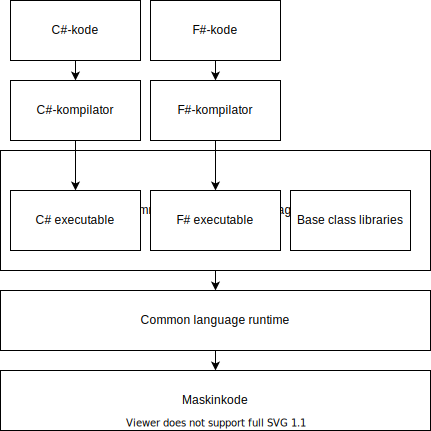

# Hva er .NET?

.NET er en plattform for å utvikle og kjøre applikasjoner, og består av flere ting:

- Programmeringsspråk - som f.eks. C# og F#
- Kompilatorer - programmer som kompilerer kode skrevet i et .NET-programmeringsspråk til CIL ("common intermediate language")
- CIL ("common intermediate language") - et felles lavnivåspråk som all .NET-kode blir kompilert til
- CLR ("common language runtime") - kjøretidsmiljø for .NET-programmer som oversetter instruksjonene definert i CIL til maskinkode, og kjører maskinkoden
- BCL ("base class library") - en stor samling biblioteker skrevet av Microsoft som tilbyr standard funksjonalitet som f.eks. datastrukturer (lister, datoer etc.), IO (lesing og skriving av filer, nettverkshåndtering) og sikkerhet (kryptering, sertifikater).

## Versjoner av .NET

Opprinnelig var .NET kun tilgjengelig på Windows. Denne versjonen av .NET omtales som .NET Framework. Etter hvert kom implementasjoner av kjøretidsmiljøet til andre plattformer også, som Mono til Linux og Mac, og Xamarin til Android og iOS. Både Mono og Xamarin var opprinnelig drevet av andre selskaper enn Microsoft. I 2016 lanserte Microsoft en ny versjon av .NET, .NET Core, som er en implementasjon av .NET for alle plattformer (Windows, Mac og Linux). .NET Core gikk gjennom tre hovedversjoner, i parallell med .NET Framework som nådde sin siste versjon, 4.8, i 2019. .NET Framework blir ikke videreutviklet, og i 2020 lanserte Microsoft .NET 5 som er den versjonen Microsoft vil fortsette å utvikle fremover. I skrivende stund (2025-01-30) er .NET 9 den nyeste versjonen av .NET.

For å definere hva som er tilgjengelig i de ulike versjonene av .NET har Microsoft laget en spesifikasjon, .NET Standard. .NET Standard har flere versjoner, og de ulike versjonene av .NET (.NET Framework, .NET Core, Mono etc.) følger spesifikasjonen i en gitt versjon av .NET Standard. Les mer om .NET Standard, og kompatibilitet på tvers av .NET-versjoner her: [https://docs.microsoft.com/en-us/dotnet/standard/net-standard](https://docs.microsoft.com/en-us/dotnet/standard/net-standard)

## Kilder

- [https://www.mono-project.com/](https://www.mono-project.com/)
- [https://en.wikipedia.org/wiki/.NET_Core](https://en.wikipedia.org/wiki/.NET_Core)
- [https://en.wikipedia.org/wiki/.NET_Framework](https://en.wikipedia.org/wiki/.NET_Framework)
- [https://en.wikipedia.org/wiki/Common_Intermediate_Language](https://en.wikipedia.org/wiki/Common_Intermediate_Language)
- [https://docs.microsoft.com/en-us/dotnet/standard/clr](https://docs.microsoft.com/en-us/dotnet/standard/clr)
- [https://dotnet.microsoft.com/apps/xamarin](https://dotnet.microsoft.com/apps/xamarin)
